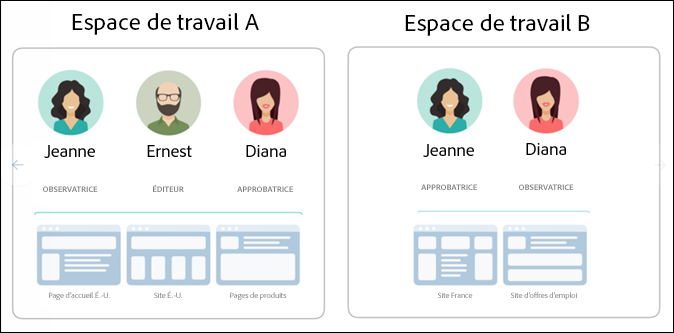
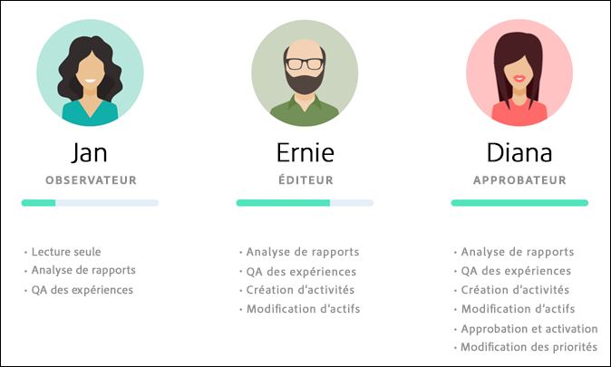
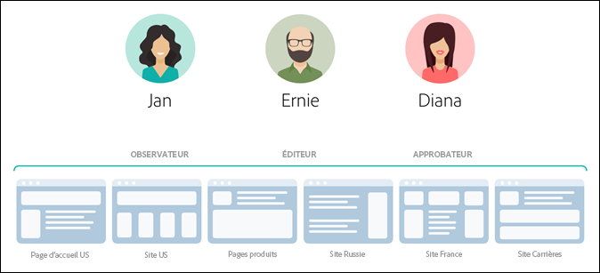
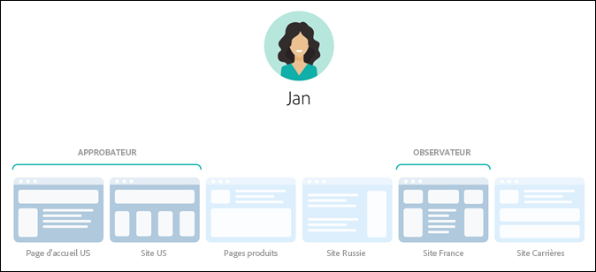
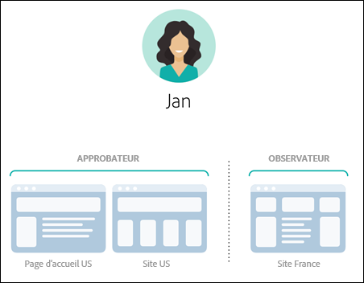
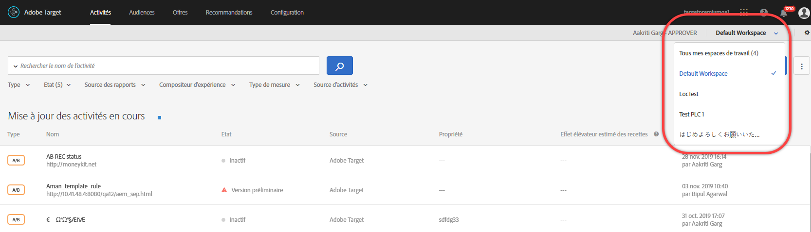
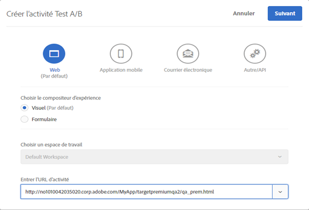
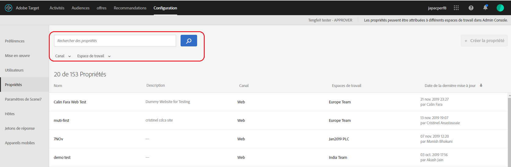

#  Autorisations des utilisateurs d’entreprise{#enterprise-user-permissions}

Enterprise user permissions is a means of formal administering enterprise-wide user access to [!DNL Target]. Add users to [!DNL Target], assign permissions based on their roles, and create workspaces for teams based on different departments, global locations, channels, and other logical groupings. You can assign users the roles of [!UICONTROL Observer], [!UICONTROL Editor], or [!UICONTROL Approver].

## Déterminez si vous avez accès aux autorisations d’utilisateur d’entreprise.

>[!NOTE]
>
>La fonctionnalité Propriétés et autorisations est disponible dans le cadre de la solution [!DNL Target] Premium. Elle n’est pas disponible dans [!DNL Target] Standard sans une licence [!DNL Target] Premium.
>
>Your [!DNL Target] implementation can be using any version of at.js or mbox.js.

You can tell whether your organization has a Standard or Premium license by clicking the [!UICONTROL Administration] link at the top of the [!DNL Target] UI.

* **[!DNL Target Standard]Clients**: Si l’onglet [!UICONTROL Utilisateurs] ([!UICONTROL Administration > Utilisateurs]) (et non l’onglet [!UICONTROL Propriétés] ) s’affiche, votre entreprise dispose d’une [!DNL Target Standard] licence. Les clients [!DNL Target Standard] doivent suivre les instructions de la rubrique [Utilisateurs](/help/administrating-target/c-user-management/c-user-management/user-management.md) pour ajouter des utilisateurs et attribuer des autorisations dans [!DNL Adobe Admin Console].

* **[!DNL Target Premium]Clients**: Si l’onglet [!UICONTROL Propriétés] ([!UICONTROL Administration > Propriétés]) et l’onglet [!UICONTROL Utilisateurs] s’affichent, votre entreprise dispose d’une [!DNL Target Premium] licence. Les clients [!DNL Target Premium] doivent suivre les instructions de cet article et de [Configurer les autorisations d’entreprise](/help/administrating-target/c-user-management/property-channel/properties-overview.md).

## Avant de commencer à utiliser les autorisations d’entreprise

>[!IMPORTANT]
>
>Ensure that you read the [Caveats](/help/administrating-target/c-user-management/property-channel/property-channel.md#section_9714311B1CD9497A86F4910F8AE635E2) section below before proceeding with enterprise permissions.

## Terms and definitions used in this section {#section_F8D229544FEA41C3BC2EFD1F95AA0116}

The following terms are used throughout this section and might be new to users wanting to use the Properties and Permissions functionality in [!DNL Target] Premium.

### Propriété

Properties are similar in nature to those within [!DNL Adobe Platform Launch] in that they use a unique snippet of code to differentiate them.

Une propriété web est une bibliothèque de règles et un code incorporé. Il peut s’agir de n’importe quel regroupement d’un ou de plusieurs domaines et de sous-domaines.

Les propriétés sont activées en ajoutant une paire nom/valeur spécifique en tant que paramètre avec tout appel (appel de Cible, appel api, etc.) à [!DNL Target].

Les propriétés appartiennent à des canaux spécifiques (web, mobile, courrier électronique ou API/autre).

### Espace de travail (Profil produit)

Avec un espace de travail, une organisation peut allouer un groupe d’utilisateurs spécifique à un groupe de propriétés spécifique. Un espace de travail peut être comparé à une suite de rapports dans [!DNL Adobe Analytics].

Note: Workspaces are known as [!UICONTROL Product Profiles] in the [!DNL Adobe Admin Console for Enterprise].

Si vous êtes membre d’une organisation internationale, vous pouvez avoir un espace de travail dédié à vos pages web, propriétés ou sites européens et un autre espace de travail dédié à vos pages web, propriétés ou sites américains. Si vous faites partie d’une organisation multimarque, vous disposez peut-être d’un espace de travail distinct pour chacune de vos marques.

Les utilisateurs peuvent appartenir à plusieurs espaces de travail et différents rôles peuvent même leur être attribués dans chaque espace de travail.

Users can have different views of [!DNL Adobe Target] by moving between workspaces, similar to how [!DNL Analytics] users have different views of [!DNL Analytics] by moving between Report Suites.

Les espaces de travail peuvent inclure des audiences, des offres de code et des activités différentes.

Toutes les audiences et activités créées avant la nouvelle migration du modèle d’autorisations d’Enterprise seront regroupées dans l’espace de travail par défaut décrit ci-dessous.

All activities created via [!DNL Adobe Experience Manager] (AEM), [!DNL Adobe Mobile Services], and [!DNL Adobe Target Classic] will be part of the &quot;Default Workspace.&quot;

### Espace de travail par défaut

All existing workspaces (product profiles) within [!DNL Admin Console] are merged into a single workspace called &quot;Default Workspace&quot; during your organization&#39;s migration to the new Enterprise Permissions model.

>[!IMPORTANT]
>
>Ne supprimez pas l’espace de travail par défaut.

All user roles and access to all [!DNL Target] functionality remains exactly the same as they were prior to the migration to the new Enterprise Permissions model.

### Groupes d’utilisateurs

Vous pouvez créer des groupes d’utilisateurs (développeurs, analystes, responsables du marketing, directeurs, etc.) et leur allouer des droits d’accès à l’échelle de plusieurs produits et espaces de travail Adobe. Il peut être aussi facile d’affecter à un nouveau membre d’équipe tous les droits d’accès appropriés à différents produits Adobe que de les affecter à un groupe d’utilisateurs spécifique.

### Rôles et autorisations

Les rôles et autorisations déterminent les niveaux d’accès qu’ont les utilisateurs pour créer et gérer les activités dans votre mise en œuvre [!DNL Target]. Dans [!DNL Target], les rôles sont les suivants :

| Rôle | Description |
|--- |--- |
| Approbateur | Peut créer, modifier et activer ou arrêter les activités. |
| Éditeur | Peut créer et modifier des activités avant qu’elles ne soient activées, mais ne peut pas approuver le lancement d’une activité. |
| Observateur | Peut visualiser des activités mais ne peut pas les créer ni les modifier. |
| Éditeur | Semblable au rôle d’observateur (peut vue des activités, mais ne peut pas les créer ni les modifier). Cependant, le rôle Editeur dispose des autorisations supplémentaires pour activer les activités. |

### Canal

Le canal se rapporte au type de contenu de l’emplacement où sont distribuées vos activités [!DNL Target] : pages web, applications mobiles, messages électroniques, etc.

Lorsque vous créez une activité, elle est ajoutée à l’espace de travail actuellement sélectionné. Dans la première boîte de dialogue qui s’ouvre, vous pouvez choisir un canal pour l’activité : web, application mobile, e-mail ou autre/API.

## Permissions overview {#section_DC2172520DA84605B218A5E9FB6D187A}

Les informations suivantes expliquent de quelle façon les autorisations étaient imposées auparavant dans [!DNL Target] et dont elles le sont maintenant à l’aide de la fonctionnalité [!UICONTROL Propriétés] et [!UICONTROL autorisations].

Grâce à la nouvelle fonctionnalité [!UICONTROL Autorisations], vous pouvez créer différents projets (appelés « Profils produit » dans [!DNL Adobe Admin Console for Enterprise]) afin d’affecter à un utilisateur donné différentes autorisations définissant ses droits d’accès pour chaque projet. Ces projets distincts sont comparables au fonctionnement des suites de rapports dans [!DNL Adobe Analytics]. À chacun d’eux peuvent appartenir des utilisateurs désignés avec des rôles spécifiques s’appliquant à une série de propriétés. Les clients pourront ainsi restreindre l’accès (affichage, modification et approbation) de leurs utilisateurs en fonction de leur région, de leur environnement (développement, évaluation, production), de leur canal ou d’un autre critère personnalisé, comme illustré ci-dessous :

Par exemple, un utilisateur donné peut avoir un accès « approbation » aux sites web américains, mais un accès « affichage » seulement à l’application mobile européenne. Ce même utilisateur peut aussi ne pas être autorisé à afficher les activités proposées sur les propriétés web et mobiles dans la région APAC.

Actuellement, le modèle [!DNL Target] [!UICONTROL d’autorisations] de se compose de trois rôles (observateur, éditeur et approbateur), comme illustré ci-après :

À chaque rôle correspondent différents niveaux d’autorisations :

| Rôle | Description |
|--- |--- |
| Approbateur | Peut créer, modifier et activer ou arrêter les activités. |
| Éditeur | Peut créer et modifier des activités avant qu’elles ne soient activées, mais ne peut pas approuver le lancement d’une activité. |
| Observateur | Peut visualiser des activités mais ne peut pas les créer ni les modifier. |
| Éditeur | Semblable au rôle d’observateur (peut vue des activités, mais ne peut pas les créer ni les modifier). Cependant, le rôle Editeur dispose des autorisations supplémentaires pour activer les activités. |

Important : Chaque rôle d’utilisateur s’applique à chaque page, propriété ou site de votre compte qui comprend des balises [!DNL Target], comme indiqué ci-après :

Le nouveau modèle [!DNL Target] [!UICONTROL d’autorisations] de se compose des mêmes trois rôles (observateur, éditeur et approbateur). Vous pouvez toutefois affecter à un même utilisateur des autorisations distinctes pour chaque page, propriété ou site, comme illustré ci-après :

Dans cet exemple, Jeanne a les autorisations associées à son rôle d’approbatrice pour la page d’accueil et le site américains et les autorisations associées à son rôle d’observatrice pour le site français.

En outre, Jeanne n’aura pas accès aux pages, propriétés ou sites pour lesquels elle n’a pas d’autorisation dans [!DNL Target], comme illustré ci-après :

Dans cet exemple, Jeanne ne peut pas afficher les pages produit, le site de Russie ni le site Carrières.

## Use-case scenarios {#section_F3CE8576959E4F4CB13BEEED38311DD8}

Les cas d’utilisation suivants peuvent s’avérer utiles pour comprendre de quelle façon les propriétés, les projets, les rôles et les autorisations peuvent vous aider à atteindre vos objectifs marketing avec [!DNL Target] :

### Organisation multinationale

Si vous êtes membre d’une organisation internationale, vous pouvez avoir un espace de travail dédié à vos pages web, propriétés ou sites européens et un autre espace de travail dédié à vos pages web, propriétés ou sites américains. Après une réorganisation, en utilisant les personnages des illustrations ci-dessus, vous pouvez configurer des espaces de travail et des autorisations semblables à ce qui suit :

* **Jeanne** : Jeanne est responsable de l’optimisation du Centre d’excellence pour les pages Web, les propriétés et les sites de son organisation aux États-Unis. Elle détient probablement les droits d’administrateur système dans Adobe Experience Cloud.

   Elle a les autorisations associées à son rôle d’approbatrice pour la page d’accueil et le site des États-Unis. Grâce à ces autorisations, elle peut créer, modifier et activer ou interrompre les activités.

   Jeanne collabore également avec l’équipe d’optimisation en France et a par conséquent les autorisations associées à son rôle d’observatrice pour le site français, ce qui lui permet d’accéder aux activités en lecture seule. Elle peut visualiser les activités mais ne peut pas les créer ni les modifier.

   Puisqu’aucun de ses rôles ne justifie qu’elle consulte les pages produit, le site russe ou le site Carrières, Jeanne n’a pas accès aux activités de ces sites.

* **Ernie** : Ernie est le directeur du marketing pour les États-Unis dans l’organisation.

   Il a rejoint l’organisation depuis peu et connaît assez mal Target. Il dispose des autorisations associées à son rôle d’éditeur pour la page d’accueil et le site États-Unis, ainsi que pour les pages produit. Il peut donc créer et modifier les activités avant qu’elles ne soient activées, mais il ne peut pas approuver le lancement d’une activité : une personne ayant les autorisations associées à un rôle d’approbateur, telle que Jeanne, doit approuver l’activité avant qu’elle ne passe en production.

   Puisqu’aucun de ses rôles ne justifie qu’il consulte les sites Russie, France ou Carrières, Ernest n’a pas accès aux activités de ces sites.

* **Diana** : Diana est analyste pour l’organisation. Elle détient les autorisations associées à son rôle d’observatrice pour la page d’accueil et le site des États-Unis, les pages produit et les sites français et russe, ce qui lui permet d’accéder aux activités en lecture seule. Elle peut visualiser des activités, mais elle ne peut pas les créer ni les modifier.

   Puisqu’aucun de ses rôles ne justifie qu’elle consulte le site Carrières, Diana n’a pas accès aux activités de ce site.

### Organisation multimarque

Si vous faites partie d’une organisation multimarque, il est possible qu’il existe un espace de travail distinct pour les pages web, propriétés ou sites de chaque marque.

Après une réorganisation, en utilisant les personnages des illustrations ci-dessus, vous pouvez configurer des projets et des autorisations semblables à ce qui suit :

* **Jeanne** : Jeanne est responsable de l’optimisation du Centre d’excellence pour une organisation de soins de santé, impliquée dans les espaces des produits hospitaliers et de consommation. Elle détient probablement les droits d’administrateur système dans Adobe Experience Cloud.

   Elle a les autorisations associées à son rôle d’approbatrice pour le site de l’hôpital. Grâce à ces autorisations, elle peut créer, modifier et activer ou interrompre les activités.

   Jeanne collabore également avec l’équipe d’optimisation de l’espace des produits de consommation et a par conséquent les autorisations associées à son rôle d’observatrice pour ce site, ce lui permet d’accéder aux activités en lecture seule. Elle peut visualiser les activités mais ne peut pas les créer ni les modifier.

* **Ernest :** Ernest est directeur marketing en charge du marketing de l’espace des produits de consommation.

   Il a rejoint l’organisation depuis peu et connaît assez mal Target. Il a donc les autorisations associées à son rôle d’éditeur pour le site dédié aux consommateurs. Il peut ainsi créer et modifier des activités avant qu’elles ne soient activées, mais il ne peut pas approuver le lancement d’une activité : une personne ayant les autorisations associées à un rôle d’approbateur pour le site dédié aux consommateurs (qui n’est pas Jeanne dans ce scénario) doit approuver l’activité avant qu’elle ne passe en production.

   Ernest n’ayant aucun rôle justifiant qu’il consulte le site de l’hôpital, il n’a pas accès aux activités de ce site.

* **Diana :** Diana est analyste pour l’organisation. Elle détient des autorisations associées à son rôle d’observatrice pour le site de l’hôpital et celui dédié aux consommateurs, ce qui lui permet d’accéder aux activités en lecture seule. Elle peut visualiser des activités, mais elle ne peut pas les créer ni les modifier.

## Target UI Property and Permissions touchpoints {#section_3414371393BB42999A268628B5456EC9}

La nouvelle fonctionnalité Autorisations est accessible depuis différents emplacements dans l’interface utilisateur de [!DNL Target].

* **Liste déroulante Espace de travail (profil produit) :** La liste déroulante Espace de travail s’affiche en haut des pages [!UICONTROL Activités], [!UICONTROL Audiences] et [!UICONTROL Offres]. Sélectionnez l’espace de travail désiré pour filtrer la liste afin de n’afficher que les éléments situés dans l’espace de travail sélectionné.

   

* **Création d’activité** : quand vous créez une activité, elle l’est dans l’espace de travail actif. Dans la première boîte de dialogue qui s’ouvre, vous pouvez choisir un canal pour l’activité : web, application mobile, e-mail ou autre/API.

   

* **Création d’audience :** Lorsque vous créez une nouvelle audience, celle-ci est créée dans l’espace de travail sélectionné.
* **Création d’offre :** Lorsque vous créez une nouvelle offre, celle-ci est créée dans l’espace de travail sélectionné.
* **Page Propriétés (Administration > Propriétés) :** Vous pouvez utiliser la zone [!UICONTROL Rechercher] pour effectuer une recherche dans la liste [!UICONTROL Propriété] .

   

## Avertissements {#section_9714311B1CD9497A86F4910F8AE635E2}

Consider the following when using or configuring properties and permissions in [!DNL Target] Premium:

* **Important** : ne supprimez pas les espaces de travail comportant des activités. Si cela se produit, contactez le service à la clientèle pour récupérer ces activités.
* Lors de l’utilisation de la vue Tous mes espaces de travail :

   * Vous pouvez voir les activités, les audiences et les offres pour tous les espaces de travail auxquels vous pouvez accéder, disposant des rôles et des autorisations appropriés.
   * Lorsque vous sélectionnez la vue Tous mes espaces de travail, une nouvelle colonne est ajoutée à la page Activités, Audiences et Offres qui répertorie l’espace de travail de l’élément et votre autorisation utilisateur associée à cet élément (observateur, éditeur ou approbateur),
   * Lorsque vous créez une activité, une audience ou une offre dans la vue Tous mes espaces de travail, vous devez sélectionner l’espace de travail dans lequel l’élément doit être créé. Seuls les espaces de travail pour lesquels vous disposez de l’autorisation éditeur ou approbateur peuvent être sélectionnés.
   * Lors de la copie d’une activité, d’une audience ou d’une offre dans la vue Tous mes espaces de travail, vous devez sélectionner l’espace de travail où l’élément doit être copié. Seuls les espaces de travail pour lesquels vous disposez de l’autorisation éditeur ou approbateur peuvent être sélectionnés.

* Tout paramètre des pages d’administration suivantes peut être contrôlé par n’importe quel approbateur dans n’importe quel espace de travail :

   * Compositeur d’expérience visuelle
   * Création de rapports
   * Configuration de Scene7
   * Mise en œuvre
   * Propriétés
   * Hôtes
   * Environnements
   * Jetons de réponse
   * Utilisateurs

* Les utilisateurs ne peuvent pas déplacer des ressources d’un espace de travail (profil produit) vers un autre. La copie, cependant, est prise en charge.
* Lorsque vous affichez les de la page [!DNL Audiences]Audiences, la page se charge plus lentement que prévu. Les audiences s’affichent plus rapidement si vous utilisez la barre de recherche. Il s’agit d’un problème connu, qui sera corrigé dans une mise à jour ultérieure. Ce problème n’a toutefois aucune incidence sur la sélection des audiences durant la création de l’activité.
* Les ressources suivantes font partie du nouveau modèle d’autorisations d’Enterprise :

   * Les activités, les audiences et les offres de code créées dans Target Standard/Premium après l’activation des autorisations pour le client. (Remarque : Les clients doivent avoir accès à Target Premium.)
   * Vous pouvez ajouter des propriétés à des activités existantes dans l’espace de travail par défaut. Cependant, cette fonction est sujette à changement.
   * Seules les nouvelles ressources (telles que les activités, les offres de code et les audiences) créées dans Target Premium (après l’activation des autorisations d’Enterprise) sont disponibles pour une limitation par autorisations.
   * Les ressources externes sont disponibles uniquement pour les utilisateurs de l’espace de travail par défaut. Le rôle d’un utilisateur de l’espace de travail par défaut s’applique globalement (à toutes les demandes et ressources Target).

* Les ressources suivantes ne font *pas* partie du nouveau modèle d’autorisations d’Enterprise :

   * Offres d’image
   * Toutes les ressources de recommandations, y compris la bibliothèque de critères, la bibliothèque de conception, le catalogue et la configuration des recommandations.
   * Les ressources existantes (telles que les activités, les offres de code et les audiences) créées dans Target Premium avant d’activer les autorisations d’Enterprise peuvent être copiées mais ne peuvent pas être déplacées vers d’autres espaces de travail.
   * Les activités, audiences, offres de code, offres d’images ou toute autre ressource créée à l’aide des solutions ou méthodes suivantes ne peuvent pas être contrôlées par le modèle Autorisations d’entreprise, mais font partie de l’espace de travail par défaut : Target Classic, Adobe Experience Manager (AEM), Adobe Mobile Services et les ressources créées via l’API. Ressources créées via une API (y compris les activités, les audiences, les offres de code et les offres d’images).
   * À l’heure actuelle, les offres d’images (ressources stockées sous `https://[tenantName].marketing.adobe.com/content/mac/[tenantName]/target/offers.html#image-library`) ne peuvent pas être contrôlées par le modèle d’autorisations d’Enterprise.
   * Le suivi des clics et les redirections fonctionnent uniquement lorsque le lien ou la page de destination fait partie d’une propriété incluse dans l’activité. En outre, le suivi des clics peut ne pas fonctionner lorsque vous utilisez la fonction `targetPageParams()`. `targetPageParamsAll()` est la fonction recommandée.

   [!DNL Target]Actuellement,  exige qu’un jeton `at_property` soit présent sur toutes les pages où se produit le suivi. In the event that the token is (1) not present, (2) not detected at the time of activity setup (within the VEC), or (3) not passed to the clickTracking Target call via the `targetPageParamsAll()` function, the metric will not be incremented and will appear as &quot;0.&quot;

   La même règle s’applique pour les activités utilisant les redirections. La page de destination doit comporter un jeton `at_property` et être reconnue au moment de la configuration dans le compositeur d’expérience visuelle.

   Dans une version ultérieure, Target fonctionnera sur les pages où aucun jeton `at_property` n’est présent ou sur les pages où un autre jeton `at_property` est présent.

* La fonctionnalité Autorisations des utilisateurs d’Enterprise n’est pas prise en charge dans les [appels de l’API d’Adobe I/O](https://developers.adobetarget.com).

## Questions fréquentes {#faqs}

Les questions fréquentes concernant les autorisations d’entreprise sont les suivantes :

### Puis-je déplacer une activité d’un espace de travail à un autre ?

Malheureusement, vous ne pouvez pas déplacer une activité d’un espace de travail à un autre. Cependant, vous pouvez copier une activité dans n’importe quel espace de travail, sachant que les données des rapports ne seront pas transférées. Pour plus d’informations, voir la rubrique [Copie ou édition d’une activité lors de l’utilisation des espaces de travail](/help/c-activities/edit-activity.md#section_45A92E1DD3934523B07E71EF90C4F8B6).

Les activités créées avant la migration continuent de fonctionner de la même façon dans l’espace de travail par défaut, sauf en cas de modification ou d’allocation de propriétés. Les activités d’un espace de travail spécifique respectent les propriétés allouées à cet espace de travail. Par conséquent, leur comportement peut changer après la migration.

### Pourquoi un message d’erreur indique qu’aucune propriété n’est associée à cette activité, même si une propriété est assignée ?

Si vous avez implémenté [!DNL Target] avec [!DNL Adobe Launch] et que vous avez reçu un message d’erreur indiquant qu’aucune propriété n’est associée à l’activité, transmettez le paramètre `at_property` avec la fonction `targetPageParams`.

### Les conversions de suivi des clics sont-elles enregistrées si une page de redirection et l’URL d’activité appartiennent à des propriétés différentes ?

Le suivi des clics n’est pas enregistré sur les pages où l’URL de page et d’activité appartient à des propriétés différentes.

Examinez le scénario suivant (s’applique à la fois à at.js et à mbox.js) :

* La page 1 appartient à la Propriété 1.
* La page 2 appartient à la Propriété 2.
* Dans l’activité, la page 1 redirige vers la page 2, qui contient des traqueurs de clics.

Lorsqu’un visiteur ouvre la page 1 dans un navigateur, il est redirigé vers la page 2. Comme la page 2 ne remplit pas les critères de diffusion de l’activité, son appel Target ne contient pas de traqueurs de clics dans sa réponse.

Si la page de redirection et l’URL d’activité appartiennent à la même propriété, les traqueurs de clics fonctionnent comme prévu. Pour plus d’informations, voir [Suivi des clics](/help/c-activities/r-success-metrics/click-tracking.md).

## Vidéos de formation

Les vidéos suivantes contiennent davantage d’informations sur les concepts abordés dans cet article.

### Training Video: Enterprise Permissions Training Video 

Objectifs de la formation :

* Les trois niveaux de rôle que les utilisateurs d’Adobe Target peuvent détenir
* Les concepts de propriétés et d’espaces de travail, et comment ces limites et regroupements fonctionnent pour permettre le contrôle des niveaux d’accès des utilisateurs
* Différents exemples de propriétés dont votre organisation doit tenir compte

>[!VIDEO](https://video.tv.adobe.com/v/19042/)

### Heures de bureau : Cible Premium Workspaces

Cette vidéo est un enregistrement de « Office Hours », une initiative lancée par l’équipe d’assistance clientèle d’Adobe.

* Création d’un espace de travail (profil de produits)
* Création des propriétés
* Ajouter des utilisateurs
* Mise à jour de l’implémentation

>[!NOTE]
>
>L’interface utilisateur du menu [!DNL Target] Administration [!UICONTROL (anciennement] Configuration ) a été repensée afin d’améliorer les performances, de réduire le temps de maintenance requis lors de la publication de nouvelles fonctionnalités et d’améliorer l’expérience utilisateur sur l’ensemble du produit. Les informations de la vidéo suivante sont généralement correctes ; toutefois, les options peuvent se trouver à des emplacements légèrement différents. Les vidéos mises à jour seront bientôt publiées.

>[!VIDEO](https://video.tv.adobe.com/v/23643/)
