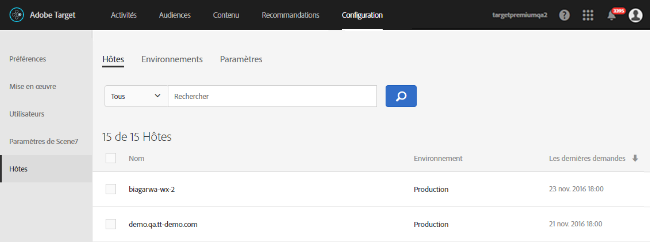

# Hôtes{#hosts}

Organisez vos sites et environnements de préproduction pour une gestion simplifiée et une création de rapports distincte.

La gestion des hôtes vise principalement à garantir qu’aucun contenu inactif ne s’affiche par inadvertance sur les sites web. Host management also lets you separate report data by [environment](/help/administrating-target/environments.md).

Un hôte est un domaine à partir duquel une [!DNL Target] demande est effectuée. Sur un site Web, il s’agit généralement de la `location.hostname` propriété de l’URL qui émet la [!DNL Target] demande.

Par défaut, [!DNL Target] ne limite pas un hôte qui peut effectuer [!DNL Target] des requêtes et recevoir [!DNL Target] des réponses. Lorsque de nouveaux hôtes effectuent des requêtes, elles fonctionnent automatiquement. Cela permet également de tester différents domaines que vous ne connaissez pas ou ne pouvez pas anticiper. Si vous souhaitez remplacer ce comportement par défaut, vous pouvez configurer une liste autorisée ou une liste bloquée pour limiter les hôtes qui fonctionneront [!DNL Target].

Pour gérer les hôtes, cliquez sur **[!UICONTROL Administration]** > **[!UICONTROL Hôtes]**.

## Recognizing hosts {#concept_0D4B43E23AA9408F8B28A57ED754BF65}

Pour reconnaître un hôte et l’ajouter à la liste [!UICONTROL Hôtes] , les conditions suivantes doivent être remplies :

* At least one [!DNL Target] request must exist on the host
* Une page sur l’hôte doit avoir :

   * Référence exacte à at.js ou mbox.js
   * Une [!DNL Target] demande ou une [!DNL Target] demande globale générée automatiquement

* The page with the [!DNL Target] request must be viewed in a browser

After the page is viewed, the host is listed in the [!UICONTROL Hosts] list, allowing you to manage it in an environment, as well as preview and launch activities and tests.

>[!NOTE]
>
>Cela inclut les serveurs de développement personnel.

Après avoir ajouté un hôte à la liste des [!UICONTROL hôtes], assurez-vous qu’il est reconnu.

1. Cliquez sur **[!UICONTROL Administration]** > **[!UICONTROL Hôtes]**.
1. Si votre hôte n’apparaît pas dans la liste, actualisez votre navigateur. 

   By default, a newly recognized host is placed in the [!UICONTROL Production] environment. Il s’agit de l’environnement le plus sécurisé, car il n’autorise pas l’affichage des activités inactives à partir de ces hôtes.

1. (Conditionnel) Cliquez sur l’icône **[!UICONTROL Déplacer]** ( icône  déplacement ) pour déplacer l’hôte vers le [!UICONTROL développement], le [!UICONTROL test ou tout autre environnement.]

>[!NOTE]
>
>The [!UICONTROL Production] environment cannot be deleted, even if you rename it. On considère que c’est là que vous diffuserez les activités et tests finaux et actifs. L’environnement par défaut n’autorise pas l’affichage des campagnes inactives.

## Sort or search the Hosts list {#section_068B23C9D8224EB78BC3B7C8580251B0}

To sort the [!UICONTROL Hosts] list, click any column header ([!UICONTROL Name], [!UICONTROL Environment], or [!UICONTROL Last Requested]) to sort the list in ascending or descending order.

To search the [!UICONTROL Hosts] list, type a search term in the [!UICONTROL Search Hosts] box.

## Create allowlists that specify hosts that are authorized to send Target requests to Target. {#allowlist}

You can create an allowlist that specifies hosts (domains) that are authorized to send [!DNL Target] requests to [!DNL Target]. Tous les autres hôtes qui génèrent des requêtes obtiendront une réponse d’erreur d’autorisation commentée. By default, any host that contains a [!DNL Target] request registers with [!DNL Target] in the [!UICONTROL Production] environment and has access to all active and approved activities. If this is not the desired approach, you can instead use the allowlist to record specific hosts that are eligible to make [!DNL Target] requests and receive [!DNL Target] content. All hosts will continue to display in the [!UICONTROL Hosts] list, and environments can still be used to group these hosts and assign different levels to each, such as whether the host can see active and/or inactive activities.

Pour créer une liste autorisée :

1. Dans la liste [!UICONTROL Hôtes] , cliquez sur **[!UICONTROL Autoriser les hôtes]**.
1. Activez la bascule **[!UICONTROL Activer les hôtes autorisés pour la diffusion]** de contenu.
1. Add the desired hosts in the **[!UICONTROL Host contains]** box, as desired.

   Plusieurs hôtes peuvent être répertoriés, chacun sur sa propre ligne.

1. Add the desired hosts in the **[!UICONTROL Host does not contains]** box, as desired.

   Plusieurs hôtes peuvent être répertoriés, chacun sur sa propre ligne.

1. Cliquez sur **[!UICONTROL Enregistrer]**.

If a [!DNL Target] request is made on an unauthorized host, the call will respond with `/* no display - unauthorized mbox host */`.

>[!IMPORTANT]
>
>**Meilleures pratiques** en matière de sécurité : Si vous utilisez la fonctionnalité de boîte aux lettres de [!DNL Target], notez que cette liste autorisée va également contrôler la liste des domaines sur lesquels vos [redirecteurs](/help/c-implementing-target/c-non-javascript-based-implementation/working-with-redirectors.md) peuvent naviguer. Assurez-vous d’ajouter les domaines vers lesquels vous souhaitez rediriger lorsque vous utilisez ubox dans le cadre de votre mise en oeuvre. Si la liste autorisée n’est pas spécifiée, [!DNL Adobe] il ne sera pas possible de vérifier les URL de redirection et de les protéger des redirections malveillantes potentielles.
>
>La liste autorisée prévaut sur les environnements. Vous devez effacer tous les hôtes avant d&#39;utiliser la fonction de liste autorisée, puis seuls les hôtes autorisés par la liste autorisée apparaissent dans la liste des hôtes. Vous pouvez ensuite déplacer les hôtes dans l’environnement de votre choix.

Il arrive parfois que les domaines d’autres sites s’affichent dans vos environnements. Un domaine s’affiche dans la liste si le domaine appelle at.js ou mbox.js. Si, par exemple, un utilisateur copie l’une de vos pages web sur son serveur, ce domaine est répertorié dans votre environnement. Les domaines de robots, sites de traduction ou disques durs locaux peuvent également s’afficher.

Dans les cas où `mboxHost` est transmis dans un appel d’API, la conversion est enregistrée pour l’environnement transmis. If no environment is passed, the host in the call defaults to [!UICONTROL Production].

You can also create a denylist that specifies hosts (domains) than cannot send [!DNL Target] requests to [!DNL Target] by adding the desired hosts in the [!UICONTROL Host Does Not Contain] box.

>[!NOTE]
>
>La liste Hôtes autorisés étant utilisée à la fois pour les hôtes [!DNL Target] et les hôtes de redirection par défaut, vous devez ajouter tous les domaines existants approuvés pour utiliser le SDK [!DNL Adobe Target] JavaScript (at.js) ** ET tous les domaines utilisés dans les URL de redirection par défaut de la boîte de réception. Vous devez également ajouter à la liste autorisée tout nouveau domaine similaire à l’avenir.

## Delete a host {#section_F56355BA4BC54B078A1A8179BC954632}

Vous pouvez supprimer un hôte lorsqu’il n’est plus utile.

1. From the [!UICONTROL Hosts] list, click the **[!UICONTROL Delete]** icon.
1. Cliquez sur **[!UICONTROL Supprimer]** pour confirmer la suppression.

>[!NOTE]
>
>L’hôte est de nouveau répertorié si un utilisateur accède à une page contenant une [!DNL Target] requête sur l’hôte.

## Résolution des problèmes liés aux hôtes {#concept_B3D7583FA4BB480382CC7453529FE1B7}

Suivez les conseils de résolution suivants si vous rencontrez des problèmes avec vos hôtes :

**L’hôte n’apparaît pas dans la liste de votre compte.**

* Actualisez la page [!UICONTROL Hôtes] dans votre navigateur.
* Vérifiez que la [!DNL Target] requête est correcte, y compris la référence at.js ou mbox.js.
* Try browsing to one of the [!DNL Target] requests on the host. It&#39;s possible that no [!DNL Target] request on the host was ever rendered in a browser.

**Des domaines aléatoires ou inconnus s’affichent dans la liste des [!UICONTROL hôtes].**

A domain appears in this list if a request to [!DNL Target] is made from the domain. Vous pouvez souvent voir des domaines à partir de moteurs de balayage, de sites de traduction de langue ou d’unités de disque locales. Si le domaine recensé n’est pas utilisé par votre équipe, vous pouvez cliquer sur [!UICONTROL Supprimer] pour le supprimer.

**Ma [!DNL Target] requête renvoie /* no display - non autorisé mbox host */.**

If a [!DNL Target] request is made on an unauthorized host, the request will respond with /* no display - unauthorized mbox host */.
