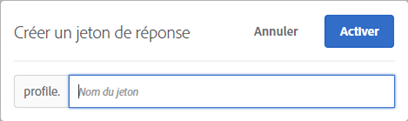

# Jetons de réponse

Les jetons de réponse vous permettent de générer automatiquement des informations spécifiques à [!DNL Target] (détails de l’activité, informations sur les profils utilisateur, informations géographiques, etc.) à utiliser dans le débogage ou l’intégration à des systèmes tiers (tels que Clicktale).

Les jetons de réponse vous permettent de choisir les variables à exploiter, puis de les activer pour qu’elles soient envoyées dans le cadre d’une réponse de Cible. Pour ce faire, il vous suffit d&#39;activer une variable à l&#39;aide du commutateur et la variable sera envoyée avec des réponses de Cible, qui peuvent être validées dans les appels réseau. Les jetons de réponse fonctionnent également en mode [!UICONTROL Prévisualisation].

L’une des différences essentielles entre les modules externes et les jetons de réponse réside dans le fait que les modules externes fournissent du code JavaScript à la page qui s’exécute lors de la diffusion, tandis que les jetons de réponse diffusent un objet qui peut ensuite être lu et utilisé à l’aide de détecteurs d’événements. Pour plus d’informations, voir [Événements personnalisés at.js](/help/c-implementing-target/c-implementing-target-for-client-side-web/atjs-custom-events.md) et les exemples plus loin dans cet article. L’approche des jetons de réponse est plus sûre et devrait faciliter le développement et la maintenance des intégrations tierces.

>[!NOTE]
>
>Les jetons de réponse sont disponibles avec at.js 1.1 ou version ultérieure.

| Bibliothèque Target utilisée | Actions suggérées |
|--- |--- |
| at.js | Assurez-vous que vous utilisez at.js version 1.1 ou ultérieure. Pour plus d’informations sur le téléchargement de la dernière version d’at.js, voir [Télécharger at.js](/help/c-implementing-target/c-implementing-target-for-client-side-web/how-to-deployatjs/implementing-target-without-a-tag-manager.md). Pour en savoir plus sur la nouvelle fonctionnalité de chaque version d’at.js, voir [Informations détaillées sur les versions d’at.js](/help/c-implementing-target/c-implementing-target-for-client-side-web/target-atjs-versions.md).<br>Les clients utilisant at.js sont encouragés à utiliser les jetons de réponse et à ne plus utiliser les modules externes. Certains modules externes qui reposent sur des méthodes internes existant dans mbox.js, mais pas dans at.js, sont fournis mais échouent. Pour plus d’informations, voir [Limites d’at.js](/help/c-implementing-target/c-implementing-target-for-client-side-web/t-mbox-download/c-target-atjs-implementation/target-atjs-limitations.md). |
| mbox.js | Les modules externes continuent d’être pris en charge et distribués lors de l’utilisation de mbox.js.<br>Cependant, les clients utilisant mbox.js et les modules externes sont invités à passer à at.js et aux jetons de réponse. Pour plus d’informations sur les avantages de l’utilisation d’at.js sur mbox.js, voir [Questions fréquentes sur at.js](/help/c-implementing-target/c-implementing-target-for-client-side-web/c-target-atjs-faq/target-atjs-faq.md). Pour plus d’informations sur la migration, voir [Migration vers at.js à partir de mbox.js](/help/c-implementing-target/c-implementing-target-for-client-side-web/t-mbox-download/c-target-atjs-implementation/target-migrate-atjs.md).<br>Après la mise hors service de Target Classic (novembre 2017), vous devrez peut-être contacter le service à la clientèle pour modifier ou désactiver les modules externes existants. Vous devez contrôler vos modules externes et désactiver les modules externes inutiles avant la mise hors service de Target Classic.<br>Vous ne pouvez pas créer de nouveaux plug-ins dans Target Standard/Premium. Vous devez, au lieu de cela, utiliser des jetons de réponse.<br>Les anciens modules externes SiteCatalyst doivent être désactivés et remplacés par [Adobe Analytics en tant que source de création de rapports pour Adobe Target](/help/c-integrating-target-with-mac/a4t/a4t.md) (A4T). Le module externe ttMeta doit être désactivé et remplacé par [Adobe Experience Cloud Debugger](https://chrome.google.com/webstore/detail/adobe-experience-cloud-de/ocdmogmohccmeicdhlhhgepeaijenapj). |

## Utilisation de jetons de réponse {#section_A9E141DDCBA84308926E68D05FD2AC62}

1. Assurez-vous que vous utilisez [!DNL at.js] version 1.1 ou ultérieure.

   Pour plus d’informations, voir [Téléchargement d’at.js](/help/c-implementing-target/c-implementing-target-for-client-side-web/how-to-deployatjs/implementing-target-without-a-tag-manager.md#concept_1E1F958F9CCC4E35AD97581EFAF659E2).

1. Dans [!DNL Target], cliquez sur **[!UICONTROL Administration]** > **[!UICONTROL Jetons de réponse]**.

   

1. Activez les jetons de réponse souhaités, tels que `activity.id`, `option.id`, etc.

   Les paramètres suivants sont disponibles par défaut :

   | Type | Paramètre | Remarques |
   |--- |--- |--- |
   | Profils intégrés | `profile.activeActivities` | Renvoie une multitude de `activityIds` pour lesquels le visiteur est qualifié. Elle s’incrémente lorsque les utilisateurs sont qualifiés. Par exemple, sur une page contenant deux demandes [!DNL Target] qui délivrent deux activités différentes, la deuxième demande comprend les deux activités. |
   |  | `profile.isFirstSession` | Renvoie « true » ou « false ». |
   |  | `profile.isNewSession` | Renvoie « true » ou « false ». |
   |  | `profile.daysSinceLastVisit` | Renvoie le nombre de jours depuis la dernière visite du visiteur. |
   |  | `profile.tntId` | Renvoie le tntID du visiteur. |
   |  | `profile.marketingCloudVisitorId` | Renvoie l’identifiant visiteur Experience Cloud du visiteur. |
   |  | `profile.thirdPartyId` | Renvoie l’identifiant tiers du visiteur. |
   |  | `profile.categoryAffinity` | Renvoie la catégorie préférée du visiteur. |
   |  | `profile.categoryAffinities` | Renvoie un tableau des 5 catégories favorites du visiteur sous la forme de chaînes. |
   | Activité | `activity.name`<br>`activity.id`<br>`experience.name`<br>`experience.id`<br>`option.name`<br>`option.id` | Détails de l’activité en cours. Notez que « option » est égal à « offer ». |
   | Géo | `geo.country`<br>`geo.state`<br>`geo.city`<br>`geo.zip`<br>`geo.dma`<br>`geo.domainName`<br>`geo.ispName`<br>`geo.connectionSpeed`<br>`geo.mobileCarrier` | Pour plus d’informations sur l’utilisation du géociblage dans les activités, voir [Géociblage](/help/c-target/c-audiences/c-target-rules/geo.md). |
   | Méthode d’affectation du trafic<br>(s’applique uniquement aux activités [!UICONTROL Cible automatique] et [!UICONTROL Automated Personalization].) | `experience.trafficAllocationId` | Renvoie 0 si un visiteur a reçu une expérience provenant d’un trafic de &quot;contrôle&quot; et 1 si un visiteur a reçu une expérience provenant de la distribution de trafic &quot;ciblée&quot;. |
   |  | `experience.trafficAllocationType` | Retourne &quot;contrôle&quot; ou &quot;ciblé&quot;. |

   Les attributs de profil utilisateur et les attributs du client s’affichent également dans la liste.

   >[!NOTE]
   >
   >Les paramètres dotés de caractères spéciaux ne s’affichent pas dans la liste. Seuls les caractères alphanumériques et les traits de soulignement sont pris en charge.

1. (Conditionnel) Si vous souhaitez utiliser un paramètre de profil comme jeton de réponse, mais que le paramètre n&#39;a pas été transmis par le biais d&#39;une requête [!DNL Target] et n&#39;a donc pas été chargé dans l&#39;interface utilisateur de la Cible, vous pouvez utiliser le bouton [!UICONTROL Ajouter le jeton de réponse] pour ajouter le profil à l&#39;interface utilisateur.

   Cliquez sur **[!UICONTROL Ajouter le jeton de réponse]**, indiquez le nom du jeton, puis cliquez sur **[!UICONTROL Activer]**.

   

1. Créez une activité.

Utilisez les [Événements personnalisés at.js](/help/c-implementing-target/c-implementing-target-for-client-side-web/atjs-custom-events.md) pour écouter la réponse et lire les jetons de réponse.[!DNL Target]

L’échantillon de code suivant ajoute un gestionnaire d’événements personnalisés [!DNL at.js] directement dans la page HTML :

```html
<html> 
  <head> 
    .... 
    <script src="at.js"></script> 
    <script> 
      document.addEventListener(adobe.target.event.REQUEST_SUCCEEDED, function(e) { 
        console.log("Request succeeded", e.detail); 
      }); 
    </script> 
  <head> 
  <body> 
  ... 
  </body> 
</html>
```

## FAQ sur les jetons de réponse {#section_3DD5F32C668246289CDF9B4CDE1F536D}

**Quel rôle est requis pour activer ou désactiver les jetons de réponse ?**

Les jetons de réponse peuvent uniquement être activés ou désactivés par les utilisateurs disposant du rôle d’administrateur Target.

**Que se passe-t-il si j’utilise at.js version 1.0 ou antérieure ?**

Les jetons de réponse sont visibles, mais at.js ne peut pas les utiliser.

**Que se passe-t-il si j’utilise at.js version 1.1 (ou ultérieure) sur certaines pages de mon site et mbox.js sur d’autres pages ?**

Les jetons de réponse seront remis aux réponses de la Cible [!DNL at.js], mais pas aux réponses [!DNL mbox.js].

**[!DNL Target Classic]Les modules externes de et les jetons de réponse peuvent-ils être actifs au même moment ?**

Les modules externes et les jetons de réponse sont disponibles en parallèle. Cependant, les modules externes seront obsolètes à l’avenir.

**Les jetons de réponse sont-ils distribués par l’intermédiaire de toutes les  [!DNL Target] réponses ou uniquement par l’intermédiaire de  [!DNL Target] réponses qui fournissent une activité ?**

Les jetons de réponse ne sont diffusés que par le biais de réponses [!DNL Target] fournissant une activité.

**Mon module externe Target Classic comprenait du code JavaScript. Comment puis-je reproduire ses fonctionnalités à l’aide des jetons de réponse ?**

Lors de la migration vers les jetons de réponse, ce type de code JavaScript doit être conservé dans votre codebase ou votre solution de gestion des balises. Vous pouvez déclencher ce code en utilisant les événements personnalisés [!DNL at.js] et transmettre les valeurs des jetons de réponse aux fonctions JavaScript.

**Pourquoi mon paramètre d’attribut de profil/client ne s’affiche-t-il pas dans la liste des jetons de réponse ?**

Target actualise normalement les paramètres toutes les 15 minutes. Cette actualisation dépend de l’action de l’utilisateur ; les données sont actualisées seulement lorsque vous affichez la page des jetons de réponse. Si les paramètres ne s’affichent pas dans la liste des jetons de réponse, cela peut être dû au fait que Target n’a pas encore actualisé les données.

De même, si le paramètre contient des caractères autres que des caractères alphanumériques ou des symboles autres que des traits de soulignement, le paramètre n’apparaît pas dans la liste. Actuellement, seuls les caractères alphanumériques et les traits de soulignement sont pris en charge.

**Si je crée un jeton de réponse à l’aide d’un script de profil ou d’un paramètre de profil, puis que je supprime ce script ou ce paramètre, le jeton de réponse diffuse-t-il toujours du contenu ?**

Les jetons de réponse extraient des informations des profils utilisateur, puis diffusent ces informations. Si vous supprimez un script ou un paramètre de profil, cela ne signifie pas que les informations ont été supprimées des profils utilisateur. Les profils utilisateur disposeront toujours des données correspondant au script de profil. Le jeton de réponse continue à diffuser le contenu. Pour les utilisateurs qui ne disposent pas de ces informations dans leurs profils, ou pour les nouveaux visiteurs, ce jeton ne sera pas diffusé car les données ne sont pas présentes dans leurs profils.

Target ne désactive pas automatiquement le jeton. Si vous supprimez un script de profil et que vous ne voulez plus que le jeton soit diffusé, vous devez le désactiver vous-même.

**J’ai renommé mon script de profil, mais pourquoi le jeton utilisant ce script est-il toujours actif avec l’ancien nom ?**

Comme mentionné ci-dessus, les jetons de réponse fonctionnent selon les informations de profil enregistrées pour les utilisateurs. Même si vous avez renommé le script de profil, les utilisateurs ayant visité votre site web disposent de l’ancienne valeur de script de profil dans leurs profils et le jeton continue à récupérer l’ancienne valeur déjà enregistrée dans les profils utilisateur. Si vous voulez maintenant diffuser du contenu sur le nouveau nom, vous devez désactiver le jeton précédent et activer le nouveau jeton.

**Si mes attributs ont changé, quand sont-ils supprimés de la liste ?**

Target effectue une actualisation des attributs à intervalles réguliers. Tout attribut qui n’est pas activé est supprimé lors de la prochaine actualisation. Toutefois, si un attribut a été activé et supprimé (par exemple, vous avez supprimé un script de profil utilisé comme jeton), ce script ne sera pas supprimé de la liste des attributs tant que vous ne le désactivez pas. Target supprime les attributs désactivés de la liste seulement lorsqu’ils sont supprimés ou renommés.

## Envoi de données aux Google Analytics via at.js {#section_04AA830826D94D4EBEC741B7C4F86156}

Vous pouvez envoyer des données à Google Analytics par l’intermédiaire d’at.js en ajoutant le code suivant à la page HTML :

```javascript
<script type="text/javascript"> 
  (function(i, s, o, g, r, a, m) { 
    i['GoogleAnalyticsObject'] = r; 
    i[r] = i[r] || function() { 
      (i[r].q = i[r].q || []).push(arguments) 
    }, i[r].l = 1 * new Date(); 
    a = s.createElement(o), 
      m = s.getElementsByTagName(o)[0]; 
    a.async = 1; 
    a.src = g; 
    m.parentNode.insertBefore(a, m) 
  })(window, document, 'script', 'https://www.google-analytics.com/analytics.js', 'ga'); 
  ga('create', 'Google Client Id', 'auto'); 
</script> 
 
<script type="text/javascript"> 
  document.addEventListener(adobe.target.event.REQUEST_SUCCEEDED, function(e) { 
    var tokens = e.detail.responseTokens; 
 
    if (isEmpty(tokens)) { 
      return; 
    } 
 
    var activityNames = []; 
    var experienceNames = []; 
    var uniqueTokens = distinct(tokens); 
 
    uniqueTokens.forEach(function(token) { 
      activityNames.push(token["activity.name"]); 
      experienceNames.push(token["experience.name"]); 
    }); 
 
    ga('send', 'event', { 
      eventCategory: "target", 
      eventAction: experienceNames, 
      eventLabel: activityNames 
    }); 
  }); 
 
  function isEmpty(val) { 
    return (val === undefined || val == null || val.length <= 0) ? true : false; 
  } 
 
  function key(obj) { 
     return Object.keys(obj) 
    .map(function(k) { return k + "" + obj[k]; }) 
    .join(""); 
  } 
 
  function distinct(arr) { 
    var result = arr.reduce(function(acc, e) { 
      acc[key(e)] = e; 
      return acc; 
    }, {}); 
   
    return Object.keys(result) 
    .map(function(k) { return result[k]; }); 
  } 
</script>
```

## Débogage (similaire au module externe ttMeta) {#section_DB3392B6E80749C1BFB520732EDF3BCE}

Vous pouvez créer l’équivalent du module externe ttMeta à des fins de débogage en ajoutant le code suivant à la page HTML :

```javascript
<script type="text/javascript" > 
  document.addEventListener(adobe.target.event.REQUEST_SUCCEEDED, function (e) { 
    window.ttMETA= typeof(window.ttMETA)!="undefined" ? window.ttMETA : []; 
 
    var tokens=e.detail.responseTokens; 
 
    if (isEmpty(tokens)) { 
      return; 
    } 
     
    var uniqueTokens = distinct(tokens); 
 
    uniqueTokens.forEach(function(token) { 
      window.ttMETA.push({ 
        'CampaignName': token["activity.name"], 
        'CampaignId' : token["activity.id"], 
        'RecipeName': token["experience.name"], 
        'RecipeId': token["experience.id"], 
        'OfferId': token["option.id"], 
        'OfferName': token["option.name"], 
        'MboxName': e.detail.mbox}); 
      console.log(ttMETA); 
    }); 
  }); 
 
  function isEmpty(val){ 
    return (val === undefined || val == null || val.length <= 0) ? true : false; 
  } 
 
  function key(obj) { 
     return Object.keys(obj) 
    .map(function(k) { return k + "" + obj[k]; }) 
    .join(""); 
  } 
 
  function distinct(arr) { 
    var result = arr.reduce(function(acc, e) { 
      acc[key(e)] = e; 
      return acc; 
    }, {}); 
   
    return Object.keys(result) 
    .map(function(k) { return result[k]; }); 
  } 
</script>
```

## Vidéo de formation : Jetons de réponse et événements personnalisés at.js  {#section_3AA0A6C8DBD94A528337A2525E3E05D5}

Regardez la vidéo suivante pour savoir comment utiliser les jetons de réponse et les événements personnalisés at.js pour partager des informations de profil de Target avec des systèmes tiers.

>[!NOTE]
>
>L&#39;interface utilisateur du menu [!DNL Target] [!UICONTROL Administration] (anciennement [!UICONTROL Setup]) a été repensée afin d&#39;améliorer les performances, de réduire le temps de maintenance requis lors de la publication de nouvelles fonctionnalités et d&#39;améliorer l&#39;expérience de l&#39;utilisateur sur l&#39;ensemble du produit. Les informations de la vidéo suivante sont généralement correctes ; toutefois, les options peuvent se trouver à des emplacements légèrement différents. Les vidéos mises à jour seront bientôt publiées.

>[!VIDEO](https://video.tv.adobe.com/v/23253/)
