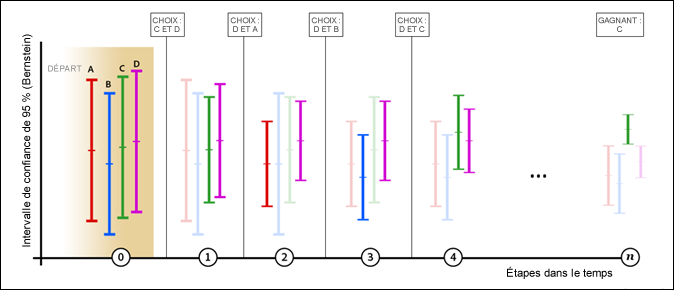

# Aperçu de l’affectation automatique

Une activité d’affectation automatique dans [!DNL Adobe Target] identifie un gagnant parmi plusieurs expériences et réaffecte automatiquement du trafic supplémentaire vers le gagnant afin d’augmenter les conversions pendant que le test se poursuit et apprend.

Lors de la création d’une activité A/B à l’aide du processus assisté en trois étapes, vous pouvez choisir l’option [!UICONTROL Affectation automatique à la meilleure expérience] .

## Le défi {#section_85D5A03637204BACA75E19646162ACFF}

Les tests A/B standard ont un coût. Vous devez générer du trafic pour mesurer les performances de chaque expérience et déterminer l’expérience gagnante grâce à une analyse. L’affectation du trafic reste fixe même après que vous avez admis que certaines expériences sont plus performantes que d’autres. En outre, il est difficile de déterminer la taille de l’échantillon. L’activité doit également s’exécuter en entier avant que vous ne puissiez agir sur un gagnant. Une fois cette étape terminée, il est encore possible que le gagnant identifié ne soit pas un véritable gagnant.

## La solution: l’affectation automatique {#section_98388996F0584E15BF3A99C57EEB7629}

L’affectation automatique réduit les frais inhérents à la détermination d’une expérience gagnante. Elle contrôle les performances de la mesure d’objectif de toutes les expériences et envoie davantage de nouveaux participants vers les expériences hautement performantes de manière proportionnelle. Suffisamment de trafic est réservé à l’exploration des autres expériences. Vous pouvez constater les avantages du test sur vos résultats, même si l’activité est toujours en cours d’exécution : l’optimisation se produit en parallèle de l’apprentissage.

L’affectation automatique dirige progressivement les visiteurs vers des expériences gagnantes, sans que vous ayez besoin d’attendre la fin d’une activité pour déterminer un gagnant. Vous bénéficiez de l’effet élévateur plus rapidement, car les participants à l’activité qui auraient été envoyés vers des expériences moins performantes sont dirigés vers des expériences potentiellement gagnantes.

Dans Target, un test A/B standard permet seulement de comparer, par paires, des expériences concurrentes à une expérience de contrôle. Si, par exemple, une activité comporte les expériences A, B, C et D, où A est l’expérience de contrôle, un test A/B Target standard compare A à B, A à C et A à D.

Lors de ces tests, la plupart des produits, y compris Target, ont recours à un test en t de Student pour générer une valeur de confiance basée sur la valeur p. Cette valeur de confiance sert ensuite à déterminer si l’expérience concurrente est suffisamment différente de l’expérience de contrôle. Target ne réalise toutefois pas automatiquement les comparaisons implicites (B par rapport à C, B par rapport à D et C par rapport à D) nécessaires en vue de déterminer quelle est la « meilleure » expérience. Le marketeur doit dès lors analyser les résultats manuellement pour déterminer la « meilleure » expérience.

L’affectation automatique effectue toutes les comparaisons implicites entre les expériences et produit un « vrai » gagnant. La notion d’expérience de « contrôle » disparaît donc totalement du test.

L’affectation automatique affecte les nouveaux visiteurs aux expériences suivant une logique intelligente jusqu’à ce qu’il n’existe plus aucun chevauchement entre l’intervalle de confiance de la meilleure expérience et celui des autres expériences. Ce processus pourrait produire des faux positifs, mais l’affectation automatique utilise des intervalles de confiance basés sur l’[inégalité de Bernstein](https://en.wikipedia.org/wiki/Bernstein_inequalities_(probability_theory)) qui compense les évaluations répétées. Nous obtenons alors un vrai gagnant. Lorsque l’affectation automatique s’arrête, pour autant qu’il n’y ait pas de dépendance temporelle importante pour les visiteurs qui arrivent sur la page, il y a au moins 95 % de chances que l’affectation automatique renvoie une expérience dont la vraie réponse n’est pas moins bonne de plus de 1 % (relatif) par rapport à la vraie réponse de l’expérience gagnante.

## Quand préférer l’affectation automatique aux tests A/B ou à Automated Personalization ? {#section_3F73B0818A634E4AAAA60A37B502BFF9}

* Utilisez l’**affectation automatique** quand vous souhaitez optimiser votre activité dès le début et identifier les expériences gagnantes aussi vite que possible. En dirigeant plus souvent les visiteurs vers des expériences hautement performantes, les performances globales de l’activité augmentent.
* Utilisez un **[test A/B](/help/c-activities/t-test-ab/test-ab.md#task_05E33EB15C4D4459B5EAFF90A94A7977)** standard quand vous voulez caractériser les performances de toutes les expériences avant d’optimiser votre site. Un test A/B vous permet de classer toutes vos expériences, tandis que l’affectation automatisée du trafic identifie les activités les plus performantes mais ne garantit pas la différenciation des activités moins performantes.
* Utilisez [Automated Personalization](/help/c-activities/t-automated-personalization/automated-personalization.md#task_8AAF837796D74CF893CA2F88BA1491C9) quand vous voulez obtenir des algorithmes d’optimisation de la plus haute complexité, tels que des modèles d’apprentissage automatique qui réalisent des prédictions en se basant sur les attributs des profils individuels. L’affectation automatisée du trafic s’intéresse au comportement global des expériences (exactement comme les tests A/B standard) et ne fait pas de distinction entre les visiteurs.

## Avantages clés {#section_0913BF06F73C4794862561388BBDDFF0}

* Préserve la rigueur d’un test A/B
* Identifie un gagnant statistiquement significatif plus rapidement qu’un test A/B manuel
* Fournit un effet élévateur de campagne moyen plus élevé qu’un test A/B manuel

## Terminologie  {#section_670F8785BA894745B43B6D4BFF953188}

Les termes suivants sont utiles pour aborder l’affectation automatique :

**Bandit à plusieurs bras :** une approche du type [bandit à plusieurs bras](https://en.wikipedia.org/wiki/Multi-armed_bandit) de l’optimisation équilibre l’apprentissage exploratoire et l’exploitation de cet apprentissage.

## Fonctionnement de l’algorithme {#section_ADB69A1C7352462D98849F2918D4FF7B}

La logique globale sous-jacente de l’affectation automatique intègre à la fois les performances mesurées (comme le taux de conversion) et les intervalles de confiance des données cumulées. Contrairement à un test A/B standard où le trafic est fractionné uniformément entre les expériences, l’affectation automatique modifie l’affectation du trafic entre les différentes expériences.

* 80 % des visiteurs sont affectés à l’aide de la logique intelligente décrite ci-dessous.
* 20 % des visiteurs sont affectés de façon aléatoire aux différentes expériences afin de tenir compte des variations de comportement des visiteurs.

L’approche du bandit à plusieurs bras permet à certaines expériences d’être explorées tandis que les expériences performantes sont exploitées. Davantage de nouveaux visiteurs sont dirigés vers des expériences aux meilleures performances tout en préservant la possibilité de réagir aux conditions changeantes. Ces modèles sont mis à jour au moins une fois par heure pour garantir que le modèle réagit aux dernières données.

Alors que davantage de visiteurs participent à l’activité, certaines expériences commencent à augmenter leurs performances et plus de trafic est envoyé vers les expériences performantes. 20 % du trafic reste réparti de manière aléatoire pour explorer toutes les expériences. Si l’une des expériences moins performantes commence à augmenter ses performances, plus de trafic est affecté à cette expérience. Si une activité hautement performante diminue ses performances, moins de trafic est affecté à cette expérience. Par exemple, si un événement pousse les visiteurs à rechercher d’autres informations sur votre site multimédia ou des ventes de week-end sur votre site de vente au détail, vous obtiendrez des résultats différents.

L’illustration suivante représente la façon dont l’algorithme pourrait s’exécuter lors d’un test avec quatre expériences :

L’illustration montre l’évolution du trafic affecté à chaque expérience sur plusieurs tours pendant la durée de vie de l’activité, jusqu’à ce que l’expérience gagnante puisse être déterminée.

| Tour | Description |
|--- |--- |
|  | **Tour de chauffe (0)** : au cours du tour de chauffe, chaque expérience reçoit une affectation égale du trafic jusqu’à ce que chaque expérience de l’activité atteigne un minimum de 1 000 visiteurs et 50 conversions.<ul><li>Expérience A = 25 %</li><li>Expérience B = 25 %</li><li>Expérience C = 25 %</li><li>Expérience D = 25 %</li></ul>Lorsque chaque expérience de l’activité atteint 1 000 visiteurs et 50 conversions, Target commence l’affectation automatisée du trafic. Toutes les affectations se produisent par tour ; deux expériences sont sélectionnées pour chaque tour. Seules deux expériences passent au tour suivant : D et C. Lorsqu’elles passent au tour suivant, les deux expériences reçoivent 80 % du trafic de façon égale, tandis que les deux autres expériences continuent de participer mais sont servies que dans le cadre de l’affectation aléatoire des 20 % de trafic restant quand de nouveaux visiteurs pénètrent dans l’activité. Toutes les affectations sont mises à jour toutes les heures (indiqué par les tours sur l’axe X ci-dessus). Après chaque tour, les données cumulées sont comparées. |
|  | **1er tour** : durant ce tour, 80 % du trafic est affecté aux expériences C et D (40 % chacune). 20 % du trafic est affecté de manière aléatoire aux expériences A, B, C et D (5 % à chaque expérience). Au cours de ce tour, l’expérience A enregistre de bonnes performances.<ul><li>L’algorithme sélectionne l’expérience D pour passer au tour suivant parce qu’elle enregistre le taux de conversion le plus élevé (comme indiqué par sur l’échelle verticale de chaque activité).</li><li>L’algorithme sélectionne également l’expérience A pour progresser, puisqu’elle présente la limite supérieure la plus élevée de l’intervalle de confiance de 95 % de Bernstein pour les expériences restantes.</li></ul>Les expériences D et A passent au tour suivant. |
|  | **2e tour** : durant ce tour, 80 % du trafic est affecté aux expériences A et D (40 % chacune). 20 % du trafic est affecté de manière aléatoire, ce qui signifie que les expériences A, B, C et D récupèrent chacune 5 % du trafic. Au cours de ce tour, l’expérience B enregistre de bonnes performances.<ul><li>L’algorithme sélectionne l’expérience D pour passer au tour suivant parce qu’elle enregistre le taux de conversion le plus élevé (comme indiqué par sur l’échelle verticale de chaque activité).</li><li>L’algorithme sélectionne également l’expérience B pour progresser, puisqu’elle présente la limite supérieure la plus élevée de l’intervalle de confiance de 95 % de Bernstein pour les expériences restantes.</li></ul>Les expériences D et B passent au tour suivant. |
|  | **3e tour** : durant ce tour, 80 % du trafic est affecté aux expériences B et D (40 % chacune). 20 % du trafic est affecté de manière aléatoire, ce qui signifie que les expériences A, B, C et D récupèrent chacune 5 % du trafic. Au cours de ce tour, l’expérience D continue d’enregistrer de bonnes performances, de même que l’expérience C.<ul><li>L’algorithme sélectionne l’expérience D pour passer au tour suivant parce qu’elle enregistre le taux de conversion le plus élevé (comme indiqué par sur l’échelle verticale de chaque activité).</li><li>L’algorithme sélectionne également l’expérience C pour progresser, puisqu’elle présente la limite supérieure la plus élevée de l’intervalle de confiance de 95 % de Bernstein pour les expériences restantes.</li></ul>Les expériences D et C passent au tour suivant. |
|  | **4e tour** : durant ce tour, 80 % du trafic est affecté aux expériences C et D (40 % chacune). 20 % du trafic est affecté de manière aléatoire, ce qui signifie que les expériences A, B, C et D récupèrent chacune 5 % du trafic. Au cours de ce tour, l’expérience C enregistre de bonnes performances.<ul><li>L’algorithme sélectionne l’expérience C pour passer au tour suivant parce qu’elle enregistre le taux de conversion le plus élevé (comme indiqué par sur l’échelle verticale de chaque activité).</li><li>L’algorithme sélectionne également l’expérience D pour progresser, puisqu’elle présente la limite supérieure la plus élevée de l’intervalle de confiance de 95 % de Bernstein pour les expériences restantes.</li></ul>Les expériences C et D passent au tour suivant. |
|  | **Tour n** : au cours de l’évolution de l’activité, une expérience hautement performante commence à se distinguer et le processus continue jusqu’à ce qu’une expérience gagnante puisse être déterminée. Si l’intervalle de confiance de l’expérience avec le taux de conversion le plus élevé ne chevauche aucun autre intervalle de confiance d’expérience, elle est désignée comme gagnante et un [badge s’affiche sur la page de l’activité](/help/c-activities/automated-traffic-allocation/determine-winner.md) et dans la liste des activités.<ul><li>L’algorithme désigne l’expérience C comme gagnante définitive</li></ul>À ce stade, l’algorithme distribue 80 % du trafic à l’expérience C, tandis que 20 % du trafic continue à être distribué de manière aléatoire à toutes les expériences (A, B, C et D). Au total, l’expérience C récupère 85 % du trafic. Dans le cas improbable où l’intervalle de confiance du gagnant recommence à chevaucher un autre intervalle, l’algorithme restaure le comportement du tour 4 ci-dessus. **Important :** Si vous aviez choisi un gagnant manuellement à un stade antérieur du processus, il aurait été très facile de choisir la mauvaise expérience. C’est pourquoi il est recommandé d’attendre que l’algorithme détermine l’expérience gagnante. |

>[!NOTE]
>
>Si une activité ne comporte que deux expériences, les deux expériences obtiennent un trafic égal jusqu’à ce que [!DNL Target] trouve une expérience gagnante avec un degré de confiance de 75 %. À ce stade, les 2/3 du trafic sont attribués au gagnant et le 1/3 au perdant. Ensuite, lorsqu’une expérience atteint un degré de confiance de 95 %, 90 % du trafic est affecté au gagnant et 10 % à celui-ci. Nous maintenons toujours un certain trafic envoyé vers l’expérience &quot;perdante&quot; afin d’éviter les faux positifs à long terme (c’est-à-dire de conserver une certaine exploration).

Une fois qu’une activité [!UICONTROL Affectation automatique] est activée, les opérations suivantes de l’interface utilisateur ne sont pas autorisées :

* Basculer le mode d’« Affectation du trafic » en « Manuel »
* Modifier le type de mesure d’objectif
* Modifier des options dans le panneau Paramètres avancés

## Fonctionnement de l’affectation automatique

Pour plus d’informations, voir [L’affectation automatique peut vous donner des résultats de test plus rapides et des recettes plus élevées qu’un test manuel](/help/c-activities/automated-traffic-allocation/faster-results-higher-revenue.md)

## Avertissements {#section_5C83F89F85C14FD181930AA420435E1D}

**L’affectation automatique fonctionne seulement avec l’un des paramètres de mesure avancée, à savoir : incrémenter le décompte et laisser l’utilisateur dans l’activité.**

Les paramètres suivants de mesure avancée ne sont pas pris en charge : incrémenter le décompte, libérer l’utilisateur et autoriser le retour et Incrémenter le décompte, libérer l’utilisateur et bloquer le retour.

**Les visiteurs fréquents peuvent exagérer les taux de conversion de l’expérience.**

Si un visiteur qui visualise l’expérience A revient fréquemment et effectue plusieurs conversions, le taux de conversion de l’expérience A augmente artificiellement. Comparez cette situation à l’expérience B, où les visiteurs effectuent des conversions mais ne reviennent pas souvent. Par conséquent, le taux de conversion de A paraît meilleur que celui de B. Les nouveaux visiteurs sont donc plus susceptibles d’être affectés à A qu’à B. Si vous choisissez de compter une fois par participant, il se peut que les taux de conversion de A et de B soient identiques.

Si les visiteurs récurrents sont distribués de manière aléatoire, leur effet sur les taux de conversion sera a priori nivelé. Pour atténuer cet effet, vous pouvez changer la méthode de comptabilisation de la mesure d’objectif pour ne compter qu’une fois par participant.

**Différenciation entre les activités les plus performantes, et non entre celles les moins performantes.**

L’affectation automatique permet de différencier les expériences hautement performantes (et de trouver un gagnant). Il peut arriver que la différenciation des expériences les moins performantes soit insuffisante.

Si vous souhaitez générer une différenciation significative sur le plan statistique entre toutes les expériences, vous pouvez éventuellement utiliser le mode manuel d’affectation du trafic.

**Les taux de conversion liés au temps (ou variant selon le contexte) peuvent fausser l’affectation.**

Certains facteurs qui peuvent être ignorés au cours d’un test A/B standard car ils affectent toutes les expériences de manière égale ne peuvent pas être ignorés lors d’un test d’affectation automatique. L’algorithme est sensible aux taux de conversion observés. Vous trouverez ci-dessous des exemples de facteurs qui peuvent affecter les performances des expériences de manière inégale :

* Expériences avec une pertinence contextuelle variable (heure, emplacement, sexe, etc.).

   Par exemple :

   * « Dieu merci, on est vendredi » produit des conversions plus élevées le vendredi
   * « Attaquez votre lundi » engendre une conversion plus élevée le lundi
   * « Équipez-vous pour un hiver sur la côte Est » fournit une conversion plus élevée pour les emplacements de la côte Est ou touchés par l’hiver

Ces éléments peuvent davantage fausser les résultats d’un test d’affectation automatique que d’un test A/B. En effet, le test A/B analyse les résultats sur une plus longue période.

* Expériences avec des délais variables de conversion (probablement à cause de l’urgence du message).

   Par exemple, « Derniers jours des soldes à -30 % » signale au visiteur d’effectuer une conversion aujourd’hui, tandis que « 50 % sur votre premier achat » n’engendre pas le même sentiment d’urgence.

## Questions fréquentes  {#section_0E72C1D72DE74F589F965D4B1763E5C3}

Consultez les questions fréquentes et réponses suivantes lorsque vous utilisez les activités [!UICONTROL Affectation automatique] :

### Analytics for Adobe Target (A4T) prend-il en charge les activités d’affectation automatique ?

Oui. Pour plus d’informations, consultez [Prise en charge d’A4T pour les activités d’affectation automatique et de ciblage automatique](/help/c-integrating-target-with-mac/a4t/a4t-at-aa.md).

###  Les visiteurs récurrents sont-ils automatiquement redirigés vers des expériences hautement performantes ?

Non. Seuls les nouveaux visiteurs sont affectés automatiquement. Les visiteurs récurrents continuent de visualiser leur expérience d’origine. Cela protège la validité du test A/B.

###  Comment l’algorithme traite-t-il les faux positifs ?

L’algorithme garantit un degré de confiance de 95 % ou un taux de faux positifs de 5 % si vous patientez jusqu’à l’apparition du badge Gagnant.

### Quand l’affectation automatique commence-t-elle à affecter le trafic ?

L’algorithme commence à fonctionner quand toutes les expériences de l’activité atteignent un minimum de 1 000 visiteurs et 50 conversions.

### Quel est le niveau d’exploitation de l’algorithme ?

80 % du trafic affecté à l’aide de l’affectation automatique et 20 % du trafic affecté de façon aléatoire. Une fois l’expérience gagnante identifiée, elle reçoit la totalité des 80 % du trafic mentionnés, tandis que toutes les expériences continuent de recevoir une partie des 20 % de trafic restant, y compris l’expérience gagnante.

###  Les expériences perdantes sont-elles affichées ?

Oui. Le bandit à plusieurs bras s’assure qu’au moins 20 % du trafic est réservé à l’exploration des taux de conversion ou des modèles changeants sur l’ensemble des expériences.

### Que se passe-t-il pour les activités avec de longs délais de conversion ?

Tant que les délais de toutes les expériences étant optimisées restent identiques, le comportement est identique à celui d’une activité avec un cycle de conversion plus rapide, bien qu’il faille plus de temps pour atteindre le seuil de 50 conversions avant que ne commence l’affectation du trafic.

###  En quoi l’affectation automatique diffère-t-elle d’Automated Personalization ?

Automated Personalization détermine la meilleure expérience en utilisant les attributs du profil de chaque visiteur. Ce faisant, l’activité est optimisée, mais également personnalisée en fonction de cet utilisateur.

D’un autre côté, l’affectation automatique est un test A/B qui produit un gagnant agrégé (l’expérience la plus populaire, mais pas nécessairement la plus efficace pour chaque visiteur).

###  Les visiteurs récurrents gonflent-ils le taux de conversion de ma mesure de succès ?

Actuellement, la logique favorise les visiteurs qui convertissent rapidement ou visitent plus souvent. En effet, de tels visiteurs gonflent temporairement le taux de conversion global de l’expérience à laquelle ils appartiennent. L’algorithme s’ajuste fréquemment, de sorte que l’augmentation du taux de conversion est amplifiée à chaque instantané. Si le site reçoit beaucoup de visiteurs récurrents, leurs conversions peuvent potentiellement gonfler le taux de conversion global pour l’expérience à laquelle ils appartiennent. Il y a de bonnes chances que les visiteurs récurrents soient distribués de manière aléatoire, auquel cas l’effet global (effet élévateur augmenté) est équilibré. Pour atténuer cet effet, vous pouvez changer la méthode de comptabilisation de la mesure de succès pour ne compter qu’une fois par participant.

### Puis-je utiliser le calculateur de taille d’échantillon lorsque j’utilise l’affectation automatique pour estimer combien de temps il faudra à l’activité pour identifier le gagnant ?

Vous pouvez utiliser le [calculateur de taille d’échantillon](https://experienceleague.adobe.com/tools/calculator/testcalculator.html) existant pour obtenir une estimation de la durée d’exécution du test. (Comme pour les tests A/B traditionnels, appliquez la correction Bonferroni si vous testez plus de deux offres ou plusieurs mesures/hypothèses de conversion.) Notez que ce calculateur est conçu pour les tests A/B à horizon fixe classiques et ne fournit qu’une estimation. L’utilisation du calculateur pour une activité d’affectation automatique est facultative, car l’affectation automatique vous désignera comme gagnant (vous n’avez pas besoin de choisir un point fixe dans le temps pour consulter les résultats du test). Les valeurs fournies sont toujours statistiquement valides. Dans nos expériences, nous avons trouvé ce qui suit :
* Lors du test de deux expériences exactement, l’affectation automatique détecte un gagnant plus rapidement que le test à horizon fixe (c’est-à-dire la période suggérée par le calculateur de taille d’échantillon) lorsque la différence de performances entre les expériences est importante, mais peut nécessiter un temps supplémentaire pour identifier un gagnant lorsque la différence de performances entre les expériences est faible. Dans ce cas, les tests à horizon fixe se seraient généralement terminés sans résultat statistiquement significatif.
* Lors du test de plus de deux expériences, l’affectation automatique détecte un gagnant plus rapidement que le test à horizon fixe (c’est-à-dire la période suggérée par le calculateur de taille d’échantillon) lorsqu’une seule expérience surpasse fortement toutes les autres expériences. Lorsque plusieurs expériences sont à la fois &quot;gagnantes&quot; par rapport à d’autres expériences, mais étroitement liées les unes aux autres, l’affectation automatique peut nécessiter un temps supplémentaire pour déterminer celle qui est supérieure. Dans ce cas, les tests à horizon fixe se seraient généralement terminés en concluant que les expériences &quot;gagnantes&quot; étaient meilleures que les expériences moins performantes, mais sans avoir identifié celle qui était supérieure.

### Dois-je supprimer une expérience peu performante d’une activité d’affectation automatique pour accélérer le processus de détermination d’un gagnant ?

Il n’y a vraiment aucune raison de supprimer une expérience peu performante. L’affectation automatique fournit automatiquement des expériences hautement performantes et diffuse moins souvent des expériences peu performantes. Le fait de laisser une expérience peu performante dans l’activité n’aura pas d’incidence significative sur la vitesse de détermination d’un gagnant.

20 % des visiteurs sont affectés de manière aléatoire à toutes les expériences. Le volume de trafic affecté à une expérience peu performante est minimal (20 % divisé par le nombre d’expériences).

### Puis-je modifier la mesure d’objectif à mi-chemin par le biais d’une activité d’affectation automatique ? {#change-metric}

Il est déconseillé de modifier la mesure d’objectif au cours d’une activité. Bien qu’il soit possible de modifier la mesure d’objectif au cours d’une activité à l’aide de l’interface utilisateur de [!DNL Target], vous devez toujours démarrer une nouvelle activité. Nous ne garantissons pas les résultats obtenus si vous modifiez la mesure d’objectif dans une activité après son exécution.

Cette recommandation s’applique aux activités d’[!UICONTROL affectation automatique], de [!UICONTROL ciblage automatique] et d’[!UICONTROL Automated Personalization] qui utilisent [!DNL Target] ou [!DNL Analytics] (A4T) comme source de création de rapports.

### Puis-je utiliser l’option Réinitialiser les données du rapport lors de l’exécution d’une activité d’affectation automatique ?

L’utilisation de l’option [!UICONTROL Réinitialiser les données du rapport] pour les activités [!UICONTROL Affectation automatique] n’est pas recommandée. Bien qu’elle supprime les données de rapport visibles, cette option ne supprime pas tous les enregistrements d’entraînement du modèle [!UICONTROL Affectation automatique] . Au lieu d’utiliser l’option [!UICONTROL Réinitialiser les données du rapport] pour les activités [!UICONTROL Affectation automatique] , créez une activité et désactivez l’activité d’origine. (Remarque : Cette recommandation s’applique également aux activités [!UICONTROL de ciblage automatique] et [!UICONTROL Automated Personalization].

### Comment l’affectation automatique génère-t-elle des modèles en ce qui concerne les environnements ?

[!UICONTROL L’] affectation automatique crée des modèles en fonction du comportement de trafic et de conversion enregistré dans l’environnement par défaut uniquement. Par défaut, [!UICONTROL Production] est l’environnement par défaut, mais cela peut être modifié dans Target [Administration > Environnements](/help/administrating-target/environments.md).

Si un accès se produit dans un autre environnement (autre que celui par défaut), le trafic est distribué en fonction du comportement de conversion observé dans l’environnement par défaut. Le résultat de cet accès (conversion ou non-conversion) sera enregistré à des fins de création de rapports, mais pas pris en compte dans le modèle [!UICONTROL Affectation automatique] .

Lors de la sélection d’un autre environnement, le rapport affiche le trafic et les conversions pour cet environnement. L’environnement sélectionné par défaut pour un rapport correspond toujours à la valeur par défaut sélectionnée pour l’ensemble du compte. L’environnement par défaut ne peut pas être défini par activité.

## Vidéos de formation {#section_893E5B36DC4A415C9B1D287F51FCCB83}

Les vidéos suivantes contiennent davantage d’informations sur les concepts abordés dans cet article.

### Workflow d’activité - Ciblage (2:14) 

Cette vidéo comprend des informations sur la configuration de l’affectation du trafic.

* Affecter une audience à votre activité
* Augmenter ou ralentir le trafic
* Sélectionner votre méthode d’affectation du trafic
* Affecter du trafic entre différentes expériences

>[!VIDEO](https://video.tv.adobe.com/v/17385)

### Création de tests A/B (8:36) 

Cette vidéo explique comment créer un test A/B à l’aide du processus assisté en trois étapes de Target. L’affectation automatisée du trafic est abordée à partir de 4:45.

* Créer une activité A/B dans Adobe Target
* Affecter du trafic à l’aide d’un fractionnement manuel ou de l’affectation automatique du trafic

>[!VIDEO](https://video.tv.adobe.com/v/17391)
