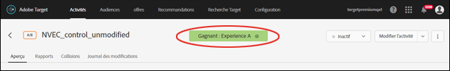
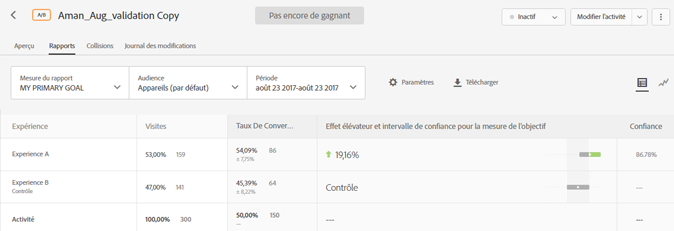
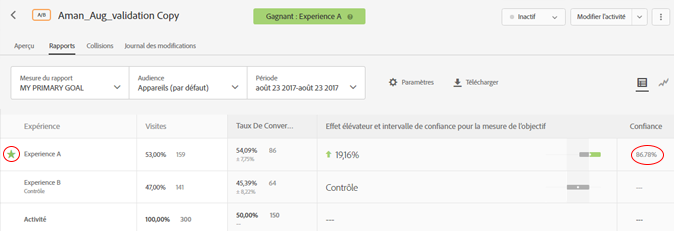

# Désignation d’un gagnant{#determine-a-winner}

Déterminez une expérience gagnante au sein d’une activité A/B d’affectation automatique en affichant les indicateurs dans l’interface utilisateur de Target.

La plupart des marketeurs ont tendance à déclarer de manière prématurée une expérience gagnante avant les résultats finaux. Désormais, il est plus facile de déterminer le gagnant.

## Affichage du badge Gagnant dans l’interface utilisateur de Target {#section_24007470CF5B4D30A06610CE8DD23CE3}

Lors de l’utilisation de la fonctionnalité [!UICONTROL Affectation automatique], [!DNL Target] affiche en haut de la page de l’activité un badge indiquant « Pas encore de gagnant » jusqu’à ce que l’activité atteigne le nombre de conversions minimal avec un degré de confiance suffisant.

Lors de la déclaration d’un gagnant définitif, [!DNL Target] affiche la mention « Gagnant : expérience X. »

>[!NOTE]
>
>Les activités d’affectation automatique sont conçues pour identifier la meilleure expérience parmi toutes les options possibles, et pas uniquement pour effectuer des comparaisons par paires avec une expérience de contrôle.

## Garanties statistiques de l’affectation automatique {#section_7AF3B93E90BA4B80BC9FC4783B6A389C}

À la fin d’une activité A/B, l’affectation automatique garantit que le gagnant déterminé a un taux de faux positifs effectif de 5 %. Cela signifie que dans seulement 5 % des cas, le gagnant déterminé ne représente pas réellement la meilleure expérience parmi toutes les expériences de l’activité. En ce qui concerne les tests A/A (avec des expériences identiques), nous ne concluons le test que dans moins de 5 % des cas. Dans la mesure où un test A/A (avec des expériences identiques) est censé être exécuté indéfiniment, le badge Gagnant ne devrait jamais apparaître.

Nous n’utilisons pas un degré de confiance basé sur la valeur p pour l’affectation automatique.

La colonne Confiance dans une activité d’affectation automatique (illustrée ci-dessous) présente la probabilité qu’une expérience soit la gagnante avec une marge d’erreur de 1 % (l’algorithme utilise un effet détectable minimum de 1 % entre le meilleur et le deuxième meilleur taux de conversion). Pour calculer cette probabilité, l’algorithme applique l’[inégalité de Bernstein](https://en.wikipedia.org/wiki/Bernstein_inequalities_(probability_theory)).

Les tests A/B standard calculent le degré de confiance selon les valeurs-p, ce que ne fait pas l’affectation automatique. Les valeurs-p calculent « grossièrement » la probabilité qu’une expérience donnée diffère de l’expérience de contrôle. Elles peuvent seulement servir à déterminer si une expérience diffère de l’expérience de contrôle. Elles ne peuvent pas servir à déterminer si une expérience diffère d’une autre expérience (que l’expérience de contrôle).

L’illustration suivante montre une activité qui n’a pas encore de gagnant :

L’illustration suivante montre une activité où l’expérience gagnante a été déterminée :

## Questions fréquentes {#section_C8E068512A93458D8C006760B1C0B6A2}

**L’activité a commencé depuis quelques jours. Pourquoi le degré de confiance reste-t-il à 0 % ?**

La colonne [!UICONTROL Confiance] peut rester à 0 % pour toutes les activités pour l’une des raisons suivantes :

* Les tests A/B manuels et l’affectation automatique utilisent différentes statistiques pour afficher les valeurs de confiance.

   Les tests A/B manuels utilisent des valeurs-p en fonction du [test en t de Student](https://en.wikipedia.org/wiki/Student%27s_t-test). Une valeur-p est la probabilité de trouver la différence observée (ou une plus extrême) entre une expérience et le contrôle, étant donné qu’en réalité, il n’y a pas de différence de ce type. Ces valeurs-p ne peuvent être utilisées que pour déterminer si les données observées sont cohérentes avec une expérience donnée et si le contrôle est le même. Elles ne peuvent pas servir à déterminer si une expérience diffère d’une autre expérience (que l’expérience de contrôle).

   L’affectation automatique présente la probabilité qu’une expérience donnée soit l’expérience gagnante par rapport à toutes les expériences de l’activité. Cela signifie que seule une expérience gagnante (dont la probabilité qu’il s’agisse de l’expérience gagnante est la plus élevée) aura une valeur de confiance non nulle. Toutes les autres expériences sont probablement des expériences perdantes, avec un taux de 0 %.

* L’affectation automatique commence à présenter un taux de confiance seulement quand l’expérience gagnante parvient à un taux de confiance de 60 %. L’affectation automatique est approximativement deux fois plus rapide qu’un test A/B standard. Pour déterminer la durée d’exécution d’un test A/B, utilisez une [calculatrice de taille d’échantillon](https://docs.adobe.com/content/target-microsite/testcalculator.html) : entrez le taux de conversion de l’expérience de contrôle dans la case taux de conversion référentiel (« Baseline Conversion Rate »), « 5 % » pour l’effet élévateur (« Lift ») et 95 % en degré de confiance (« Confidence »). En règle générale, le degré de confiance apparaît quand chaque expérience a accumulé au moins 50 % des échantillons requis par expérience. Ainsi, vous savez à peu près quand le degré de confiance commencera à apparaître.
* Si le rapport présente globalement un taux de 0 %, cela signifie probablement que l’activité n’a pas encore suffisamment progressé.

