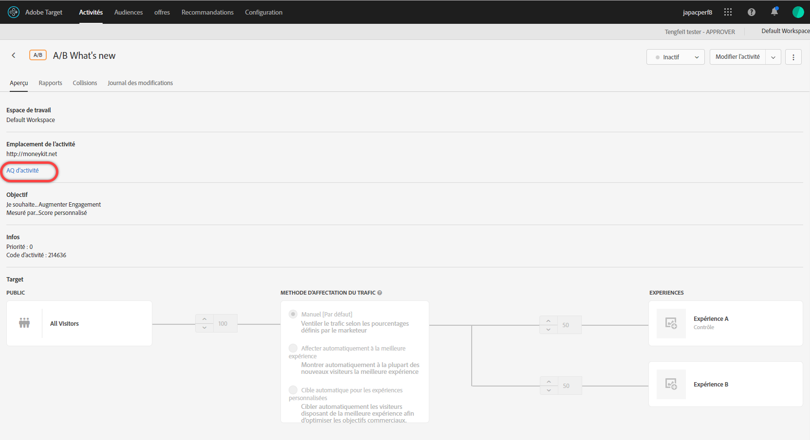
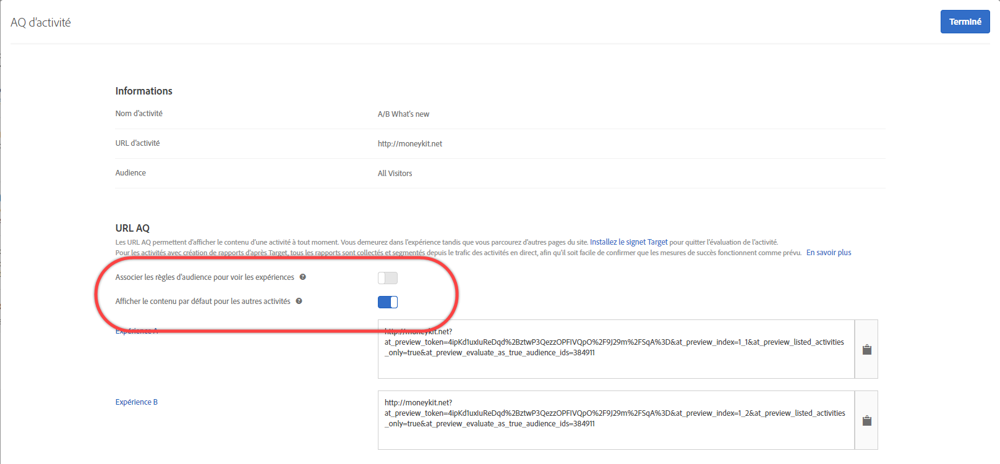

# AQ d’activité {#activity-qa}

Utilisez les URL d’assurance qualité en Adobe Target pour effectuer un contrôle qualité des activités de bout en bout simple avec des liens de prévisualisation qui ne changent jamais, un ciblage facultatif des audiences et un rapports d’assurance qualité qui reste segmenté à partir des données d’activité en direct.

## Aperçu {#section_11B761A522A14E61978275772210A4C2}

L’AQ d’activité permet de tester entièrement les activités Target avant de les activer. La fonctionnalité AQ d’activité inclut :

* des liens à partager avec les membres de l’équipe qui ne changent jamais ou ne nécessitent jamais de régénération, indépendamment des mises à jour apportées aux expériences ou aux activités ;. Vous pouvez ainsi tester pleinement vos activités dans tout le parcours de l’utilisateur.
* Des conditions d’audience facultatives afin que les responsables du marketing puissent tester les critères de ciblage ou les ignorer pour soumettre à l’assurance qualité (QA) l’aspect des expériences sans avoir à respecter les conditions d’audience.
* La création de rapports QA est capturée afin que les responsables du marketing puissent confirmer que les mesures s’incrémentent comme prévu et que les données des rapports QA sont conservées indépendamment des rapports de production (pour les rapports non-A4T).
* Capacité de prévisualisation d’une expérience isolée ou en association avec d’autres activités en direct répondant aux critères de diffusion (demande/audience de page/Cible/page).
* La capacité à vérifier la qualité de l’ensemble du parcours de l’utilisateur. Vous avez accès à votre site une fois avec le lien AQ et vous parcourez ensuite le site entier en mode AQ d’activité. Vous restez dans l’AQ d’activité jusqu’à ce vous mettiez fin à la session ou que vous utilisiez le [signet d’applet AQ de Target](/help/c-activities/c-activity-qa/activity-qa-bookmark.md#concept_A8A3551A4B5342079AFEED5ECF93E879) pour vous libérer de l’AQ d’activité. Cette fonctionnalité est particulièrement utile si vous avez une activité qui s’étend sur plusieurs pages Web.

   >[!NOTE]
   >
   >Cela est vrai pour les implémentations d’at.js avec la version 2.*x* ou ultérieure. Pour at.js 1.*Implémentations de x* et mbox.js, cela n’est vrai que si le navigateur du visiteur ne bloque pas les cookies tiers.

## Accès et partage d’une URL AQ {#section_1C59BAA247B247BDB125D1BE8EAD4547}

1. Dans la page [!UICONTROL Aperçu] d’une activité (tous les types à l’exception d’Automated Personalization), cliquez sur le lien **[!UICONTROL AQ d’activité]**.

   

1. Configurez les paramètres suivants :

   

   * **Faire correspondre les règles d’audience pour afficher les expériences :** parfois, vous voulez confirmer que la correspondance d’audiences fonctionne. D’autres fois, vous voulez simplement vérifier l’aspect de l’activité. Si ce paramètre est activé, les testeurs doivent satisfaire aux exigences de ciblage pour pouvoir voir les expériences. Pour les activités de ciblage d’expérience (XT), une seule URL d’activité est fournie. L’expérience que vous voyez est déterminée par le fait que vous vous qualifiez pour l’une des règles de ciblage.

      Si ce paramètre est désactivé, le fait de cliquer sur les liens vous montre les expériences, que vous vous qualifiez ou non. Lors de l’exécution de l’AQ, vous pouvez basculer entre la nécessité ou non de respecter le ciblage d’audience.

   * **Afficher le contenu par défaut pour toutes les autres Activités :** Si cette option est activée, le contenu par défaut s’affiche pour toutes les autres activités (par exemple, la prévisualisation s’affiche isolément sans prendre en compte toutes les autres activités actives sur la même page/[!DNL Target] même requête.

      Si ce paramètre est désactivé, considérez ce qui suit :

      * En cas de conflits entre l’activité que vous testez et d’autres activités actives, [les règles de priorité normale](/help/c-activities/priority.md#concept_1780C11FEA57440499F0047DD6900E0F) s’appliquent. Pour cette raison, il est possible que vous ne voyiez pas l’activité que vous avez l’intention de soumettre à l’assurance qualité (AQ).
      * Les mesures s’incrémentent pour les activités vues, mais uniquement dans l’environnement de création de rapports d’AQ.

1. Cliquez sur **[!UICONTROL Terminé]** pour enregistrer les modifications.
1. Partagez les URL de lien d’activité avec les membres de votre organisation pour les tester.

   Les liens d’activité n’expirent jamais et vous n’avez pas besoin de renvoyer des liens si quelqu’un modifie une activité ou une expérience. Cependant, si vous appliquez une audience différente de la bibliothèque d’audiences, au lieu de simplement modifier l’activité, un nouveau lien est généré, que vous devez partager à nouveau.

   Chaque URL de lien d’activité (pour Exp A, Exp B, etc.) permet de démarrer le parcours de l’utilisateur à partir de l’expérience correspondante. Vous pouvez cliquer sur l’URL générée pour une expérience, puis naviguer normalement sur le site pour voir les expériences sur plusieurs pages (s’il existe plusieurs pages). Une seule URL est générée par expérience, même si celle-ci s’étend sur plusieurs pages (tests de modèle ou tests de plusieurs pages).

   Vous pouvez naviguer sur le site pour voir les autres pages car l’AQ d’activité est attractive. Notez que cela est vrai pour les implémentations d’at.js avec la version 2.*x* ou ultérieure. Pour at.js 1.*Implémentations de x* et mbox.js, cela n’est vrai que si le navigateur du visiteur ne bloque pas les cookies tiers.

1. Pour afficher les rapports générés à partir des URL de lien d’activité, cliquez sur la page des **[!UICONTROL Rapports]** de l’activité, puis sur l’icône **[!UICONTROL Paramètres]** (  ), puis sélectionnez **[!UICONTROL Mode AQ]** dans la liste déroulante **[!UICONTROL Environnement]**

## Considérations {#section_B256EDD7BFEC4A6DA72A8A6ABD196D78}

* Le lien [!UICONTROL AQ d’activité] s’affiche sur la page [!UICONTROL Aperçu] de tous les types d’activité, à l’exception d’Automated Personalization (AP). Vous pouvez utiliser l’option [Aperçu des liens](/help/c-activities/t-automated-personalization/experience-preview.md#task_586C6655A6FD4AF08F5678FC3F481EFC) pour les activités AP.
* Les liens d’aperçu de l’AQ des activités pour les activités enregistrées peuvent ne pas se charger si votre compte comporte trop d’activités enregistrées. Une nouvelle tentative avec les liens d’aperçu doit fonctionner. Pour éviter que ce problème se reproduise, archivez les activités enregistrées qui ne sont plus utilisées.
* Les URL AQ d’activité sont disponibles avec les activités avec Analytics en tant que source des rapports (A4T). Les accès générés lors de l’exécution de l’AQ avec une AQ d’activité seront ajoutés à la même suite de rapports que celle où seront collectées les données de l’activité, même une fois celle-ci mise en service.
* L’AQ d’activité n’affiche pas de contenu pour les activités archivées ni les activités dont le délai est écoulé. Si vous désactivez une activité terminée, vous devez l’enregistrer de nouveau pour que l’AQ d’activité fonctionne.
* Les activités importées dans Target Standard/Premium (par exemple, depuis Target Classic) ne prennent pas en charge les URL AQ.
* Dans les activités d’affectation automatique, de ciblage automatique et de recommandations, le modèle n’est pas affecté par les visites capturées dans l’AQ d’activité.
* Comme l’AQ d’activité est attractive, une fois que vous avez navigué sur un site web en mode AQ d’activité, la session Target doit expirer ou Target doit vous libérer de l’AQ d’activité pour pouvoir afficher votre site comme un visiteur type. Utilisez le [signet d’applet AQ de Target](/help/c-activities/c-activity-qa/activity-qa-bookmark.md#concept_A8A3551A4B5342079AFEED5ECF93E879) pour vous libérer de l’AQ d’activité.

   Vous pouvez également vous libérer manuellement en chargeant une page de votre site avec le `at_preview_token`paramètre doté d’une valeur vide (par exemple, `https://www.mysite.com/?at_preview_token=`).

* Si vous avez spécifié « URL » lors de la création des [améliorations de l’activité dans le compositeur d’après les formulaires](/help/c-experiences/form-experience-composer.md#task_FAC842A6535045B68B4C1AD3E657E56E) ou [les options de remise dans le compositeur d’expérience visuelle](/help/c-experiences/c-visual-experience-composer/viztarget-options.md#reference_3BD1BEEAFA584A749ED2D08F14732E81), l’URL d’assurance qualité ne fonctionnera pas car l’AQ d’activité ajoute des paramètres d’URL. Pour résoudre ce problème, cliquez sur l’URL AQ pour accéder à votre site, supprimez les paramètres ajoutés depuis l’URL, puis chargez la nouvelle URL.
* Si vous avez at.js 1.*x*, ou mbox.js, le mode d’assurance qualité des Activités n’est pas collant si vous utilisez Safari ou un autre navigateur qui bloque les cookies tiers. Dans ce cas, vous devez ajouter les paramètres de prévisualisation à chaque URL à laquelle vous accédez. Il en va de même si vous avez implémenté [CNAME](/help/c-implementing-target/c-considerations-before-you-implement-target/implement-cname-support-in-target.md).
* Si une activité utilise plusieurs audiences d’expérience (par exemple, un site britannique et un site américain inclus dans la même activité), les liens QA ne sont pas générés pour les quatre combinaisons (Expérience A / Site américain, Expérience A / Site britannique, Expérience B / Site américain, Expérience B / Site britannique). Seuls deux liens AQ (Expérience A et Expérience B) sont créés et les utilisateurs doivent se qualifier pour l’audience appropriée pour voir la page. Une personne de l’assurance-qualité (AQ) au Royaume-Uni ne peut pas voir le site américain.
* Tous les paramètres et toutes les valeurs `at_preview` sont déjà encodés sous forme d’URL. La plupart du temps, tout fonctionne comme prévu, mais certains clients peuvent avoir des équilibrages de charge ou des serveurs Web qui tentent de coder de nouveau les paramètres de la chaîne de requête.

   En raison de ce double encodage, lorsque nous tentons de décoder la valeur `at_preview_token`, Target ne parvient pas à extraire la valeur de jeton correcte, ce qui fait échouer l’affichage.

   Nous vous recommandons de contacter votre équipe informatique pour vous assurer que tous les paramètres de prévisualisation sont placés sur la liste autorisée afin que ces valeurs ne soient pas transformées d’aucune manière.

   Le tableau suivant liste les paramètres qui peuvent être placés sur la liste autorisée dans votre domaine :

   | Paramètre | Type | Valeur | Description |
   |--- |--- |--- |--- |
   | `at_preview_token` | Chaîne chiffrée | Obligatoire ; aucune valeur par défaut | Entité chiffrée qui contient la liste des ID de campagnes autorisés à être exécutés en mode QA. |
   | `at_preview_index` | Chaîne | Empty | Le format du paramètre est `<campaignIndex>` ou `<campaignIndex>_< experienceIndex>` . Les deux index commencent par 1. |
   | `at_preview_listed_activities_only` | Booléen (true/false) | Valeur par défaut : false | Si la valeur est définie sur « true », toutes les campagnes spécifiées dans les paramètres `at_preview_index` seront traitées. Si « false », toutes les campagnes de la page sont traitées, même si elles n’ont pas été spécifiées dans le jeton d’aperçu. |
   | `at_preview_evaluate_as_true_audience_ids` | Chaîne | Empty | Underscore-separated (&quot;_&quot;) list of segmentId-s that should always (at targetting and reporting level) be evaluated as &quot;true&quot; in the scope of the [!DNL Target] request. |
   | `_AT_Debug` | Chaîne | Fenêtre ou console | Journalisation de console ou nouvelle fenêtre. |
   | `adobe_mc_ref` |  |  | Transmet l’URL de référence de la page par défaut à la nouvelle page. Lorsqu’utilisé avec la version 2.1 (ou ultérieure) de `AppMeasurement.js`, [!DNL Adobe Analytics] utilise cette valeur de paramètre comme URL de référence sur la nouvelle page. |
   | `adobe_mc_sdid` |  |  | Transfère l’[!DNL Supplemental Data Id] (SDID) et [!DNL Experience Cloud Org Id] de la page par défaut vers la nouvelle page afin que Analytics for Target (A4T) « relie » la requête Target de la page par défaut à la requête Analytics de la nouvelle page. |

* L’interface utilisateur du mode QA de Target affiche uniquement la première URL d’une expérience dans une activité multi-page. Supposons que vous créiez un test de parcours et que vous passiez de l’URL 1 à l’URL 2. Toutefois, si vous souhaitez accéder à l’URL 2 indépendamment, copiez tous les paramètres d’URL fournis par rapport à l’URL 1 et appliquez-les à l’URL 2 après avoir placé un « ? ». comme vous le voyez dans l’URL 1.
