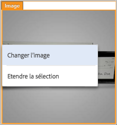
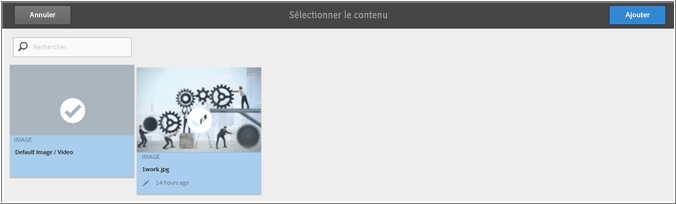
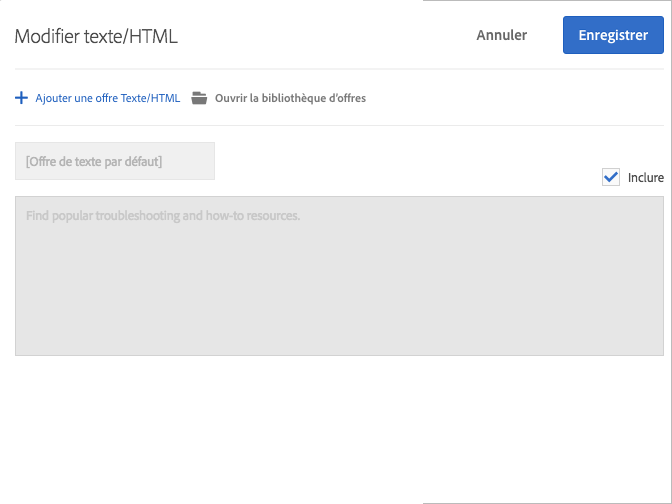

# Création de combinaisons{#create-combinations}

Utilisez le compositeur d’expérience visuelle pour créer les offres que vous souhaitez inclure dans le test.

>[!NOTE]
>
>Vous pouvez cliquer sur **[!UICONTROL Étendre la sélection]** lors de la sélection d’objets sur la page afin de sélectionner l’élément parent en plus de l’élément sélectionné d’origine. Lorsque vous sélectionnez un élément parent, tous les enfants de cet élément sont automatiquement sélectionnés. Vous pouvez étendre plusieurs fois la sélection.

Le compositeur d’expérience visuelle permet de modifier des offres, des noms d’offres et des noms d’emplacements. Une superposition apparaît pour indiquer où vous avez apporté des modifications.

## Offres d’image  {#section_A48333211DB149ED926AE467D0032914}

Testez plusieurs offres d’image dans un emplacement afin de déterminer l’image qui remporte le plus de succès.

1. Cliquez sur une image de la page, puis sélectionnez **[!UICONTROL Changer l’image]**.

   

1. Sélectionnez toutes les images que vous souhaitez inclure dans le test, puis cliquez sur **[!UICONTROL Ajouter]**.

   

Chaque image devient une expérience distincte à cet emplacement.

## Offres HTML  {#section_DF016101AFA9412C9B99862C23DE77B1}

Testez plusieurs offres Texte/HTML dans un emplacement afin de déterminer l’offre qui remporte le plus de succès.

1. Cliquez sur une offre Texte/HTML de la page, puis sur **[!UICONTROL Modifier le texte/code HTML]**.

   

1. Cliquez sur **[!UICONTROL Ajouter une offre Texte/HTML]**, attribuez un nom à l’offre, puis saisissez ou collez le code pour l’offre Texte/HTML.

   

   >[!NOTE]
   >
   >Internet Explorer 10 ne prend pas en charge les espaces réservés d’entrée HTML5. De ce fait, si vous utilisez IE10, le texte de l’espace réservé « Ajouter du contenu » reste dans le champ Texte lorsque vous saisissez du contenu.

   Répétez cette opération pour toute offre Texte/HTML supplémentaire que vous souhaitez inclure.

1. Cliquez sur **[!UICONTROL Enregistrer]**.

Chaque offre Texte/HTML devient une expérience distincte à cet emplacement.

## Bonnes pratiques {#section_2E98C23D2F1A460FA732A31799CE6291}

* N’incluez pas plus d’emplacements que nécessaire pour le test. Chaque expérience que vous incluez dans le test augmente de manière significative le volume de trafic et le temps requis pour obtenir des résultats acceptables. Par exemple, en présence d’éléments de page comportant trois offres chacun, vous obtenez neuf combinaisons possibles (3x3). Trois éléments, dont deux contiennent trois offres possibles et un deux offres, fournissent 18 options (3x3x2). Les nombres augmentent substantiellement avec chaque élément et offre supplémentaires.
* Lorsque vous créez un test multivarié, vous pouvez maintenant en exclure plus de 10 % des expériences, à condition d’utiliser alors les rapports hors ligne pour l’analyse.
* Tirez parti des fonctionnalités d’aperçu pour éviter des combinaisons non souhaitables de contenu. Par exemple, vous pourriez avoir deux images qui offrent des remises différentes sur le même élément ou service. L’affichage de ces images sur la même page n’est pas logique et est susceptible de prêter à confusion.
* Utilisez l’estimateur de trafic pour vous assurer que le test est conçu pour le volume de trafic que votre page reçoit. Assurez-vous que l’estimateur de trafic donne le feu vert à votre configuration de test afin que vous puissiez obtenir les résultats souhaités.
* Vous devez avoir au moins trois éléments à tester. Si vous n’en n’avez pas autant, exécutez une série de  Tests A/B.
* Il est recommandé de créer des alternatives significativement différentes les unes des autres.
* Bien que cela ne soit pas requis, la bonne pratique consiste à ce que chaque élément ait le même nombre d’alternatives.

