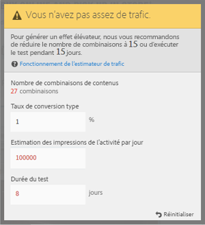

# Création d’un test multivarié{#create-a-multivariate-test}

Le [!UICONTROL compositeur d’expérience visuelle] (VEC) de [!DNL Adobe Target] facilite la création d’un test directement sur une page activée pour Target, ainsi que la modification de parties de la page dans Target[!DNL Target].

L&#39;éditeur [!DNL Target] pointer-cliquer vous permet de sélectionner n&#39;importe quel emplacement et d&#39;ajouter plusieurs offres.

Le [!UICONTROL test multivarié] (MVT) utilise un rapport de type « page-premier ». En d’autres termes, le test s’exécute sur une URL spécifique, avec des expériences que vous concevez pour cette page.

1. Cliquez sur **[!UICONTROL Créer l’activité]** > **[!UICONTROL Test multivarié]**.

   

   >[!NOTE]
   >
   >Les types d’activité disponibles dépendent de votre compte Target. Certains types d’activité peuvent ne pas apparaître dans votre liste. Par exemple, [!UICONTROL Automated Personalization] est une fonctionnalité [Target Premium](/help/c-intro/intro.md#premium).
   >
   >Pour plus d’informations sur les différents types d’activité disponibles dans [!DNL Target] et leurs différences, voir [Activités](/help/c-activities/activities.md#concept_D317A95A1AB54674BA7AB65C7985BA03). Reportez-vous à la section [Types d’activité Target](/help/c-activities/target-activities-guide.md) pour déterminer les types d’activité qui conviennent le mieux à vos besoins.

1. Si nécessaire, sélectionnez **[!UICONTROL visuelle (défaut)]**.

   

   >[!NOTE]
   >
   >Pour plus d’informations sur la résolution de problèmes liés au compositeur d’expérience visuelle, veuillez consulter [Dépannage du compositeur d’expérience visuelle](/help/c-experiences/c-visual-experience-composer/r-troubleshoot-composer/troubleshoot-composer.md).
   >
   >L’option [!UICONTROL Choisir l’espace de travail] de l’illustration précédente est une fonction [Target Premium](/help/c-intro/intro.md). Votre entreprise dispose d’une licence Target Standard si vous ne voyez pas cette option.

1. (Conditionnel) Si vous êtes client Target Premium, [choisissez un espace de travail](/help/administrating-target/c-user-management/property-channel/property-channel.md).

1. [Spécifiez l’URL](/help/c-activities/c-multivariate-testing/t-create-multivariate-test/url.md#concept_C12E4A85FF3B4E518E3110F6CF1AF9C0) pour la page que vous souhaitez tester, puis cliquez sur **[!UICONTROL Suivant]**.

   >[!NOTE]
   >
   >Utilisez une URL complète, y compris le HTTP ou HTTPS au début.

   Si un message s’affiche vous demandant d’activer votre navigateur pour le contenu mixte, suivez les instructions du message. Après avoir activé votre navigateur pour le contenu mixte, recommencez à l’étape 1.

   Le compositeur d’expérience visuelle s’ouvre.

1. Entrez le nom de l’activité.

   

   Le nom de l&#39;activité ne peut pas commencer par l&#39;un des caractères suivants :

   | Caractère | Description |
   |--- |--- |
   | `=` | Égal |
   | `+` | Plus |
   | `-` | Moins |
   | `@` | Arobase |

1. [Créez les offres à chaque emplacement](/help/c-activities/c-multivariate-testing/t-create-multivariate-test/add-offers.md#concept_DCE6B45C30F7419B8EC17AFDEE8D8AA6).

   

   Vous pouvez ajouter les types d’offres suivants :

   * HTML
   * Image
   * Texte

1. Cliquez sur **[!UICONTROL Aperçu]** pour [prévisualiser vos expériences](/help/c-activities/c-multivariate-testing/t-create-multivariate-test/preview-experiences.md).

   

   Vous pouvez afficher chaque expérience et exclure toute expérience que vous ne souhaitez pas inclure dans votre test. Pour exclure une ou plusieurs expériences, cochez les cases de votre choix, puis cliquez sur **[!UICONTROL Exclure]**.

   

1. [Utilisez l’estimateur de trafic](/help/c-activities/c-multivariate-testing/t-create-multivariate-test/traffic-estimator.md#task_71AA6922AFD447EA8C5E610A78ABA714) afin de tester la faisabilité de votre plan de test.

   

   L’illustration suivante indique que le trafic de l’activité n’est pas suffisant.

   

   L’illustration suivante indique que le trafic de l’activité n’est pas suffisant.

   

1. Cliquez sur **[!UICONTROL Suivant]** pour accéder à la page [!UICONTROL Ciblage.]

1. Sélectionnez l’audience et le pourcentage des visiteurs admissibles qui doivent entrer dans l’activité.

   

   Vous pouvez par exemple limiter les entrées à 50 % de tous les visiteurs ou à 45 % pour l’audience « Parisiens ».

   >[!NOTE]
   >
   >En plus de sélectionner une audience existante, vous pouvez combiner plusieurs audiences pour créer des audiences combinées ad hoc plutôt que d’en créer une nouvelle. Pour plus d’informations, voir [Combinaison de plusieurs audiences](/help/c-target/combining-multiple-audiences.md#concept_A7386F1EA4394BD2AB72399C225981E5).

1. [Révisez le résumé du test](/help/c-activities/c-multivariate-testing/t-create-multivariate-test/test-summary.md#reference_971AB225963A4DC18EEB5B0E20F0A4A7) et apportez toute modification souhaitée, puis cliquez sur **[!UICONTROL Continuer]**.

1. [Spécifiez les objectifs et paramètres](/help/c-activities/c-multivariate-testing/t-create-multivariate-test/goals-and-settings.md#reference_B25389FD6F3A4989801E740364B089CC) pour le test.

1. Cliquez sur **[!UICONTROL Enregistrer et fermer]** afin de créer l’activité.

## Vidéo de formation : Création de tests multivariés (9:25) 

Cette vidéo explique comment planifier et créer un test multivarié à l’aide du flux de travaux Target à trois étapes.

* Définir et créer un test multivarié
* Création d’un test multivarié

>[!VIDEO](https://video.tv.adobe.com/v/17395)
