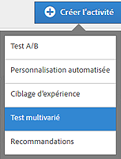
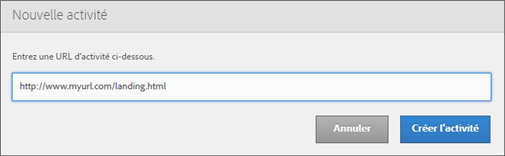
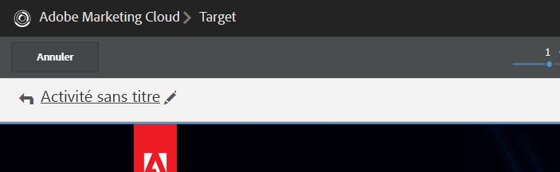
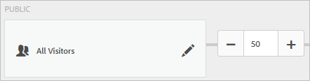
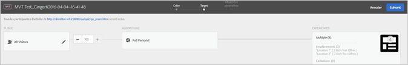
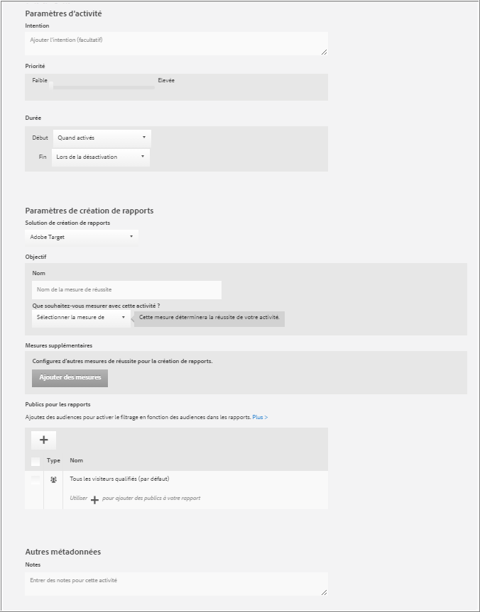

# Création d’un test multivarié{#create-a-multivariate-test}

Le compositeur d’expérience visuelle de Target facilite la création correcte de votre test sur une page activée pour Target et la modification de parties de la page dans Target.

L’éditeur convivial de Target permet de sélectionner n’importe quel emplacement et d’ajouter plusieurs offres.

Le test multivarié utilise un rapport de type « page-premier ». En d’autres termes, le test s’exécute sur une URL spécifique, avec des expériences que vous concevez pour cette page.

1. Cliquez sur **[!UICONTROL Créer une activité]** &gt; **[!UICONTROL Test multivarié]**.

   

1. [Spécifiez l’URL](../../../c-activities/c-multivariate-testing/t-create-multivariate-test/url.md#concept_C12E4A85FF3B4E518E3110F6CF1AF9C0) pour la page que vous souhaitez tester, puis cliquez sur **[!UICONTROL Créer l’activité]**.

   

   >[!NOTE]
   >
   >Utilisez une URL complète, y compris le HTTP ou HTTPS au début.

   Si un message s’affiche vous demandant d’activer votre navigateur pour le contenu mixte, suivez les instructions du message. Après avoir activé votre navigateur pour le contenu mixte, recommencez à l’étape 1.

   Le compositeur d’expérience visuelle s’ouvre.

   Pour plus d’informations sur la résolution de problèmes liés au compositeur d’expérience visuelle, veuillez consulter [Dépannage du compositeur d’expérience visuelle](../../../c-experiences/c-visual-experience-composer/r-troubleshoot-composer/troubleshoot-composer.md#reference_77743144F10143A3A89D56E116D296E4).
1. Entrez le nom de l’activité.

   

   Le nom de l’activité ne peut pas contenir les caractères suivants :

   | Caractère | Description |
   |--- |--- |
   | / | Barre oblique |
   | ? | Point d’interrogation |
   | # | Croisillon  |
   | : | Deux-points |
   | = | Égal |
   | + | Plus |
   | - | Moins |
   | @ | Arobase |

1. [Créez les offres à chaque emplacement](../../../c-activities/c-multivariate-testing/t-create-multivariate-test/add-offers.md#concept_DCE6B45C30F7419B8EC17AFDEE8D8AA6).

   

   Vous pouvez ajouter les types d’offres suivants :

   * HTML
   * Image
   * Texte

1. [Prévisualisez vos expériences](../../../c-activities/c-multivariate-testing/t-create-multivariate-test/preview-experiences.md#task_21A700587E88453A9FC2210C0DE53A28).

   

   Vous pouvez afficher chaque expérience et exclure toute expérience que vous ne souhaitez pas inclure dans votre test.
1. [Utilisez l’estimateur de trafic](../../../c-activities/c-multivariate-testing/t-create-multivariate-test/traffic-estimator.md#task_71AA6922AFD447EA8C5E610A78ABA714) afin de tester la faisabilité de votre plan de test.

     

1. Sélectionnez l’audience et le pourcentage des visiteurs admissibles qui doivent entrer dans l’activité.

   

   Vous pouvez par exemple limiter les entrées à 50 % de tous les visiteurs ou à 45 % pour l’audience « Parisiens ».

   >[!NOTE]
   >
   >En plus de sélectionner une audience existante, vous pouvez combiner plusieurs audiences pour créer des audiences combinées ad hoc plutôt que d’en créer une nouvelle. Pour plus d’informations, voir [Combinaison de plusieurs audiences](../../../c-target/combining-multiple-audiences.md#concept_A7386F1EA4394BD2AB72399C225981E5).

1. [Révisez le résumé du test](../../../c-activities/c-multivariate-testing/t-create-multivariate-test/test-summary.md#reference_971AB225963A4DC18EEB5B0E20F0A4A7) et apportez toute modification souhaitée, puis cliquez sur **[!UICONTROL Continuer]**..

   

1. [Spécifiez les objectifs et paramètres](../../../c-activities/c-multivariate-testing/t-create-multivariate-test/goals-and-settings.md#reference_B25389FD6F3A4989801E740364B089CC) pour le test.

   

1. Cliquez sur **[!UICONTROL Enregistrer et fermer]** afin de créer l’activité.

## Vidéo de formation : Création de tests multivariés (9:25)

Cette vidéo explique comment planifier et créer un test multivarié à l’aide du flux de travaux Target à trois étapes.

* Définir et créer un test multivarié
* Créer un test multivarié

>[!VIDEO](https://video.tv.adobe.com/v/17395)
