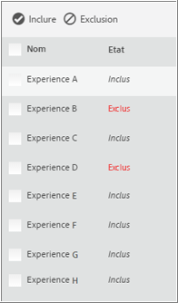

# Aperçu des expériences pour un test multivarié{#preview-experiences-for-a-multivariate-test}

Un test multivarié comparant plusieurs expériences sur une page, il est utile de prévisualiser la page avec chaque expérience.

1. Depuis le compositeur d’expérience, cliquez sur **[!UICONTROL Aperçu]**.

   Une liste de toutes les expériences s’affiche.

   

1. Cliquez sur une expérience dans la liste pour afficher cette expérience.

1. Pour exclure une expérience du test multivarié, sélectionnez-la et cliquez sur **[!UICONTROL Exclure]**.

   

   Vous pouvez exclure une expérience qui affiche des variations en conflit ou une expérience qui n’est pas équilibrée esthétiquement.

   >[!NOTE]
   >
   >Lorsque vous créez un test multivarié, vous pouvez maintenant en exclure plus de 10 % des expériences, à condition d’utiliser alors les rapports hors ligne pour l’analyse.

   Par défaut, toutes les expériences sont incluses dans le test multivarié. Pour inclure une expérience qui a été exclue, sélectionnez l’expérience exclue et cliquez sur **[!UICONTROL Inclure]**.

Cliquez sur **[!UICONTROL Quitter le mode Aperçu]** pour revenir au compositeur d’expérience afin que vous puissiez apporter des modifications ou cliquez sur **Continuer]pour accéder au résumé du test.[!UICONTROL **

