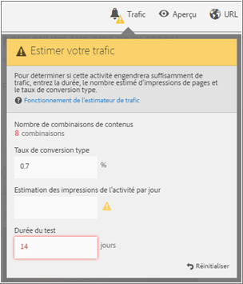
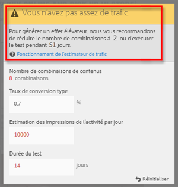
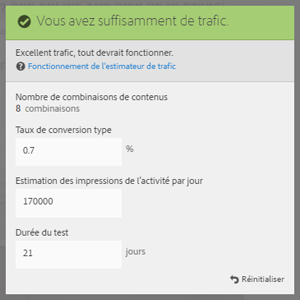

# Estimation du trafic requis pour un test réussi{#estimate-the-traffic-required-for-a-successful-test}

Un test multivarié comparant plusieurs expériences, il est important de connaître le volume de trafic requis pour fournir des résultats significatifs. L’estimateur de trafic utilise des statistiques relatives à votre page ainsi que le nombre d’expériences en cours de test afin d’estimer le volume de trafic et la durée du test requis pour assurer le succès de ce dernier.

L’estimateur de trafic prévoit la taille de l’échantillon requis pour garantir les conditions suivantes :

* Un degré de confiance de 95 %

   Cela signifie que le risque de rapporter un faux positif en l’absence d’un réel effet élévateur est de 5 % (100 % - degré de confiance).
* Une puissance statistique de 80 %

   Cela signifie que le test a une probabilité de 80 % de détecter un véritable effet élévateur de 25 % ou plus.
* Un effet élévateur minimal détectable de manière fiable de 25 %

   Target calcule le volume de trafic requis pour avoir une chance de 80 % de détecter un véritable effet élévateur de 25 % ou plus.

Le test utilise la correction de Bonferroni pour effectuer des corrections pour plusieurs comparaisons. Cette méthode est connue pour être conservative, ce qui est équilibré par l’application d’un effet élévateur minimal détectable de manière fiable relativement important.

L’estimateur de trafic fournit également des commentaires qui vous permettent de savoir si votre volume de trafic est suffisant pour que le test que vous avez conçu réussisse.

1. **Dans le compositeur d’expérience, cliquez sur[!UICONTROL Trafic]**.

   L’estimateur de trafic s’ouvre. Vous pouvez à nouveau cliquer sur **[!UICONTROL Trafic** pour masquer l’estimateur de trafic.]

   

1. Indiquez le taux de conversion type, le nombre estimé de visiteurs par jour et la durée du test.

   * [!UICONTROL Nombre de combinaisons de contenu]: Calculé automatiquement en fonction du nombre d&#39;expériences créées dans le cadre de votre activité après toute exclusion.
   * [!UICONTROL Taux de conversion type]: Le taux de conversion est exprimé sous forme de pourcentage, en fonction de l&#39;estimation ou des données antérieures de votre système d&#39;analyse.
   * [!UICONTROL Estimation des visiteurs par jour]: Il s&#39;agit du nombre de visiteurs susceptibles d&#39;afficher cette page en fonction des critères de ciblage. Cela peut être basé sur vos données d’analyse.
   * [!UICONTROL Durée du test]: Nombre de jours de l&#39;exécution de l&#39;activité.
   L’estimateur de trafic utilise ces statistiques pour déterminer les ajustements requis pour exécuter un test réussi.

   Près de la partie supérieure de l’estimateur de trafic, les valeurs que vous avez saisies sont calculées et les résultats s’affichent.

   

   Lorsque vous modifiez les valeurs, l’estimation change. Par exemple, si vous testez un grand nombre d’expériences et que votre taux de conversion et vos impressions sont trop faibles, l’estimateur de trafic indique la durée pendant laquelle le test doit s’exécuter pour être réussi. Ou, si votre trafic est faible, l’estimateur de trafic peut suggérer un nombre d’expériences plus faible afin que vous puissiez exécuter le test pendant le nombre de jours souhaité.

   Si vous n’avez pas suffisamment de trafic, vous pouvez effectuer une ou les deux opérations suivantes :

   * Réduire le nombre de combinaisons d’offres et le nombre d’emplacements.
   * Augmenter la durée du test.
   Ajustez les chiffres jusqu’à ce que l’estimateur de trafic indique que vous avez suffisamment de trafic, puis concevez votre test en conséquence.

   

