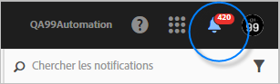
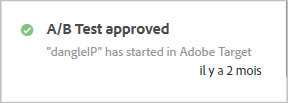
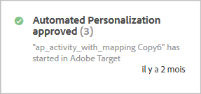
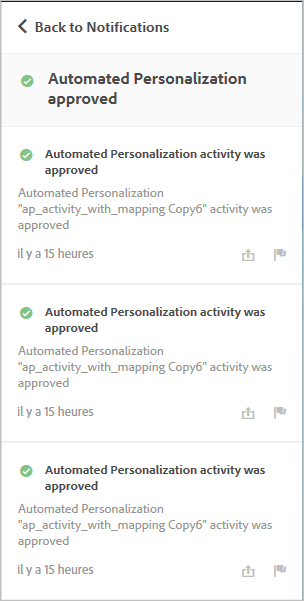

# Notifications d’activités{#activity-notifications}

Target peut échanger des notifications avec d’autres solutions Adobe Experience Cloud à l’aide d’Adobe Pulse. Target envoie deux types de notification pour tous les types d’activité : lorsqu’une activité est activée et lorsqu’une activité est désactivée.

Les notifications de [!DNL Target] sont visibles dans toutes les solutions par les utilisateurs qui disposent d’un [!DNL Experience Cloud]contexte produit dans [!DNL Target Standard/Premium].

For information about setting up Notifications, see [Notifications](https://marketing.adobe.com/resources/help/en_US/mcloud/notifications.html) in the [!DNL Adobe Experience Cloud] documentation.

Accédez aux notifications à partir de n’importe quel emplacement dans [!DNL Target], à l’exception du workflow de création d’activité. Cliquez sur l’icône représentant une cloche dans le titre de la page pour afficher ou masquer le widget de notification.

[!DNL Target] envoie deux types de notification pour tous les types d’activité :

* Lorsqu’une activité devient active et que la diffusion de l’offre commence :

   Par exemple :

   

* Lorsqu’une activité est désactivée et que la diffusion de l’offre est interrompue :

   Par exemple :

   

Des notifications similaires s’affichent également lorsqu’une activité planifiée commence à la date de début et se termine à la date de fin.

Toutes les notifications de [!DNL Target] indiquent le nom de l’activité qui a été approuvée ou désactivée et comprennent Adobe Target pour une identification rapide.

Si une seule activité envoie plusieurs notifications d’un même type, elles sont combinées dans une seule carte indiquant le nombre de notifications. Par exemple :

Cliquez sur la carte de notification pour afficher les détails de chaque notification.

Par exemple, si vous cliquez sur la carte affichée ci-dessus, les trois notifications apparaissent :

## Limites {#section_B466EB20B2554CE7B1915374B39F4322}

* Les notifications ne vous indiquent pas qui a approuvé, désactivé ou importé une activité.
* Les notifications MVT s’affichent en tant que Test A/B, car elles sont synchronisées en tant que campagnes A/B dans [!DNL Target Classic].

