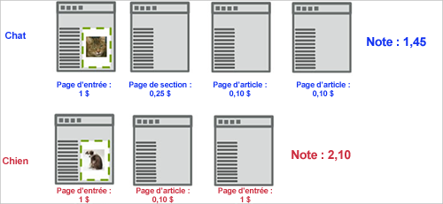
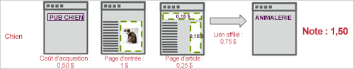

# Score de capture{#capture-score}

The Capture Score engagement metric calculates an aggregated score based on the value assigned to pages visited on the site, from the point the visitor first sees the campaign&#39;s first display [!DNL Target] request.

L’exemple suivant illustre le mode de calcul de la note dans une campagne qui teste deux expériences, la première avec une image de chat, la seconde avec une image de chien.

Dans cet exemple, le premier visiteur teste l’expérience Chat. Assume that a global [!DNL Target] request passes in a page score based on the value of the page. If the marketer has captured page count engagement on a success metric associated with `**any Target request**`, the visit score accumulates for any request seen after the display request around the cat image.

La première page ajoute 1 au score, la deuxième page 0,25, la troisième et la quatrième 0,10 chacune, soit un total de 1;45. Ce chiffre peut être interprété comme une monnaie ou un nombre de points. Lors d’une autre visite, un visiteur accède à l’expérience Chien et même s’il voit moins de pages, la note est de 2,10 (elle est supérieure à la visite précédente car le visiteur a vu des pages ayant plus de valeur).

Vous pouvez prendre en compte les coûts d’acquisition du compte et les recettes des liens affiliés en transmettant des adbox et des redirecteurs, comme illustré dans le flux de page ci-après. Notice that, in this example, both [!DNL Target] requests on the article page pass a score, possibly representing a known CPM.

**Attribution d’une note à une page**

Vous pouvez attribuer une valeur à une page de votre site en fonction de l’importance que vous lui donnez. Par exemple, il est possible qu’un site de cuisine vende des annonces publicitaires à un tarif plus élevé sur ses pages d’articles de fond que dans sa section Expérience. Les articles de fond ont donc plus de valeur que l’expérience. La note des pages permet d’estimer la « valeur globale » d’une visite, si bien que la personne qui lit davantage d’articles de fond obtient plus de points que celle qui se contente de parcourir les expériences.

Vous pouvez attribuer une note à une page de deux manières :

* Dans la [!DNL Target] requête, créez un paramètre appelé `mboxPageValue`.

   Exemple : `('global_mbox', 'mboxPageValue=10');`

   The specified value is added to the score every time the page with that [!DNL Target] request is viewed. Si plusieurs requêtes de la page incluent des valeurs de score, le score de la page correspond au total de toutes les valeurs de requête. `mboxPageValue` est un paramètre réservé utilisé pour transmettre des valeurs dans une demande de Cible afin de capturer un score d’engagement. Il est possible de transmettre des valeurs positives et négatives. La somme est calculée à la fin de chaque visite d’un visiteur pour calculer le score total de la visite.

* Transmettez le paramètre `?mboxPageValue=n` dans l’URL pour la page.

   Exemple : `https://www.mydomain.com?mboxPageValue=5`

   Using this method, the specified value is added to the score for each [!DNL Target] request on the page. For example, if you pass the parameter `?mboxPageValue=10`and there are three [!DNL Target] requests on the page, the score for the page is 30.

>[!NOTE]
>
>Les demandes de cible situées au-dessus de la première [!DNL Target] demande d’affichage de l’activité ne seront pas incluses dans le score.

Best practice is to assign values in the [!DNL Target] request. Cela vous permet d’être précis dans les valeurs que vous mesurez, en fonction du contenu de chaque requête.

>[!NOTE]
>
>Pour simplifier la maintenance, vous pouvez configurer les attributions de valeurs de page de votre site dans le fichier [!DNL at.js] ou [!DNL mbox.js] en appliquant une certaine logique JavaScript conditionnelle. Vous n’avez ainsi plus besoin d’ajouter du code supplémentaire dans vos pages. Pour plus d’informations, contactez le gestionnaire de compte.

Vous pouvez combiner les deux méthodes mais la note résultat peut être plus élevée que prévu. For example, if you assign a value of 10 to each of three [!DNL Target] requests and no score to a fourth request, then pass the URL parameter `?mboxPageValue=5`, your page score will be 50, 30 for the three requests with assigned values, and then 5 for each of the four requests on the page.

Le compteur début avec la première demande d&#39;affichage, et non la demande d&#39;entrée. Par exemple, si vous entrez l&#39;activité sur la page d&#39;accueil qui n&#39;a pas de demande d&#39;affichage, puis que vous créez un lien vers la page de catalogue contenant une demande d&#39;affichage, le compteur commence lorsque vous accédez à la page de catalogue.

Vous pouvez également transmettre des valeurs négatives sur certaines pages qui vous coûtent de l’argent ou qu’un visiteur ne devrait pas voir. Les valeurs négatives affectent également la note globale. Cette technique peut être utilisée sur une page que les visiteurs atteignent à partir d’une annonce publicitaire, de telle sorte que vous connaissez le coût par clic. Ou, par exemple, elle peut être utilisée pour une page d’assistance technique ou de contact, à partir de laquelle vous savez que les visiteurs vont appeler ou demander un support.
