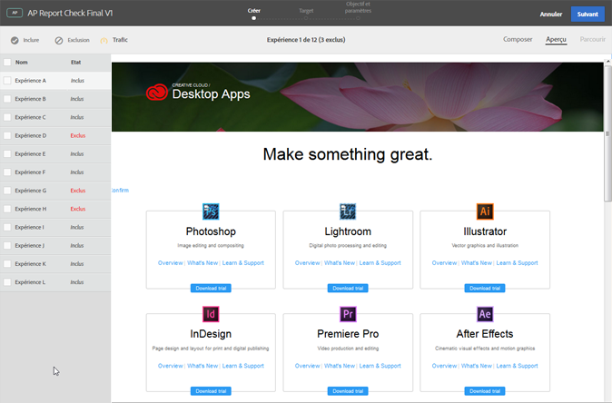

#  Prévisualisez les expériences de personnalisation automatisée dans le compositeur d’expérience visuelle{#preview-experiences-for-automated-personalization-in-the-visual-experience-composer}

Un test d’Automated Personalization comparant plusieurs offres sur une page, il est utile de prévisualiser la page avec chaque expérience.

1. Dans le compositeur d’expérience, cliquez sur **[!UICONTROL Aperçu]**.

   Une liste de toutes les expériences s’affiche.

   

1. Cliquez sur une expérience spécifique dans la liste pour l’afficher.

1. Pour exclure une expérience de l’activité, sélectionnez-la et cliquez sur **[!UICONTROL Exclure]**.

   

   Vous pouvez choisir d’exclure une expérience qui affiche des variations en conflit ou une expérience qui n’est pas équilibrée esthétiquement.

   Par défaut, toutes les expériences sont incluses dans l’activité d’Automated Personalization. Pour inclure une expérience qui a été exclue, sélectionnez l’expérience exclue et cliquez sur **[!UICONTROL Inclure]**.

Cliquez sur **[!UICONTROL Quitter le mode Aperçu]** pour revenir au compositeur d’expérience afin que vous puissiez apporter des modifications ou cliquez sur **[!UICONTROL Continuer]** pour accéder à l’étape de ciblage.
