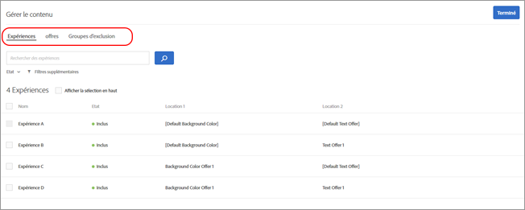

# Offres de personnalisation automatisée  Target{#target-automated-personalization-offers}

Dans une activité d’Automated Personalization, vous pouvez cibler des offres vers des audiences spécifiques.

Utiliser cette fonctionnalité réduit le nombre d’offres qu’un visiteur spécifique est autorisé à voir. Prenons par exemple une activité d’Automated Personalization (PA) comportant trois offres. L’offre 1 présente une règle de ciblage qui limite son exposition à l’audience A uniquement. Deux visiteurs ont vu cette activité.

|  | Visiteur 1 | Visiteur 2 |
|--- |--- |--- |
| Qualification d’audience | Audience A | Audience B |
| Note du modèle de personnalisation de la cible de l’offre 1 | 90 | 90 |
| Note du modèle de personnalisation de la cible de l’offre 2 | 50 | 70 |
| Note du modèle de personnalisation de la cible de l’offre 3 | 80 | 60 |

Dans ce cas de figure, le visiteur 1 voit l’offre 1 (parce qu’il fait partie de l’audience A), laquelle correspond au score le plus élevé de ce visiteur. Toutefois, le visiteur 2 verrait l’offre 2 même si son score le plus élevé correspond à l’offre 1, car il ne fait pas partie de l’audience A. Cet exemple montre pourquoi les règles de ciblage doivent être utilisées avec modération pour répondre aux besoins de l’entreprise. L’ajout de ces règles peut réduire l’efficacité des modèles de personnalisation Target.

## Paramétrage des règles de ciblage

1. Créez une activité d’Automated Personalization contenant les offres que vous souhaitez cibler.
1. Une fois que vous avez configuré les offres pour l’activité dans le compositeur d’expérience visuelle, cliquez sur **[!UICONTROL Contenu]**.

   La boîte de dialogue de gestion du contenu s’ouvre.

   

   >[!NOTE]
   >
   >Vous pouvez configurer jusqu’à 50 emplacements et 250 offres par emplacement.

1. Dans la colonne **[!UICONTROL Contenu]**, sélectionnez l’offre, puis cliquez sur **[!UICONTROL Ciblage]** et choisissez les audiences qui doivent pouvoir voir cette offre.

   Seules les audiences sélectionnées visualiseront cette offre.

   >[!NOTE]
   >
   >En plus de sélectionner une audience existante, vous pouvez combiner plusieurs audiences pour créer des audiences combinées ad hoc plutôt que d’en créer une nouvelle. Pour plus d’informations, voir [Combinaison de plusieurs audiences](../../c-target/combining-multiple-audiences.md#concept_A7386F1EA4394BD2AB72399C225981E5).

1. Cliquez sur **[!UICONTROL Terminé]**.
