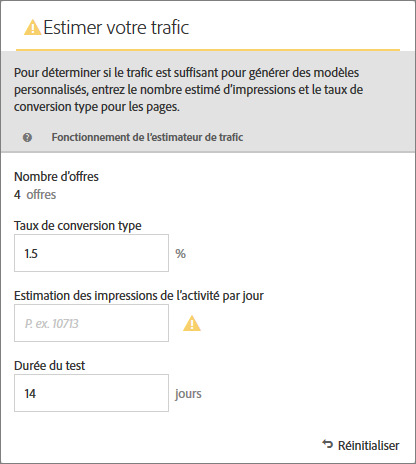
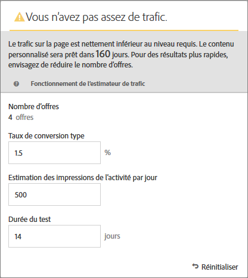
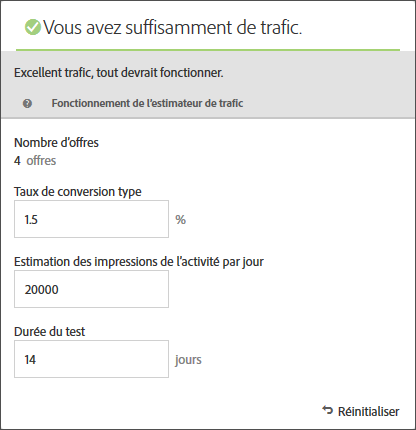

#  Estimation du trafic requis pour réussir un test{#estimate-the-traffic-required-for-success}

The [!UICONTROL Traffic Estimator] provides feedback that lets you know whether you have sufficient traffic for your [!DNL Adobe Target] activity to succeed.

Because an [!UICONTROL Automated Personalization] activity uses multiple offer combinations, it is important to know how much traffic is required to provide meaningful results. The [!UICONTROL Traffic Estimator] uses statistics about your page and the number of experiences being tested to estimate the amount of traffic and the test duration needed to make the activity successful.

The [!UICONTROL Traffic Estimator] determines if there is enough traffic to generate personalized models, by comparing the estimated page impressions and typical conversion rate for the pages. Idéalement, pour une activité réussie, la taille d’échantillon appropriée garantit que le contenu personnalisé est prêt au bout de 50 % de la durée de l’activité ou 14 jours, selon la durée la plus courte. Il s’agit d’un délai suffisant pour obtenir un contenu personnalisé et savoir quel contenu diffuser.

Remember that [!DNL Target] randomly serves experiences until the personalization algorithms are built. The checkmark icon beside each offer shows when the model for that offer is ready and [!DNL Target] is able to begin delivering personalized content. L’effet élévateur n’étant attendu qu’une fois que les modèles sont prêts, l’indication visuelle vous permet de définir l’attente appropriée. Use the [!UICONTROL Traffic Estimator] in the [!UICONTROL Visual Experience Composer] (VEC) to get a guideline of when the models will be ready.

## Utilisation de l’estimateur de trafic

1. From the [!UICONTROL Visual Experience Composer], click **[!UICONTROL Traffic]**.

   

   The [!UICONTROL Traffic Estimator] opens. Vous pouvez à nouveau cliquer sur **[!UICONTROL Trafic]**[!UICONTROL  pour masquer l’estimateur de trafic].

   

1. Fournissez le taux de conversion type (ou le taux de conversion escompté pour cette activité), l’estimation des impressions de l’activité par jour et la durée du test.

   * **Nombre d&#39;Offres**: Calculé automatiquement en fonction du nombre d’expériences créées dans le cadre de votre activité après toute exclusion.
   * **Taux de conversion** type : Le taux de conversion est exprimé en pourcentage, selon votre estimation ou les données antérieures de votre système d’analyse.
   * **Estimation des visites par jour**: Il s’agit du nombre de visites par jour effectuées par des visiteurs qui sont en mesure de vue à l’activité, en fonction des critères de ciblage. Cela peut être basé sur vos données d’analyse. Il est à noter que ce nombre doit être celui des visites, et non des visiteurs uniques.
   * **Durée du test** : nombre de jours pendant lesquels vous souhaitez que l’activité s’exécute.

   The [!UICONTROL Traffic Estimato]r uses these statistics to determine what adjustments are needed to run a successful test.

   Near the top of the [!UICONTROL Traffic Estimator], the values you entered are calculated and the results are shown.

   

   Lorsque vous modifiez les valeurs, l’estimation change. For example, if you are testing a large number of combinations and your conversion rate and impressions are too low, the [!UICONTROL Traffic Estimator] shows how long the test will need to run to be successful. Or, if your traffic is low, the [!UICONTROL Traffic Estimator] might suggest a lower number of offer combinations so you can run the test the desired number of days.

   Si vous n’avez pas suffisamment de trafic, vous pouvez effectuer l’une ou plusieurs des opérations suivantes :

   * Consider using an [Auto-Target](/help/c-activities/auto-target-to-optimize.md) activity instead of [!UICONTROL Automated Personalization] to create experiences with several offer changes in one experience variation.
   * Reduce the number of offer combinations within your [!UICONTROL Automated Personalization] activity.
   * Augmentez la durée de l’activité.

   Adjust the numbers until the [!UICONTROL Traffic Estimator] says you have sufficient traffic, then design your test accordingly.

   

   If the traffic is sufficient, the [!UICONTROL Traffic] icon shows a green check. S’il est insuffisant, l’icône affiche une étiquette d’avertissement rouge.

## Questions fréquentes sur l’estimateur de trafic

Tenez compte des questions fréquentes suivantes lorsque vous travaillez avec l’estimateur [!UICONTROL de]trafic :

### Pourquoi ne crée-t- [!DNL Target] il pas de modèles personnalisés lorsque mon activité AP a assez de trafic ?

Dans certaines circonstances, votre trafic peut être suffisamment important pour qu’un modèle personnalisé soit créé, mais ce trafic peut indiquer [!DNL Target] qu’il n’y a pas de différence significative entre le modèle personnalisé et le modèle aléatoire. Bien que le modèle soit intégré [!DNL Target] et testé, il ne sera pas déployé car il n&#39;est pas nettement meilleur que aléatoire.

Une des raisons possibles pour lesquelles le modèle n&#39;est pas meilleur que aléatoire pourrait être que les offres ne sont pas significativement différentes les unes des autres. Si tel est le cas, vous pouvez essayer de rendre les offres plus visuellement différentes si le message est similaire, ou vous pouvez essayer de modifier le message lui-même.
