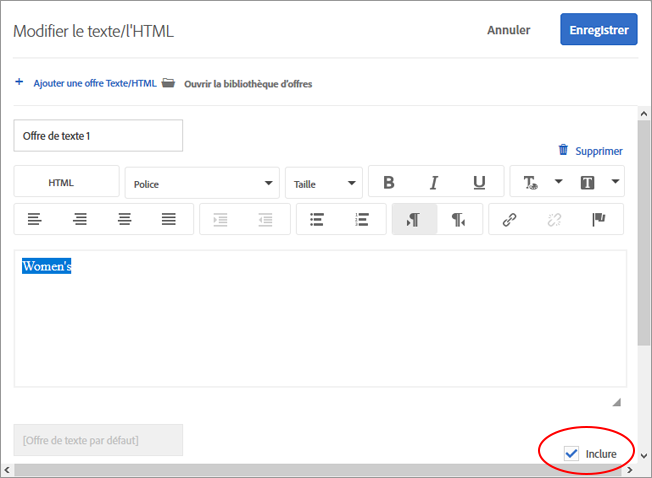
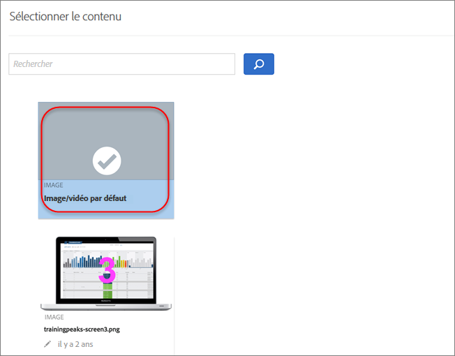
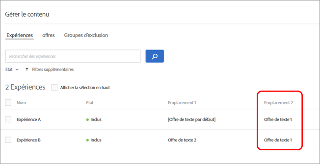

#  Gérer les exclusions{#manage-exclusions}

Gérez les exclusions en créant des groupes d&#39;exclusion, à l&#39;exclusion des offres en double, en excluant des expériences spécifiques et en excluant le contenu par défaut dans les activités de personnalisation automatisée.

## Create exclusion groups {#task_AAAA6C7239A84F7696C8492F04B575A2}

Créez des groupes d’exclusion dans les activités d’Automated Personalization (AP) pour garantir que les expériences dotées des offres désignées sont automatiquement exclues.

Les groupes d’exclusion constituent un excellent moyen de s’assurer que des offres incompatibles ne sont pas présentées dans la même expérience à des emplacements différents. Par exemple, supposons que vous ayez deux offres : l’une de 20 % de réduction sur l’ensemble de la marchandise et l’autre de 15 %. Vous ne voulez absolument pas que ces deux offres soient présentées aux visiteurs dans la même expérience. Si vous ajoutez ces deux offres à un groupe d’exclusion, vous pouvez vous assurer que cela ne sera jamais le cas.

Vous pouvez également limiter les audiences qui voient des offres spécifiques dans les activités personnalisées. For more information, see [Target Automated Personalization offers](/help/c-activities/t-automated-personalization/ap-target-offers.md).

**Pour créer un groupe d’exclusion, procédez comme suit :**

1. While [creating or editing an AP activity](/help/c-activities/t-automated-personalization/create-ap-activity.md), click **[!UICONTROL Manage Content]** in the header bar.

   

1. Dans la boîte de dialogue [!UICONTROL Gérer le contenu], cliquez sur **[!UICONTROL Groupe d’exclusion]**.

   

   Si vous avez déjà créé des groupes d’exclusion, ils s’affichent dans la liste. Si vous n’avez pas encore créé de groupe d’exclusion, vous êtes invité à en créer un.

1. Cliquez sur **[!UICONTROL Créer un groupe d’exclusion]**.

   

1. (Obligatoire) Attribuez un nom explicite au groupe d’exclusion.

   Un nom explicite vous aide, ainsi que les autres utilisateurs, à localiser et à comprendre rapidement l’objectif d’un groupe.

1. Localisez et sélectionnez les offres que vous souhaitez ajouter au groupe d’exclusion.

   Vous pouvez sélectionner plusieurs offres du même emplacement d’un groupe d’exclusion.

1. Cliquez sur **[!UICONTROL Enregistrer]**.

Les offres du groupe d’exclusion sont automatiquement exclues des mêmes expériences à l’avenir.

## Exclude duplicate offers {#concept_4EF78013F80E48EFA024AE0274C9F037}

Empêchez la duplication des offres provenant de la bibliothèque d’offres lors de leur utilisation dans des emplacements différents dans les activités d’[!UICONTROL Automated Personalization].

Vous pouvez par exemple avoir une activité avec six emplacements sur une page comportant 12 offres. Il existe un risque que la même offre soit placée dans un ou plusieurs emplacements de cette activité. Cette fonctionnalité empêche que des offres en double s’affichent en même temps à des endroits différents dans la même activité.

Cliquez sur **[!UICONTROL Configurer]** &gt; **[!UICONTROL Offres en double]**, puis cliquez sur **[!UICONTROL Autoriser les doublons]** ou **[!UICONTROL Interdire les doublons**].

## Exclude specific experiences {#task_C17D36EF58AF4908B17A3D84CA6DE85A}

Excluez des expériences spécifiques si vous souhaitez exclure certaines combinaisons d’offres de votre activité Automated Personalization.

Il peut exister certaines combinaisons qui ne fonctionnent pas bien ensemble, ou il se peut que vous souhaitiez limiter le nombre d’expériences afin de réduire les exigences de trafic de votre activité.

1. While [creating or editing an AP activity](/help/c-activities/t-automated-personalization/create-ap-activity.md), click **Manage Content** in the header bar.

   

   La liste [!UICONTROL Expériences] indique chaque expérience générée à partir des permutations de toutes les options de contenu et de lieu.

1. Excluez d’autres expériences, selon les besoins.

   Vous pouvez exclure certaines expériences en survolant l’expérience souhaitée, puis en cliquant sur l’icône Exclure.

   

   Or you can batch exclude/include experiences by selecting the checkbox for the relevant experiences and then clicking the **[UICONTROL Exclude]** icon in the top right corner of the dialog box. The [!UICONTROL Exclude] icon appears when one or more experiences are checked.

   

   Vous pouvez filtrer cette vue sous forme de liste de manière à afficher uniquement les activités incluses ou exclues en cliquant sur la liste déroulante [!UICONTROL État].

   Les expériences seront alors exclues de l’activité et leur [!UICONTROL État] sera affiché comme [!UICONTROL Exclu].

   

## Exclude default content {#task_DCB4528989DF4C05A3A4729E5891D18F}

Dans certains cas, il peut être souhaitable de ne pas inclure votre contenu par défaut dans le cadre de votre activité Automated Personalization. La manière dont vous accédez à ce paramètre est différente par rapport à la création de groupes d’exclusion. Vous pouvez utiliser cette méthode pour n&#39;avoir qu&#39;une offre (différente de votre contenu par défaut) à un emplacement dans le cadre de votre activité AP.

L&#39;exclusion du contenu par défaut permet de modifier l&#39;apparence du reste de la page en fonction des offres que vous testez avec votre activité AP. Supposons par exemple que vous souhaitiez faire correspondre la palette de couleurs des offres que vous testez ; dans ce cas, vous pouvez modifier la couleur d’arrière-plan de votre page et exclure la couleur d’arrière-plan par défaut.

**Pour exclure le contenu par défaut à l’aide du compositeur d’expérience visuelle (VEC) :**

1. While [creating or editing an AP activity](/help/c-activities/t-automated-personalization/create-ap-activity.md), select the content you want to replace and click to access **[!UICONTROL Change Text/HTML]**, **[!UICONTROL Change Image]**, or **[!UICONTROL Change Background Color]**.
1. Dans la boîte de dialogue, créez votre nouveau contenu et désélectionnez la case **Inclure** à droite du contenu par défaut (ou ne cochez pas l’image/vidéo par défaut dans l’écran Sélection de contenu).

   Suivant le type de contenu ou d’offre, le positionnement de la case à cocher [!UICONTROL Inclure] peut légèrement varier.

   Pour le contenu texte/HTML :

   

   Pour le contenu image/vidéo :

   

   Pour la couleur d’arrière-plan :

   

1. Cliquez sur **[!UICONTROL Enregistrer]**.

   Vous pouvez voir les expériences créées à partir des offres que vous avez spécifiées sous [!UICONTROL Gérer le contenu]. Vous pouvez noter qu’aucune expériences n’est créée dans [!UICONTROL Gérer le contenu] en utilisant l’offre par défaut que vous avez exclue.

   

**Pour exclure le contenu par défaut à l’aide du compositeur d’expérience d’après les formulaires :**

1. Lors de la création ou de la modification d’une activité AP, cliquez sur **[!UICONTROL Modifier le texte/HTML]** ou **[!UICONTROL Modifier l’offre d’image]** sous **[!UICONTROL Contenu**].
1. Dans la boîte de dialogue, créez votre nouveau contenu et désélectionnez la case **[!UICONTROL Inclure]à droite du contenu par défaut (ou ne cochez pas l’image/vidéo par défaut dans l’écran Sélection de contenu).**

   Suivant le type de contenu ou d’offre, le positionnement de la case à cocher Inclure peut légèrement varier.

   Pour le contenu texte/HTML :

   

   Pour le contenu image/vidéo :

   

1. Cliquez sur **[!UICONTROL Enregistrer]**.

   Vous pouvez voir les expériences créées à partir des offres que vous avez spécifiées sous [!UICONTROL Gérer le contenu]. Vous pouvez noter qu’aucune expériences n’est créée dans [!UICONTROL Gérer le contenu] en utilisant l’offre par défaut que vous avez exclue.

   
