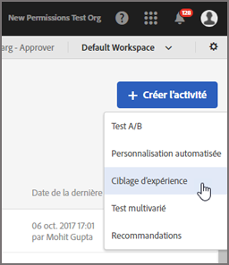
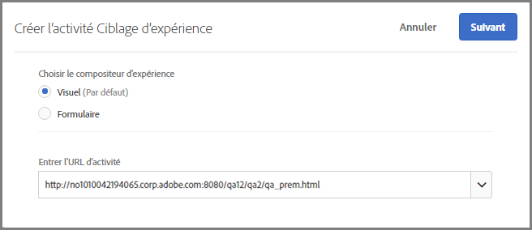
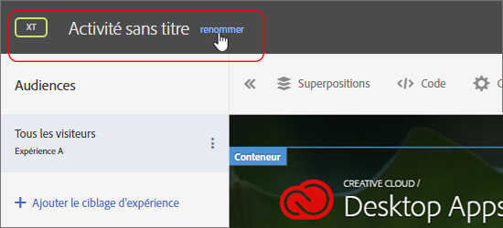
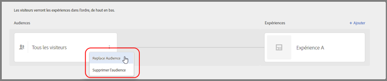
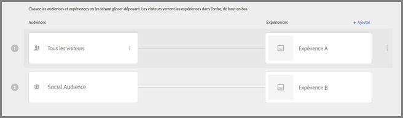
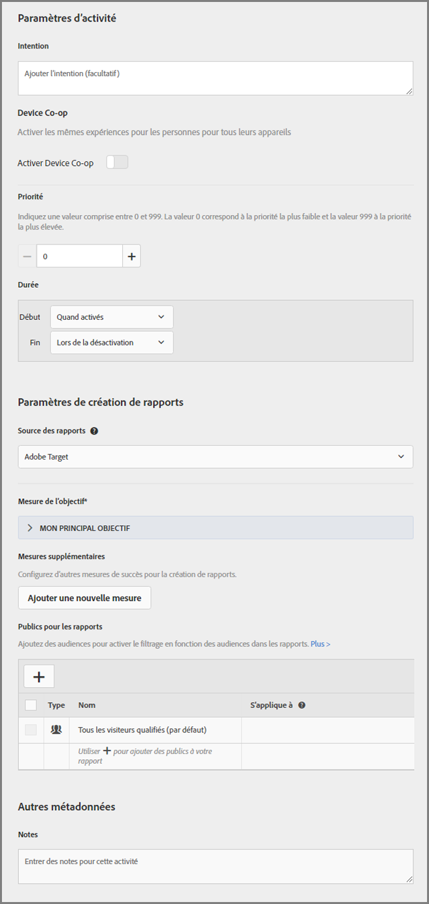

# Création d’une activité de ciblage d’expérience{#create-an-experience-targeting-activity}

Utilisation du compositeur d’expérience visuelle pour créer une activité de ciblage d’expérience sur une page Target et pour modifier des parties de la page dans Target.

1. Depuis la liste [!UICONTROL Activités], cliquez sur **[!UICONTROL Créer l’activité]** &gt; **[!UICONTROL Ciblage d’expérience]**.

   

   >[!NOTE]
   >
   >Les types d’activité disponibles dépendent de votre compte Target. Certains types d’activité peuvent ne pas apparaître dans votre liste.

   Pour plus d’informations sur les types d’activités, voir  [Activités](../../../c-activities/activities.md#concept_D317A95A1AB54674BA7AB65C7985BA03).
1. Saisissez votre URL [d’activité](../../../c-activities/t-experience-target/t-xt-create/xt-activity-url.md#concept_D28549AAA0A14E3BB5F05F32BE8ABC90), puis cliquez sur **[!UICONTROL Suivant]**.

   

   Si votre compte est configuré par une URL par défaut, cette URL apparaît par défaut. Vous pouvez passer de la valeur par défaut à une autre URL.

   Pour plus d’informations sur la résolution de problèmes liés au compositeur d’expérience visuelle, veuillez consulter [Dépannage du compositeur d’expérience visuelle](../../../c-experiences/c-visual-experience-composer/r-troubleshoot-composer/troubleshoot-composer.md#reference_77743144F10143A3A89D56E116D296E4).

   Si vous préférez utiliser le compositeur d’expérience d’après les formulaires, sélectionnez cette option. Voir [Compositeur d’expérience d’après les formulaires](https://marketing.adobe.com/resources/help/en_US/target/target/t_form_experience_composer.html).

   Le compositeur d’expérience visuelle s’ouvre, affichant la page indiquée dans l’URL.
1. Saisissez un nom pour l’activité dans l’espace fourni.

   

   Le nom de l’activité ne peut pas contenir les caractères suivants :

   | Caractère | Description |
   |--- |--- |
   | `/` | Barre oblique |
   | `?` | Point d’interrogation |
   | `#` | Croisillon |
   | `:` | Deux-points |
   | `=` | Égal |
   | `+` | Plus |
   | `-` | Moins |
   | `@` | Arobase |

1. [Créez de nouvelles expériences](../../../c-activities/t-experience-target/t-xt-create/xt-add-experience.md#task_454646F2895242D3B92DC395A0CE1A00) en modifiant les éléments sur la page.

   Le compositeur d’expérience (voir [Expériences](../../../c-experiences/experiences.md#concept_1D011219034B492BB03C08B3BB80E3F0)) ouvre la page spécifiée dans vos Préférences de compte. Pour afficher une autre page, cliquez sur l’icône Globe et entrez l’URL dans la zone Sélectionner une URL du Compositeur visuel d’expérience, puis cliquez sur **[!UICONTROL Continuer]**. Si vous avez saisi l’URL d’un site qui ne contient pas le code JavaScript de Target Standard, vous ne pouvez pas sélectionner d’éléments de page.

   Par défaut, le compositeur d’expérience visuelle n’autorise pas la modification d’éléments contenant du code JavaScript tels que les bannières rotatives. Vous pouvez choisir de désactiver JavaScript si vous souhaitez pouvoir modifier ces éléments à l’aide du compositeur d’expérience visuelle.

   >[!NOTE]
   >
   >Si vous modifiez l’URL après avoir apporté des modifications à une page pour une ou plusieurs expériences, l’expérience est réinitialisée sur la nouvelle page et les modifications sont perdues.

   Lorsque vous pointez sur les éléments de votre page, ils sont mis en surbrillance. Vous pouvez modifier un élément en surbrillance à l’aide du Compositeur visuel d’expérience.

   Si vous créez une mbox sur la page à l’aide de Target Classic (anciennement Test&amp;Target), celle-ci apparaît comme un élément qui indique le nom de la mbox et qui peut être modifié comme tout autre élément.

   >[!NOTE]
   >
   >Si vous publiez une image provenant d’une source autre que votre page principale (une image hébergée sur akamai.net et publiée sur dell.com, par exemple), cette image ne s’affiche pas dans la miniature de la page dans le diagramme de flux.

1. Cliquez sur **[!UICONTROL Suivant]**.

   Le diagramme de flux s’ouvre.

   

   Le diagramme de flux vous guide tout au long des étapes permettant le choix de l’audience pour l’activité et la configuration des expériences.
1. **Passez la souris sur l’audience, cliquez sur l’icône[!UICONTROL Modifier]** qui s’affiche (trois points alignés verticalement), puis sur **[!UICONTROL Changer l’audience]. Sélectionnez l’audience de la première expérience de l’activité.**

   

   La bibliothèque d’audiences s’ouvre. La bibliothèque d’audiences contient les audiences qui ont été précédemment définies ainsi que les audiences courantes préconfigurées dans Target. Vous pouvez sélectionner une audience dans la bibliothèque ou  [en créer une](../../../c-target/c-audiences/audiences.md#concept_65BE870D290E412D8BBF557EEA67C271). Pour afficher la même expérience pour tous les entrants, sélectionnez Tous les visiteurs.

   >[!NOTE]
   >
   >En plus de sélectionner une audience existante, vous pouvez combiner plusieurs audiences pour créer des audiences combinées ad hoc plutôt que d’en créer une nouvelle. Pour plus d’informations, voir [Combinaison de plusieurs audiences](../../../c-target/combining-multiple-audiences.md#concept_A7386F1EA4394BD2AB72399C225981E5).

   Lors de la création d’une audience, vous pouvez sélectionner un emplacement (mbox) et préciser les paramètres de ce dernier. Sous Paramètres personnalisés, sélectionnez la mbox, puis spécifiez les paramètres souhaités.

   >[!NOTE]
   >
   >Les audiences sont automatiquement importées en arrière-plan lorsque vous ouvrez la liste d’audiences et que les audiences ont été importées il y a plus de 10 minutes.

   Vous pouvez cliquer sur l’icône [!UICONTROL Modifier] (trois points alignés verticalement) qui s’affiche, puis sur [!UICONTROL Supprimer le public] pour supprimer une audience existante.
1. **Cliquez sur[!UICONTROL Ajouter un ciblage d’expérience]**.

   >[!NOTE]
   >
   >Si vous ciblez une expérience vers une audience, vous devez sélectionner l’audience avant de pouvoir ajouter une expérience. Un message s’affiche pour vous rappeler de sélectionner l’audience.

1. (Facultatif) Cliquez sur **[!UICONTROL Ajouter]** et configurez des expériences ciblées supplémentaires.

   

   Cliquez ensuite sur **[!UICONTROL Continuer]**.
1. Spécifiez les [objectifs et paramètres](../../../c-activities/t-experience-target/t-xt-create/xt-goals-and-settings.md#reference_B25389FD6F3A4989801E740364B089CC) pour l’activité.

   

1. Cliquez sur **[!UICONTROL Enregistrer et fermer]**.
