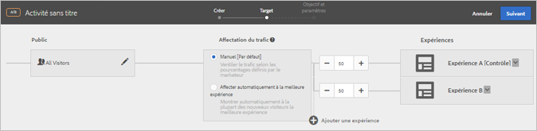
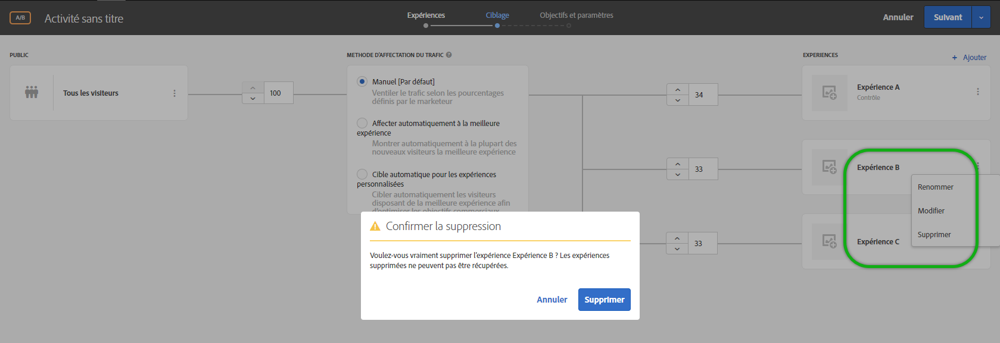

# Ajout d’une expérience{#add-experience}

Le compositeur d’expérience visuelle fournit une interface visuelle pour la modification des expériences de votre page.

Pour plus d’informations sur les expériences, voir [Expériences](../../../c-experiences/experiences.md#concept_A2E10F6AFB3D4AEAB6951EE14688848D).

1. Cliquez sur **[!UICONTROL Ajouter une expérience]**.

   >[!NOTE]
   >
   >Si vous ciblez une expérience vers une audience, vous devez sélectionner l’audience avant de pouvoir ajouter une expérience. Un message s’affiche pour vous rappeler de sélectionner l’audience.

1. A l’invite, saisissez l’URL de l’activité. Saisissez l’URL complète (y compris `https://`), puis cliquez sur **[!UICONTROL Continuer]**.

   Le compositeur d’expérience (voir [Expériences](../../../c-experiences/experiences.md#concept_1D011219034B492BB03C08B3BB80E3F0)) ouvre la page spécifiée dans vos Préférences de compte. Pour afficher une autre page, cliquez sur l’icône Globe et entrez l’URL dans la zone Sélectionner une URL du Compositeur visuel d’expérience, puis cliquez sur **[!UICONTROL Continuer]**. Si vous avez saisi l’URL d’un site qui ne contient pas le code JavaScript de Target Standard, vous ne pouvez pas sélectionner d’éléments de page.

   Par défaut, le compositeur d’expérience visuelle n’autorise pas la modification d’éléments contenant du code JavaScript tels que les bannières rotatives. Vous pouvez choisir de désactiver JavaScript si vous souhaitez pouvoir modifier ces éléments à l’aide du compositeur d’expérience visuelle.

   >[!NOTE]
   >
   >Si vous modifiez l’URL après avoir apporté des modifications à une page pour une ou plusieurs expériences, l’expérience est réinitialisée sur la nouvelle page et les modifications sont perdues.

1. Sélectionnez les éléments que vous souhaitez modifier et apportez les modifications de votre choix.

   Lorsque vous pointez sur les éléments de votre page, ils sont mis en surbrillance. Vous pouvez modifier un élément en surbrillance à l’aide du Compositeur visuel d’expérience.

   Si vous créez une mbox sur la page à l’aide de Target Classic (anciennement Test&amp;Target), celle-ci apparaît comme un élément qui indique le nom de la mbox et qui peut être modifié comme tout autre élément.

   Pour obtenir la liste des actions pouvant être exécutées sur un élément de la page affichée pour modifier l’expérience, voir [Options du compositeur d’expérience visuelle](/help/c-experiences/c-visual-experience-composer/viztarget-options.md).

   >[!NOTE]
   >
   >Si vous publiez une image provenant d’une source autre que votre page principale (une image hébergée sur akamai.net et publiée sur dell.com, par exemple), cette image ne s’affiche pas dans la miniature de la page dans le diagramme de flux.

1. Cliquez sur le bouton représentant une coche lorsque vous avez terminé de concevoir l’expérience.

   Le diagramme des activités affiche :

   

   S’il s’agit de contenu interdomaines, les miniatures peuvent ne pas s’afficher correctement et être remplacées par des icônes.

1. Spécifiez le pourcentage de visiteurs qui consultera chaque expérience de l’activité.

   Vous pouvez proposer plusieurs expériences à une même audience. Un diagramme s’affiche pour indiquer l’audience sélectionnée et les expériences ajoutées à l’activité. Spécifiez le pourcentage de fois où chaque expérience doit s’afficher. Vous pouvez fractionner les pourcentages de manière uniforme entre tous les contenus ou spécifier des pourcentages supérieurs ou inférieurs pour chaque contenu. Le total de toutes les expériences doit être égal à 100 %. Vous pouvez également cliquer sur **[!UICONTROL Ajouter une expérience]** pour ajouter une autre expérience à l’activité.

   Cliquez ensuite sur **[!UICONTROL Continuer]**.

## Modification du nom, modification ou suppression d’une expérience

Notez que vous pouvez cliquer sur l’icône Plus (trois points alignés verticalement) d’une expérience dans une activité de test A/B ou de ciblage d’expérience (XT) et choisir l’une des options suivantes, selon vos besoins :

* Renommer
* Modifier 
* Supprimer

Notez que les caractères suivants sont interdits lorsque vous nommez ou renommez une expérience :

| Caractère | Description |
|--- |--- |
| / | Barre oblique |
| ? | Point d’interrogation |
| # | Croisillon  |
| : | Deux-points |
| = | Égal |
| + | Plus |
| - | Moins |
| @ | Arobase |

## Duplication d’une expérience

Duplication d’une expérience : vous pouvez copier une expérience dans un test AB afin d’y apporter des changements mineurs, sans devoir la recréer de zéro.

Sur la page **[!UICONTROL Expériences]** (la première étape du processus assisté en trois étapes), cliquez sur les trois points alignés verticalement &gt; **[!UICONTROL Dupliquer]**.

## Vidéo de formation : utilisation du compositeur d&#39;expérience visuelle

La vidéo ci-après fournit des informations sur l’utilisation des options du compositeur d’expérience visuelle. (07:17)

* Modification du contenu d’une page
* Modification de la mise en page d’une page

>[!VIDEO](https://video.tv.adobe.com/v/17399)
