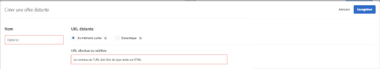

# Créer des offres distantes{#create-remote-offers}

Utilisez les offres distantes pour héberger hors de Target du contenu que Target référence et diffuse sur les sites web des utilisateurs. Ce contenu peut être hébergé sur un système de gestion de contenu ou sur un autre système, que ce soit par facilité ou pour des raisons de sécurité.

>[!NOTE]
>
>Les offres distantes peuvent uniquement être créées dans le compositeur à partir de formulaires. Content will be injected in the [!DNL Target] request locations, so these are most likely not appropriate for a global [!DNL Target] request.
>
>[!DNL Target Classic] fonctions similaires incluses : [!UICONTROL Offre sur votre site] et [!UICONTROL Offre hors Test&amp;Target].

Voici quelques exemples d’offres distantes :

* les différentes versions de ventes croisées ;
* les messages des paniers dynamiques ;
* les formulaires ;
* les calculateurs ;
* les mises à jour de taux d’intérêt.

**Pour créer une offre distante :**

1. Cliquez sur **[!UICONTROL Offres]**, puis sélectionnez l’onglet **[!UICONTROL Offres (code)]**.
1. Cliquez sur **[!UICONTROL Créer]** > **[!UICONTROL Offre distante]**.

   

1. Attribuez un nom explicite à l’offre.

   Un nom explicite aide les utilisateurs et vous-même à trouver rapidement l’offre dans la bibliothèque [!UICONTROL Ressources].

1. Spécifiez l’URL distante de l’offre distante :

   | Option | Description |
   |--- |--- |
   | En mémoire cache | Le contenu d’une offre distante en mémoire cache est diffusé à partir de Target. Toutes les deux heures, [!DNL Target] va chercher le contenu sur l’URL distante et le stocke ensuite dans Target. Lorsque des visiteurs chargent un site avec une expérience qui comprend une offre distante, l’offre est diffusée par Target. Les offres distantes en mémoire cache offrent une meilleure sécurité, car un utilisateur connecté à Target ne peut pas en modifier le contenu. Pour modifier le contenu, l’utilisateur doit se connecter au gestionnaire de contenu ou à un autre système pour le modifier dans celui-ci. Vous pouvez spécifier une URL absolue ou relative pour une offre distante en mémoire cache. |
   | Dynamique | Une offre distante dynamique n’est pas diffusée à partir de Target, mais du gestionnaire de contenu ou d’un autre système. Vous pouvez ne pas souhaiter que le contenu soit régulièrement mis en cache et ensuite diffusé par Target lorsque des visiteurs chargent un site avec une expérience comportant une offre distante. En lieu et place, vous pouvez opter pour appeler le système qui héberge le contenu et éventuellement transférer des informations spécifiques pour que l’offre renvoyée soit dynamique, c’est-à-dire différente, pour chaque utilisateur. Par exemple, si un utilisateur se connecte à un site web pour une carte de crédit incluant une expérience avec une offre distante dynamique, vous pouvez transférer des paramètres dans l’URL pour les informations de compte de l’utilisateur. Le site web peut ensuite fournir des informations spécifiques à l’utilisateur, telles que son solde. Cliquez sur Paramètre  d’Ajoute pour ajouter une ou plusieurs [!DNL Target] requêtes ou paramètres de requête. |

1. Cliquez sur **[!UICONTROL Enregistrer]**.

## Bonnes pratiques pour l’utilisation d’offres distantes {#section_7718512D08E14121B6F6B8C38134F4BC}

Bonnes pratiques pour l’utilisation d’offres distantes dans vos activités :

* If your offer resides in the same domain as the [!DNL Target] requests, using the [!UICONTROL Cached] option lets you use relative URLs in describing your offer location.

   Cela signifie que lorsque vous déplacez l’activité des serveurs de test vers ceux de production, le contenu devient automatiquement accessible sans avoir à modifier l’URL manuellement.

* Si votre test implique des données générées dynamiquement par votre serveur, l’option [!UICONTROL Dynamique] peut être un bon choix.
* Si vous planifiez de tester uniquement l’apparence du contenu de votre offre distante existante, utilisez le [!UICONTROL compositeur d’expérience visuelle] pour modifier l’apparence du contenu renvoyé à partir du système de gestion du contenu.
* Utilisez la matrice de sélection des offres distantes pour déterminer l’offre qui répond le mieux à votre cas spécifique. Si vous avez des questions, contactez le représentant du compte.

## Fonctionnement des offres distantes dynamiques {#concept_CC2A969420B34364A9FA78C1CE251818}

Une offre distante dynamique applique la technologie de page dynamique pour transmettre des valeurs à l’offre.

L’offre est exécutée une fois la page affichée. Un iframe invisible recueille les données, les copie et les insère dans la page, en chargeant les valeurs transmises.

## Matrice de sélection des offres distantes {#reference_B23BEDD29DDD47709A7651AFD27E776B}

La matrice de sélection des offres distantes vous aide à déterminer le type d’offre distante à choisir : [!UICONTROL En mémoire cache] ou [!UICONTROL Dynamique].

| Fonctionnalité | En mémoire cache | Dynamique |
|--- |--- |--- |
| Mises à jour chaque fois qu’un visiteur émet une requête | Non | Oui |
| Mises à jour du contenu | Mise en cache toutes les 2 heures | Mise à jour immédiate à chaque requête |
| Durée de chargement | Plus rapide | Plus lent en raison du traitement des requêtes |
| JavaScript visible dans la page | Oui | Non, mais peut transmettre par URL |
| Les offres peuvent inclure du code JavaScript | Oui | Oui |
| URL de l’offre | Absolu    ou Relatif | Relatif |
| Ordinateur émettant la requête | Serveurs Adobe | Ordinateur du visiteur qui stocke les cookies de celui-ci |