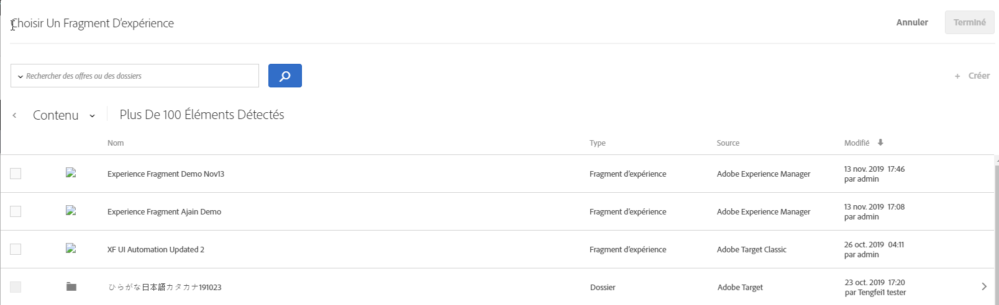

# Fragments d’expérience AEM{#aem-experience-fragments}

Information about using experience fragments created in [!DNL Adobe Experience Manager] (AEM) in [!DNL Target] activities to aid optimization or personalization.

>[!NOTE]
>
>Cette fonctionnalité nécessite que vous soyez un [!DNL Adobe Experience Manager] ([!DNL AEM]) client(e). Pour plus d’informations, reportez-vous à [Conditions](../../c-experiences/c-manage-content/aem-experience-fragments.md#section_AE6F0971E1574B3AA324003599B96E5A) ci-dessous.

## Aperçu {#section_95A91830530F493B81C5C9CDB9B783EA}

Using experience fragments created in [!DNL AEM] in [!DNL Target] activities lets you combine the ease-of-use and power of [!DNL AEM] with powerful Automated Intelligence (AI) and Machine Learning (ML) capabilities in [!DNL Target] to test and personalize experiences at scale.

[!DNL AEM] rassemble tous vos contenus et ressources dans un emplacement central pour alimenter votre stratégie de personnalisation. [!DNL AEM] permet de créer facilement du contenu pour les ordinateurs de bureau, les tablettes et les appareils mobiles dans un emplacement sans avoir à écrire de code. Il n’est pas nécessaire de créer des pages pour chaque périphérique. [!DNL AEM] ajuste automatiquement chaque expérience à l’aide de votre contenu.

[!DNL Target] permet de diffuser des expériences personnalisées à grande échelle en combinant des approches d’apprentissage automatique basées sur des règles et basées sur l’intelligence artificielle qui intègrent des variables comportementales, contextuelles et hors ligne. With [!DNL Target] you can easily set up and run [A/B Test](/help/c-activities/t-test-ab/test-ab.md) and [Multivariate](/help/c-activities/c-multivariate-testing/multivariate-testing.md) (MVT) activities to determine the best offers, content, and experiences.

Les fragments d’expérience représentent une énorme avancée permettant de relier les créateurs et les gestionnaires de contenu et d’expérience aux professionnels de l’optimisation et de la personnalisation qui génèrent les résultats commerciaux en utilisant [!DNL Target].

## Conditions {#section_AE6F0971E1574B3AA324003599B96E5A}

Les privilèges d’accès doivent vous avoir été attribués pour la fonctionnalité de fragments d’expérience dans [!DNL Target]. In addition, you must be using [!DNL AEM] 6.3 with the appropriate service pack or [!DNL AEM] 6.4 (or later). Votre gestionnaire de compte peut vous aider à vous assurer que vous répondez aux exigences requises pour utiliser cette fonction :

* [!DNL Adobe Experience Manager] 6.4 (ou version ultérieure).
* [!DNL Adobe Experience Manager] 6.3 SP2 (ou version ultérieure).
* [!DNL Adobe Target Standard] ou [!DNL Adobe Target Premium] compte.
* Contact [Adobe Target Customer Care](/help/cmp-resources-and-contact-information.md#reference_ACA3391A00EF467B87930A450050077C) to enable the integration and to provide you with authentication details.

## Creating and configuring experience fragments in [!DNL AEM] {#section_745C8EFE29F547A2958FDBF61A5ADF7B}

In order to use [!DNL AEM] experience fragments in [!DNL Target], you must perform the following steps:

### Étape 1 : Intégration [!DNL AEM] de [!DNL Target]

Pour obtenir plus d’informations, voir :

* **[!DNL AEM]6.3**: [Inscription à Adobe Analytics et Adobe Target](https://docs.adobe.com/docs/en/aem/6-3/administer/integration/marketing-cloud/opt-in.html) dans la documentation _Adobe Experience Manager 6.3_ .
* **[!DNL AEM]6.4**: [Inscription à Adobe Analytics et Adobe Target](https://helpx.adobe.com/experience-manager/6-4/sites/administering/using/opt-in.html) dans la _documentation Adobe Experience Manager 6.4_ .
* **[!DNL AEM]6.5**: [Inscription à Adobe Analytics et Adobe Target](https://helpx.adobe.com/experience-manager/6-5/sites/administering/using/opt-in.html) dans la documentation *Adobe Experience Manager 6.5* .

### Étape 2 : créer le fragment d’expérience

Les fragments d’expérience sont créés dans [!DNL AEM]. Pour obtenir plus d’informations, voir :

* **[!DNL AEM]6.3**: [Fragments](https://docs.adobe.com/docs/en/aem/6-3/author/experience-fragments.html) d’expérience dans la documentation *Adobe Experience Manager 6.3* .
* **[!DNL AEM]6.4**: [Fragments](https://helpx.adobe.com/experience-manager/6-4/sites/authoring/using/experience-fragments.html) d’expérience dans la documentation *Adobe Experience Manager 6.4* .
* **[!DNL AEM]6.5**: [Fragments](https://helpx.adobe.com/experience-manager/6-5/sites/authoring/using/experience-fragments.html) d’expérience dans la documentation *Adobe Experience Manager 6.5* .

### Step 3: Configure [!DNL AEM] to share the experience fragment with [!DNL Target]

1. From within [!DNL AEM], select the desired experience fragment or its containing folder, then click **[!UICONTROL Properties]**.
2. Cliquez sur l’onglet **[!UICONTROL Services Cloud]** puis, dans la liste déroulante **[!UICONTROL Configuration du service cloud]**, sélectionnez **[!UICONTROL Adobe Target]**.

   >[!NOTE]
   >
   >The previous step assumes that someone in your organization has created the [!DNL Adobe Target] configuration.

3. Cliquez sur **[!UICONTROL Enregistrer et fermer]**.

### Étape 4 : publiez le fragment d’expérience et exportez-le dans [!DNL Target]

En fonction de votre [!DNL AEM] version, consultez les liens suivants pour obtenir des instructions détaillées :

* **[!DNL AEM]6.3**: [Exportation d’un fragment d’expérience vers la Cible](https://helpx.adobe.com/experience-manager/6-3/sites/administering/using/experience-fragments-target.html) dans la documentation *Adobe Experience Manager 6.3* .
* **[!DNL AEM]6.4**: [Exportation d’un fragment d’expérience vers la Cible](https://docs.adobe.com/content/help/en/experience-manager-64/administering/integration/experience-fragments-target.html) dans la documentation *Adobe Experience Manager 6.4* .
* **[!DNL AEM]6.5**: [Exportation d’un fragment d’expérience vers la Cible](https://helpx.adobe.com/experience-manager/6-5/sites/administering/using/experience-fragments-target.html) dans la documentation *Adobe Experience Manager 6.5* .

## Using experience fragments in Target activities {#section_17CE4BE6B2B74CCEBAE0C68DEB84ABB9}

Après avoir effectué les tâches précédentes, le fragment d’expérience s’affiche sur la page [!UICONTROL Offres] de [!DNL Target].

>[!NOTE]
>
>[!DNL Target] recherche actuellement des fragments d’expérience à importer toutes les dix minutes. The imported experience fragment should be available in [!DNL Target] within ten minutes, but this time frame should shorten going forward.

>[!IMPORTANT]
>
>The experience fragment is currently imported into [!DNL Target] as an HTML offer. Note that the experience fragment &quot;primary&quot; version remains in [!DNL AEM]. Vous ne pouvez pas modifier le fragment d’expérience dans [!DNL Target].

Vous pouvez placer le pointeur de la souris sur un fragment d’expérience dans la liste, puis cliquer sur l’icône de [!UICONTROL Vue de l’icône de] Vue  [!DNL AEM] chemin d’accès.

You can consume experience fragments in [!DNL Target] activities using the [Visual Experience Composer](/help/c-experiences/c-visual-experience-composer/visual-experience-composer.md) (VEC) or the [Form-Based Experience Composer](/help/c-experiences/form-experience-composer.md).

>[!NOTE]
>
>To fully utilize the [!DNL Target] AI and ML functionality, you can select [Auto-Allocate](../../c-activities/automated-traffic-allocation/automated-traffic-allocation.md#concept_A1407678796B4C569E94CBA8A9F7F5D4) or [Auto-Allocate](/help/c-activities/automated-traffic-allocation/automated-traffic-allocation.md) while creating an A/B Test.

**Pour utiliser des fragments d’expérience à l’aide du compositeur d’expérience visuelle :**

1. Dans [!DNL Target], lors de la création ou de la modification d’une expérience dans le compositeur [d’expérience](../../c-experiences/experiences.md#concept_A2E10F6AFB3D4AEAB6951EE14688848D)visuelle, cliquez sur l’emplacement de la page où vous souhaitez insérer [!DNL AEM] du contenu, puis sélectionnez l’option de votre choix pour afficher la liste [!UICONTROL Choisir un fragment d’expérience] .

   * [!UICONTROL Insérer avant]
   * [!UICONTROL Insérer après]
   * [!UICONTROL Permutation avec le fragment d’expérience]

   La liste [!UICONTROL Fragment d’expérience][!DNL AEM] répertorie tout le contenu créé dans qui est désormais disponible en mode natif dans [!DNL Target].

   >[!NOTE]
   >
   >L’option [!UICONTROL Permuter avec le fragment d’expérience] n’est pas disponible pour les images. Si vous voulez utiliser cette option avec une image, cliquez sur l’élément conteneur qui contient l’image souhaitée.

   

1. Select the desired experience fragment, then click **[!UICONTROL Done]**.
1. Terminez la configuration de l’activité.

   Pour plus d’informations sur la configuration des différents types d’activités, reportez-vous aux rubriques suivantes :

   * **Test A/B :** [création d’un test A/B](../../c-activities/t-test-ab/t-test-create-ab/test-create-ab.md#task_68C8079BF9FF4625A3BD6680D554BB72)
   * **Affectation automatique :** [Affectation automatique](../../c-activities/automated-traffic-allocation/automated-traffic-allocation.md#concept_A1407678796B4C569E94CBA8A9F7F5D4)
   * **Ciblage automatique :** [Ciblage automatique pour les expériences personnalisées](../../c-activities/auto-target-to-optimize.md#concept_67779E5B7F67427A97D7EA2A6FB919B3)
   * **Personnalisation automatisée (AP) :** [Création d’une activité de personnalisation automatisée](../../c-activities/t-automated-personalization/create-ap-activity.md#task_8AAF837796D74CF893CA2F88BA1491C9)
   * **Ciblage d’expérience (XT) :** [Création d’une activité de ciblage d’expérience](../../c-activities/t-experience-target/t-xt-create/xt-create.md#task_D6B3429AC31549E1A70EDF04B3DDC765)
   * **Test multivarié (MVT) :** [création d’un test multivarié](../../c-activities/c-multivariate-testing/t-create-multivariate-test/create-multivariate-test.md#task_BF870FA60A8245AB8F0B775BE32EA710)
   * **Recommendations :** [création d’une activité de recommandations](../../c-recommendations/t-create-recs-activity/create-recs-activity.md#task_6874328773C64C44A73F0A130AD3F96F).

**Pour utiliser des fragments d’expérience à l’aide du compositeur d’expérience d’après les formulaires :**

1. In [!DNL Target], while creating or editing an experience in the [Form-Based Experience Composer](../../c-experiences/form-experience-composer.md#task_FAC842A6535045B68B4C1AD3E657E56E), select the location on the page where you want to insert [!DNL AEM] content, then select **[!UICONTROL Change Experience Fragment]** to display the [!UICONTROL Choose an Experience Fragment] list.

   

   La liste [!UICONTROL Fragment d’expérience][!DNL AEM] répertorie tout le contenu créé dans qui est désormais disponible en mode natif dans [!DNL Target].

1. Sélectionnez le fragment d’expérience souhaité, puis cliquez sur **[!UICONTROL Enregistrer]**.
1. Terminez la configuration de l’activité.

## Considérations {#considerations}

* [!DNL Target] recherche actuellement des fragments d’expérience à importer toutes les dix minutes. The imported experience fragment should be available in [!DNL Target] within ten minutes, but this time frame should shorten going forward.
* The experience fragment is currently imported into [!DNL Target] as an HTML offer. Note that the experience fragment &quot;primary&quot; version remains in [!DNL AEM]. Vous ne pouvez pas modifier le fragment d’expérience dans [!DNL Target].
* Vous pouvez importer des offres JSON en tant que fragments d’expérience dans [!DNL Target]. Cependant, ces offres sont importées en tant qu’offres HTML. Actuellement, les offres JSON (fragments d’expérience) ne sont pas entièrement prises en charge dans l’ [!DNL Target] interface utilisateur.
* Vous ne pouvez pas créer de fragments d’expérience à l’aide des E/S d’Adobe. Vous devez créer des fragments d’expérience à l’aide d’AEM, comme expliqué ci-dessus.

## Training video: Using AEM experience fragments with Adobe Target  {#section_C0EDC54063464F41A182492D2045BC64}

La vidéo suivante vous explique comment configurer et utiliser des fragments d’expérience :

>[!VIDEO](https://video.tv.adobe.com/v/22383)

>[!NOTE]
>
>La fonction [!DNL AEM] de lien profond décrite à 4:54 a été supprimée.

Pour plus d’informations, voir [Utilisation de fragments d’expérience avec Adobe Target](https://docs.adobe.com/content/help/en/experience-manager-learn/sites/personalization/experience-fragment-target-offer-feature-video-use.html) sur la page Vidéos et Tutorials ** AEM Sites.
