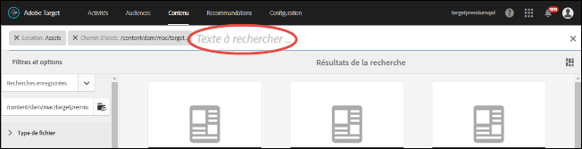
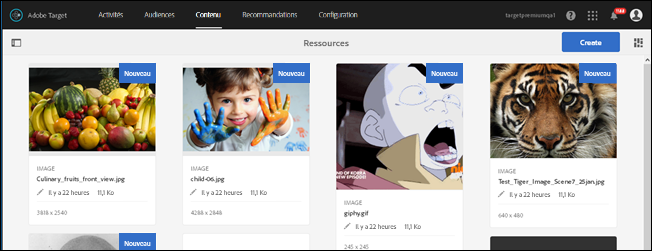
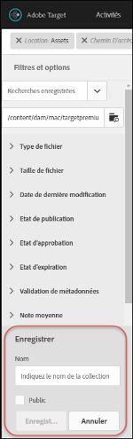
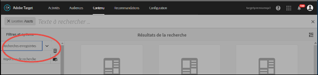

# Recherche de contenu et création de collections dynamiques{#search-content-and-create-smart-collections}

Recherchez des ressources par mots-clés et enregistrez des dossiers de recherche, appelés collections dynamiques, qui sont automatiquement mis à jour avec les résultats de recherche.

Cette section traite des sujets suivants :

* [Recherche de ressources par mots-clés ](../../c-experiences/c-manage-content/filter-and-search-content.md#section_2465A71BC95942588F586B1EC8B9E5DB)
* [Enregistrement d’une collection dynamique ](../../c-experiences/c-manage-content/filter-and-search-content.md#section_5C95159543B5405EB8C8E47B518DF4AB)

## Recherche de ressources par mots-clés {#section_2465A71BC95942588F586B1EC8B9E5DB}

1. Cliquez sur **[!UICONTROL Offres]** > **[!UICONTROL Offres (images)]** pour accéder à la [!UICONTROL Bibliothèque de ressources].

   Vous pouvez cliquer sur l’icône [!UICONTROL Mode Carte] dans le coin supérieur droit pour afficher les ressources au format du mode Carte.

   OU

   Vous pouvez cliquer sur l’icône [!UICONTROL Mode Liste] dans le coin supérieur droit pour afficher les ressources au format du mode Liste.

1. Cliquez sur l’icône **[!UICONTROL Contenu uniquement]** dans le coin supérieur gauche pour afficher la zone de recherche.

   

1. Dans la zone de recherche, saisissez un mot-clé pour la ou les ressources que vous souhaitez localiser, puis appuyez sur Entrée.

## Enregistrement d’une collection dynamique {#section_5C95159543B5405EB8C8E47B518DF4AB}

Vous pouvez créer des recherches enregistrées, appelées collections dynamiques, pour gagner du temps lorsque vous effectuez des recherches similaires. L’enregistrement d’une recherche crée une collection dynamique qui est automatiquement mise à jour avec les résultats de recherche.

1. Cliquez sur **[!UICONTROL Offres]** > **[!UICONTROL Offres (images)]** pour accéder à la [!UICONTROL Bibliothèque de fichiers].

   

1. Cliquez sur l’icône **[!UICONTROL Contenu uniquement]** dans le coin supérieur gauche pour afficher le panneau [!UICONTROL Filtres et options] dans le rail gauche.
1. Cliquez sur l’icône **[!UICONTROL Parcourir]** pour afficher la boîte de dialogue [!UICONTROL Sélectionner le chemin].

   

1. Recherchez le dossier sur lequel vous souhaitez baser la collection dynamique et sélectionnez-le, puis cliquez sur l’icône **[!UICONTROL Confirmer.]**

   

1. (Facultatif) Sélectionnez parmi les diverses options pour préciser un filtre de recherche, par exemple le type ou la taille du fichier.
1. Cliquez sur **[!UICONTROL Enregistrer la collection dynamique]** au bas du panneau [!UICONTROL Filtres et options] pour afficher les options d’enregistrement.

   

1. Indiquez un nom pour la collection dynamique, sélectionnez la case **[!UICONTROL Public]** si vous souhaitez que tous les utilisateurs de votre compte [!DNL Target] puissent accéder à cette collection dynamique, puis cliquez sur **[!UICONTROL Enregistrer]**.

   La collection dynamique est ajoutée à votre liste de recherches enregistrées pour une utilisation ultérieure :

   

Vous pouvez modifier une collection dynamique enregistrée en la sélectionnant dans la liste déroulante [!UICONTROL Recherches enregistrées] pour l’ouvrir, puis en cliquant sur [!UICONTROL Modifier la collection dynamique].
