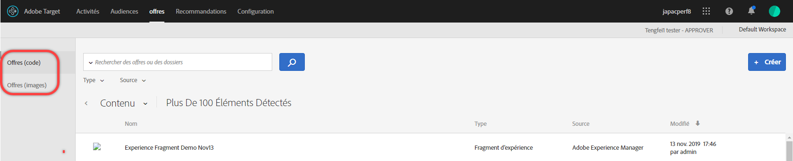
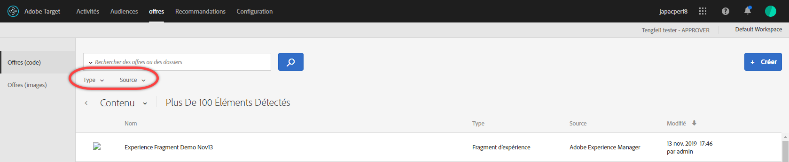
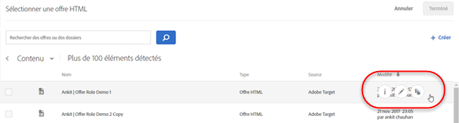
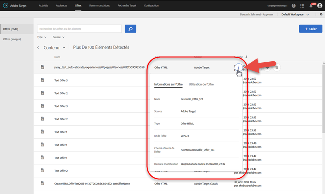
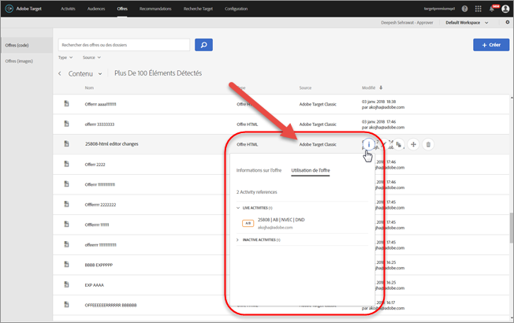
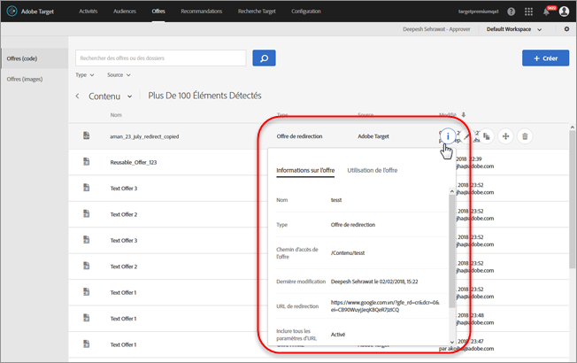
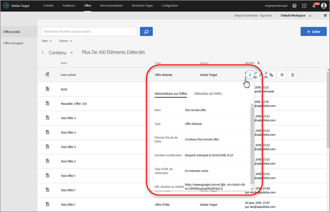

# Offres{#offers}

Pour gérer le contenu de vos offres de code et d’image, utilisez la bibliothèque d’offres.

>[!NOTE]
>
>Dans la version de janvier 2017, les offres créées dans[!DNL Target Classic], [!DNL Adobe Experience Manager] (AEM), [!DNL Adobe Mobile Services] (AMS) et les API sont visibles dans l’interface utilisateur de [!DNL Target Standard/Premium]. Les offres mises à jour suivant ces méthodes au cours des deux dernières années (c’est-à-dire depuis janvier 2015) seront visibles. La synchronisation initiale a lieu la première fois qu’un utilisateur de votre entreprise ouvre la page [!UICONTROL Offres]. La durée de la première synchronisation dépend de la quantité de données. Par la suite, les données sont synchronisées de manière incrémentielle. Si, avant cette version, un même dossier contenait du code et des images, [!DNL Target] le divise en deux dossiers. La date et l’heure de mise à jour désignent le moment de la migration du dossier ; il ne s’agit pas de la date de création du dossier.

Pour ouvrir la bibliothèque, cliquez sur **[!UICONTROL Offres]**. La bibliothèque contient les offres qui ont été configurées par l’intermédiaire de [!DNL Target Standard/Premium], [!DNL Target Classic], [!DNL Adobe Experience Manager] (AEM), [!DNL Adobe Mobile Services] (AMS) et les API. Les offres créées dans [!DNL Target Standard/Premium] ou d’autres solutions sont modifiables dans [!DNL Target Classic].

Deux onglets se trouvent à droite de la page [!UICONTROL Offres] : Offres (code) et Offres (images), d’où vous pouvez afficher les offres par type.

Vous pouvez filtrer les offres par type (offre HTML, offre de redirection, offre distante ou dossier) et par source (Adobe Target, Adobe Target Classic, Adobe Experience Manager, Adobe Mobile Services ou API).

Vous pouvez modifier ou copier un dossier ou une offre en survolant l’élément souhaité, puis en cliquant sur l’icône Modifier ou Copier.

## Affichage des définitions d’offre {#section_6B059DD121434E6292CAB393507D010E}

Vous pouvez afficher les détails de la définition de l’offre dans une carte contextuelle dans la bibliothèque d’offres sans ouvrir l’offre.

Par exemple, la carte de définition de l’offre suivante pour une offre HTML est accessible en survolant une offre de la liste de contenus, puis en cliquant sur l’icône d’informations :

Les informations suivantes sont disponibles :

* Nom
* Source
* Type
* ID d’offre
* Chemin de l’offre
* Dernière modification

Cliquez sur l’onglet [!UICONTROL Utilisation de l’offre] pour afficher les activités qui référencent une offre de code dans la carte contextuelle de définition de chaque offre. Cette fonctionnalité ne s’applique pas aux offres d’image. Vous pouvez ainsi éviter toute répercussion sur les autres activités lorsque vous modifiez les offres. Les informations portent sur les activités actives et inactives.

L’illustration ci-dessous présente une carte de définition d’offre pour une offre de redirection :

Les informations suivantes sont disponibles :

* Nom
* Source
* Type
* ID d’offre
* Chemin de l’offre
* Dernière modification
* URL de redirection
* Inclure tous les paramètres d’URL (activé ou désactivé)
* Transmettre l’ID de session de la mbox (activé ou désactivé)

L’illustration ci-dessous présente une carte de définition d’offre pour une offre distante :

Les informations suivantes sont disponibles :

* Nom
* Source
* Type
* ID d’offre
* Chemin de l’offre
* Dernière modification
* Type d’URL de redirection
* URL absolue ou relative

## Vidéo de formation : Le Référentiel de contenu 

Cette vidéo fournit des informations sur la gestion des offres.

* Connexion entre la [bibliothèque des ressources Experience Cloud](https://experienceleague.adobe.com/docs/core-services/interface/assets/creative-cloud.html) et la bibliothèque de contenu Target
* Offres HTML personnalisées
* Offre HTML personnalisée dans le compositeur d’expérience visuelle

>[!VIDEO](https://video.tv.adobe.com/v/17387)