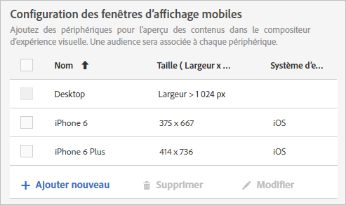
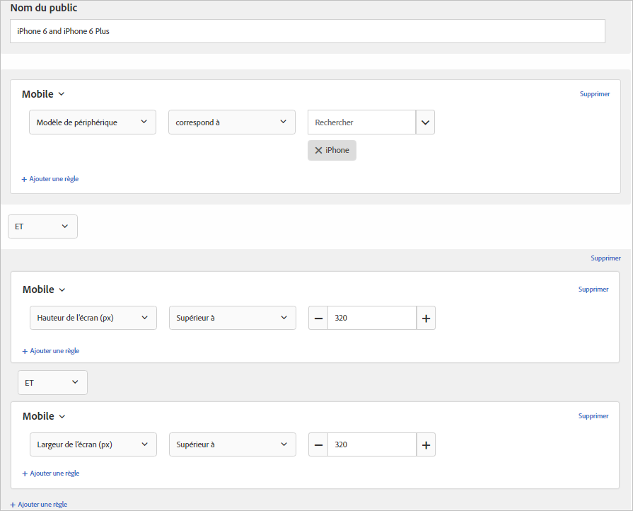

# Mobile Viewports for responsive experiences{#mobile-viewports-for-responsive-experiences}

Mobile viewports help you preview how your [!DNL Target] activities appear on screens of various sizes.

La fonction de prévisualisation de fenêtres d’affichage mobiles est conçue pour les sites réactifs qui s’affichent correctement sur divers périphériques, fenêtres ou tailles d’écran. Les sites réactifs s’adaptent et s’adaptent automatiquement à n’importe quelle taille d’écran, y compris les ordinateurs de bureau, les ordinateurs portables, les tablettes ou les téléphones portables.

>[!NOTE]
>
> * Utilisez les fenêtres d’affichage mobiles si votre site est réactif et que les éléments de votre page de bureau sont également utilisés sur votre page mobile dans une configuration différente. If you have a separate mobile site with a separate structure, such as `m.mysite.com`, use a [multipage activity](../../c-experiences/c-visual-experience-composer/multipage-activity.md#concept_277E096063E14813AC5D8EDFA1D2ED48) instead.
   >
   >
* Les fenêtres d’affichage mobiles ne sont pas disponibles si elles sont recouvertes par une offre de redirection.

Une fenêtre d’affichage est définie par la taille du rectangle occupé par une page web sur votre écran. Il s’agit de la taille de la fenêtre du navigateur, moins les barres de défilement et les barres d’outils. Les navigateurs utilisent les « pixels CSS ». Pour de nombreux périphériques, notamment ceux disposant d’écrans Retina, la fenêtre d’affichage est plus petite que la résolution annoncée du périphérique.

Vous trouverez ci-dessous les fenêtres d’affichage et les résolutions pour certains périphériques populaires. Rappelez-vous d’utiliser la taille de fenêtre d’affichage dans [!DNL Target]. Plusieurs sites web répertorient les tailles de fenêtres d’affichage pour les appareils populaires. Par exemple, voir [https://viewportsizer.com/devices/](https://viewportsizer.com/devices/) ou consultez le site Web du fabricant de périphériques.

| Périphérique | Taille de fenêtre d’affichage | Résolution du périphérique |
|---|---|---|
| iPhone SE | 375 (largeur) x 667 (hauteur) | 750 (largeur) x 1 334 (hauteur) |
| iPhone 11 Pro Max | 414 (largeur) x 896 (hauteur) | 1242 (largeur) x 2688 (hauteur) |
| iPhone 11 Xs max | 414 (largeur) x 896 (hauteur) | 1242 (largeur) x 2688 (hauteur) |
| iPhone 11 | 414 (largeur) x 896 (hauteur) | 828 (largeur) x 1792 (hauteur) |
| iPhone 11 Xr | 414 (largeur) x 896 (hauteur) | 828 (largeur) x 1792 (hauteur) |
| iPhone 11 Pro | 375 (largeur) x 812 (hauteur) | 1 125 (largeur) x 2 436 (hauteur) |
| iPhone 11 X | 375 (largeur) x 812 (hauteur) | 1 125 (largeur) x 2 436 (hauteur) |
| iPhone 11 Xs | 375 (largeur) x 812 (hauteur) | 1 125 (largeur) x 2 436 (hauteur) |
| iPhone X | 375 (largeur) x 812 (hauteur) | 1 125 (largeur) x 2 436 (hauteur) |
| iPhone 8 Plus | 414 (largeur) x 736 (hauteur) | 1 080 (largeur) x 1 920 (hauteur) |
| iPhone 8 | 375 (largeur) x 667 (hauteur) | 750 (largeur) x 1 334 (hauteur) |
| iPhone 7 Plus | 414 (largeur) x 736 (hauteur) | 1 080 (largeur) x 1 920 (hauteur) |
| iPhone 7 | 375 (largeur) x 667 (hauteur) | 750 (largeur) x 1 334 (hauteur) |
| iPhone 6s Plus | 414 (largeur) x 736 (hauteur) | 1 080 (largeur) x 1 920 (hauteur) |
| iPhone 6s | 375 (largeur) x 667 (hauteur) | 750 (largeur) x 1 334 (hauteur) |
| iPhone 6 Plus | 414 (largeur) x 736 (hauteur) | 1 080 (largeur) x 1 920 (hauteur) |
| iPhone 6 | 375 (largeur) x 667 (hauteur) | 750 (largeur) x 1 334 (hauteur) |
| iPad Pro | 1 024 (largeur) x 1 366 (hauteur) | 2 048 (largeur) x 2 732 (hauteur) |
| iPad 3e et 4e génération | 768 (largeur) x 1 024 (hauteur) | 1 536 (largeur) x 2 048 (hauteur) |
| iPad Air 1 et 2 | 768 (largeur) x 1 024 (hauteur) | 1 536 (largeur) x 2 048 (hauteur) |
| iPad Mini | 768 (largeur) x 1 024 (hauteur) | 768 (largeur) x 1 024 (hauteur) |
| iPad Mini 2 et 3 | 768 (largeur) x 1 024 (hauteur) | 1 536 (largeur) x 2 048 (hauteur) |
| Nexus 6P | 411 (largeur) x 731 (hauteur) | 1 440 (largeur) x 2 560 (hauteur) |
| Nexus 5X | 411 (largeur) x 731 (hauteur) | 1 080 (largeur) x 1 920 (hauteur) |
| Google Pixel | 411 (largeur) x 731 (hauteur) | 1 080 (largeur) x 1 920 (hauteur) |
| Google Pixel XL | 411 (largeur) x 731 (hauteur) | 1 440 (largeur) x 2 560 (hauteur) |
| Google Pixel 2 | 411 (largeur) x 731 (hauteur) | 1 080 (largeur) x 1 920 (hauteur) |
| Google Pixel 2 XL | 411 (largeur) x 823 (hauteur) | 1440 (largeur) x 2880 (hauteur) |
| Samsung Galaxy Note 5 | 480 (largeur) x 853 (hauteur) | 1 440 (largeur) x 2 560 (hauteur) |
| LG G5 | 480 (largeur) x 853 (hauteur) | 1 440 (largeur) x 2 560 (hauteur) |
| One Plus 3 | 480 (largeur) x 853 (hauteur) | 1 080 (largeur) x 1 920 (hauteur) |
| Samsung Galaxy S9 | 360 (largeur) x 740 (hauteur) | 1 440 (largeur) x 2 960 (hauteur) |
| Samsung Galaxy S9+ | 360 (largeur) x 740 (hauteur) | 1 440 (largeur) x 2 960 (hauteur) |
| Samsung Galaxy S8 | 360 (largeur) x 740 (hauteur) | 1 440 (largeur) x 2 960 (hauteur) |
| Samsung Galaxy S8+ | 360 (largeur) x 740 (hauteur) | 1 440 (largeur) x 2 960 (hauteur) |
| Samsung Galaxy S7 | 360 (largeur) x 640 (hauteur) | 1 440 (largeur) x 2 560 (hauteur) |
| Samsung Galaxy S7 Edge | 360 (largeur) x 640 (hauteur) | 1 440 (largeur) x 2 560 (hauteur) |
| Nexus 7 (2013) | 600 (largeur) x 960 (hauteur) | 1 200 (largeur) x 1 920 (hauteur) |
| Nexus 9 | 768 (largeur) x 1 024 (hauteur) | 1 536 (largeur) x 2 048 (hauteur) |
| Samsung Galaxy Tab 10 | 800 (largeur) x 1 280 (hauteur) | 800 (largeur) x 1 280 (hauteur) |
| Chromebook Pixel | 1 280 (largeur) x 850 (hauteur) | 2 560 (largeur) x 1 700 (hauteur) |

Si vous souhaitez diffuser une activité aux utilisateurs d’un périphérique précis, choisissez l’audience appropriée pour ce périphérique dans le diagramme d’activité. Utilisez le compositeur web mobile pour modifier la page dans l’activité pour ce périphérique. Si vous voulez exécuter une activité sur l’ensemble de votre expérience numérique et vous assurer qu’elle s’affiche correctement sur tous les périphériques, n’appliquez pas de ciblage et utilisez les fenêtres d’affichage mobiles pour prévisualiser l’activité sur chaque taille d’écran.

Si votre site est réactif, il est typiquement conçu pour s’ouvrir dans un affichage différent lorsqu’on y accède par le biais d’un périphérique avec une taille d’écran spécifique. Ces tailles d’écran qui déclenchent les nouveaux affichages sont connues sous le nom de points de rupture CSS. Les points d’arrêt CSS sont des points où le contenu du site Web répond en fonction de la largeur de l’appareil pour afficher la disposition optimale aux visiteurs. Les points d’arrêt CSS sont également appelés requêtes multimédias.

Save your CSS breakpoints in [!DNL Target] so you can preview your experiences for each view you define. Each of these experiences is displayed in a mobile viewport in the [!DNL Target] interface. Ouvrez l’affichage pour chaque taille d’écran en cliquant sur la fenêtre d’affichage située en haut de l’écran.

Si votre site n’est pas réactif, vous pouvez quand même utiliser le compositeur web mobile pour afficher un site si votre activité cible un périphérique spécifique.

>[!IMPORTANT]
>
>Bien que vous puissiez modifier une expérience depuis les fenêtres d’affichage mobiles, ces modifications s’appliquent à toutes les fenêtres d’affichage et tous les périphériques, et pas seulement à la fenêtre d’affichage dans laquelle vous travaillez. De même, la modification d’une expérience dans l’affichage de bureau classique entraîne la modification de la page pour toutes les tailles d’écran, pas seulement pour l’affichage de bureau. La modification des pages spécifiques aux fenêtres d’affichage n’est pour le moment pas prise en charge.

## Mobile viewport configuration {#task_B4B161499DC0470584ED922A4D20FCAB}

Configurez toutes les fenêtres d’affichage mobiles que vous voulez rendre disponibles lors de la création de vos expériences.

1. Cliquez sur **[!UICONTROL Administration]** > Compositeur **[!UICONTROL d’expérience]** visuelle.
1. Pour ajouter une nouvelle fenêtre d’affichage mobile, dans la section Configuration **[!UICONTROL des fenêtres d’affichage]** mobiles, cliquez sur **[!UICONTROL Ajouter]**.

   

   To change the configuration of an existing mobile viewport, select that viewport, then click the [!UICONTROL Edit] (pencil) icon.

1. Saisissez un nom pour la fenêtre d’affichage mobile.

   Choisissez un nom explicite facile à reconnaître pour votre fenêtre d’affichage mobile. Le nom ne peut excéder 36 caractères.

1. Précisez la taille de l’écran du périphérique mobile (largeur et la hauteur).

   La largeur doit être comprise entre 150 et 968 pixels. La hauteur doit être comprise entre 150 et 1 280 pixels.

1. (Facultatif) Sélectionnez le système d’exploitation du périphérique.

   Options :

   * Android
   * iOS
   * Windows
   * Symbian
   * BlackBerry

   Si vous utilisez le [compositeur d’expérience avancé](../../c-experiences/experiences.md#section_34265986611B4AB8A0E4D6ACC25EF91D) et choisissez un système d’exploitation,  émule cet appareil lorsque vous affichez la page. [!DNL Target] If, for example, there is a different look and feel for Android than iOS on your responsive site, [!DNL Target] mimics that behavior.

1. Cliquez sur **[!UICONTROL Enregistrer]**.

>[!NOTE]
>
>Si vous tentez de supprimer une fenêtre d’affichage mobile en cours d’utilisation, le message suivant s’affiche : &quot;Cette fenêtre d’affichage est actuellement associée à une ou plusieurs activités. Vous devez supprimer la fenêtre d’affichage de ces activités avant de pouvoir la supprimer.&quot;

## Create a responsive experience {#task_D6332438B5EE48CCA8AF199270F1CAEF}

Add mobile viewports to your [!DNL Target] activities to create responsive experiences for mobile screens.

1. Créez l’activité souhaitée.
1. Dans le compositeur d’expérience visuelle, cliquez sur l’icône d’engrenage représentant les **[!UICONTROL Paramètres]**, puis sélectionnez **[!UICONTROL Ajouter des fenêtres d’affichage mobiles]**.

   

1. Cliquez sur l’icône **[!UICONTROL Périphériques]**, puis activez chaque périphérique auquel ajouter une fenêtre d’affichage mobile.

   

   Les fenêtres d’affichage mobiles sont répertoriées de la plus petite à la plus grande selon la largeur.

1. Modifiez les fenêtres d’affichage mobile comme vous le souhaitez.

   Toute modification apportée à l’expérience (par exemple, si vous changez le texte d’un titre) sera appliquée à l’expérience sur tous les périphériques.

   Placez votre souris sur le nom d’une fenêtre d’affichage pour afficher la taille de celle-ci.

   

1. Si vous le souhaitez, basculez entre les modes portrait et paysage en cliquant sur l’icône d’orientation de votre choix.

   

## Use Case: Target two iPhone versions {#task_CC3144BF5BA54034996E1D3DB0BC1A35}

Ce cas d’utilisation montre comment configurer des expériences pour deux versions d’iPhone : iPhone 6 et iPhone 6 Plus.

1. Cliquez sur **[!UICONTROL Administration]** > Compositeur **[!UICONTROL d’expérience]** visuelle.
1. In the **[!UICONTROL Mobile Viewport Configuration]** section, create mobile viewports for iPhone 6 and iPhone 6 plus.

   Utilisez les paramètres suivants pour chaque fenêtre d’affichage :

   | Nom | Largeur | Hauteur | Système d’exploitation |
   |---|---|---|---|
   | iPhone 6 | 375 | 667 | iOS |
   | iPhone 6 Plus | 414 | 736 | iOS |

   

1. Créez une activité avec l’expérience que vous souhaitez cible.
1. Sélectionnez l’expérience que vous souhaitez cibler pour les visiteurs qui accèdent à votre site depuis un iPhone 6 ou un iPhone 6 Plus.
1. Lorsque vous sélectionnez votre cible, cliquez sur **[!UICONTROL Créer une audience]**, puis configurez une audience comme illustré dans l’image ci-dessous :

   

   Étant donné que le téléphone peut être pivoté en mode paysage, ce qui requiert à la fois une longueur et une largeur supérieures à 320, cela créé une condition que seuls les iPhone 6 et 6 Plus sont capables d’observer, lorsqu’elle est combinée avec le modèle de périphérique iPhone.
1. Cliquez sur **[!UICONTROL Enregistrer]**.
1. Continuez à configurer votre activité comme vous l’auriez normalement fait.

## Vidéos de formation

Les vidéos suivantes contiennent davantage d’informations sur les concepts abordés dans cet article.

### Compositeur d’expérience visuelle (2 de 2) (07:29) 

La vidéo de démonstration suivante contient des informations sur l’utilisation du compositeur d’expérience visuelle avec des fenêtres d’affichage mobiles :

* Attribution d’un nouveau nom à une expérience et duplication d’une expérience
* Création d’une expérience de redirection
* Ciblage d’une activité sur une URL unique ou un groupe d’URL
* Création d’une activité multipage
* Prévisualisation et création d’expérience pour des sites web réactifs
* Utilisation de superposition pour mettre en avant des types d’éléments

>[!VIDEO](https://video.tv.adobe.com/v/17401)

### Préférences de compte dans le badge 

Cette vidéo contient des informations sur la configuration des fenêtres d’affichage mobiles, à partir de 4:40 dans la vidéo.

>[!VIDEO](https://video.tv.adobe.com/v/17379)