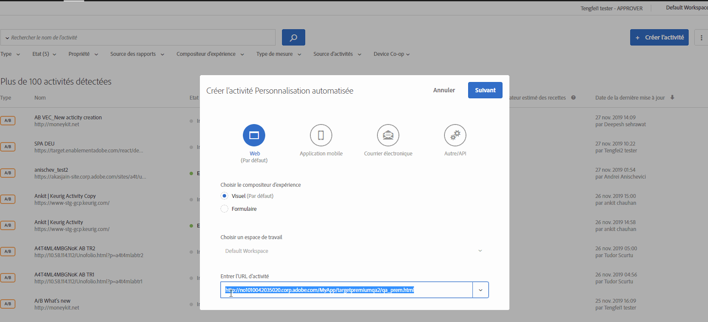

# Activation du contenu mixte dans votre navigateur{#enabling-mixed-content-in-your-browser}

Certains navigateurs bloquent l’affichage d’une page si elle comporte du contenu sécurisé et non sécurisé.

## Activation du contenu mixte dans votre navigateur{#concept_46D022D50280468C9EF6D5DF6EFC911C}

Certains navigateurs bloquent l’affichage d’une page si elle comporte du contenu sécurisé et non sécurisé.

Si le compositeur d’expérience visuelle tente d’ouvrir une page contenant du contenu mixte (sécurisé et non sécurisé), un message s’affiche indiquant comment désactiver le blocage dans le navigateur afin d’ouvrir un site HTTP ou un site comportant des appels mixtes (HTTPS et HTTP).

Auparavant, lorsque le contenu mixte n’était pas autorisé, vous pouviez toujours effectuer certaines actions de l’étape 1 du processus assisté en trois étapes lors de la création d’activités. Target bloque désormais les actions de l’étape 1. Lorsque le message ci-dessus s’affiche, vous devez activer le contenu mixte avant de continuer.

Les paramètres de sécurité du navigateur peuvent bloquer le chargement du contenu mixte ou du contenu non sécurisé (HTTP) sur une page sécurisée (HTTPS) ou une trame sécurisée (par exemple le compositeur d’expérience visuelle). Si vous ne souhaitez pas désactiver les paramètres de sécurité du navigateur, vous devez disposer d’un site web HTTPS.

Si votre site web s’exécute sur un domaine non sécurisé (HTTP), vous devez autoriser le compositeur d’expérience visuelle à charger du contenu mixte actif.

>[!NOTE]
>
>L’autorisation du contenu mixte affecte uniquement le compositeur d’expérience visuelle et non votre site Web actif.

Pour plus d’informations, voir [Mixed Content (Contenu mixte)](https://developer.mozilla.org/en-US/docs/Web/Security/Mixed_content) sur le site web *Mozilla Developer Network* (MDN).

## Activation du contenu mixte dans Firefox {#task_5448763B8DC941FD80F84041AEF0A14D}

Par défaut, Firefox bloque les pages qui contiennent du contenu sécurisé et non sécurisé. Pour utiliser [!DNL Target], il est conseillé de modifier définitivement ce paramètre.

<!-- 

target/t_mixed_content_firefox.xml

 -->

1. Dans Firefox, saisissez `about:config` dans la barre d’adresse.
1. Acceptez le message d’avertissement affiché par Firefox.
1. Dans la barre de recherche, entrez `block_active`.
1. Double-cliquez sur ` **[!UICONTROL security.mixed_content.block_active_content]**`.

   La valeur true se transforme en false. Lorsque la valeur devient false, l’opération est terminée. Une fois ce paramètre modifié, il est conseillé de redémarrer l’ordinateur.

## Activation du contenu mixte dans Internet Explorer {#task_59E7D13C04DF486C92CD78D0C63DDDE8}

Par défaut, Internet Explorer bloque les pages qui contiennent du contenu sécurisé et non sécurisé. Pour utiliser Target Standard, il est conseillé de modifier définitivement ce paramètre.

<!-- 

target/t_mixed_content_ie.xml

 -->

1. Dans Internet Explorer, cliquez sur l’icône des paramètres &gt; **[!UICONTROL Options Internet]**.
1. Cliquez sur l’onglet [!UICONTROL Sécurité.]
1. Sélectionnez **[!UICONTROL Internet]**, puis cliquez sur **[!UICONTROL Niveau personnalisé]**.
1. Sélectionnez **[!UICONTROL Divers]**.
1. Sous [!UICONTROL Divers], activez **[!UICONTROL Afficher un contenu mixte]**.
1. Cliquez sur **[!UICONTROL OK]** &gt; **[!UICONTROL Oui]** &gt; **[!UICONTROL Appliquer]**.

Une fois ce paramètre modifié, il est conseillé de redémarrer l’ordinateur.

## Activation du contenu mixte dans Chrome {#task_FF297A08F66E47A588C14FD67C037B3A}

Si vous visitez un site au moyen d’une connexion sécurisée, Google Chrome vérifie que le contenu de la page web a été transmis en toute sécurité.

<!-- 

target/t_mixed_content_chrome.xml

 -->

Voir [Cette page comporte du contenu non sécurisé](https://support.google.com/chrome/answer/1342714?hl=en) dans l’aide Google Chrome.
