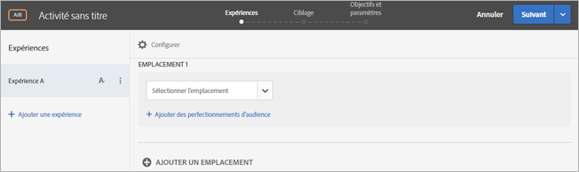
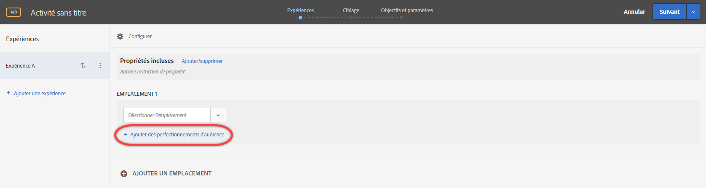
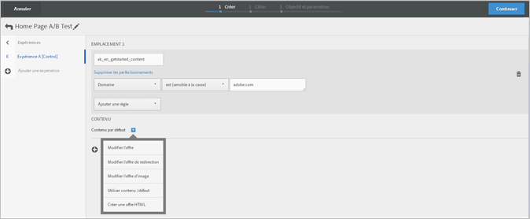
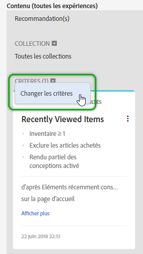
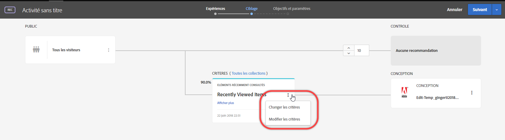

# Compositeur d’expérience d’après les formulaires{#form-based-experience-composer}

Le compositeur d’expérience d’après les formulaires est une interface de création d’expérience et d’offres qui est utile pour créer des expériences à utiliser dans les activités de tests A/B, de ciblage d’expérience, d’Automated Personalization et recommandations lorsque le compositeur d’expérience visuelle n’est pas disponible ou pratique à utiliser. Par exemple, vous pouvez utiliser le compositeur basé sur les formulaires pour créer des expériences et des offres pour une diffusion dans des courriels, des bornes et des assistants vocaux.

Si vous créez une activité de recommandations, il n’y a pas d’expériences. Choisissez votre critère et votre conception. Si vous choisissez plusieurs critères ou conceptions, Target génère automatiquement les expériences.

1. Cliquez sur **[!UICONTROL Créer l’activité]**, puis sélectionnez le type d’activité que vous souhaitez créer.

   Le compositeur d’expérience d’après les formulaires est disponible pour les activités de tests A/B, de ciblage d’expérience, d’Automated Personalization et de recommandations.
1. Sélectionnez **[!UICONTROL Compositeur d’expérience d’après les formulaires]** depuis la boîte de dialogue [!UICONTROL Nouvelle Activité.]

   Le compositeur d’expérience d’après les formulaires s’ouvre.

   

   Cet écran est différent si vous créez une activité de recommandations. Les activités de recommandations n’incluent pas d’expériences.
1. Nommez l’activité.
1. Sélectionnez un emplacement.

   When you click in the [!UICONTROL Select Location] box, a list of available locations appears. Sélectionnez un de ces emplacements. Pour sélectionner l’emplacement global fourni via target.js, sélectionnez « target-global-mbox ».

   Vous pouvez également saisir un emplacement qui n’est pas répertorié ici. Ceci peut s’avérer utile lorsque la mbox n’a pas encore été créée ou consultée sur une page. Saisissez le nom de l’emplacement. Soyez prudent lorsque vous saisissez un emplacement qui n’existe pas encore. Si l’orthographe ou la capitalisation ne correspond pas à l’orthographe et à la capitalisation lorsque l’appel mbox est passé, l’activité ne sera pas diffusée. Les emplacements saisis manuellement sont enregistrés à la liste des emplacements disponibles. La prochaine fois que vous essaierez de sélectionner un emplacement saisi manuellement, il sera disponible dans la liste déroulante [!UICONTROL Sélectionner un emplacement] pour cette activité.

   >[!NOTE]
   >
   >La création d’un emplacement saisi manuellement au cours de la création d’activités ne crée pas automatiquement un nouvel emplacement. Le nom de l’emplacement n’est enregistré que dans le contexte de l’activité. L’emplacement est créé lorsqu’il y a un appel de diffusion de contenu. Une fois l’emplacement créé, il sera disponible pour une utilisation dans d’autres activités, pour la création d’audiences, etc. dans la liste déroulante des emplacements disponibles.

1. Cliquez sur **[!UICONTROL Ajouter des ajustements d’audience]**, puis choisissez une ou plusieurs [audience(s)](/help/c-target/target.md#concept_A782F8481A5041EBA75103CB26376522) pour l’activité.

   

   Dans le compositeur d’expérience d’après les formulaires, les perfectionnements ont été remplacés par une fonctionnalité d’audience complète. Les perfectionnements pour les activités existantes ont été transférés vers [les audiences d’activité uniques](/help/c-target/creating-activity-only-audience.md#concept_A6BADCF530ED4AE1852E677FEBE68483).
1. Sélectionnez le type de contenu que vous souhaitez voir à cet emplacement.

   

1. Pour le type de contenu que vous avez sélectionné, indiquez le contenu.

   **Modifier l’offre HTML :** choisissez une offre HTML.

   **Modifier une offre d’images :** sélectionnez une image enregistrée dans la bibliothèque de contenu de Target.

   Vous pouvez également ajouter un lien à une image (clic publicitaire, destination, entrée, etc.)

   1. Cliquez sur [!UICONTROL Modifier l’offre d’image].
   1. Sélectionnez l’image souhaitée, puis cliquez sur [!UICONTROL Modifier les liens].
   1. Précisez l’URL ou la page de votre site souhaitée, puis cliquez sur [!UICONTROL Mettre à jour].

   **Modifier l’offre JSON :** choisissez une offre json.

   **Modifier le fragment d’expérience :** choisissez un fragment d’expérience.

   **Modifier l’offre de redirection :** choisissez une offre de redirection.

   **Modifier l’offre à distance :** choisissez une offre à distance.

   **Créer une offre HTML :**

   1. Cliquez sur [!UICONTROL Offres], puis sélectionnez l’onglet [!UICONTROL Offres (code)].
   1. Cliquez sur [!UICONTROL Créer] > [!UICONTROL Offre HTML].
   1. Saisissez le nom de l’offre.
   1. Saisissez ou copiez votre code HTML dans la zone Code.
   1. Cliquez sur [!UICONTROL Enregistrer].

   **Création d’offres JSON :**

   1. Cliquez sur [!UICONTROL Offres], puis sélectionnez l’onglet [!UICONTROL Offres (code)].
   1. Cliquez sur [!UICONTROL Créer] > [!UICONTROL Offre JSON].
   1. Saisissez le nom de l’offre.
   1. Saisissez ou copiez votre code JSON dans la zone Code.
   1. Cliquez sur [!UICONTROL Enregistrer].

   Pour une activité de recommandation, le menu déroulant Contenu fournit l’option Ajouter une recommandation. Cliquez sur **[!UICONTROL Ajouter une recommandation]**, puis sélectionnez le type de page. Suivez ensuite les étapes habituelles telles que définies dans l’interface pour [créer une activité de recommandations](/help/c-recommendations/t-create-recs-activity/create-recs-activity.md).

   Lors de la sélection de critères de recommandation dans le compositeur d’expérience d’après les formulaires, il existe désormais un lien direct vers la carte de critère sélectionnée, ce qui vous permet de modifier rapidement et facilement les critères.

   

   Dans la page Ciblage du processus assisté en trois étapes Target :

   

1. (Optional, for AB activities, Automated Personalization, and Experience Targeting) To repeat this process for additional locations, click **[!UICONTROL Add Location]** and configure the location and content.
1. Click **[!UICONTROL Next]**, then complete the activity creation steps as usual for your activity type.

* [Création d’un test A/B](/help/c-activities/t-test-ab/t-test-create-ab/test-create-ab.md)
* [Création d’une activité de ciblage d’expérience](/help/c-activities/t-experience-target/t-xt-create/xt-create.md#task_D6B3429AC31549E1A70EDF04B3DDC765)
* [Création d’une activité de recommandations](/help/c-recommendations/t-create-recs-activity/create-recs-activity.md#task_6874328773C64C44A73F0A130AD3F96F)

## Vidéo de formation : compositeur d’après les formulaires 

Cette vidéo fournit une démonstration du compositeur d’après les formulaires.

* Création d’une activité à l’aide du compositeur d’expérience d’après les formulaires
* Comprendre à quel moment utiliser le compositeur d’expérience d’après les formulaires et le compositeur d’expérience visuelle
* Utilisation des ajustements pour cibler un emplacement

>[!VIDEO](https://video.tv.adobe.com/v/17390)