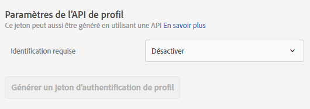
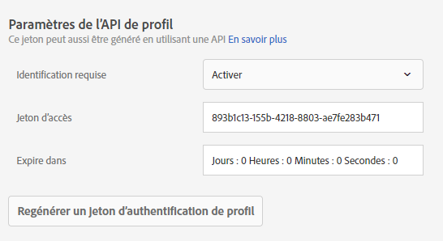

# Paramètres de l’API de profil

Activez ou désactivez l’authentification pour les mises à jour par lots via les API Adobe Target et générez un jeton d’authentification de profil.

[!DNL Adobe Target] crée et gère un profil pour chaque utilisateur. This profile is stored on the [!DNL Target] edge cluster and is updated in real time after every visit; however, you can update a profile individually or in bulk via API.

Pour plus de sécurité, vous pouvez exiger que l’appel de l’API de mise à jour en masse requiert qu’un jeton d’accès valide soit transmis dans l’en-tête de la demande.

**Pour exiger une authentification et générer un jeton d’accès à l’aide de l’interface utilisateur de Target :**

1. Cliquez sur **[!UICONTROL Administration]** > **[!UICONTROL Implémentation]**.
1. Sous API **[!UICONTROL de]** Profil, faites glisser la bascule **[!UICONTROL Exiger l’authentification]** pour passer à la position activée ou désactivée.

   

1. (Conditional) If you enabled authentication requirements, click **[!UICONTROL Generate New Profile Authentication Token]**.

   

   Le jeton expire selon l’heure indiquée dans la zone [!UICONTROL Expire dans].

   Vous devez disposer de l’une des autorisations d’utilisateur suivantes pour générer un jeton d’authentification :

   * Au moins l&#39;autorisation [!UICONTROL Editeur] (ou [!UICONTROL Approbateur])

      Pour plus d’informations pour [!DNL Target Standard] les clients, voir [Définition de rôles et d’autorisations](/help/administrating-target/c-user-management/c-user-management/user-management.md#roles-permissions) dans *Utilisateurs*. Pour plus d’informations pour [!DNL Target Premium] les clients, voir [Configuration des autorisations](/help/administrating-target/c-user-management/property-channel/properties-overview.md)d’entreprise.

   * Rôle d’administrateur au niveau de l’espace de travail/du profil de produit

      Les espaces de travail sont disponibles uniquement pour [!DNL Target Premium] les clients. For more information, see [Configure enterprise permissions](/help/administrating-target/c-user-management/property-channel/properties-overview.md).

   * Droits d’administration (autorisation Sysadmin) au niveau du [!DNL Adobe Target] produit
   >[!NOTE]
   >
   >Vous pouvez également générer un jeton d’authentification de profil via l’API. Pour plus d’informations, voir [Profiles](https://developers.adobetarget.com/api/#profiles) sur le [site web Adobe Target Developers](https://developers.adobetarget.com/).

1. Copiez le jeton et insérez-le dans l’en-tête de la demande au format « Autorisation » : « Support ».

Click [!UICONTROL Generate New Profile Authentication Token] to regenerate the token as needed.

>[!IMPORTANT]
>
>La réinitialisation de ce jeton entraîne l’échec des appels d’API utilisant le jeton actuel. Vous devez, de ce fait, mettre à jour tous les scripts ou applications utilisant ce jeton.
