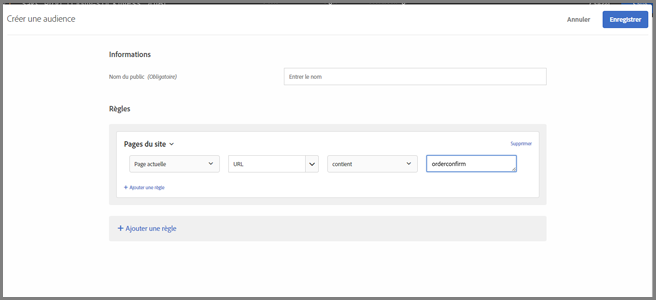
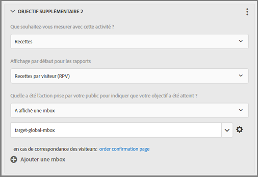

# Questions fréquentes relatives aux mbox globales{#global-mbox-frequently-asked-questions}

Liste des questions fréquentes (FAQ) relatives aux mbox globales.

## Puis-je disposer de plusieurs mbox globales si mon compte Target est défini sur plusieurs domaines ?{#section_B7252BA6C3BB4EF4AE9E53F47FD58ABD}

Une seule mbox globale est prise en charge pour l’ensemble du compte.

Vous pouvez limiter l’exécution des activités en ajoutant des règles d’URL à ces dernières. Pour plus d’informations, voir [Inclure la même expérience sur des pages similaires](/help/c-experiences/c-visual-experience-composer/temtest.md#task_2539D51A18044F82B0D9895636546781).

Vous pouvez également transmettre un paramètre sur la page à l’aide de [targetPageParams](/help/c-implementing-target/c-implementing-target-for-client-side-web/targetpageparams.md), puis sélectionner ces paramètres dans la section « Configurer l’URL » du [!UICONTROL Compositeur d’expérience visuelle] (VEC) ou en ajoutant les paramètres comme « ajustements » dans le compositeur d’expérience basé sur les formulaires.

## Comment puis-je transférer des données sur les recettes à une mbox globale Target ?{#section_17AEA933BADA4D169CCEDF5833C41306}

Pour collecter des informations sur les recettes et les commandes dans la mbox target-global-mbox, les « paramètres de mbox » doivent être envoyés à Target. Ces paramètres sont des paires de nom/valeur utilisées pour envoyer des informations supplémentaires à Target. Target recherche automatiquement ces paramètres (noms réservés) pour renseigner les données de recettes.

Pour le `orderConfirmPage`, vous devez passez en `orderId`, `orderTotal` et `productPurchasedId`. Pour plus d’informations, voir [Création d’une mbox de confirmation de commande - mbox.js](/help/c-implementing-target/c-implementing-target-for-client-side-web/t-mbox-download/orderconfirm-create.md#task_0036D5F6C062442788BB55E872816D82).

Les mêmes paramètres doivent être envoyés à la mbox target-global-mbox via `targetPageParams()`. Pour plus d’informations, voir [Transfert de paramètres à une mbox globale](/help/c-implementing-target/c-implementing-target-for-client-side-web/t-mbox-download/c-understanding-global-mbox/pass-parameters-to-global-mbox.md#concept_33362A04146C4E3C8E7089B65F38B5E5).

Vous souhaiterez également ajouter le ciblage à la fonction de conversion afin que Target décompte les conversions de la mbox target-global-mbox seulement lorsque la page de confirmation de la commande s’affiche, comme illustré ci-dessous :

La section Pages du site illustrée ci-dessus comporte les sélections suivantes : Page actuelle, URL, contient, orderconfirm.

Les options de l’illustration ci-dessus incluent les paramètres suivants :

* **Que souhaitez-vous mesurer avec cette activité ? :** Recettes
* **Affichage par défaut pour les rapports :** Recettes par visiteur (RPV)
* **Quelle action a été entreprise par votre audience pour indiquer que votre objectif a été atteint ?** A affiché une mbox, target-global-mbox