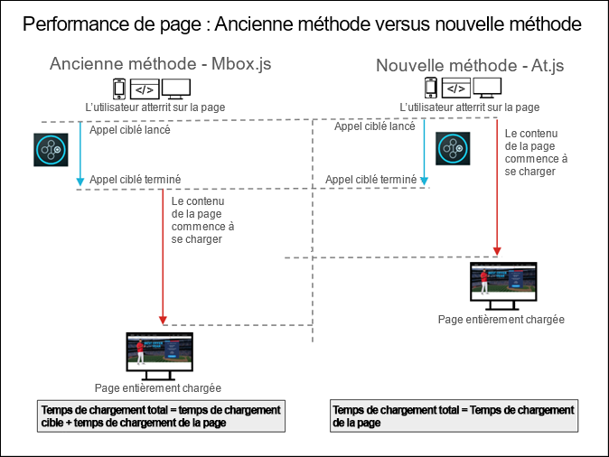

# Forum aux questions sur at.js{#at-js-frequently-asked-questions}

Réponses aux questions fréquentes sur at.js.

## Quels sont les avantages d’utiliser at.js au lieu de mbox.js ?{#section_FE30D01A577C46ACB0F787B85F5E0F6B}

Bien que [!DNL at.js] remplace [!DNL mbox.js], [!DNL mbox.js] reste prise en charge. Pour la plupart des utilisateurs, [!DNL at.js] offre cependant des avantages en comparaison de [!DNL mbox.js].

Autres avantages : [!DNL at.js] réduit les délais de chargement des pages pour les implémentations web, renforce la sécurité et offre des options d’implémentation optimisées pour les applications d’une seule page.

Le diagramme suivant illustre les performances de chargement de page avec mbox.js et at.js.



Comme illustré ci-dessus, avec mbox.js, le contenu de la page ne commence à charger qu’une fois l’appel de [!DNL Target] terminé. Avec at.js, le contenu de la page commence à charger dès que l’appel de [!DNL Target] est initié, sans attendre qu’il soit terminé.

## Quel est l’impact de at.js et mbox.js sur le temps chargement de la page ? {#page-load}

Bon nombre de clients et de consultants souhaitent connaître l’impact d’[!DNL at.js] et de [!DNL mbox.js] sur le délai de chargement des pages, particulièrement en ce qui concerne les nouveaux utilisateurs et les utilisateurs réguliers. Il est, malheureusement, difficile de mesurer l’influence d’[!DNL at.js] ou de [!DNL mbox.js] sur le délai de chargement des pages et d’avancer des chiffres concrets en raison de l’implémentation de chaque client.

Toutefois, si l’API visiteur est présente sur la page, nous pouvons mieux comprendre comment [!DNL at.js] et [!DNL mbox.js] influencent le délai de chargement des pages.

>[!NOTE]
>
>L’API visiteur et [!DNL at.js] ou [!DNL mbox.js] ont un impact sur le délai de chargement des pages uniquement lorsque vous utilisez la mbox globale (en raison de la technique de masquage du corps). Les mboxes régionales ne sont pas impactées par l’intégration de l’API visiteur.

Les sections suivantes décrivent la séquence d’actions pour les nouveaux visiteurs et les visiteurs récurrents :

### Nouveaux visiteurs

1. L’API visiteur est chargée, analysée et exécutée.
1. at.js / mbox.js est chargé, analysé, puis exécuté.
1. Si la fonction de création automatique de mbox globale est activée, la bibliothèque JavaScript de Target :

   * instancie l’objet visiteur ;
   * la bibliothèque Target tente de récupérer les données de l’identifiant visiteur Experience Cloud ;
   * vu qu’il s’agit d’un nouveau visiteur, l’API visiteur déclenche une requête inter-domaines sur demdex.net.
   * Une fois les données de l’identifiant de visiteur Experience Cloud récupérée, une requête est déclenchée sur Target.

### Visiteurs récurrents

1. L’API visiteur est chargée, analysée et exécutée.
1. at.js / mbox.js est chargé, analysé, puis exécuté.
1. Si la fonction de création automatique de mbox globale est activée, la bibliothèque JavaScript de Target :

   * instancie l’objet visiteur ;
   * la bibliothèque Target tente de récupérer les données de l’identifiant visiteur Experience Cloud ;
   * l’API visiteur récupère les données du cookies ;
   * Une fois les données de l’identifiant de visiteur Experience Cloud récupérée, une requête est déclenchée sur Target.

>[!NOTE]
>
>Pour les nouveaux visiteurs, si l’API visiteur est présente, Target doit se connecter plusieurs fois pour s’assurer que les requêtes Target contiennent les données de l’identifiant de visiteur Experience Cloud. Pour les visiteurs réguliers, Target se connecte uniquement pour récupérer le contenu personnalisé.

## Pourquoi les temps de réponse semblent-ils plus lents après la mise à niveau d’une version précédente d’at.js vers la version 1.0.0 ?{#section_DFBA5854FFD142B49AD87BFAA09896B0}

[!DNL at.js] version 1.0.0 (et ultérieure) déclenche toutes les demandes en parallèle. Les versions précédentes exécutent les demandes de manière séquentielle, ce qui signifie que les demandes sont placées en file d’attente et que Target attend que la première demande se termine avant de passer à la suivante.

La façon dont les versions précédentes d’[!DNL at.js] exécutent les demandes est sujette au « blocage d’en-tête de ligne ». Dans [!DNL at.js] version 1.0.0 et ultérieure, Target est passé à l’exécution de demandes parallèles.

Si vous consultez par exemple la cascade de l’onglet réseau pour [!DNL at.js] 0.9.1, vous verrez que la demande Target suivante ne démarre pas tant que la précédente n’est pas terminée. Ce n’est pas le cas avec [!DNL at.js] version 1.0.0 et ultérieure, où toutes les demandes démarrent en même temps.

En termes de temps de réponse, mathématiquement, ce concept peut se résumer comme ceci :

<ul class="simplelist"> 
 <li> at.js 0.9.1 : temps de réponse de toutes les demandes Target = somme des temps de réponse des demandes </li> 
 <li> at.js 1.0.0 et versions ultérieures : temps de réponse de toutes les demandes Target = maximum du temps de réponse des demandes </li> 
</ul>

Comme vous pouvez le constater, [!DNL at.js] 1.0.0 traite les demandes plus rapidement. En outre, les demandes [!DNL at.js] sont asynchrones, de sorte que Target ne bloque pas le rendu de la page. Même si le traitement des demandes ne prend que quelques secondes, la page rendue sera toujours visible, mais certaines parties de la page seront masquées jusqu’à ce que Target reçoive une réponse de Target Edge.

## Puis-je charger la bibliothèque Target de manière asynchrone ?{#section_AB9A0CA30C5440C693413F1455841470}

La version 1.0.0 d’at.js permet de charger la bibliothèque Target de manière asynchrone.

Pour charger at.js de manière asynchrone, procédez comme suit :

* L’approche recommandée est par le biais d’un gestionnaire de balises tel qu’Adobe Launch ou Adobe Dynamic Tag Manager (DTM). See the [Add Adobe Target](https://docs.adobe.com/content/help/en/experience-cloud/implementing-in-websites-with-launch/implement-solutions/target.html) lesson of the [Implementing the Experience Cloud in Websites with Launch](https://docs.adobe.com/content/help/en/experience-cloud/implementing-in-websites-with-launch/index.html) tutorial for more information.
* Vous pouvez également charger at.js de manière asynchrone en ajoutant l’attribut async à la balise du script qui charge at.js. Vous devez utiliser une ligne de code similaire à celle-ci :

   ```
   <script src="<URL to at.js>" async></script>
   ```

* Vous pouvez également charger at.js de manière asynchrone en utilisant le code suivant :

   ```
   var script = document.createElement('script'); 
   script.async = true; 
   script.src = "<URL to at.js>"; 
   document.head.appendChild(script);
   ```

Le chargement d’at.js de manière asynchrone est un excellent moyen d’éviter de bloquer le rendu du navigateur. Cependant, cette technique peut entraîner un scintillement de la page web.

Vous pouvez éviter le scintillement à l’aide d’un extrait de code prémasqué qui masque la page (ou les portions spécifiées), puis la révèle après le chargement complet d’at.js et de la requête globale. Vous devez ajouter le fragment de code avant le chargement d’at.js.

If you are deploying at.js through an asynchronous Launch implementation, be sure to include the pre-hiding snippet directly on your pages, before the Launch Embed code, as described in the [Add the Target Pre-Hiding Snippet](https://docs.adobe.com/content/help/en/experience-cloud/implementing-in-websites-with-launch/implement-solutions/target.html#add-the-target-pre-hiding-snippet) section of the [Implementing the Experience Cloud in Websites with Launch tutorial](https://docs.adobe.com/content/help/en/experience-cloud/implementing-in-websites-with-launch/index.html).

Si vous déployez at.js par le biais d’une implémentation synchrone de la gestion dynamique des balises, le fragment de code prémasqué peut être ajouté au moyen d’une règle de chargement de page déclenchée en haut de la page.

Pour plus d’informations, voir [Comment at.js gère le scintillement](/help/c-implementing-target/c-implementing-target-for-client-side-web/c-how-atjs-works/manage-flicker-with-atjs.md).

## at.js est-il compatible avec l’intégration d’Adobe Experience Manager (AEM) ?{#section_6177AE10542344239753764C6165FDDC}

[!DNL Adobe Experience Manager] 6.2 avec FP-11577 (ou ultérieur) prend maintenant en charge [!DNL at.js] les implémentations avec son intégration des [!UICONTROL Services Cloud Adobe Target]. Pour plus d’informations, reportez-vous aux sections [Feature Packs](https://docs.adobe.com/docs/en/aem/6-2/release-notes/feature-packs.html) et [Intégration à Adobe Target](https://docs.adobe.com/docs/en/aem/6-2/administer/integration/marketing-cloud/target.html) de la documentation d’*Adobe Experience Manager 6.2*.

## Comment empêcher le scintillement au chargement des pages avec at.js ?{#section_4D78AAAE73C24E578C974743A3C65919}

Target propose plusieurs solutions pour éviter le scintillement au chargement des pages. Pour plus d’informations, voir [Prévention du scintillement avec at.js](/help/c-implementing-target/c-implementing-target-for-client-side-web/c-how-atjs-works/manage-flicker-with-atjs.md#concept_AA168574397D4474B993EEAB90865EBA).

## Quelle est la taille de fichier d’at.js ?{#section_6A25C9A14C66441785A7635FEF5C4475}

Le fichier at.js fait environ 109 Ko une fois téléchargé. Cependant, comme la plupart des serveurs compressent automatiquement les fichiers pour les rendre plus légers, at.js ne fait plus que 34 Ko environ une fois compressé (avec GZIP ou une autre méthode) sur votre serveur et chargé lorsque des utilisateurs visitent votre site web. Les paramètres de compression du serveur sur lequel vous avez installé at.js déterminent sa taille réelle après compression.

## Pourquoi le fichier at.js est-il plus volumineux que le fichier mbox.js ?{#section_AA1C43897E46448FA3E26EEC10ED7E51}

Les implémentations at.js utilisent une seule bibliothèque ([!DNL at.js]), tandis que les implémentations mbox.js en utilisent réellement deux ([!DNL mbox.js] et [!DNL target.js]). Il serait donc préférable donc de comparer at.js à mbox.js *et* `target.js`. Si l’on compare la taille des fichiers gzip des deux versions, at.js version 1.2 fait 34 Ko, tandis mbox.js version 63 fait 26,2 Ko. ``

Le fichier at.js est plus volumineux, car il effectue beaucoup plus d’analyses DOM que le fichier mbox.js, du fait que le fichier at.js doit interpréter les données « brutes » qu’il récupère dans la réponse JSON. mbox.js utilise `document.write()` et toute l’analyse est effectuée par le navigateur.

Malgré une taille de fichier plus importante, nos tests démontrent que les pages se chargent plus rapidement avec at.js qu’avec mbox.js. En outre, at.js offre une sécurité accrue, car il ne charge pas de fichiers supplémentaires de manière dynamique ni n’utilise `document.write`.

## at.js inclut-il jQuery ? Puis-je supprimer cette partie du fichier at.js si jQuery figure déjà dans mon site web ?{#section_E4604E46E7B34460B8DD6A78D9B476F9}

Actuellement, at.js utilise des portions de jQuery ; c’est pourquoi l’avis de licence MIT s’affiche en haut du fichier at.js. jQuery n’est pas exposé et n’interfère pas avec la bibliothèque jQuery déjà présente sur votre page, qui peut être d’une autre version. Il n’est pas possible de supprimer le code jQuery dans at.js.

## at.js prend-il en charge Safari et un interdomaine défini sur x-uniquement ?{#section_114EC271A6E045E1B2183B66F1B71285}

Non, si le suivi interdomaine est défini sur x-uniquement et que les cookies tiers sont désactivés dans Safari, [!DNL mbox.js] et at.js définiront un cookie désactivé et aucune demande de mbox ne sera exécutée pour le domaine de ce client spécifique.

Pour prendre en charge les visiteurs Safari, il convient d’avoir un x-domaine « désactivé » (définit uniquement un cookie propriétaire) ou « activé » (définit un cookie propriétaire sur Safari, ainsi que des cookies propriétaires et tiers sur les autres navigateurs).

## Puis-je exécuter at.js et mbox.js côte à côte ?{#section_4DCAF38DBAEB430CA486FAEFAE0E0A29}

Non, pas sur une même page. Toutefois, pendant l’implémentation et le test [!DNL at.js], vous pouvez exécuter [!DNL at.js] sur certaines pages et [!DNL mbox.js] sur d’autres jusqu’à ce que soit [!DNL at.js] entièrement validé.

## Puis-je utiliser le compositeur d’expérience visuelle de Target dans mes applications d’une seule page ?{#section_459C1BEABD4B4A1AADA6CF4EC7A70DFB}

Oui, vous pouvez utiliser le VEC pour votre SPA si vous utilisez at.js 2.x. Pour plus d’informations, voir [Page unique (SPA) du Compositeur d’expérience visuelle](/help/c-experiences/spa-visual-experience-composer.md).

## Puis-je utiliser le débogueur Adobe Experience Cloud avec les implémentations d’at.js ?{#section_FF3CF4C5FD2F4DB1BF1A6B39DA161637}

Oui. Vous pouvez également utiliser mboxTrace à des fins de débogage ou les outils de développement de votre navigateur pour inspecter les demandes de réseau, en filtrant sur « mbox » pour isoler les appels mbox.

## Puis-je utiliser des caractères spéciaux dans les noms mbox avec at.js ?{#section_8E31D2E8A27642098934D7DACFB2A600}

Oui, comme avec mbox.js.

## Pourquoi mes mbox ne se déclenchent-elles pas sur mes pages web ?{#section_4BA5DA424B734324AAB51E4588FA50F5}

Les clients de utilisent parfois des instances basées sur le cloud avec [!DNL Target]Target à des fins de test ou de preuve de concept. Ces domaines, et de nombreux autres, font partie de la [liste des suffixes publics](https://publicsuffix.org/list/public_suffix_list.dat).

Les navigateurs modernes n’enregistrent pas les cookies si vous utilisez ces domaines, sauf si vous personnalisez le paramètre `cookieDomain` à l’aide de targetGlobalSettings(). Pour plus d’informations, voir [Utilisation d’instances basées sur un cloud avec Target](/help/c-implementing-target/c-implementing-target-for-client-side-web/c-target-debugging-atjs/targeting-using-cloud-based-instances.md#concept_A2077766948F4EA081CE592D8998F566).

## Les adresses IP peuvent-elles être utilisées comme domaine de cookie lors de l’utilisation d’at.js ?{#section_8BEEC91A3410459D9E442840A3C88AF7}

Assurez-vous que vous utilisez la [version at.js 1.2 ou ultérieure](/help/c-implementing-target/c-implementing-target-for-client-side-web/target-atjs-versions.md#reference_DBB5EDB79EC44E558F9E08D4774A0F7A). Néanmoins, il est vivement recommandé de rester à jour avec la dernière version.

>[!NOTE]
>
>Remarque : Les exemples suivants ne sont pas nécessaires si vous utilisez la version 1.2 ou ultérieure d’at.js.

Remarque : En fonction de votre utilisation de [targetGlobalSettings](/help/c-implementing-target/c-implementing-target-for-client-side-web/targetgobalsettings.md), vous devrez peut-être apporter des modifications supplémentaires au code après le téléchargement d’at.js. Par exemple, si vous avez besoin de paramètres légèrement différents pour vos mises en œuvre [!DNL Target] sur plusieurs sites web et que vous ne parvenez pas à définir ces paramètres dynamiquement à l’aide d’un code JavaScript personnalisé, effectuez ces personnalisations manuellement après avoir téléchargé le fichier et avant de le transférer vers le site web correspondant.

Les exemples suivants permettent d’utiliser la fonction `targetGlobalSettings()` d’at.js pour insérer un fragment de code permettant de prendre en charge les adresses IP.

Cet exemple concerne une adresse IP unique :

```
if (window.location.hostname === '123.456.78.9') { 
    window.targetGlobalSettings = window.targetGlobalSettings || {}; 
    window.targetGlobalSettings.cookieDomain = window.location.hostname; 
}
```

Cet exemple concerne une plage d’adresses IP :

```
if (/^123\.456\.78\..*/g.test(window.location.hostname)) { 
    window.targetGlobalSettings = window.targetGlobalSettings || {}; 
    window.targetGlobalSettings.cookieDomain = window.location.hostname; 
}
```

## Pourquoi des messages d’avertissement du type « Actions avec sélecteurs manquants » s’affichent-ils ? {#section_C36BED5B16634361A1BA46FCB731489D}

Ces messages ne sont pas liés à la fonctionnalité [!DNL at.js]. La bibliothèque [!DNL at.js] tente de signaler tout ce qui est introuvable dans l’élément DOM.

L’affichage de ce message d’avertissement peut s’expliquer par les causes suivantes :

* La page est générée de manière dynamique et at.js ne trouve pas l’élément.
* La page est générée lentement (en raison d’un réseau lent) et at.js ne trouve pas le sélecteur dans le modèle DOM.
* La structure de la page sur laquelle s’exécute l’activité a été modifiée. Si vous rouvrez l’activité dans le compositeur d’expérience visuelle (VEC), un message d’avertissement s’affiche. Mettez à jour l’activité afin que tous les éléments nécessaires soient détectés.
* La page sous-jacente fait partie d’une application d’une seule page ou la page contient des éléments qui apparaissent plus bas dans la page et le « mécanisme d’interrogation des sélecteurs » [!DNL at.js] ne parvient pas à trouver ces éléments. Augmenter le `selectorsPollingTimeout` peut aider. Pour plus d’informations, voir [targetGlobalSettings()](/help/c-implementing-target/c-implementing-target-for-client-side-web/targetgobalsettings.md).
* Les mesures de suivi des clics tentent de s’ajouter à chaque page, indépendamment de l’URL à laquelle elles ont été configurées. Bien que sans danger, cette situation entraîne l’affichage répété de ces messages.

   Pour des résultats optimaux, téléchargez et utilisez la dernière version d’[!DNL at.js]. Pour plus d’informations, consultez les [Détails de la version at.js](/help/c-implementing-target/c-implementing-target-for-client-side-web/target-atjs-versions.md#reference_DBB5EDB79EC44E558F9E08D4774A0F7A) et le [Téléchargement d’at.js](/help/c-implementing-target/c-implementing-target-for-client-side-web/how-to-deployatjs/implementing-target-without-a-tag-manager.md#concept_1E1F958F9CCC4E35AD97581EFAF659E2).

## À quoi correspond le domaine tt.omtrdc.net auquel les appels au serveur Target sont adressés ?{#section_999C29940E8B4CAD8A957A6B1D440317}

[!DNL tt.omtrdc.net] est le nom de domaine du réseau EDGE d’Adobe utilisé pour recevoir tous les appels au serveur pour Target.

## Pourquoi at.js et mbox.js n’utilisent-ils pas les indicateurs de cookie HttpOnly et Secure ?{#section_74527E3B41B54B0A83F217C3E664ED1F}

HttpOnly ne peut être défini que via un code côté serveur. Les cookies Target, tels que mbox, étant créés et enregistrés via le code JavaScript, Target ne peut pas utiliser l’indicateur de cookie HttpOnly.

Secure ne peut être défini que via JavaScript lorsque la page a été chargée via HTTPS. Si la page se charge initialement via HTTP, JavaScript ne peut pas définir cet indicateur. En outre, si l’indicateur Secure est utilisé, le cookie sera disponible uniquement sur les pages HTTPS.

Pour vous assurer que Target peut assurer un suivi correct des utilisateurs, et parce que les cookies sont générés côté client, Target n’utilise aucun de ces indicateurs.

## À quelle fréquence la bibliothèque at.js déclenche-t-elle une demande de réseau ? {#section_57C5235DF7694AF093A845D73EABADFD}

Toutes les prises de décision d’Adobe Target se font côté serveur. Cela signifie que at.js déclenche une demande de réseau à chaque rechargement de page, ou qu’une API publique de at.js est appelée.

## Dans le meilleur des cas, peut-on espérer que l’utilisateur ne subisse pas d’effets visibles liés au masquage, au remplacement et à l’affichage de contenu lors du chargement d’une page ?{#section_CB3C566AD61F417FAC0EC5AC706723EB}

at.js tente d’éviter le pré-masquage de l’ensemble HTML BODY ou autres éléments DOM pendant une durée prolongée, mais cela dépend des conditions du réseau et de la configuration des activités. at.js fournit [des paramètres](/help/c-implementing-target/c-implementing-target-for-client-side-web/targetgobalsettings.md) pouvant être utilisés pour personnaliser BODY en masquant le style CSS. Par exemple, au lieu de masquer entièrement l’ensemble HTML BODY, vous pouvez pré-masquer certaines parties de la page. On s’attend à ce que ces parties contiennent des éléments DOM à « personnaliser ».

## Quelle est le déroulement des événements dans une situation type, dans laquelle un utilisateur est admissible pour une activité ? {#section_56E6F448E901403FB77DF02F44C44452}

La requête at.js est une requête `XMLHttpRequest` asynchrone. Les étapes exécutées sont donc les suivantes :

1. La page charge.
1. at.js pré-masque l’ensemble HTML BODY. Il existe un paramètre qui permet de pré-masquer un conteneur plutôt que l’ensemble HTML BODY.
1. La bibliothèque at.js déclenche une demande.
1. Une fois la réponse de Target reçue, Target extrait les sélecteurs CSS.
1. Grâce aux sélecteurs CSS, Target crée des balises de style pour pré-masquer les éléments DOM qui seront personnalisés.
1. Le style de pré-masquage de l’ensemble HTML BODY est supprimé.
1. Target lance l’interrogation pour les éléments DOM.
1. Si Target trouve un élément DOM, des modifications sont apportées au modèle DOM et le style de pré-masquage de l’élément supprimé.
1. Si Target ne trouve pas d’élément DOM, un délai d’attente global retire le masquage des éléments, afin d’éviter de faire face à une page cassée.

## À quelle fréquence le contenu des pages est-il complètement chargé et visible, lorsque at.js finit par retirer le masquage de l’élément modifié par l’activité ?{#section_01AFF476EFD046298A2E17FE3ED85075}

Dans le cas ci-dessus, à quelle fréquence le contenu des pages est-il complétement chargé et visible, lorsque at.js fini par retirer le masquage de l’élément modifié par l’activité ? Autrement dit, la page est entièrement visible, excepté le contenu de l’activité, qui apparaît légèrement après le reste du contenu.

at.js ne bloque pas le rendu de la page. L’utilisateur peut apercevoir certaines zones vides dans la page, représentant les éléments qui seront personnalisés par Target. Si le contenu qui doit être appliqué contient peu d’actifs distants, tels que des scripts et des images, tout devrait être rendu rapidement.

## Quel serait l’impact d’une page entièrement en cache dans le cas ci-dessus ? Le contenu de l’activité aurait-il plus de chance d’être visible une fois le reste du contenu de la page chargé ? {#section_CE76335A3E0B41CB8253DEE5E060FCDA}

Si une page est en cache sur un réseau de diffusion de contenu proche de l’emplacement géographique de l’utilisateur, mais loin du serveur Target Edge, le délai risque d’être un peu plus long. Les serveurs Target Edge sont bien répartis autour du globe, ce n’est donc pas un problème la plupart du temps.

## Est-il possible que la bannière principale s’affiche, puis change après un court instant ? {#section_C25B07B25B854AAE8DEE1623D0FA62A3}

Dans le cas suivant :

Le délai d’attente de Target est de cinq secondes. Un utilisateur charge une page qui a une activité afin de personnaliser une image principale. at.js envoie une requête pour déterminer s’il faut appliquer une activité, mais dans un premier temps, ne reçoit pas de réponse. On considère que l’utilisateur consulte le contenu de l’image principale, car Target n’a pas envoyé de réponse pour savoir si oui ou non une activité y est associée. Au bout de quatre secondes, Target envoie une réponse avec le contenu de l’activité.

À ce stade, est-il possible d’afficher la version alternative ? Donc, après les quatre secondes, l’image principale a pu changer et l’utilisateur a pu remarquer ce changement ?

Initialement, l’élément DOM de l’image principale est masqué. Une fois la réponse de Target reçue, at.js apporte les modifications aux éléments DOM, comme le changement d’image, et affiche l’image principale personnalisée.

## Quel doctype HTML at.js requiert-il ?

at.js requiert le doctype HTML 5.

Cette syntaxe est la suivante :

`<!DOCTYPE html>`

Le doctype HTML 5 garantit le chargement de la page en mode standard. Lors du chargement en mode quirks, certaines API JS dont le fichier at.js dépend sont désactivées. Target désactive at.js en mode quirks.
