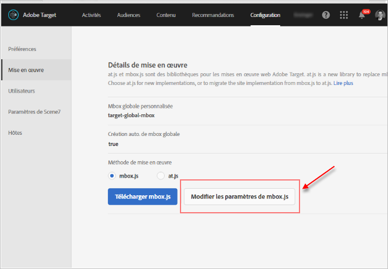
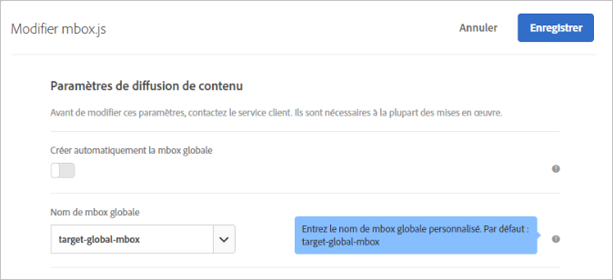
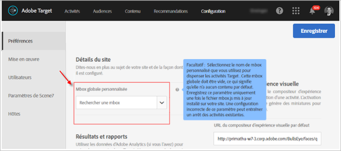

# Personnalisation d’une mbox globale{#customize-a-global-mbox}

Informations vous aidant à personnaliser une mbox globale pour at.js et mbox.js.

1. Modification de mbox.js.

   Go to **[!UICONTROL Target]** > **[!UICONTROL Administration]** > **[!UICONTROL Implementation]**.

   * Pour mbox.js, cliquez sur **[!UICONTROL Modifier les paramètres de mbox.js]**.
   * Pour [!DNL at.js], sélectionnez **[!UICONTROL at.js]** sous la méthode d’implémentation, puis cliquez sur **[!UICONTROL Modifier les paramètres at.js]**.

   

1. Modifiez [!DNL mbox.js] ou [!DNL at.js].

   Désactivez **[!UICONTROL Créer automatiquement la mbox globale]**, puis ajoutez le nom de la mbox globale personnalisée que vous souhaitez utiliser pour diffuser des activités à partir de [!DNL Target Standard/Premium]. Cette mbox globale personnalisée est également utilisée pour le suivi des clics.

   

   Cliquez sur **[!UICONTROL Enregistrer]** lorsque vous avez terminé.
1. Implémentez la bibliothèque [!DNL mbox.js] ou [!DNL at.js] sur votre site.

* Pour mbox.js, voir [Implémentation de mbox.js](../../../../c-implementing-target/c-implementing-target-for-client-side-web/t-mbox-download/mbox-download.md#task_4EAE26BB84FD4E1D858F411AEDF4B420).
* Pour at.js, voir [Implémentation d’at.js](../../../../c-implementing-target/c-implementing-target-for-client-side-web/t-mbox-download/c-target-atjs-implementation/target-atjs-implementation.md#concept_8AC8D169E02944B1A547A0CAD97EAC17).

1. Synchronisation de la transition avec votre publication.

   Dès que vous êtes prêt à ce que [!DNL Target Standard/Premium] utilise votre mbox globale pour toutes les activités à venir, vous pouvez effectuer cette étape.

   Mettez à jour le nom de la mbox globale personnalisée afin qu’il corresponde au nom utilisé dans l’étape 2 ci-dessus.

   

   >[!IMPORTANT]
   >
   >Lors de l’enregistrement, toutes les activités de votre compte sont synchronisées avec cette mbox. Si elle ne se trouve pas sur votre site, toutes les activités cesseront de fonctionner.

   Cliquez sur **[!UICONTROL Enregistrer]**.
