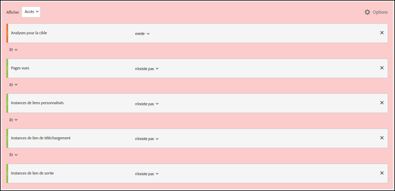

# Minimisation du nombre de visiteurs ou de visites exagéré dans A4T{#minimizing-inflated-visit-and-visitor-counts-in-a-t}.

Informations destinées à vous aider à minimiser les effets d’un nombre de visiteurs ou de visites exagéré lors de l’utilisation d’Analytics comme source de création de rapports.

>[!IMPORTANT]
>Le 14 novembre 2016, Adobe Analytics a modifié la façon dont certaines données sont traitées pour les clients qui utilisent la création de rapports Analytics pour Target (A4T). Ces modifications améliorent l’alignement entre les données Adobe Target et le modèle de données d’Adobe Analytics. Ces modifications ont été déployées pour tous les clients utilisant A4T. Ces modifications ont pour but de résoudre un problème en raison duquel certains clients ont remarqué un nombre de visiteurs exagéré lors de l’exécution d’activités Target.
>
>Notez que cette modification n’est pas rétroactive. Si vos rapports historiques indiquent des nombres exagérés et que vous souhaitez les exclure de vos rapports, vous pouvez créer une suite de rapports virtuelle, comme expliqué ci-dessous.
>
>Par ailleurs, plusieurs bibliothèques JavaScript ont été mises à jour afin de minimiser les nombres de visites ou de visiteurs exagérés. Nous vous recommandons de mettre les bibliothèques à niveau vers les versions de bibliothèque suivantes (ou ultérieures) :
>
>* Service d’identification des visiteurs d’Experience Cloud : visitorAPI.js version 2.3.0 ou ultérieure.
>* Adobe Analytics : appMeasurement.js version 2.1.
>* Adobe Target : at.js version 0.9.6 ou ultérieure (à l’exception de la version 1.1.0 si vous utilisez les offres de redirection avec A4T).

>
>  
La bibliothèque mbox.js ne prend pas en charge les offres de redirection avec A4T. Votre mise en œuvre doit utiliser at.js.

## Qu’est-ce qui a changé ? {#section_9CCF45F5D66D48EBA88F3A178B27D986}

Lorsqu’[!DNL Adobe Analytics] est utilisé pour mesurer les activités [!DNL Target] (sous le nom A4T), [!DNL Analytics] collecte des données supplémentaires qui ne sont pas disponibles lorsqu’il n’y a pas d’activité [!DNL Target] sur la page. Cela est dû au fait que l’activité [!DNL Target] déclenche un appel en haut de la page, tandis qu’[!DNL Analytics] déclenche généralement ses appels de collecte de données au bas de la page. Dans l’implémentation d’A4T actuelle, nous avons inclus ces données supplémentaires chaque fois qu’une activité [!DNL Target] était active. À l’avenir, nous inclurons ces données supplémentaires uniquement en cas de déclenchement des balises [!DNL Target] et [!DNL Analytics].

## Pourquoi Adobe a-t-il apporté cette modification ?{#section_92380A4BD69E4B8886692DD27540C92A}

Adobe se targue de la précision et de la qualité de ses données. Lorsque la balise [!DNL Target] se déclenche mais que la balise [!DNL Analytics] ne se déclenche pas, nous enregistrons des « données partielles » (parfois appelées « accès désassemblés »), qui ne seraient pas capturées par [!DNL Analytics] en l’absence d’activité [!DNL Target]. Si l’inclusion des données partielles dans les rapports [!DNL Analytics] fournit des informations supplémentaires, elle crée également des incohérences par rapport aux données historiques des périodes où aucune activité [!DNL Target] n’était active. Cela peut être source de problèmes pour les utilisateurs d’[!DNL Analytics] qui analysent les tendances qui se dégagent au fil du temps. Afin d’assurer la cohérence des données dans [!DNL Analytics], nous allons supprimer toutes les données partielles.

## Qu’est-ce qui contribue aux données partielles ? {#section_C9C906BEAA7D44DAB9D3C03932A2FEB8}

Certains clients enregistrent des taux de données partielles très élevés dans [!DNL Analytics]. Ce phénomène peut être dû à une implémentation incorrecte, mais il existe également des causes légitimes.

Les causes identifiées des données partielles incluent :

* **Alignement incorrect des identifiants de suites de rapports (implémentation) :** la suite de rapports spécifiée lors de la configuration d’une activité ne correspond pas à la suite de rapports de la page où le test est diffusé. Les données obtenues apparaissent comme partielles parce qu’elles ne peuvent pas être réconciliées sur les serveurs [!DNL Analytics].
* **Pages lentes :** étant donné que les appels [!DNL Target] se trouvent en haut de la page et que les appels [!DNL Analytics] se trouvent généralement au bas de la page, si la page se charge lentement, cela augmente la probabilité qu’un visiteur quitte la page après le déclenchement de l’appel [!DNL Target] mais avant l’appel [!DNL Analytics]. Cela peut s’avérer particulièrement problématique sur les sites web mobiles où les connexions sont souvent plus lentes.
* **Erreurs de page :** en cas d’erreurs JavaScript ou d’autres scénarios où tous les points de contact ne se déclenchent pas (service d’Experience Cloud ID, Target et Analytics), des données partielles sont générées.
* **Offres de redirection dans l’activité [!DNL Target] :** pour les offres de redirection dans les activités utilisant A4T, votre mise en œuvre doit respecter certaines conditions préalables minimales. En outre, vous devez prendre connaissance de certaines informations importantes. Pour plus d’informations, voir [FAQ sur les offres de redirection (A4T)](/help/c-integrating-target-with-mac/a4t/r-a4t-faq/a4t-faq-redirect-offers.md#section_FA9384C2AA9D41EDBCE263FFFD1D9B58).
* **Versions obsolètes des bibliothèques :** au cours de l’année écoulée, Adobe a apporté diverses améliorations à ses bibliothèques JavaScript ([!DNL appMeasurement.js], `at.js/mbox.js`, et `visitorAPI.js`) pour garantir un envoi de données aussi efficace que possible. Pour en savoir plus sur les exigences d’implémentation, voir [Avant l’implémentation](/help/c-integrating-target-with-mac/a4t/before-implement.md#concept_046BC89C03044417A30B63CE34C22543).

## Quelles sont les bonnes pratiques pour réduire les données partielles ?{#section_065C38501527451C8058278054A1818D}

Pour réduire la collecte de données partielles, nous vous recommandons de passer en revue les étapes suivantes dans l’ordre.

| Étape | Tâche |
| --- | --- |
|  | Assurez-vous que la suite de rapports sélectionnée dans [!DNL Target] est identique à celle des pages où l’activité sera présentée. |
|  | Assurez-vous que les bibliothèques visitorAPI.js, appMeasurement.js, at.js / mbox.js se trouvent sur des versions compatibles avec A4T. Pour en savoir plus sur les exigences d’implémentation, voir [Avant l’implémentation](/help/c-integrating-target-with-mac/a4t/before-implement.md). |
|  | Vérifiez que le SDID est défini sur tous les appels [!DNL Target] et [!DNL Analytics] qui quittent la page et que les SDID correspondent. Pour ce faire, utilisez un analyseur de réseau ou un outil de débogage pour vérifier que le paramètre `mboxMCSDID` sur l’appel [!DNL Target] correspond au paramètre SDID de l’appel [!DNL Analytics]. |
|  | Vérifiez que les bibliothèques d’implémentation se chargent dans l’ordre correct sur vos sites. Pour plus d’informations, voir [Implémentation d’Analytics pour Target](/help/c-integrating-target-with-mac/a4t/a4timplementation.md). |

## Comment puis-je voir de combien de données partielles je dispose ?{#section_89B663E2824A4805AB934153508A0F4B}

Ces informations ne sont pas directement disponibles dans [!DNL Analytics], mais vous pouvez contacter l’Assistance clientèle d’Adobe pour obtenir un rapport de données partielles. Ce rapport est destiné à faciliter le débogage.

## Comment puis-je afficher les tendances historiques sans les données partielles ?{#section_4C9DED560FAD4428B362DDA2064897C3}

Dans la mesure où cette modification du traitement des données n’affecte les données qu’après la date de publication (14 novembre 2016), si vous souhaitez ajuster vos mesures historiques pour qu’elles correspondent, nous vous recommandons de créer un segment afin d’exclure les données partielles.

Les informations suivantes relatives à cette modification incluent des instructions destinées à vous aider à définir le segment et à l’appliquer à une suite de rapports virtuelle pour que ce segment soit toujours appliqué à vos vues [!DNL Analytics].

Dans la plupart des cas, un [!DNL Target] accès est associé à un [!DNL Analytics] accès sur chaque page web. Cet assemblage se produit lorsqu’un paramètre SDID cohérent se trouve à la fois dans un appel [!DNL Target] et [!DNL Analytics] et qu’un appel [!DNL Experience Cloud ID] (MCID) se trouve dans un appel [!DNL Analytics] sur la même page. [!DNL Target] dispose également du MCID, mais si l’appel à [!DNL Target] se produit avant le retour de l’ID du visiteur, l’accès sera assemblé en raison du SDID. L’utilisateur peut également rester suffisamment longtemps sur la page pour déclencher un appel [!DNL Analytics] après qu’un appel [!DNL Target] ait été déclenché. Il s’agit du scénario idéal.

**Accès aux données partielles :** les utilisateurs ne restent parfois pas suffisamment longtemps sur une page pour envoyer un [!DNL Analytics] appel, mais [!DNL Target] dispose d’un MCID correct. De ce fait, les accès enregistrent des données partielles (accès sans affichage de la page [!DNL Analytics]). Si ces utilisateurs reviennent sur votre site et affichent une page comportant du code [!DNL Analytics], ils seront probablement comptés en tant que visiteurs récurrents. Ces accès auraient été perdus si la page ne comportait que du code [!DNL Analytics]. Certains clients ne souhaitent pas récupérer les données de ces accès car elles exagèrent certaines mesures (visites) et diminuent d’autres mesures (nombre de pages vues par visite, durée par visite, etc.). Vous verrez également des visites sans aucune page vue. Toutefois, il existe de bonnes raisons de conserver ces données.

Afin de minimiser les accès à données partielles, vous pouvez faire charger votre page plus rapidement, mettre à jour les bibliothèques vers les versions les plus récentes ou créer une [suite de rapports virtuelle](https://experienceleague.adobe.com/docs/analytics/components/virtual-report-suites/vrs-workflow/vrs-create.html) qui exclut ces accès. For step-by-step instructions, see [Create virtual report suites](https://experienceleague.adobe.com/docs/analytics/components/virtual-report-suites/vrs-workflow/vrs-create.html) in the *Analytics Components Guide*.

L’illustration suivante présente la définition de segment pour la suite de rapports virtuelle :

Lors de la création de la suite de rapports virtuelle, spécifiez la configuration suivante pour la définition de segment (comme présenté dans l’illustration ci-dessus) :

* **Afficher les accès :**
* Analytics for Target : Existe
* Et
* Pages vues : N’existe pas
* Et
* Instances de liens personnalisés : N’existe pas
* Et
* Instances de lien de téléchargement : N’existe pas
* Et
* Instances de lien de sortie : N’existe pas

**Accès orphelins :** il arrive parfois que les utilisateurs ne restent pas suffisamment longtemps sur la page pour un appel Analytics et Target n’obtient pas de MCID correct. Ces accès sont ce que nous appelons des « orphelins ». Ils représentent les clients qui reviennent rarement et ils exagèrent le nombre de visites et de visiteurs de manière inappropriée.

Afin de minimiser ces accès « orphelins », vous pouvez créer une [suite de rapports virtuelle](https://experienceleague.adobe.com/docs/analytics/components/virtual-report-suites/vrs-workflow/vrs-create.html) qui exclut ces accès, comme expliqué ci-dessus.

## Quel impact cette modification a-t-elle sur mes [!DNL Target] rapports ? {#section_AAD354C722BE46D4875507F0FCBA5E36}

Une fois cette modification effectuée, vous verrez peut-être une diminution du nombre de visiteurs et de visites dans les tests en direct vu que [!DNL Adobe] ne traitera plus les données partielles entrantes. Les conversions et les accès aux autres mesures [!DNL Analytics] ne connaîtront aucun changement.
