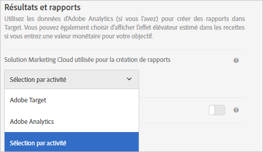

# FAQ sur le paramétrage des activités - A4T

Cette rubrique contient des réponses aux questions fréquentes sur la configuration des activités et l’utilisation de [!DNL Analytics] comme source de rapports pour [!DNL Target] (A4T).

## Quels types d’activités prennent en charge Analytics comme source de création de rapports (A4T) ?{#section_5E4F58CD25A5424E869E6FE0803968EF}

Pour obtenir une liste complète, consultez les « Types d’activité pris en charge » dans [Adobe Analytics en tant que source de création de rapports pour Adobe Target (A4T)](/help/c-integrating-target-with-mac/a4t/a4t.md#concept_7540C8C04259434AB6EE33B09F47A1DE).

## Lors de la configuration de mes mesures d’objectif, pourquoi ne puis-je pas accéder aux paramètres avancés ?

Pour les activités qui utilisent [!DNL Analytics] comme source de rapports (A4T), la mesure d’objectif utilise toujours les paramètres &quot;[!UICONTROL Incrémenter le décompte et laisser l’utilisateur en Activité]&quot; et &quot;[!UICONTROL Sur chaque impression]&quot;. *non* configurable.

Pour plus d’informations, voir &quot;Lors de la configuration de mes mesures d’objectif, pourquoi ne puis-je pas accéder aux options Paramètres avancés ?&quot; dans [Définition des mesures - FAQ sur A4T](/help/c-integrating-target-with-mac/a4t/r-a4t-faq/a4t-faq-metric-definition.md).

## Je viens de créer une activité. Pourquoi n’ai-je accès à aucune donnée ? {#section_9F8092BE4225442896F926540292F221}

Lorsqu&#39;une activité est créée, [!DNL Target] envoie un fichier de classification à [!DNL Analytics]. Bien que [!DNL Analytics] capture et traite les données, elles ne s&#39;affichent pas dans les rapports tant que le fichier de classification n&#39;a pas été mis à jour. Cela peut prendre jusqu’à 24 heures. Si vous n’avez pas accès à vos données après 48 heures, veuillez [contacter le service à la clientèle](/help/cmp-resources-and-contact-information.md#reference_ACA3391A00EF467B87930A450050077C). Sinon, si vous savez que vous allez lancer une activité, vous pouvez créer l’activité quelques jours auparavant et les classifications seront envoyées une fois l’activité sauvegardée. De cette manière, les données apparaissent dans les rapports dès le lancement. Veuillez noter que le traitement des données dans [!DNL Analytics] prend entre 45 et 90 minutes.

## Pourquoi est-ce que je ne parviens pas à sélectionner Analytics comme source de création des rapports lors de la création d’une activité ? {#section_9F4F69C3085F4C2480AF439127EB27CD}

Vous pouvez modifier vos options [!UICONTROL Paramètres de Rapports] dans [!UICONTROL Administration].

1. Dans [!DNL Target], cliquez sur **[!UICONTROL Administration]**.
1. Dans la liste déroulante **[!UICONTROL Solution Experience Cloud utilisée pour la création de rapports]**, cliquez sur **[!UICONTROL Sélection par activité]**.

La liste déroulante **[!UICONTROL Source des rapports]** est activée dans l’écran **[!UICONTROL Objectif et paramètres]** afin de créer et modifier des activités.

Pour toujours utiliser [!DNL Analytics] comme source de rapports, sélectionnez **[!UICONTROL Adobe Analytics]** dans la liste déroulante de [!UICONTROL Administration].

## Un visiteur peut-il basculer entre des expériences ciblées et contrôlées lors de différentes visites dans une activité de Cible automatique qui utilise A4T ?

Ce qui suit est vrai en supposant que le visitorId ne change pas pour un visiteur entre deux visites.

Si le pourcentage d’affectation du trafic est ajusté en activité intermédiaire, il est possible qu’un visiteur puisse passer d’une expérience ciblée à une expérience de contrôle.

Si les pourcentages ne sont pas ajustés en activité moyenne, un visiteur qui voit initialement le contrôle est toujours envoyé au contrôle. Un visiteur envoyé vers des expériences ciblées est toujours envoyé vers des expériences ciblées.

* Après avoir été dans le &quot;compartiment&quot; ciblé du trafic, le visiteur peut être envoyé vers une expérience différente, de la visite à la visite, si les modèles d’apprentissage automatique déterminent qu’une expérience différente est pertinente pour la nouvelle visite.
* Après avoir été affecté au &quot;compartiment&quot; de contrôle du trafic, un visiteur verra toujours la même expérience car l’affectation de l’expérience est basée sur un hachage pseudo-aléatoire déterministe du visitorId du visiteur.
