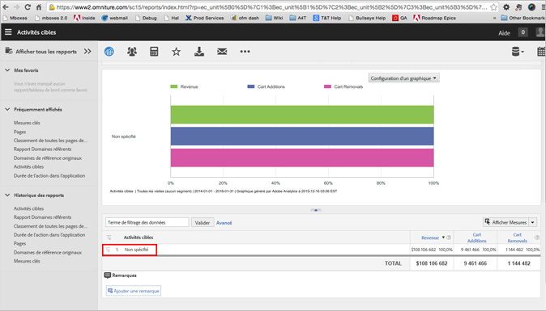

# FAQ sur l’affichage des rapports - A4T{#view-reports-a-t-faq}

Cette rubrique contient des réponses aux questions fréquentes sur l’affichage des rapports lors de l’utilisation d’Analytics comme source de création de rapports pour Target (A4T).

## Quelle est la méthodologie de calcul et comment l’appliquer ?{#section_E9C21C47B5BE4E54BABF0CD7F03D3945}

La méthodologie de comptabilisation spécifie ce que Target utilise comme dénominateur pour les taux de conversion. Les choix sont :

* impressions
* visiteurs
* visites

## Puis-je définir une mesure par défaut pour les rapports Target ? {#section_50C20D286AA042CCA958184C9C0767DD}

Pour le rapport des activités, les administrateurs peuvent modifier la mesure par défaut afin que les mêmes mesures s’affichent à chaque exécution du rapport. Sinon, le rapport utilise par défaut la dernière mesure appliquée à votre dernier rapport.

For more information, see [Select default report metrics](https://docs.adobe.com/content/help/en/analytics/analyze/reports-analytics/metrics.html) in the *Analytics Analyze Guide*.

## Quand préférer l’application d’un segment à une mesure (avec une mesure calculée) à l’application d’un segment au rapport ?{#section_BC29DEE6D2734911A5CD6FBF1189EB89}

L’application de segments aux rapports est similaire à l’application de segments dans Target Classic. Cette technique est plus utile pour voir comment le test affecte un sous-ensemble de personnes (par exemple, quelles ont été les performances de ce test pour les personnes au Royaume-Uni ?).

Il est possible d’appliquer des segments aux mesures avec une mesure calculée. Cela se fait généralement quand vous voulez créer un nouveau type d’événement de succès. Par exemple, si vous voulez voir le nombre de visiteurs récurrents généré par votre activité ou le nombre de visiteurs qui ont accédé à une certaine page pour consulter votre test. Veuillez noter que l’effet élévateur et le degré de confiance ne peuvent actuellement pas être générés pour les mesures calculées.

## Dois-je utiliser les visiteurs, les impressions d’activité ou les visites quand je consulte les rapports ? {#metrics}

Plusieurs options sont disponibles, chacune avec ses avantages :

* ***Visiteurs uniques*** : augmente une fois qu’un utilisateur est admissible pour une activité pour la première fois.
* ***Visites*** : augmente à chaque session une fois qu’un utilisateur (visiteur unique) entre dans une activité, même s’il ne la consulte pas lors de ses visites ultérieures.
* ***Impressions d’activité*** : augmente à chaque fois que le contenu de l’activité est présenté. (Mesurées par Target)
* ***Instances*** : augmente une fois par page quand le contenu de l’activité est présenté. (Mesurées par Analytics)

Lorsqu’un visiteur visualise une page contenant une activité, une variable contenant le nom de cette activité est définie pour ce visiteur. Consultez les scénarios détaillés ci-après pour une comparaison entre les différentes méthodologies de calcul.

Tenez compte des points suivants :

* Les mesures ci-dessus s’appliquent quand un utilisateur est admissible pour une activité, et [!DNL Target] renvoie du contenu. Cela ne signifie pas pour autant que l’utilisateur a forcément vu l’offre. Si l’activité de l’expérience se trouve en bas de page et que l’utilisateur ne fait pas entièrement défiler celle-ci, l’offre est bien diffusée par [!DNL Target], mais l’utilisateur ne la voit pas.
* Le nombre d’[!UICONTROL impressions d’activité] (mesurées par [!DNL Target]) et d’[!UICONTROL instances] (mesurées par [!DNL Analytics]) est égal, sauf dans le cas de plusieurs appels de mbox sur une même page, dans une même activité. Cela entraîne le comptage de plusieurs [!UICONTROL impressions d’activité], mais d’une seule [!UICONTROL instance].
* Lors de l’utilisation des mesures [!UICONTROL Impressions d’activité] et [!UICONTROL Conversions de l’activité] dans [!DNL Analysis Workspace], vérifiez que les modèles d’attribution [!UICONTROL Même touche] sont appliqués aux deux mesures. Pour appliquer des modèles, cliquez sur l’engrenage des paramètres de colonne, activez [!UICONTROL Modèle d’attribution autre que celui par défaut], puis sélectionnez [!UICONTROL Même touche. ] En savoir plus sur l’attribution dans l’aperçu [de l’IQ](https://docs.adobe.com/content/help/en/analytics/analyze/analysis-workspace/panels/attribution.html) des attributs dans le Guide *des outils d’* Analytics.

## Que signifie « conversions de l’activité » si le marketeur choisit une mesure Analytics lors de la configuration de l’activité ?{#section_F3EBACF85AF846E9B366A549AAB64356}

Les « conversions de l’activité » seront vides si une mesure Analytics a été sélectionnée comme mesure de conversion pour l’activité.

## Pourquoi la mention « non spécifié » s’affiche-t-elle dans les rapports Analytics ? Qu’est-ce que cela signifie ? {#unspecified}

Dans d’autres rapports, la mention « non spécifié » indique que les données ne respectent pas une règle de classification, mais cela ne devrait jamais se produire dans A4T. Si la mention « non spécifié » s’affiche, cela signifie que le service de classification ne s’est pas encore exécuté. Les données des activités prennent généralement de 24 à 72 heures pour apparaître dans les rapports. Même si les activités n’apparaissent pas dans le rapport avant ce délai, les données des visiteurs associés à ces activités sont capturées et apparaîtront une fois la classification terminée.

Après la période de classification, les données apparaissent dans ces rapports environ une heure après avoir été collectées à partir du site Web. Toutes les mesures et valeurs et tous les segments des rapports proviennent de la suite de rapports que vous avez sélectionnée lorsque vous avez configuré l’activité.

## Pourquoi des mesures Target sont-elles envoyées à Analytics même quand l’activité a été désactivée ?{#section_38AA8380A4D54A18972F1EF3E73E22EF}

La variable [!DNL Target] envoyée à [!DNL Analytics] dispose d’une période d’expiration de 90 jours par défaut. Cette période d’expiration peut être ajustée par l’assistance clientèle au besoin. Cependant, ce paramètre est global pour toutes les activités. Il ne doit donc pas être ajusté pour un seul cas.

Les variables Target envoyées à Analytics sont visibles après la période d’expiration, puisque l’expiration est de 90 jours, mais seulement si l’utilisateur ne voit pas d’autre activité Target compatible A4T. Si un utilisateur revient sur le site au 45 e jour et voit une autre activité, le compteur de la valeur entière de l’eVar A4T est réinitialisé à 90 jours. En d’autres termes, la première campagne à partir du jour 1 pourrait persister pendant 45 + 90 = 135 jours au maximum. Si l’utilisateur revient plusieurs fois sur le site, il est possible que les mesures envoyées à Analytics dans vos rapports concernent des activités beaucoup plus anciennes. Si l’utilisateur supprime les cookies et ne revient pas sur le site, les chiffres dans cette activité baisseront, mais resteront visibles.

Cela signifie que ces activités continuent de bénéficier de vues, de visites, etc., jusqu’à 90 jours après la fin de l’activité pour les visiteurs devenus membres de l’activité lorsque celle-ci était active. Toutefois, si vous examinez la mesure [!UICONTROL Impressions d’activité], vous ne devriez voir aucune impression après la fin de l’activité.

Il s’agit d’un comportement normal et attendu. La variable A4T fonctionne comme n’importe quelle autre eVar - la valeur est associée à l’utilisateur jusqu’à ce qu’elle expire (90 jours). Si, par conséquent, une activité est active pendant deux semaines seulement, la valeur reste associée à l’utilisateur pendant les 90 jours suivants, au moins.

Il est recommandé d’afficher les rapports pour cette activité seulement pendant la période pendant laquelle l’activité était active. Les dates doivent être correctement définies par défaut lorsque vous affichez l’activité dans Analytics. Ceci ne devrait donc pas être un problème du point de vue de la création de rapports, sauf si vous avez manuellement prolongé la date.

Par exemple, supposons que la variable A4T expire après 90 jours et que notre test est actif du 1er au 15 janvier.

Le 1er janvier, l’utilisateur consulte le site et voit l’activité XYZ une fois, puis cinq pages ensuite. Au cours des deux semaines suivantes, l’utilisateur ne revient pas sur le site. Pour cet utilisateur, les données ressembleraient à ceci :

| Nom de l’activité | Instances (Impressions) | Pages vues | Visites | Visiteurs uniques |
|--- |--- |--- |--- |--- |
| XYZ | 1 | 5 | 1 | 1 |

L’utilisateur revient le 1er février, consulte cinq autres pages, mais ne consulte aucune autre activité Target et l’activité d’origine n’est plus active. Même si l’activité n’est plus active, l’utilisateur continue à être suivi par le biais de la persistance des eVars. Les données ressemblent maintenant à ce qui suit :

| Nom de l’activité | Instances (Impressions) | Pages vues | Visites | Visiteurs uniques |
|--- |--- |--- |--- |--- |
| XYZ | 1 | 10 | 2 | 1 |

L’utilisateur revient sur le site le 1er mars et voit une nouvelle activité, l’activité ABC. Il voit également cinq pages. Puisque l’activité XYZ continue à suivre l’utilisateur en raison de l’eVar persistante et que l’activité ABC est définie pour cet utilisateur, deux lignes s’affichent dans les rapports :

| Nom de l’activité | Instances (Impressions) | Pages vues | Visites | Visiteurs uniques |
|--- |--- |--- |--- |--- |
| XYZ | 1 | 15 | 3 | 1 |
| ABC | 1 | 5 | 1 | 1 |

L’utilisateur revient alors le 1er avril, consulte cinq autres pages et effectue un achat. L’expiration à 90 jours de cette première valeur d’eVar est réinitialisée le 1er avril, ce qui se répercutera dans les rapports. La conversion est répercutée à toutes les activités Target que l’utilisateur voit, mais le nombre total de conversions est dédupliqué :

| Nom de l’activité | Instances (Impressions) | Pages vues | Visites | Visiteurs uniques | Commandes |
|--- |--- |--- |--- |--- |--- |
| XYZ | 1 | 20 | 4 | 1 | 1 |
| ABC | 1 | 10 | 2 | 1 | 1 |
| Total | 2 | 20 | 3 | 1 | 1 |

Les deux expériences ayant été vues avant la conversion, elles sont toutes deux « créditées » de la commande. Toutefois, une seule commande a eu lieu dans le système, ce qui se reflète dans le total. Dans les rapports Target, puisque vous ne comparez pas les activités Target pour savoir laquelle est la plus réussie, il importe peu que toutes les activités soient créditées de ce qu’a vu l’utilisateur. Vous comparez les résultats de deux éléments au cours d’une seule et même activité. Il n’est pas possible de présenter à l’utilisateur des contenus différents dans la même activité, de sorte que l’inter-contamination du crédit de la commande ne présente pas de problème.

For more information, see [Conversion Variables (eVar](https://docs.adobe.com/content/help/en/analytics/admin/admin-tools/conversion-variables/conversion-var-admin.html)) in the *Analytics Admin Guide*.

## Pourquoi le calcul de la mesure Visiteurs uniques est-il différent dans Analytics et dans Analytics for Target (A4T) ?{#section_0C3B648AB54041F9A2AA839D51791883}

Lorsque vous exécutez un test A/B qui utilise le test en t de Student (la mesure du degré de confiance) pour choisir le gagnant d’un test, on suppose entre autres qu’une date de fin est définie. Le test n’est pas statistiquement valide si vous n’examinez pas cet échantillon de taille fixe.

La mesure Visiteurs uniques diffère dans Analytics et dans Target uniquement si vous examinez une période plus courte que celle du test réel. Le test n’est pas fiable si la taille de l’échantillon n’est pas atteinte. Pour en savoir plus, voir la rubrique [Comment ne pas exécuter un test A/B](https://www.evanmiller.org/how-not-to-run-an-ab-test.html) (en anglais) sur le [site web d’Evan Miller](https://www.evanmiller.org/index.html).

La mesure Visiteurs uniques affiche le nombre de personnes qui ont été exposées au test et qui ont visité le site durant la période spécifiée. Ces personnes font toujours partie du test et doivent être comptabilisées. Pour afficher uniquement le nombre de personnes qui ont été exposées au cours d’une seule semaine, vous pouvez créer un segment de visiteurs qui ont exécuté une impression de l’activité et l’ont appliquée au rapport.

Vous pouvez réduire à une session la durée pendant laquelle persiste la variable Target. Toutefois, ceci s’avère généralement problématique pour les tests au cours desquels il est peu probable que l’événement de conversion se produise durant la même session.

## Pourquoi le même visiteur est-il parfois comptabilisé dans plusieurs expériences dans Analytics ? {#section_1397E972D31C4207A142E4D2D6D794A2}

La liste suivante explique les raisons pour lesquelles le même visiteur peut être comptabilisé dans plusieurs expériences dans Analytics :

* Le profil Target a expiré mais le cookie Analytics est toujours là. Le cas échéant, Target réévalue l’utilisateur mais Analytics considère que le visiteur est la même personne.
* Si le visiteur utilise `mbox3rdPartyId`, lorsque le visiteur anonyme est fusionné avec son profil d’ID tiers, Target peut le mettre dans une expérience différente pour établir une correspondance avec l’ID tiers. Pour plus d’informations, voir [Synchronisation de profil en temps réel pour mbox3 à identifiant tiers](../../../c-target/c-visitor-profile/3rd-party-id.md#concept_BF4113593F614987B1D3E359AE1C5732).
* Il est possible qu’Analytics effectue le suivi de différents appareils pour un même visiteur d’une autre façon que Target. En effet, la configuration de l’ID tiers dans Target est différente de sa configuration dans Analytics.

## A4T prend-il en charge les suites de rapports virtuelles ?

Les suites de rapports virtuelles *ne sont pas* incluses dans la liste des suites de rapports et les audiences des suites de rapports virtuelles ne sont pas prises en charge dans les rapports A4T.

## Puis-je modifier le pourcentage de l’affectation du trafic dans une activité qui utilise A4T après l’activation de l’activité ?

La modification du pourcentage d’affectation du trafic dans une activité après l’activation peut entraîner des rapports incohérents dans Analytics car la modification affecte uniquement les nouveaux visiteurs. Les visiteurs récurrents ne sont pas affectés.

En règle générale, il est conseillé d’arrêter l’activité existante, puis de créer une nouvelle activité plutôt que de modifier le pourcentage après son activation. La création de rapports pour la nouvelle activité commence par les nouveaux visiteurs et les données des visiteurs de retour ne provoqueront pas de rapports incohérents.

## Puis-je afficher mes données d’activité Target dans Adobe Analysis Workspace ?

Vous pouvez utiliser [!DNL Adobe Analysis Workspace] pour effectuer une analyse plus approfondie et visualiser les données ou découvrir les informations masquées sous la surface.

For detailed information and examples, open the [Analytics &amp; Target: Best Practices for Analysis tutorial](https://spark.adobe.com/page/Lo3Spm4oBOvwF/), provided by Adobe Experience League.