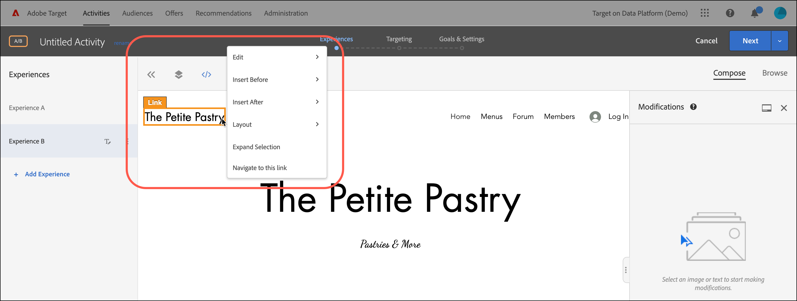

# Utilisation des décisions d’offre

Utilisation [!DNL Adobe Target] avec [!DNL Adobe Journey Optimizer] les décisions d’offre afin de déterminer et de diffuser la meilleure offre qui soit la plus adaptée à vos visiteurs sur le web et sur mobile.

Ajoutez les décisions d’offre créées dans [!DNL Adobe Journey Optimizer] to [!DNL Target] activités (manuelles [!UICONTROL Test A/B] ou [!UICONTROL Ciblage d’expérience]) à l’aide de l’une des options suivantes : [!UICONTROL Compositeur d’expérience visuelle] (VEC) ou le [!UICONTROL Compositeur d’après les formulaires] pour tester et diffuser des offres personnalisées à vos visiteurs sur vos canaux entrants alimentés par [!DNL Target].

>[!NOTE]
>
>La fonctionnalité d’offre de décision décrite dans cette rubrique sera publiée le 13 janvier 2022 avec le [!DNL Target Standard/Premium] Version 22.1.1.

Pour plus d’informations sur [!DNL Adobe Journey Optimizer], voir [Prise en main de Journey Optimizer](https://experienceleague.adobe.com/docs/journey-optimizer/using/get-started/get-started.html) dans le *Journey Optimizer* documentation.

Pour plus d’informations sur les décisions relatives aux offres, voir [À propos de la gestion des décisions](https://experienceleague.adobe.com/docs/journey-optimizer/using/offer-decisioniong/get-started/starting-offer-decisioning.html) dans le *[!DNL Journey Optimizer]documentation*.

## Conditions préalables

Pour utiliser les décisions d’offre dans [!DNL Target], vous avez besoin des éléments suivants :

* [!DNL Adobe Target Standard] ou [!DNL Adobe Target Premium] mis en oeuvre à l’aide de la fonction [SDK Web Adobe Experience Platform](/help/c-implementing-target/c-implementing-target-for-client-side-web/aep-web-sdk.md).

   Cette fonctionnalité n’est pas disponible lors de l’implémentation. [!DNL Target] avec at.js ou autre [!DNL Target] SDK.

* [!DNL Adobe Journey Optimizer Ultimate] (AJ0 + Offer decisioning) ou [!DNL Adobe Experience Platform] et le [!UICONTROL offer decisioning] module complémentaire du service d’applications.

## Exemples de cas d’utilisation

Les exemples suivants présentent des cas d’utilisation de la méthode [!DNL Target]/[!DNL Adobe Journey Optimizer] intégration pour utiliser les décisions d’offre dans [!DNL Target] activités :

### Marchandisage sportif

En tant que responsable marketing d’une ligue sportive, vous souhaitez personnaliser le contenu de votre page d’accueil (sur les ordinateurs de bureau et les sites web mobiles). Vous souhaitez personnaliser le contenu en fonction de plusieurs dimensions et présenter une offre pour acheter des marchandises en franchise liées à la boutique. Vous êtes intéressé par :

* L’équipe préférée du visiteur
* Activité athlète/joueur récente (par exemple, mouvement d’équipe, mises à jour de contrat ou blessures)

Par exemple, vous souhaitez offrir une expérience personnalisée pour chacune des régions suivantes : Dortmund, Francfort et Bochum, ainsi que pour les utilisateurs qui sont des fans implicites et explicites de ces équipes. Pour les mesures, vous souhaitez consulter les visites et les clics sur le site de marchandisage.

Vous souhaitez concevoir une [!UICONTROL Test A/B] activité (partage 50/50) entre l’expérience par défaut et l’expérience personnalisée (qui inclut une décision d’offre avec des offres pour chaque région et équipe). Vous souhaitez utiliser cette activité pour déterminer la conversion et l’effet élévateur de l’expérience personnalisée par rapport au contrôle.

### Plateformes de diffusion en continu de jeux

En tant que marketeur pour une organisation de jeux, vous souhaitez proposer une offre personnalisée pour une plateforme de diffusion en continu de jeux pour les utilisateurs de bureau et de mobiles de différents pays : Allemagne, France, Mexique et Brésil. Lorsqu’un visiteur accède au site web pour ordinateur ou mobile à partir de l’une de ces géographies, vous souhaitez diffuser une offre de diffusion en continu de jeux dans la langue locale avec un prix correspondant pour la devise locale.

Dans [!DNL Adobe Journey Optimizer], vous pouvez créer une offre principale de page d’accueil personnalisée pour chacune des zones géographiques ciblées, ainsi qu’une offre de secours avec une héroïne de page d’accueil par défaut. Vous pouvez ensuite créer une décision d’offre qui intègre ces offres et leurs règles d’éligibilité. Ensuite, dans [!DNL Target], vous pouvez créer une [!DNL Experience Targeting] (XT) et insérez cette décision d’offre dans votre bureau ou site web mobile pour offrir l’expérience personnalisée aux visiteurs.

## Créez une expérience qui utilise une décision d’offre :

1. Lors de la modification ou de la création d’un manuel [!UICONTROL Test A/B] ou [!UICONTROL Ciblage d’expérience] (XT) dans le [!UICONTROL Compositeur d’expérience visuelle] (VEC), cliquez sur un élément de page pour afficher la variable [menu options](/help/c-experiences/c-visual-experience-composer/viztarget-options.md).

   

   >[!NOTE]
   >
   >Vous pouvez également créer une expérience qui utilise [!UICONTROL Décisions sur les offres] dans le [[!UICONTROL Compositeur d’expérience d’après les formulaires]](/help/c-experiences/form-experience-composer.md).

1. Cliquez sur **[!UICONTROL Insérer avant]**, **[!UICONTROL Insérer après]** ou **[!UICONTROL Remplacer le contenu]**, puis cliquez sur **[!UICONTROL Offer Decision]**.

   Le [!UICONTROL Offer Decision] est disponible lors de la modification ou de la création. [manuel [!UICONTROL Test A/B]](/help/c-activities/t-test-ab/test-ab.md#types) ou [[!UICONTROL Ciblage d’expérience]](/help/c-activities/t-experience-target/experience-target.md) (XT) uniquement. Cette option n’est pas disponible pour les autres types d’activité. Les options disponibles dans le menu varient en fonction de l’élément sélectionné.

   

1. Dans le **[!UICONTROL Ajout d’une décision d’offre]** , sélectionnez l’environnement de test et l’emplacement de votre choix.

   A [sandbox](https://experienceleague.adobe.com/docs/experience-platform/sandbox/ui/overview.html){target=_blank} dans la variable [!DNL Adobe Experience Platform] vous permet de partitionner votre instance en environnements virtuels. Par exemple, vous pouvez avoir un environnement de production et un environnement intermédiaire. A [placement](https://experienceleague.adobe.com/docs/journey-optimizer/using/offer-decisioniong/create-components/creating-placements.html){target=_blank} dans [!DNL Adobe Journey Optimizer] permet de s’assurer que le contenu d’offre approprié s’affiche au bon emplacement.

   

1. Sélectionnez la décision d’offre souhaitée, puis cliquez sur **[!UICONTROL Créer]**.

   

   Votre site web s’affiche dans le VEC, où vous pouvez voir la décision d’offre nouvellement créée dans le [!UICONTROL Modifications] sur le côté droit. Vous pouvez survoler la modification avec la souris et cliquer sur l’icône [!UICONTROL Aperçu] pour examiner la décision relative à l’offre.

   

   Vous pouvez consulter les différentes offres contenues dans l’offre en cliquant sur l’icône correspondante au bas de la [!UICONTROL Aperçu de l’offre] , y compris l’offre de secours. Une offre de secours est l’offre par défaut affichée lorsqu’un visiteur n’est éligible à aucune des offres personnalisées de la collection.

   

1. Terminez la création de l’activité en exécutant la [!UICONTROL Ciblage] et [!UICONTROL Objectifs et paramètres] étapes du processus assisté en trois parties.

   >[!IMPORTANT]
   >
   >Pour garantir que la variable [!DNL Target] l’activité est personnalisée, assurez-vous que les dates de début/fin actuelles de l’activité sont synchronisées avec les dates de début/fin de la décision d’offre dans [!DNL Adobe Journey Optimizer]. Si la variable [!DNL Target] les dates de début/fin se situent en dehors de la plage de dates de début/fin de la décision d’offre, à savoir la valeur par défaut [!DNL Target] le contenu s’affiche pour les visiteurs.

   

## Remarques et limitations

Tenez compte des remarques et limites suivantes lorsque vous travaillez avec les décisions d’offre :

* L’intégration offer decisioning fonctionne pour [!DNL Target] les mises en oeuvre basées sur la variable [SDK Web Adobe Experience Platform](/help/c-implementing-target/c-implementing-target-for-client-side-web/aep-web-sdk.md). Cette fonctionnalité n’est pas disponible lors de la mise en oeuvre de [!DNL Target] avec at.js ou autre [!DNL Target] SDK.

* L’intégration Target/Adobe Journey Optimizer prend en charge [manuel [!UICONTROL Test A/B]](/help/c-activities/t-test-ab/test-ab.md#types) et [[!UICONTROL Ciblage d’expérience]](/help/c-activities/t-experience-target/experience-target.md) (XT) uniquement. Cette fonctionnalité n’est pas disponible pour les autres types d’activité.

* Les offres de type de contenu texte/html ne prennent pas en charge la diffusion de contenu deliveryURL. L’URL de diffusion est prise en charge par le compositeur d’expérience d’après les formulaires uniquement lorsque le client est chargé de récupérer et de composer explicitement le contenu.

* [!DNL Target] la création de rapports ne fournit pas de rapports au niveau de la décision relative aux offres.

* Visualisation [Liens d’assurance qualité](/help/c-activities/c-activity-qa/activity-qa.md) pour [!DNL Target] les expériences qui contiennent des décisions d’offre affectent le plafonnement des fréquences défini dans [!DNL Adobe Journey Optimizer] pour les décisions d’offre.
