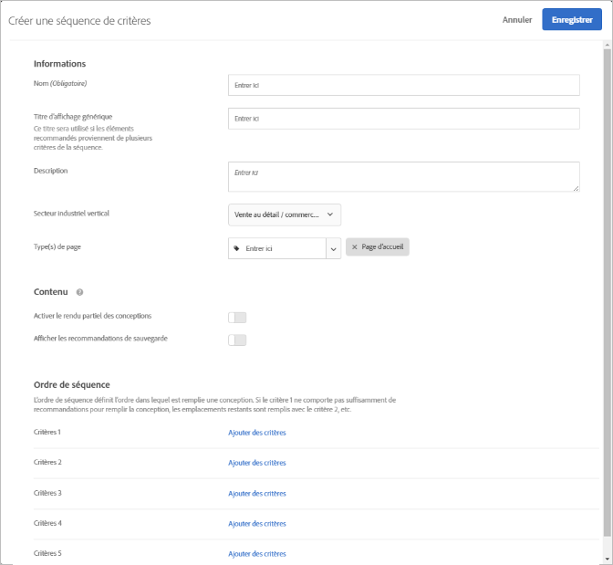

#  Création d’une séquence de critères

Utilisez des séquences de cinq critères au maximum afin d’exercer un plus grand contrôle sur les éléments qui apparaissent dans vos activités de [!UICONTROL Recommandations].

>[!NOTE]
>
>Il n’est pas possible d’utiliser des séquences de critères avec les activités [!UICONTROL Recommendations] créées avant la version d’octobre 2016 de [!DNL Target Premium].

Pour créer une séquence de critères, vous devez d’abord créer les critères que vous souhaitez inclure dans la séquence. Voir [Création de critères](/help/c-recommendations/c-algorithms/create-new-algorithm.md) pour plus d’informations.

En utilisant une séquence de critères, vous pouvez fournir des recommandations ciblées supplémentaires au lieu d’utiliser des recommandations de sauvegarde plus génériques lorsqu’un critère ne renvoie pas suffisamment de résultats pour remplir votre conception. En règle générale, une séquence de critères passe d’un ciblage plus spécifique, susceptible de renvoyer moins de résultats, à un ciblage plus général, qui renvoie généralement plus de résultats.

Vos séquences de critères peuvent varier en fonction du type de page, comme le montrent les exemples suivants :

| Type de page | Ordre de séquence possible |
| --- | --- |
| Page de produit | <ol><li>Basé sur l’article actuel, de la même marque</li><li>Basé sur l’article actuel, de toutes les marques</li><li>Basé sur la similarité de contenu</li><li>Basé sur les meilleurs vendeurs</li><li>Basé sur les articles les plus consultés sur le site</li></ol> |
| Page d&#39;accueil | <ol><li>Basé sur le dernier achat du visiteur </li><li>Basé sur l’article préféré du visiteur</li><li>Basé sur la catégorie préférée du visiteur</li><li>Basé sur les meilleurs vendeurs</li><li>Basé sur les articles les plus consultés sur le site</li></ol> |

## Création d’une séquence de critères

Vous créez des séquences de critères à partir de l’écran [!UICONTROL Créer une séquence] de critères.

Il existe plusieurs méthodes pour accéder à l’écran [!UICONTROL Créer une séquence de critères]. Certaines options de l’écran varient en fonction de l’accès à ce dernier.

* Dans l’écran de la bibliothèque **[!UICONTROL Recommandations]** > **[!UICONTROL Critères]**, cliquez sur **[!UICONTROL Créer des critères]** > **[!UICONTROL Créer une séquence de critères]**. Les critères que vous créez à cet emplacement deviennent automatiquement disponibles pour toutes les activités de [!UICONTROL Recommandations].
* Lorsque vous créez une activité [!UICONTROL Recommendations] , dans l’écran Sélectionner les critères, cliquez sur **[!UICONTROL Créer]** > **[!UICONTROL Créer une séquence]** de critères. Vous aurez la possibilité d’enregistrer la nouvelle séquence de critères afin de les utiliser avec d’autres activités de [!UICONTROL Recommandations].
* When you are editing a [!UICONTROL Recommendations] activity, click in a [!UICONTROL Recommendations Location] box on your page, then select **[!UICONTROL Change Criteria]**. Dans l’écran [!UICONTROL Sélectionner des critères], cliquez sur **[!UICONTROL Créer]** > **[!UICONTROL Créer une séquence de critères]**. Vous aurez la possibilité d’enregistrer les nouveaux critères afin de les utiliser avec d’autres activités de [!UICONTROL Recommandations].

Les étapes suivantes supposent que vous accédez à l’écran [!UICONTROL Créer une séquence] de critères à l’aide de la première méthode : l’écran **[!UICONTROL Recommendations]** > **[!UICONTROL Critères]** de bibliothèque.

1. Cliquez sur **[!UICONTROL Recommendations]** > **[!UICONTROL Critères]**.

1. Cliquez sur **[!UICONTROL Créer des critères]** > **[!UICONTROL Créer une séquence]** de critères.

   

1. Fill in the information in the [Basic Information](/help/c-recommendations/c-algorithms/create-new-algorithm.md#info) section.

1. Dans la section Séquence **[!UICONTROL de]** critères, cliquez sur **[!UICONTROL Ajouter des critères]**.

   L’ordre de séquence définit l’ordre dans lequel une conception est remplie. Si le critère 1 ne comporte pas suffisamment de recommandations pour remplir votre conception, les créneaux restants seront remplis avec le critère 2, etc.

   

1. Dans l’écran [!UICONTROL Sélectionner les critères] , sélectionnez un critère, puis cliquez sur **[!UICONTROL Ajouter]**.

   Vous pouvez utiliser la zone de recherche et les listes déroulantes de filtre pour trouver les critères de votre choix.

   

1. (Facultatif) Faites glisser la **[!UICONTROL case Limiter le nombre d’éléments renvoyés]** pour passer à la position &quot;Activé&quot;, puis indiquez le nombre d’éléments (entre 1 et 50).

   

   Pour vous aider à comprendre la valeur de l’option [!UICONTROL Limiter le nombre d’éléments renvoyés] , tenez compte des cas d’utilisation suivants :

   * **Cas d’utilisation 1**: Vous souhaitez avoir un mélange de différents types d’éléments dans un seul bac de Recommandations. Par exemple, vous souhaitez afficher un mélange de vêtements de dessus (vestes) et de dessus (chemises, T-shirts). Pour ce faire, utilisez une collection pour l’activité qui inclut tous les types de produits potentiels que vous souhaitez dans les emplacements de votre conception. Ensuite, configurez vos premiers critères avec un filtre statique limitant les critères à inclure uniquement les vêtements de dessus, et configurez vos deuxièmes critères avec un filtre statique limitant les critères à inclure uniquement les dessus. Enfin, ajoutez les deux critères à une séquence de critères et limitez le premier critère à 2 emplacements.

      La barre d’état des recommandations peut se présenter comme suit sur votre site :

      

   * **Cas d’utilisation 2**: Vous voulez un mélange d&#39;éléments alternatifs et d&#39;éléments complémentaires. Configurez un critère pour utiliser un algorithme affiché/affiché et utilisez un filtre dynamique qui limite les éléments recommandés à la catégorie de l’élément actuel. Configurez le second critère pour utiliser un algorithme consulté/acheté et utilisez un filtre dynamique qui inclut uniquement les éléments recommandés qui ne correspondent pas à la catégorie de l’élément actuel. Enfin, ajoutez les deux critères à une séquence et limitez le premier critère à 2 emplacements.

1. Continuez à ajouter d’autres critères à votre séquence. Vous pouvez ajouter jusqu’à cinq critères à une séquence.

1. Activez les options Sauvegarder le contenu.

1. Cliquez sur **[!UICONTROL Enregistrer]**.

   La séquence de critères apparaît dans la liste des critères.

   Pour plus d’informations sur les options logiques de recommandation, voir [Critères](/help/c-recommendations/c-algorithms/algorithms.md).

## Vidéo de formation : Créer des critères dans Recommendations (12:33) 

Cette vidéo traite des sujets suivants :

* Création de critères
* Création d’une séquence de critères
* Téléchargement de critères personnalisés

>[!VIDEO](https://video.tv.adobe.com/v/27694?quality=12)
