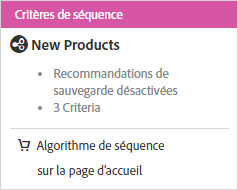

#  Création d’une séquence de critères{#create-criteria-sequences}

Utilisez des séquences de maximum cinq critères afin d’exercer un plus grand contrôle sur les éléments qui apparaissent dans vos activités de recommandations.

>[!NOTE]
>
>Il n’est pas possible d’utiliser des séquences de critères avec les activités [!UICONTROL Recommendations] créées avant la version d’octobre 2016 de [!DNL Target Premium].

Pour créer une séquence de critères, vous devez d’abord créer les critères que vous souhaitez inclure dans la séquence. Voir [Création de critères](../../c-recommendations/c-algorithms/create-new-algorithm.md#task_8A9CB465F28D44899F69F38AD27352FE) pour plus d’informations.

En utilisant une séquence de critères, vous pouvez fournir des recommandations ciblées supplémentaires au lieu d’utiliser des recommandations de sauvegarde plus génériques lorsqu’un critère ne renvoie pas suffisamment de résultats pour remplir votre conception. Une séquence de critères progresse généralement d’un ciblage plus spécifique, susceptible de renvoyer moins de résultats, à un ciblage plus général, qui renvoie généralement plus de résultats.

Par exemple, une séquence de critères d’une page de produits peut suivre l’ordre ci-dessous :

1. Basé sur l’article actuel, de la même marque
1. Basé sur l’article actuel, de toutes les marques
1. Basé sur la similarité de contenu
1. Basé sur les meilleurs vendeurs
1. Basé sur les articles les plus consultés sur le site

Une séquence de critères d’une page d’accueil peut suivre l’ordre ci-dessous :

1. Basé sur le dernier achat du visiteur
1. Basé sur l’article préféré du visiteur
1. Basé sur la catégorie préférée du visiteur
1. Basé sur les meilleurs vendeurs
1. Basé sur les articles les plus consultés sur le site

Il existe plusieurs méthodes pour accéder à l’écran [!UICONTROL Créer une séquence de critères]. Certaines options de l’écran varient en fonction de l’accès à ce dernier.

* Lorsque vous créez une activité de [!UICONTROL Recommandations], cliquez sur **[!UICONTROL Créer]** > **[!UICONTROL Créer une séquence de critères]** dans l’écran [!UICONTROL Sélectionner des critères]. Vous aurez la possibilité d’enregistrer la nouvelle séquence de critères afin de les utiliser avec d’autres activités de [!UICONTROL Recommandations].
* Lorsque vous modifiez une activité de [!UICONTROL Recommandations], cliquez dans la zone [!UICONTROL Emplacements des recommandations], puis sélectionnez **[!UICONTROL Changer les critères]**. Dans l’écran [!UICONTROL Sélectionner des critères], cliquez sur **[!UICONTROL Créer]** > **[!UICONTROL Créer une séquence de critères]**. Vous aurez la possibilité d’enregistrer les nouveaux critères afin de les utiliser avec d’autres activités de [!UICONTROL Recommandations].
* Dans l’écran de la bibliothèque **[!UICONTROL Recommandations]** > **[!UICONTROL Critères]**, cliquez sur **[!UICONTROL Créer des critères]** > **[!UICONTROL Créer une séquence de critères]**. Les critères que vous créez à cet emplacement deviennent automatiquement disponibles pour toutes les activités de [!UICONTROL Recommandations].

1. Cliquez sur **[!UICONTROL Créer des critères]** ou sur **[!UICONTROL Nouveau]**.

   

1. Sélectionnez **[!UICONTROL Créer une séquence de critères]**.

   

1. Saisissez un **[!UICONTROL nom]** pour la séquence.

   Il s’agit du nom « interne » utilisé pour décrire cette séquence de critères. Les visiteurs de votre site ne verront pas ce nom.
1. Saisissez un **[!UICONTROL Titre d’affichage générique]** destiné au public qui apparaîtra sur la page si plusieurs critères de la séquence sont utilisés pour remplir la conception de [!UICONTROL Recommendations].

   Par exemple, vous souhaiterez peut-être remplacer « Les clients qui ont consulté ceci ont également consulté... » par « Recommandations personnalisées » si la conception est susceptible d’inclure des éléments en fonction de plusieurs clés de [!UICONTROL Recommandations].
1. Tapez une **[!UICONTROL Description]** succincte de la séquence de critères.

   La description doit vous permettre d’identifier la séquence de critères. Elle peut aussi inclure des informations concernant l’objet de la séquence.
1. Sélectionnez un **[!UICONTROL Secteur industriel vertical]**.

   Votre secteur industriel vertical par défaut apparaît automatiquement.
1. Sélectionnez un **[!UICONTROL Type de page]**.

   Vous pouvez sélectionner plusieurs types de page.

   Le secteur industriel vertical et les types de page sont utilisés pour classer les séquences de critères enregistrées afin que vous puissiez facilement les réutiliser pour d’autres activités de [!UICONTROL Recommandations].
1. **[!UICONTROL Définissez les règles de contenu.]**

   Lorsque vous créez une séquence de critères, les paramètres de recommandations de sauvegarde et de rendu de conception partiel sont ignorés en faveur des critères individuels qui composent la séquence. Pour utiliser les recommandations de sauvegarde et le rendu de conception partiel, vous devez les activer pour la séquence. Sélectionnez les bascules appropriées. Si vous choisissez d’autoriser les recommandations de sauvegarde, vous pouvez également choisir si les règles d’inclusion doivent être appliquées aux sauvegardes.
1. Définissez l’ordre de la séquence.

1. Cliquez sur **[!UICONTROL Ajouter un critère]**.
1. Dans l’écran Ajouter un critère, sélectionnez un critère.
1. Cliquez sur **[!UICONTROL Ajouter]**.

   Vous pouvez ajouter jusqu’à cinq critères à une séquence.
1. Cliquez sur **[!UICONTROL Enregistrer]**.

   La séquence de critères apparaît dans la liste des critères.

   

   Pour plus d’informations sur les options logiques de recommandation, voir [Critères](../../c-recommendations/c-algorithms/algorithms.md#concept_4BD01DC437F543C0A13621C93A302750).

## Vidéo de formation : Créer des critères dans Recommendations (12:33) 

Cette vidéo traite des sujets suivants :

* Création de critères
* Création d’une séquence de critères
* Téléchargement de critères personnalisés

>[!VIDEO](https://video.tv.adobe.com/v/27694?quality=12)
