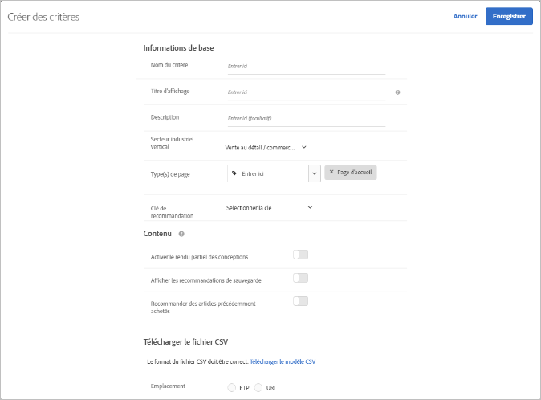

#  Téléchargement de critères personnalisés{#upload-custom-criteria}

Téléchargez un fichier CSV pour personnaliser vos recommandations.

Il existe plusieurs méthodes pour accéder à l’écran [!UICONTROL Créer des critères]. Certaines options de l’écran varient en fonction de l’accès à ce dernier.

* Lorsque vous créez une activité de [!UICONTROL Recommandations], cliquez sur **[!UICONTROL Nouveau]** dans l’écran [!UICONTROL Sélectionner]. Vous aurez la possibilité d’enregistrer les nouveaux critères afin de les utiliser avec d’autres activités de [!UICONTROL Recommandations].
* Lorsque vous modifiez une activité de [!UICONTROL Recommandations], cliquez dans la zone [!UICONTROL Emplacements des recommandations], puis sélectionnez **[!UICONTROL Changer les critères]**. Dans l’écran [!UICONTROL Sélectionner les critères], cliquez sur **[!UICONTROL Nouveau]**. Vous aurez la possibilité d’enregistrer les nouveaux critères afin de les utiliser avec d’autres activités de [!UICONTROL Recommandations].
* Dans l’écran de la bibliothèque **[!UICONTROL Recommandations]** > **[!UICONTROL Critères]**, cliquez sur **[!UICONTROL Créer des critères]**. Les critères que vous créez à cet emplacement deviennent automatiquement disponibles pour toutes les activités de [!UICONTROL Recommandations].

1. Cliquez sur **[!UICONTROL Créer des critères]**.

   

1. **[!UICONTROL Sélectionnez Télécharger les critères personnalisés]**.

   

1. Saisissez un **[!UICONTROL Nom de critère]**.

   C’est le nom « interne » utilisé pour décrire ce critère. Par exemple, vous voulez peut-être appeler votre critère « Produits générant la marge la plus élevée », mais vous ne voulez pas que ce titre soit affiché publiquement. Reportez-vous à la prochaine étape pour configurer le titre destiné au public.
1. Saisissez un **[!UICONTROL Titre d’affichage]** destiné à l’audience qui apparaîtra sur la page pour n’importe quelle recommandation qui utilise ce critère.

   Vous pouvez par exemple souhaiter afficher « Les personnes qui ont consulté cet article ont aussi consulté celui-ci » ou « Produits similaires » lorsque vous utilisez ce critère pour afficher des recommandations.
1. Saisissez une courte **[!UICONTROL Description]** du critère.

   La description doit vous permettre d’identifier le critère. Elle peut aussi inclure des informations concernant l’objet du critère.
1. Sélectionnez un **[!UICONTROL Secteur industriel vertical]**.

   Les autres options de critère peuvent varier en fonction du secteur industriel vertical que vous sélectionnez.

1. Sélectionnez un **[!UICONTROL Type de page]**.

   Vous pouvez sélectionner plusieurs types de page.

   Le secteur industriel vertical et les types de page sont utilisés pour classer les critères enregistrés pour que vous puissiez facilement les réutiliser pour d’autres activités de [!UICONTROL Recommandations].
1. Sélectionnez une **[!UICONTROL Clé de recommandation]**.

   Pour plus d’informations sur la base des critères sur une clé, voir [Baser la recommandation sur une clé de recommandation](../../c-recommendations/c-algorithms/create-new-algorithm.md#task_2B0ED54AFBF64C56916B6E1F4DC0DC3B).
1. **[!UICONTROL Définissez les règles de contenu.]**

   Les règles de contenu déterminent ce qui se passe lorsque le nombre d’éléments recommandés ne remplissent pas votre conception. Par exemple, si votre conception comprend un espace destiné à cinq éléments, mais que seuls trois éléments sont recommandés en raison de vos critères, vous pouvez laisser l’espace supplémentaire vide ou le remplir avec des recommandations de sauvegarde. Sélectionnez les bascules appropriées. Voir [Paramètres Contenu](../../c-recommendations/c-algorithms/create-new-algorithm.md#concept_BC16005C7A1E4F1A87E33D16221F4A96).
1. **[!UICONTROL Définissez les règles d’inclusion]**.

   Les règles d’inclusion vous aident à préciser les éléments qui s’affichent dans les recommandations. Voir [Règles d’inclusion](../../c-recommendations/c-algorithms/create-new-algorithm.md#task_28DB20F968B1451481D8E51BAF947079). 1. Sélectionnez l’**[!UICONTROL emplacement]** de votre fichier CSV.

   Le fichier CSV doit être correctement formaté pour pouvoir être téléchargé. Cliquez sur **[!UICONTROL Télécharger le modèle CSV]** pour obtenir un fichier CSV correctement formaté.

   Vous avez le choix entre deux options :

   * **FTP :** Pour transférer le fichier CSV depuis un serveur FTP, sélectionnez l’option **[!UICONTROL FTP]**, puis saisissez les informations requises. Vous pouvez utiliser le chiffrement SSL, qui transfère le fichier CSV en toute sécurité au moyen du protocole FTPS.
   * **URL :** pour transférer le fichier CSV depuis une URL, sélectionnez l’option **[!UICONTROL URL]** et saisissez une URL de flux.

1. Cliquez sur **[!UICONTROL Enregistrer]**.

   >[!NOTE]
   >
   >Les entités de critères personnalisés (lignes) peuvent comporter jusqu’à 1 000 éléments recommandés (colonnes).

Les mises à jour de critères personnalisés sont par défaut « cumulatives ». Les nouvelles paires clé-valeur spécifiées dans le fichier de chargement CSV remplacent les paires clé-valeur existantes. Les paires clé-valeur existantes qui n’ont pas de clés spécifiées dans le téléchargement CSV seront toujours disponibles pour la diffusion. Elles arriveront à expiration dans 31 jours à compter du dernier téléchargement dans le fichier CSV.

Contactez le service à la clientèle pour permettre au paramètre d’ignorer les résultats existants qui ne sont pas inclus dans le prochain chargement CSV. Si ce paramètre est activé, seules les clés présentes dans le fichier de flux CSV personnalisé seront disponibles pour la livraison. Ce paramètre s’applique à tous les critères personnalisés.

Les flux de critères personnalisés sont mis à jour une fois toutes les 24 heures.

Le statut de chargement et de synchronisation de votre chargement de critères personnalisés est visible au bas de chaque carte de critère sur la page Recommandations > Critère. Vous pouvez également voir l’état dans la boîte de dialogue Modifier lors de la modification des critères personnalisés.

Le flux d’un chargement sans erreur est composé des étapes suivantes : Planifié > Téléchargement du fichier du flux > Importation > Réussite.

Vous trouverez ci-dessous les messages d’erreur que vous pouvez recevoir si Target rencontre un problème lors du chargement :

| Message d’erreur | Détails |
|--- |--- |
| Erreur inconnue | Indique une erreur technique interne. |
| Erreur d’analyse | Indique probablement un problème de format du fichier du flux. Corrigez le format du fichier et enregistrez à nouveau l’algorithme. Cela redémarre le processus de téléchargement du fichier. |
| Serveur introuvable | Fournissez une adresse IP ou un nom d’hôte visible sur Internet. |
| Erreur d’informations d’identification | Fournissez un nom d’utilisateur et un mot de passe valides pour un compte actif sur le serveur. |
| Répertoire introuvable | Fournissez un répertoire qui existe sur le serveur. |
| Fichier introuvable | Fournissez le nom d’un fichier qui existe sur le serveur dans le répertoire indiqué. |

## Vidéo de formation : Créer des critères dans Recommendations (12:33) 

Cette vidéo contient les informations suivantes (les détails sur le transfert de critères personnalisés commencent à 11h43) :

* Création de critères
* Création d’une séquence de critères
* Téléchargement de critères personnalisés

>[!VIDEO](https://video.tv.adobe.com/v/27694?quality=12)