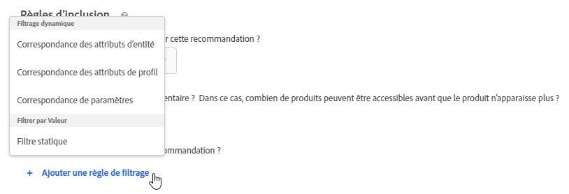
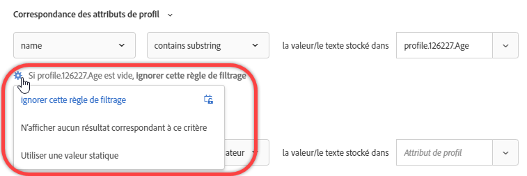
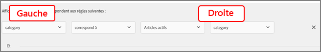

#  Utilisation de règles d’inclusion dynamiques et statiques{#use-dynamic-and-static-inclusion-rules}

Informations sur la création de règles d’inclusion pour les critères et les promotions dans [!DNL Adobe Target] et l’ajout de règles de filtrage dynamiques ou statiques supplémentaires afin d’obtenir de meilleurs résultats pour vos recommandations.

>[!NOTE]
>
>Le processus de création et d’utilisation de règles d’inclusion pour les critères et les promotions est similaire, de même que les cas d’utilisation et les exemples. Les critères et les promotions ainsi que l&#39;utilisation des règles d&#39;inclusion sont traités dans cette section.

## Ajout de règles de filtrage à des critères {#section_CD0D74B8D3BE4A75A78C36CF24A8C57F}

Lorsque vous [créez des critères](/help/c-recommendations/c-algorithms/create-new-algorithm.md#task_8A9CB465F28D44899F69F38AD27352FE), cliquez sur **[!UICONTROL Ajouter une règle de filtrage]** sous **[!UICONTROL Règles d’inclusion]**.

Les options disponibles varient en fonction du secteur industriel vertical et de la clé de recommandation sélectionnés.

## Ajout de règles de filtrage à des promotions {#section_D59AFB62E2EE423086281CF5D18B1076}

Lors de la [création d’une promotion](/help/c-recommendations/t-create-recs-activity/adding-promotions.md#task_CC5BD28C364742218C1ACAF0D45E0E14), sélectionnez **[!UICONTROL Promouvoir par attribut]**, puis cliquez sur **[!UICONTROL Ajouter une règle de filtrage]**.

## Types de filtre {#section_0125F1ED10A84C0EB45325122460EBCD}

Les sections suivantes liste les types d’options de filtrage pour [!UICONTROL Filtrage dynamique] et [!UICONTROL Filtrer par valeur] pour les critères et les promotions :

### Filtrage dynamique

Les règles d’inclusion dynamique sont plus puissantes que les règles d’inclusion statique et elles produisent de meilleurs résultats et un meilleur engagement. Tenez compte des points suivants :

* Les règles d’inclusion dynamique fournissent des recommandations en faisant correspondre un attribut au paramètre de profil d’un utilisateur ou dans un appel de mbox.

   Par exemple, vous pouvez créer une recommandation &quot;Critères les plus populaires&quot;, puis de l’ensemble de recommandations renvoyées, puis filtrer toutes les recommandations (en temps réel) par rapport à un attribut transmis lorsque l’utilisateur accède à une page où les recommandations sont affichées.

* Utilisez des règles statiques pour limiter les éléments qui sont inclus dans la recommandation (au lieu d’utiliser des collections).

* Vous pouvez créer autant de règles d’inclusion dynamiques que nécessaire. Les règles d’inclusion sont jointes par l’opérateur ET. Toutes les règles doivent être respectées pour inclure un élément dans une recommandation.

Les options suivantes sont disponibles pour le filtrage dynamique :

| Option de filtrage dynamique | Détails |
| --- | --- |
| [Correspondance des attributs d’entité](/help/c-recommendations/c-algorithms/entity-attribute-matching.md) | Filtrez dynamiquement en comparant un groupe d’éléments de recommandations potentiels à un élément spécifique avec lequel les utilisateurs ont interagi. Utilisez la  [!UICONTROL correspondance des attributs ] d’entité lorsque vous souhaitez afficher des recommandations susceptibles d’intéresser le visiteur, telles que la marque préférée du visiteur. |
| [Correspondance des attributs de profil](/help/c-recommendations/c-algorithms/profile-attribute-matching.md) | Filtrez dynamiquement en comparant des éléments (entités) à une valeur du profil de l’utilisateur. Utilisez la  [!UICONTROL correspondance des attributs de ] Profil lorsque vous souhaitez afficher des recommandations qui correspondent à une valeur stockée dans le profil du visiteur, telle que la taille ou la marque préférée. |
| [Correspondance de paramètres](/help/c-recommendations/c-algorithms/parameter-matching.md) | Filtrez dynamiquement en comparant des éléments (entités) à une valeur dans la requête (API ou mbox). Utilisez  [!UICONTROL la ] correspondance des paramètres pour recommander le contenu qui correspond aux paramètres de page ou aux paramètres du visiteur, tels que les dimensions du périphérique ou la géolocalisation. |

### Filtrer par valeur

L’option suivante est disponible pour le filtrage par valeur :

| Filtrage par valeur, option | Détails |
| --- | --- |
| [Filtre statique](/help/c-recommendations/c-algorithms/static-value.md) | Saisissez manuellement une ou plusieurs valeurs statiques à filtrer. |

## Critères dynamiques et exemples de promotion

Les critères et les promotions dynamiques sont beaucoup plus puissants que les critères statiques et les promotions et produisent de meilleurs résultats et un meilleur engagement.

Les exemples suivants fournissent des idées générales sur la manière d’utiliser les promotions dynamiques dans vos efforts marketing :

| Opérateur | Exemples |
| --- | --- |
| Est égal | En utilisant l&#39;opérateur &quot;égal à&quot; dans les promotions dynamiques, lorsqu&#39;un visiteur consulte un article sur votre site Web (tel qu&#39;un produit, un article ou un film), vous pouvez promouvoir d&#39;autres éléments à partir de :<ul><li>de la même marque ;</li><li>de la même catégorie ;</li><li>de la même catégorie ET de la même marque-mère ;</li><li>du même magasin.</li></ul> |
| N’est pas égal à | En utilisant l&#39;opérateur &quot;n&#39;est pas égal à&quot; dans les promotions dynamiques, lorsqu&#39;un visiteur consulte un élément de votre site Web (tel qu&#39;un produit, un article ou un film), vous pouvez promouvoir d&#39;autres éléments à partir de :<ul><li>d’un autre programme télévisé ;</li><li>d’un autre genre de film ;</li><li>d’une autre gamme de produit ;</li><li>un autre code de style.</li></ul> |
| Est compris entre | En utilisant l&#39;opérateur &quot;se situe entre&quot; dans les promotions dynamiques, lorsqu&#39;un visiteur consulte un élément de votre site Web (tel qu&#39;un produit, un article ou un film), vous pouvez promouvoir d&#39;autres éléments qui sont :<ul><li>sont plus chers ;</li><li>sont moins chers ;</li><li>coûtent plus ou moins de 30 % ;</li><li>sont des épisodes ultérieurs de la même saison ;</li><li>sont des livres antérieurs dans une série.</li></ul> |

## Gestion des valeurs vides lors du filtrage par correspondance d’attributs d’entité, correspondance d’attributs de Profil et correspondance de paramètres {#section_7D30E04116DB47BEA6FF840A3424A4C8}

Vous pouvez choisir plusieurs options pour gérer les valeurs vides lors du filtrage selon [!UICONTROL Entity Attribute Matching], [!UICONTROL Profil Attribute Matching] et [!UICONTROL Parameter Matching] pour les critères de sortie et les promotions.

Auparavant, aucun résultat n’était renvoyé si une valeur était vide. La liste déroulante « Si *x* est vide » permet de choisir l’action appropriée à exécuter si le critère contient des valeurs vides, comme illustré ci-dessous :

Pour sélectionner une action spécifique, survolez l’icône représentant un engrenage (), puis choisissez l’action souhaitée :

| Action | Disponible pour | Détails |
|--- |--- |--- |
| [!UICONTROL Ignorer cette règle de filtrage] | [!UICONTROL Correspondance des attributs de profil ] [!UICONTROL et des paramètres] | Il s’agit de l’action par défaut pour [!UICONTROL Profil Attribute Matching] et [!UICONTROL Parameter Matching]. Cette option indique que la règle est ignorée. Par exemple, s’il existe trois règles de filtrage et que la troisième règle ne transmet aucune valeur, vous pouvez simplement ignorer la troisième règle avec les valeurs vides au lieu de ne renvoyer aucun résultat. |
| [!UICONTROL Ne pas afficher de résultats pour ce critère]  (Critères uniquement) | [!UICONTROL Correspondance] d’attributs d’entité, Correspondance [!UICONTROL  d’attributs ]Profil et Correspondance de  [!UICONTROL paramètres] | Il s&#39;agit de l&#39;action par défaut pour [!UICONTROL la correspondance d&#39;attribut d&#39;entité]. [!DNL Target]Cette action est la manière dont a géré les valeurs vides avant l’ajout de cette option : aucun résultat ne sera affiché pour ce critère. |
| [!UICONTROL Ne pas promouvoir d’éléments  (Promotions uniquement)] | [!UICONTROL Correspondance] d’attributs d’entité, Correspondance [!UICONTROL  d’attributs ]Profil et Correspondance de  [!UICONTROL paramètres] | Il s&#39;agit de l&#39;action par défaut pour [!UICONTROL la correspondance d&#39;attribut d&#39;entité]. [!DNL Target]Cette action est la manière dont a géré les valeurs vides avant l’ajout de cette option : aucun résultat ne sera affiché pour ce critère. |
| [!UICONTROL Utiliser une valeur statique] | [!UICONTROL Correspondance] d’attributs d’entité, Correspondance [!UICONTROL  d’attributs ]Profil et Correspondance de  [!UICONTROL paramètres] | Si une valeur est vide, vous pouvez choisir d’utiliser une valeur statique. |

## Avertissements {#section_A889FAF794B7458CA074DEE06DD0E345}

>[!IMPORTANT]
>
>Différents attributs de type de données peuvent ne pas être compatibles dans les critères ou promotions dynamiques au moment de l’exécution avec les opérateurs « est égal à » et « n’est pas égal à ». Vous devez utiliser les valeurs [!UICONTROL Valeur], [!UICONTROL Marge], [!UICONTROL Inventaire] et [!UICONTROL Environnement] judicieusement sur le côté droit si le côté gauche comporte des attributs prédéfinis ou des attributs personnalisés.

Le tableau suivant répertorie les règles efficaces et celles qui peuvent ne pas être compatibles au moment de l’exécution :

| Règles compatibles | Règles potentiellement incompatibles |
|--- |--- |
| value - est compris entre - 90 % et 110 % de l’article actif - salesValue | salesValue - est compris entre - 90 % et 110 % de l’article actif - value |
| value - est compris entre - 90 % et 110 % de l’article actif - value | clearancePrice - est compris entre - 90 % et 110 % de l’article actif - margin |
| margin - est comprise entre - 90 % et 110 % de l’article actif - margin | storeInventory - est égal à - de l’article actif - inventory |
| inventory - est égal à - de l’article actif - inventory |  |
