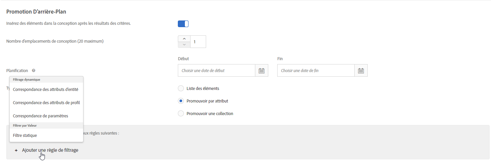
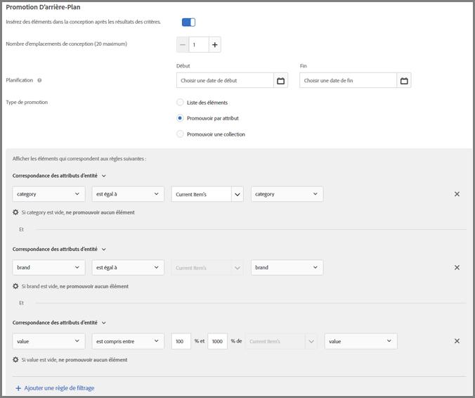
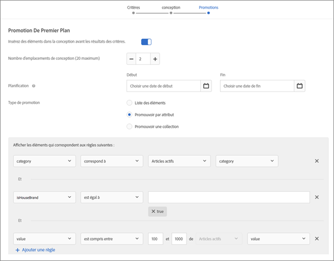
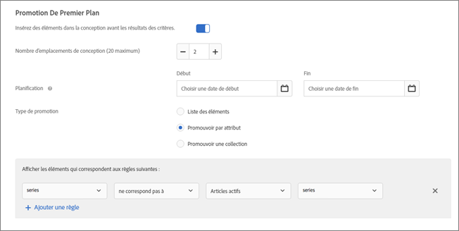
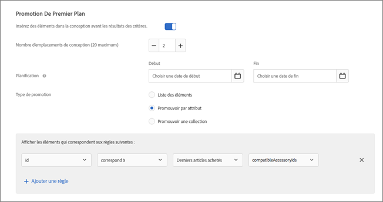
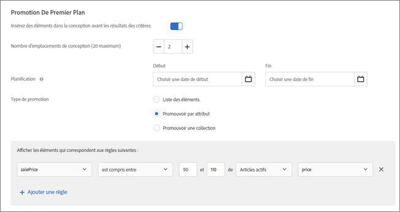
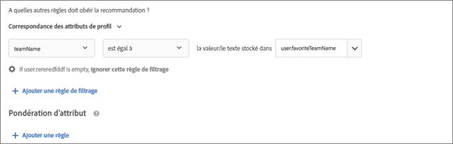
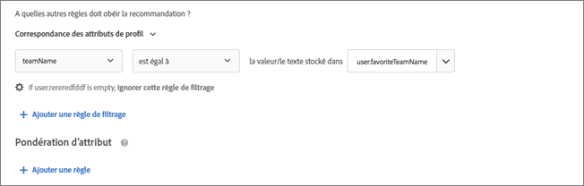
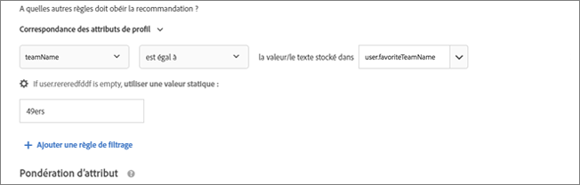

#  Utilisation de règles d’inclusion dynamiques et statiques{#use-dynamic-and-static-inclusion-rules}

Informations sur la création de règles d’inclusion pour les critères et les promotions et sur l’ajout de règles de filtrage dynamiques ou statiques supplémentaires pour obtenir de meilleurs résultats.

Le processus de création et d’utilisation de règles d’inclusion pour les critères et les promotions est similaire, de même que les cas d’utilisation et les exemples. Les critères et les promotions ainsi que l’utilisation des règles d’inclusion sont abordés dans cette rubrique.

## Ajout de règles de filtrage à des critères {#section_CD0D74B8D3BE4A75A78C36CF24A8C57F}

Lorsque vous [créez des critères](../../c-recommendations/c-algorithms/create-new-algorithm.md#task_8A9CB465F28D44899F69F38AD27352FE), cliquez sur **[!UICONTROL Ajouter une règle de filtrage]** sous **[!UICONTROL Règles d’inclusion]**.


Les options disponibles varient en fonction du secteur industriel vertical et de la clé de recommandation sélectionnés.

## Ajout de règles de filtrage à des promotions {#section_D59AFB62E2EE423086281CF5D18B1076}

Lors de la [création d’une promotion](../../c-recommendations/t-create-recs-activity/adding-promotions.md#task_CC5BD28C364742218C1ACAF0D45E0E14), sélectionnez **[!UICONTROL Promouvoir par attribut]**, puis cliquez sur **[!UICONTROL Ajouter une règle de filtrage**].



## Types de filtre {#section_0125F1ED10A84C0EB45325122460EBCD}

Le tableau suivant répertorie les types d’options de filtrage pour les critères et les promotions :

| Type | Option | Opérateurs disponibles |
|--- |--- |--- |
| **Filtrage dynamique** | **Correspondance des attributs d’entité :** filtrez dynamiquement en comparant un pool d’éléments de recommandations potentielles à un élément spécifique avec lequel les utilisateurs ont interagi.<br>Par exemple, recommandez uniquement des articles correspondant à la marque de l’article en cours. | est égal à<br>n’est pas égal à<br>est entre<br>contient<br>ne contient pas<br>débute par<br>se termine par<br>valeur est présente<br>valeur n’est pas présente<br>est supérieur ou égal à<br>est inférieur ou égal à |
|  | **Correspondance des attributs de profil :** filtrez dynamiquement en comparant les éléments (entités) à une valeur du profil de l’utilisateur.<br>Par exemple, recommandez uniquement des articles correspondant à la marque préférée du visiteur. | est égal à<br> n’est pas égal à<br>contient<br>ne contient pas<br>débute par<br>se termine par<br>est supérieur ou égal à<br>est inférieur ou égal à<br>est entre |
|  | **Correspondance de paramètres :** filtrez dynamiquement en comparant les éléments (entités) à une valeur de la demande (API ou mbox).<br>Par exemple, recommandez uniquement du contenu correspondant au paramètre de la page « industrie ».<br>**Important :** Si l’activité a été créée avant le 31 octobre 2016, sa diffusion échoue si elle utilise le filtre « Correspondance de paramètres ». Pour contourner ce problème, procédez comme suit :<ul><li>Créez une activité et ajoutez-y des critères.</li><li>Utilisez un critère qui ne contient pas le filtre « Correspondance de paramètres ».</li><li>Supprimez le filtre « Correspondance de paramètres » des critères.</li></ul> | est égal à<br>n’est pas égal à<br>contient<br>ne contient pas<br>débute par<br>se termine par<br>est inférieur ou égal à<br>est inférieur ou égal à<br>entre |
| **Filtrer par valeur** | **Filtre statique :** entrez manuellement une ou plusieurs valeurs statiques à filtrer.<br>Par exemple, recommandez uniquement le contenu avec une note MPAA de « G » ou « PG ». | est égal à<br>n’est pas égal à<br>contient<br>ne contient pas<br>débute par<br>se termine par<br>valeur est pas présente<br>valeur n’est pas présente<br>est supérieure ou égale à<br>est inférieur ou égal à |

>[!NOTE]
>
>Si vous connaissiez la manière dont les règles d’inclusion étaient configurées avant la version 17.6.1 de Target (juin 2017), vous remarquerez que certains opérateurs et options ont changé. Seuls les opérateurs applicables à l’option sélectionnée s’affichent et certains opérateurs ont été renommés (« correspond à » est devenu « est égal à ») pour être plus cohérents et intuitifs. Toutes les règles d’exclusion existantes créées avant cette version ont été automatiquement migrées vers la nouvelle structure. Aucune restructuration n’est nécessaire de votre part.

Vous pouvez créer autant de règles d’inclusion que nécessaire. Les règles d’inclusion sont jointes par l’opérateur ET. Toutes les règles doivent être respectées pour inclure un élément dans une recommandation.

Les critères et les promotions dynamiques sont beaucoup plus puissants que les critères et les promotions statiques, et donnent de meilleurs résultats et un meilleur engagement. Les exemples suivants illustrent la façon dont vous pouvez utiliser les promotions dynamiques dans le cadre de vos efforts marketing :

**est égal à :** si vous utilisez l’opérateur « est égal à » dans les promotions dynamiques, lorsqu’un visiteur consulte un élément sur votre site web (un produit, un article, un film, etc.), vous pouvez promouvoir d’autres éléments issus :

* de la même marque ;
* de la même catégorie ;
* de la même catégorie ET de la même marque-mère ;
* du même magasin.

**n’est pas égal à :** si vous utilisez l’opérateur « n’est pas égal à » dans les promotions dynamiques, lorsqu’un visiteur consulte un élément sur votre site web (un produit, un article, un film, etc.), vous pouvez promouvoir d’autres éléments issus :

* d’un autre programme télévisé ;
* d’un autre genre de film ;
* d’une autre gamme de produit ;
* d’un autre code de style.

**est compris entre :** si vous utilisez l’opérateur « est compris entre » dans les promotions dynamiques, lorsqu’un visiteur consulte un élément de votre site web (un produit, un article, un film, etc.), vous pouvez promouvoir d’autres éléments qui :

* sont plus chers ;
* sont moins chers ;
* coûtent plus ou moins de 30 % ;
* sont des épisodes ultérieurs de la même saison ;
* sont des livres antérieurs dans une série.

## Gestion des valeurs vides lors du filtrage par correspondance des attributs d’entité, correspondance des attributs de profil et correspondance de paramètres {#section_7D30E04116DB47BEA6FF840A3424A4C8}

Vous pouvez choisir plusieurs options permettant de gérer des valeurs vides lors du filtrage par correspondance des attributs d’entité, correspondance des attributs de profil et correspondance de paramètres pour les critères et les promotions de sortie.

Auparavant, aucun résultat n’était renvoyé si une valeur était vide. La liste déroulante « Si *x* est vide » permet de choisir l’action appropriée à exécuter si le critère contient des valeurs vides, comme illustré ci-dessous :


Pour sélectionner une action spécifique, survolez l’icône représentant un engrenage (), puis choisissez l’action souhaitée :

| Action | Disponible pour | Détails |
|--- |--- |--- |
| Ignorer cette règle de filtrage | Correspondance de paramètres de profil<br>Correspondance de paramètres | Il s’agit de l’action par défaut pour la correspondance des attributs de profil et la correspondance de paramètres.<br>Cette option indique que la règle est ignorée. Par exemple, s’il existe trois règles de filtrage et que la troisième règle ne transmet aucune valeur, vous pouvez simplement ignorer la troisième règle avec les valeurs vides au lieu de ne renvoyer aucun résultat. |
| N’afficher aucun résultat correspondant à ce critère | Correspondance des attributs d’entité<br>Correspondance de paramètre de profil<br>Correspondance de paramètre | Il s’agit de l’action par défaut pour la correspondance des attributs d’entité.<br>Cette action est la manière dont Target a géré les valeurs vides avant l’ajout de cette option : aucun résultat ne sera affiché pour ce critère. |
| Utiliser une valeur statique | Correspondance des attributs d’entité<br>Correspondance de paramètres de profil<br>Correspondance de paramètres | Si une valeur est vide, vous pouvez choisir d’utiliser une valeur statique. |

Comme exemple de gestion des valeurs vides, considérez le [scénario 9](../../c-recommendations/c-algorithms/use-dynamic-and-static-inclusion-rules.md#section_9873E2F22E094E479569D05AD5BB1D40) ci-dessous :

## Scénarios de filtrage dynamique {#section_9873E2F22E094E479569D05AD5BB1D40}

**Scénario 1 :** au lieu de faire correspondre un élément d’un catalogue à d’autres éléments d’un catalogue à l’aide d’un filtre statique, vous pouvez utiliser un filtre dynamique pour associer un élément d’un catalogue à un attribut du profil du visiteur.

Par exemple, vous pouvez utiliser l’option [!UICONTROL Correspondance des attributs de profil] pour créer une règle qui recommande les éléments uniquement lorsque la marque est égale à la valeur ou au texte stocké dans `profile.favoritebrand`. Avec une telle règle, si un visiteur recherche des shorts de course d’une marque spécifique, seules les recommandations qui correspondent à la marque préférée de cet utilisateur s’affichent (la valeur stockée dans `profile.favoritebrand` du profil du visiteur).

**Scénario 2 :** avant que Target n’ait ajouté la possibilité d’utiliser les informations d’attribut provenant du profil d’un visiteur, si vous créiez des listes d’emplois qui ne s’affichaient que pour les demandeurs d’emploi d’un lieu spécifique titulaires d’un diplôme spécifique, vous deviez configurer de nombreuses activités avec différentes audiences (une pour chaque ville et diplôme). Si vous aviez des listes d’emplois dans de nombreuses villes, cette tâche devenait fastidieuse.

Vous pouvez désormais utiliser des règles d’inclusion pour faire correspondre le lieu et le diplôme d’un demandeur d’emploi provenant de son profil de visiteur à une liste d’emplois, comme indiqué dans l’exemple suivant :


La liste d’emplois à gauche exige que le visiteur soit à San Francisco, à New York ou à Los Angeles (`entity.jobCity`) et soit titulaire d’un diplôme BSCS ou MBA (`entity.requiredDegree`).

Ce chercheur d’emploi à droite est à Los Angeles (`profile.usersCity`) et est titulaire d’un MBA (`profile.degree`).

À l’aide d’un filtre dynamique avec la correspondance des attributs de profil, vous pouvez créer le filtre affiché dans la partie inférieure de l’illustration ci-dessus, qui recommande seulement les listes d’emplois auxquelles ce visiteur est admissible en fonction de son lieu et de son diplôme.

Les critères pour ces filtres se présentent ainsi :

```
entity.jobCity - equals - the value/text stored in - profile.usersCity
```

et

```
entity.requiredDegree - equals - the value/text stored in - profile.degree
```

Les filtres dynamiques utilisant la correspondance des attributs de profil permettent de faire plus avec moins d’activités, comme illustré ci-dessous :


Le diagramme en haut de l’illustration ci-dessus montre comment fonctionnent les filtres dynamiques utilisant les attributs de profil. Vous pouvez créer une audience qui utilise des critères (dans le scénario ci-dessus, la ville et le diplôme) pour afficher une liste d’emplois correspondant aux critères du visiteur. Ce filtre fonctionne pour un nombre presque infini de possibilités concernant le lieu et le diplôme.

Les diagrammes au bas de l’illustration représentent seulement deux des nombreuses audiences que vous devriez configurer si vous n’utilisiez pas un critère ou une promotion avec des filtres dynamiques utilisant des attributs de profil. Vous devriez configurer une audience différente pour chaque ville et chaque diplôme. Le nombre d’audiences nécessaires pourrait rapidement devenir ingérable, surtout si vous avez un grand nombre de listes d’emplois dans diverses villes.

Sans utiliser les attributs de profil, vos audiences et expériences ressembleraient à la moitié supérieure de l’illustration ci-dessous, mais avec des paires d’audiences/expériences supplémentaires pour chaque scénario envisageable.


Les filtres dynamiques utilisant des attributs de profil qui associent des attributs d’entité à des attributs d’utilisateur permettent de configurer une audience dynamique qui, à la volée, fournit l’expérience souhaitée, comme illustré dans la partie inférieure de l’illustration ci-dessus.

Tant que les informations requises sont intégrées à chaque liste d’emplois et que vous capturez les informations requises dans les profils d’utilisateur, la création et la gestion des audiences et des expériences est grandement simplifiée.

**Scénario 3 :** un magasin de sports veut afficher des articles sur son site web pour des équipes qui intéressent une personne. Chaque article pourrait comporter un champ avec la valeur `entity.featuredTeams` incluant toutes les équipes mentionnées dans l’article. Chaque attribut de profil pourrait comporter une liste d’équipes favorites auxquelles l’utilisateur « s’abonne ».

Un exemple de règle d’inclusion pourrait ressembler à ceci :

Inclure uniquement lorsque `entity.featuredTeam` contient une ou plusieurs valeurs correspondant à `profile.favoriteTeams`.

Lorsque vous examinez les exemples suivants, gardez à l’esprit qu’au moins une valeur de chaîne entière doit correspondre (complètement). Il n’y a pas de correspondance si aucune des chaînes ne correspond. Notez le découplage des attributs d’entité dans les règles de correspondance. Cela permet de faire correspondre différents champs de métadonnées.

Exemples/Descriptions

`"entity.featuredTeam" - "Athletics,Red Sox" equals "profile.favoriteTeams" - "Athletics"`

Considéré comme une correspondance car « Athletics » est égal à, même si « Red Sox » ne l’est pas.

`"entity.featuredTeam" - "Athletics,Red Sox" equals "profile.favoriteTeams" - "Athletics,Red Sox"`

Considéré comme une correspondance car « Athletics » tout comme « Red Sox » est égal à, même s’il n’est pas nécessaire que les deux équipes correspondent.

`"entity.featuredTeam" - "Athletics" equals "profile.favoriteTeams" - "Athletics,Red Sox"`

Considéré comme une correspondance car « Athletics » est égal à, même si « Red Sox » ne l’est pas.

`"entity.featuredTeam" - "Athletics" equals "profile.favoriteTeams" - "Athletic"`

N’est pas une correspondance car « Athletics » (au pluriel) n’est pas égal à « Athletic » (au singulier).

Alternativement, vous pouvez utiliser « contient » au lieu de « est égal à » pour transformer cet exemple en une correspondance.

`"entity.featuredTeam" - "Athletic" equals "profile.favoriteTeams" - "Athletics"`

N’est pas une correspondance car « Athletic » (au singulier) n’est pas égal à « Athletics » (au pluriel).

Alternativement, vous pouvez utiliser « commence par » au lieu de « est égal à » pour transformer cet exemple en une correspondance.

**Scénario 4 :** l’illustration suivante indique comment utiliser les opérateurs « est égal à » et « est compris entre » pour promouvoir des articles plus chers issus de la même catégorie et de la même marque. Par exemple, un magasin de sport peut promouvoir des chaussures de course plus chères afin d’inciter un visiteur qui regarde des shorts de course à monter en gamme.



Les règles ci-après sont appliquées dans cet exemple :

```
category - equals - current item's - category 
And 
brand - equals - current item's - brand 
And 
value - is between - 100% and 1000% of - current item's - value
```

>[!NOTE]
>
>Vous ne pouvez pas changer la clé d’une promotion dynamique avec plusieurs règles (la troisième liste déroulante des deux premières règles intitulées Articles actifs (Current Item’s) dans l’illustration).

**Scénario 5 :** la deuxième illustration indique comment utiliser les opérateurs « est égal à » et « est compris entre » pour promouvoir des articles plus chers issus de la même catégorie, de la même marque et de la même marque-mère. Par exemple, un magasin de fournitures de bureau peut promouvoir des cartouches d’imprimantes plus chères, de la même marque et de la même marque-mère, afin d’inciter un visiteur qui regarde des imprimantes à monter en gamme.



Les règles ci-après sont appliquées dans cet exemple :

```
category - equals - current item's - category 
And 
IsHouseBrand - equals - true 
And 
value - is between - 100% and 1000% of - current item's - value
```

Dans cet exemple, nous utilisons deux règles dynamiques et une règle statique.

**Scénario 6 :** la troisième illustration indique comment utiliser l’opérateur « n’est pas égal à » afin de promouvoir un programme différent de celui que le visiteur regarde actuellement. Par exemple, un site web multimédia peut promouvoir un programme télévisé différent de celui que le visiteur regarde actuellement.



La règle ci-après est appliquée dans cet exemple :

```
series - does not equal - current item's - series
```

**Scénario 7 :** la quatrième illustration indique comment promouvoir des accessoires compatibles avec l’article que le visiteur vient d’acheter. Si, par exemple, un visiteur a acheté une télévision, vous pouvez lui présenter de manière dynamique un câble HDMI.



Les règles ci-après sont appliquées dans cet exemple :

```
id - equals - last purchased item's - compatibleAccessoryids
```

**Scénario 8 :** l’illustration suivante indique comment promouvoir des articles dont le prix de vente est compris entre 90 et 110 % du prix de l’article que le visiteur consulte actuellement. Si, par exemple, quelqu’un regarde un téléviseur, vous pouvez promouvoir de manière dynamique des téléviseurs semblables qui sont en vente dans la même fourchette de prix.



Les règles ci-après sont appliquées dans cet exemple :

```
salesPrice - is between - 90% and 110% of - current item's - price
```

**Scénario 9 :** envisagez le scénario suivant relatif à la gestion des valeurs vides pour un site multimédia de sport, comme expliqué dans la section [Gestion des valeurs vides lors du filtrage par correspondance des attributs d’entité, correspondance des attributs de profil et correspondance de paramètres](../../c-recommendations/c-algorithms/use-dynamic-and-static-inclusion-rules.md#section_7D30E04116DB47BEA6FF840A3424A4C8) ci-dessus :

L’équipe en charge du contenu du site multimédia de sport souhaite présenter aux utilisateurs le contenu relatif à leurs équipes favorites. Si un utilisateur a indiqué une équipe favorite, l’équipe en charge du contenu souhaite présenter des éléments multimédias pour cette équipe. Si un utilisateur n’a pas indiqué d’équipe favorite, l’équipe en charge du contenu peut utiliser la liste déroulante « Si *x* est vide » pour effectuer l’une des opérations suivantes :

* Utilisez l’option [!UICONTROL Ignorer cette règle de filtrage] pour ignorer complètement le filtre de l’équipe, comme illustré ci-dessous :

   

* Utilisez l’option [!UICONTROL N’afficher aucun résultat correspondant à ce critère] pour ne pas afficher d’élément multimédia dans le cadre de ce critère, comme illustré ci-dessous :

   

* Utilisez l’option [!UICONTROL Utiliser une valeur statique] pour afficher les éléments multimédias d’une équipe spécifique (49ers, par exemple), comme illustré ci-dessous :

   

## Avertissements {#section_A889FAF794B7458CA074DEE06DD0E345}

>[!IMPORTANT]
>
>Différents attributs de type de données peuvent ne pas être compatibles dans les critères ou promotions dynamiques au moment de l’exécution avec les opérateurs « est égal à » et « n’est pas égal à ». Si des attributs prédéfinis ou personnalisés sont sélectionnés à gauche, utilisez avec sagacité les valeurs Value, Margin, Inventory, et Environment de droite.


Le tableau suivant répertorie les règles efficaces et celles qui peuvent ne pas être compatibles au moment de l’exécution :

| Règles compatibles | Règles potentiellement incompatibles |
|--- |--- |
| value - est compris entre - 90 % et 110 % de l’article actif - salesValue | salesValue - est compris entre - 90 % et 110 % de l’article actif - value |
| value - est compris entre - 90 % et 110 % de l’article actif - value | clearancePrice - est compris entre - 90 % et 110 % de l’article actif - margin |
| margin - est comprise entre - 90 % et 110 % de l’article actif - margin | storeInventory - est égal à - de l’article actif - inventory |
| inventory - est égal à - de l’article actif - inventory |  |