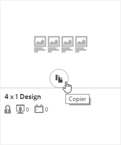
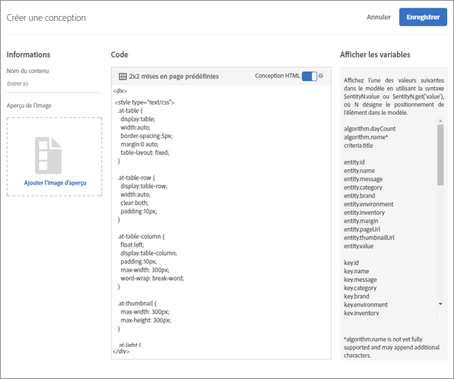

#  Créer une conception {#create-a-design}

Une conception définit la manière dont les recommandations s’affichent sur une page.

Vous pouvez créer une conception de [!UICONTROL Recommandations] à l’aide d’une conception par défaut ou en créant une conception personnalisée. L’écran **[!UICONTROL Recommandations > Conceptions]** affiche les cartes des conceptions par défaut et les conceptions que vous avez créées. Les conceptions par défaut ne peuvent pas être modifiées ni supprimées.

1. Dans l’écran **[!UICONTROL Recommandations > Conceptions]**, passez la souris sur la carte selon la conception que vous voulez créer.

   

1. Pour copier et modifier une conception existante, cliquez sur l’icône **[!UICONTROL Copier]**.

   OU

   Pour créer une conception personnalisée, cliquez sur **[!UICONTROL Créer une conception]** dans l’écran **[!UICONTROL Recommandations > Conceptions]**.

   

1. Ajoutez un **[!UICONTROL nom de contenu]**.

   Lorsque vous utilisez une conception par défaut, le nom de la conception et « Copier » apparaissent dans le champ **[!UICONTROL Nom du contenu]**. Ce nom est modifiable. 1. (Facultatif) Cliquez pour sélectionner une image à afficher sur la carte de conception.
1. Modifiez le **[!UICONTROL code]** de la conception.

   Les conceptions de recommandations utilisent le langage de conception libre Velocity. Vous trouverez des informations concernant Velocity à l’adresse [](https://velocity.apache.org)https://velocity.apache.org.

   Une conception peut être au format HTML ou non HTML. Par défaut, les conceptions HTML sont entourées de <div> balises pour permettre le suivi des clics dans un environnement Web. Les conceptions non HTML sont réservées aux environnements non web dans lesquels le suivi des clics n’est pas possible.

   >[!NOTE]
   >
   >Le nombre maximum d’entités qu’il est possible de référencer dans une conception, que ce soit par le biais de boucles ou d’un codage en dur, est de 99.

1. Cliquez sur **[!UICONTROL Enregistrer]**.

## Exemple d’objet JSON {#section_75BFB2537CFF4FBD9B560F59EB32C8DD}

L’exemple suivant décrit comment les réponses JSON peuvent être renvoyées lorsque vous configurez une activité par l’intermédiaire de l’éditeur d’après les formulaires.

1. Créez une conception depuis la bibliothèque de conceptions ou dans le processus basé sur un formulaire. Si vous tentez de le faire dans le flux de travaux du compositeur d’expérience visuelle (VEC), vous ne pouvez pas créer autre chose qu’une conception HTML, qui est encapsulée dans une balise `<div>` à des fins de suivi des clics.
1. Assurez-vous que l’option « Conception HTML » est désactivée :

   

1. Le code ci-dessous est un exemple de ce que vous pourriez insérer dans votre conception :

   ```
       #* 
       * "Return a simple list of recommended entity ids"   
       *#
   
       {   
         "notes":{   
         "purpose": "Return a simple list of recommended entity ids",   
         "use-case": "Use this approach if you prefer to do a real-time lookup of entity attribute details (such as inventory, price, rating) from another system (such as a CMS, PIM or ecommerce platform)",   
         "version": "01"   
         },   
         "recommendedItems": {   
           "key": "$key.id",   
           "slot-01": "$entity1.id",   
           "slot-02": "$entity2.id",   
           "slot-03": "$entity3.id",   
           "slot-04": "$entity4.id",   
           "slot-05": "$entity5.id",   
           "slot-06": "$entity6.id",   
           "slot-07": "$entity7.id",   
           "slot-08": "$entity8.id",   
           "slot-09": "$entity9.id",   
           "slot-10": "$entity10.id"   
         }   
       }  
   ```

1. Configurez une activité de recommandations d’après les formulaires qui utilise cette conception.

   1. Accédez à la page Activités.
   1. Cliquez sur **[!UICONTROL Créer l’activité]**.
   1. Sélectionnez **[!UICONTROL Recommandations]**.
   1. Sous **[!UICONTROL Choisir le compositeur d’expérience]**, sélectionnez **[!UICONTROL Formulaire]**.

   1. Sous Emplacement, saisissez le texte : « Sample_Recs_Response ».
   1. Sous **[!UICONTROL Contenu par défaut]**, cliquez sur la flèche vers le bas, puis sur **[!UICONTROL Ajouter une recommandation]**.
   1. Choisissez un type de page. Celui-ci détermine le filtrage initial de l’écran suivant.
   1. Sélectionnez une carte de critères, puis cliquez sur **[!UICONTROL Suivant]**.
   1. Sélectionnez la conception que vous avez créée à l’étape précédente, puis cliquez sur **[!UICONTROL Enregistrer]**.
   1. Terminez le processus de configuration.
   1. Cliquez sur la flèche droite en regard de **[!UICONTROL Inactif]**, puis sélectionnez **[!UICONTROL Activer]**.

1. Une fois votre activité configurée et activée, vous pouvez configurer un exemple de requête pour récupérer la réponse JSON vierge.

   Lorsque vous enregistrez votre activité, Target doit créer un modèle pour prendre en charge la configuration des critères sélectionnée. Cette tâche peut prendre un certain temps selon le nombre de facteurs. Les résultats apparaissent une fois le modèle créé.

   Par exemple :

   ```
   https://[YOUR_CLIENT_CODE].tt.omtrdc.net/m2/YOUR_CLIENT_CODE/ubox/raw?mbox=[YOUR_MBOX_NAME]&mboxContentType=text/html&mboxXDomain=disabled&entity.id=[ENTITY_ID]&mboxHost=rawbox_sample&at_property=[AT_PROPERTY_TOKEN]&mboxNoRedirect=true&mboxPC=1234-4321&mboxSession=9876-7000
   ```

   où

| Paramètre | Valeur |
|--- |--- |
| `[YOUR_CLIENT_CODE]` | Code client Target (disponible sous ../target/products.html#recsSettings > Jeton d’API Recommendations > Code Client) |
| `[YOUR_MBOX_NAME]` | Nom que vous avez sélectionné dans la section &quot;emplacements&quot; de la Recommendations basée sur un formulaire, dans ce cas Sample_Recs_Response. |
| `[ENTITY_ID`] | L’`entity.id` d’un élément de votre catalogue. |
| `[AT_PROPERTY_TOKEN]` | (Facultatif) Ajoutez ce paramètre si vous avez sélectionné une propriété (fonctionnalité des autorisations d’Enterprise) pendant la configuration de votre activité. |

Après l’exécution de votre algorithme et l’obtention des résultats, votre réponse doit ressembler à ceci :

{width=&quot;575px&quot;}

## Autres conseils et astuces concernant les objets JSON {#section_C305673C68944749969DB239E3221DC2}

Vous pouvez également renvoyer une simple liste d’éléments délimitée par des virgules en configurant une conception avec la syntaxe suivante :

```
entity1.id, $entity2.id, $entity3.id, $entity4.id, $entity5.id, 
```

Vous avez aussi la possibilité d’envoyer des informations supplémentaires dans la réponse. Le fichier de code suivant est un exemple plus complexe qui renvoie bien plus que les ID d’entité et leurs emplacements associés (ordre). Cet exemple de conception renvoie également les détails de l’activité, les détails du profil Target (le cas échéant), et d’autres attributs `entity.attributes` associés aux éléments renvoyés.

```
    {   
     "adobeRecommendations": {   
      "notes": {   
       "purpose": "Return a list of entity ids with their associated entity.attributes",   
       "use-case": "Use this approach to avoid looking up attribute details after receiving a response from Target",   
       "version": "01"   
      },   
      "recommendedItems": {   
       "slot-01": "$entity1.id",   
       "slot-02": "$entity2.id",   
       "slot-03": "$entity3.id",   
       "slot-04": "$entity4.id",   
       "slot-05": "$entity5.id",   
       "slot-06": "$entity6.id",   
       "slot-07": "$entity7.id",   
       "slot-08": "$entity8.id",   
       "slot-09": "$entity9.id",   
       "slot-10": "$entity10.id"   
      },   
      "activityDetails": {   
       "mbox.name": "email-mbox",   
       "campaign.name": "\${campaign.name}",   
       "campaign.id": "\${campaign.id}",   
       "campaign.recipe.name": "\${campaign.recipe.name}",   
       "campaign.recipe.id": "\${campaign.recipe.id}",   
       "offer.name": "\${offer.name}",   
       "offer.id": "\${offer.id}",   
       "criteria.title": "$criteria.title",   
       "algorithm.name": "$algorithm.name",   
       "algorithm.dayCount": "$algorithm.dayCount"   
      },   
      "visitorProfile": {   
       "profile.favorite-category": "\${profile.favorite-category}",   
       "profile.test": "\${profile.test}",   
       "user.endpoint.lastPurchasedEntity": "\${user.endpoint.lastPurchasedEntity}",   
       "user.endpoint.lastViewedEntity": "\${user.endpoint.lastViewedEntity}",   
       "user.endpoint.mostViewedEntity": "\${user.endpoint.mostViewedEntity}",   
       "user.endpoint.categoryAffinity": "\${user.endpoint.categoryAffinity}",   
       "profile.geolocation.city": "\${profile.geolocation.city}",   
       "profile.geolocation.dma": "\${profile.geolocation.dma}",   
       "profile.geolocation.state": "\${profile.geolocation.state}",   
       "profile.geolocation.country": "\${profile.geolocation.country}",   
       "profile.sessionCount": "\${profile.sessionCount}",   
       "profile.averageDaysBetweenVisits": "\${profile.averageDaysBetweenVisits}",   
       "profile.browserTime": "\${profile.browserTime}",   
       "user.activeActivities": "\${user.activeActivities}",   
       "user.pcId": "\${user.pcId}",   
       "user.isFirstSession": "\${user.isFirstSession}",   
       "user.isNewSession": "\${user.isNewSession}",   
       "user.header": "\${user.header}",   
       "user.parameter": "\${user.parameter}"   
      },   
      "recKey": {   
       "recKeyDetails": {   
        "id": "$key.id",   
        "name": "$key.name",   
        "category": "$key.category",   
        "pageUrl": "$key.pageUrl",   
        "thumbnailUrl": "$key.thumbnailUrl"   
       }   
      },   
      "recDetailedResults": {   
       "recEntity1Details": {   
        "id": "$entity1.id",   
        "name": "$entity1.name",   
        "category": "$entity1.category",   
        "pageUrl": "$entity1.pageUrl",   
        "thumbnailUrl": "$entity1.thumbnailUrl"   
       },   
       "recEntity2Details": {   
        "id": "$entity2.id",   
        "name": "$entity2.name",   
        "category": "$entity2.category",   
        "pageUrl": "$entity2.pageUrl",   
        "thumbnailUrl": "$entity2.thumbnailUrl"   
       },   
       "recEntity3Details": {   
        "id": "$entity3.id",   
        "name": "$entity3.name",   
        "category": "$entity3.category",   
        "pageUrl": "$entity3.pageUrl",   
        "thumbnailUrl": "$entity3.thumbnailUrl"   
       },   
       "recEntity4Details": {   
        "id": "$entity4.id",   
        "name": "$entity4.name",   
        "category": "$entity4.category",   
        "pageUrl": "$entity4.pageUrl",   
        "thumbnailUrl": "$entity4.thumbnailUrl"   
       },   
       "recEntity5Details": {   
        "id": "$entity5.id",   
        "name": "$entity5.name",   
        "category": "$entity5.category",   
        "pageUrl": "$entity5.pageUrl",   
        "thumbnailUrl": "$entity5.thumbnailUrl"   
       },   
       "recEntity6Details": {   
        "id": "$entity6.id",   
        "name": "$entity6.name",   
        "category": "$entity6.category",   
        "pageUrl": "$entity6.pageUrl",   
        "thumbnailUrl": "$entity6.thumbnailUrl"   
       },   
       "recEntity7Details": {   
        "id": "$entity7.id",   
        "name": "$entity7.name",   
        "category": "$entity7.category",   
        "pageUrl": "$entity7.pageUrl",   
        "thumbnailUrl": "$entity7.thumbnailUrl"   
       },   
       "recEntity8Details": {   
        "id": "$entity8.id",   
        "name": "$entity8.name",   
        "category": "$entity8.category",   
        "pageUrl": "$entity8.pageUrl",   
        "thumbnailUrl": "$entity8.thumbnailUrl"   
       },   
       "recEntity9Details": {   
        "id": "$entity9.id",   
        "name": "$entity9.name",   
        "category": "$entity9.category",   
        "pageUrl": "$entity9.pageUrl",   
        "thumbnailUrl": "$entity9.thumbnailUrl"   
       },   
       "recEntity10Details": {   
        "id": "$entity10.id",   
        "name": "$entity10.name",   
        "category": "$entity10.category",   
        "pageUrl": "$entity10.pageUrl",   
        "thumbnailUrl": "$entity10.thumbnailUrl"   
       }   
      }   
     }   
    }  
```

## Training video: Create custom designs in Recommendations (3:20) 

Cette vidéo traite des sujets suivants :

* Créer une conception personnalisée
* Comprendre comment référencer les variables d’affichage dans vos conceptions

>[!VIDEO](https://video.tv.adobe.com/v/27687)
