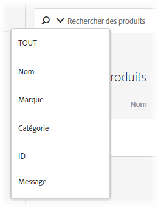

#  recherche catalogue{#catalog-search}

La page [!UICONTROL Recherche catalogue] vous aide à localiser les produits ou le contenu de votre catalogue.

Les catalogues font référence à l’ensemble de votre ensemble de produits (entités). Votre catalogue peut contenir de nombreuses collections, ce qui permet d’organiser vos produits dans des intervalles logiques.

Pour accéder à la page [!UICONTROL Recherche catalogue], cliquez sur **[!UICONTROL Recommendations]** > **[!UICONTROL Recherche catalogue]**.

La tâche la plus élémentaire que vous pouvez effectuer sur cette page est de rechercher un élément. En outre, vous pouvez modifier l’environnement ; enregistrer les résultats de la recherche dans des collections ou des exclusions ; ajoutez, supprimez ou réorganisez les colonnes du tableau, et ajoutez de nouvelles facettes de recherche au panneau [!UICONTROL Filtres].

## Rechercher un élément

Vous pouvez utiliser une recherche simple ou avancée pour localiser des articles dans votre catalogue.

### Exécution d’une recherche simple

1. Tapez un terme de recherche dans le champ **[!UICONTROL Produits de recherche]**.

1. (Facultatif) Vous pouvez affiner votre recherche en sélectionnant une option de recherche dans le menu d’options qui s’affiche lorsque vous cliquez sur la flèche vers le bas dans le champ de recherche.

   

   Les options de recherche disponibles sont les suivantes :

   * TOUT - Recherche dans tous les autres critères de recherche, en utilisant la logique OU.
   * Nom
   * Marque
   * Catégorie
   * ID
   * Message

1. Vous pouvez désormais faire défiler les éléments des résultats de la recherche vers les vignettes de vue et d’autres informations sur les produits.

   L&#39;illustration suivante montre les résultats pour &quot;vélo&quot; à l&#39;aide de l&#39;option Tous.

   

   Le nombre qui s’affiche en regard de « Produits » est le nombre de produits qui correspondent au terme de recherche, sur le total disponible dans l’environnement spécifié.

   Vous pouvez utiliser la fonctionnalité de saisie semi-automatique de la recherche. Dans l’illustration suivante, la saisie de &quot;vélo&quot; renvoie tous les produits qui contiennent le mot &quot;vélo&quot;.

   

   >[!NOTE]
   >
   >Lorsque vous effectuez une recherche catalogue sur un attribut personnalisé doté d’une valeur numérique, les résultats traitent l’attribut personnalisé comme un type String plutôt que comme une valeur numérique.
   >
   >Actuellement, aucune fonctionnalité disponible ne permet aux clients de modifier le type d’un attribut. Pour apporter une modification, [ouvrez un problème client](/help/cmp-resources-and-contact-information.md#reference_ACA3391A00EF467B87930A450050077C) référençant les attributs dont le type doit être passé de chaîne à numérique.

1. Vous pouvez également utiliser des filtres pour trouver le produit souhaité. Dans l&#39;exemple suivant, en développant la facette [!UICONTROL Collections] et en sélectionnant &quot;Outils Vélo&quot;, tous les outils de vélo de votre catalogue s&#39;affichent.

   

1. Vous pouvez effectuer une recherche plus approfondie dans la liste de résultats en entrant un terme de recherche, par exemple &quot;chaîne&quot;.

   

### Exécution d’une recherche avancée {#advanced-search}

Vous pouvez utiliser [!UICONTROL Recherche avancée] pour affiner davantage vos résultats de recherche ou pour enregistrer vos résultats de recherche sous la forme d&#39;une [collection](/help/c-recommendations/c-products/collections.md) ou d&#39;une [exclusion](/help/c-recommendations/c-products/exclusions.md).

1. Cliquez sur le lien **[!UICONTROL Recherche avancée]**.

   

1. Utilisez les listes déroulantes pour spécifier le paramètre, l’opérateur et les valeurs de votre recherche.

1. (Facultatif) Cliquez sur **[!UICONTROL Ajouter la règle]** pour ajouter une règle de recherche supplémentaire.

   Chaque règle de recherche supplémentaire est associée à l’opérateur ET.

1. Cliquez sur **[!UICONTROL Rechercher]**.

1. (Facultatif) Cliquez sur **[!UICONTROL Enregistrer sous]**, puis sur **[!UICONTROL Collection]** ou **[!UICONTROL Exclusion]**.

   

   Pour plus d’informations, voir [Création d’une collection ou d’une exclusion basée sur la recherche avancée](#save-as) ci-dessous.

## Vue des détails d’un élément

Vous pouvez vue les détails d’un élément individuel, notamment son ID, son nom, son message, sa catégorie, etc. en affichant ses détails.

1. Cliquez sur un élément dans les résultats de la recherche pour en vue les détails.

   

## Supprimer un élément du catalogue

1. Cliquez sur un élément dans les résultats de la recherche pour en vue les détails.

1. Cliquez sur **[!UICONTROL Supprimer du catalogue]**.

1. Confirmez que vous souhaitez supprimer l’élément.

Toutes les informations relatives à cet élément sont supprimées de l’index de catalogue. L’élément sera inclus dans votre catalogue uniquement s’il est de nouveau ajouté dans un flux de données. Un élément supprimé doit être supprimé séparément des flux.

## Actualiser le catalogue

L’index de votre catalogue est automatiquement créé lorsque vous téléchargez votre premier flux et actualisé selon la [planification spécifiée](/help/c-recommendations/c-products/feeds.md#steps).

Le catalogue est automatiquement actualisé lorsque des mises à jour sont reçues via des fichiers de flux, des API ou des mises à jour de mbox. Les mises à jour sont généralement effectuées en une heure. Si des mises à jour sont en cours, l’heure de début de la mise à jour la plus récente s’affiche. Si aucune mise à jour n’est en cours, l’heure de début et de fin de la mise à jour la plus récente s’affiche.

## Création d’une collection ou d’une exclusion à l’aide de la recherche avancée {#save-as}

Vous pouvez créer des [collections](/help/c-recommendations/c-products/collections.md) ou des [exclusions](/help/c-recommendations/c-products/exclusions.md) à l’aide de la fonctionnalité de recherche avancée de la page de recherche catalogue ([!UICONTROL Recommandations] > [!UICONTROL Recherche catalogue] > [!UICONTROL Recherche avancée]).

1. Exécutez une [recherche avancée](#advanced-search).

1. Cliquez sur **[!UICONTROL Enregistrer sous]**, puis sur **[!UICONTROL Collection]** ou **[!UICONTROL Exclusion]**.

   

   >[!IMPORTANT]
   >
   >La fonctionnalité [!UICONTROL Recherche avancée] ne respecte pas la casse ; toutefois, les produits renvoyés au moment de la diffusion sont basés sur une recherche sensible à la casse. Cette incohérence peut prêter à confusion. Veillez à respecter la casse lorsque vous créez des collections ou des exclusions en fonction des résultats à l’aide de la fonctionnalité [!UICONTROL Recherche avancée]. Par exemple, si vous effectuez une recherche portant sur « Vacances », cette recherche initiale répertorie les résultats contenant « Vacances » et « vacances ». Si vous créez ensuite un catalogue avec l’intention de renvoyer les produits contenant « vacances », seuls les produits contenant « vacances » sont renvoyés. Les produits contenant « Vacances » ne sont pas renvoyés. Les exclusions sont traitées de façon similaire. 

## Modifier l’environnement

[Les ](/help/administrating-target/environments.md) environnements vous permettent d’organiser vos sites et vos environnements de préproduction pour une gestion aisée et des rapports séparés.

1. Cliquez sur le lien Environnement.

   

1. Sélectionnez l’environnement de votre choix.

## Modification de la page de recherche de catalogue (filtres et colonnes)

Vous pouvez temporairement modifier les filtres et colonnes disponibles sur la page [!UICONTROL Recherche catalogue] pour la session en cours.

### Modifier les filtres

Vous pouvez ajouter d’autres facettes de filtre à la page [!UICONTROL Recherche catalogue].

1. Dans le panneau **[!UICONTROL Filtres]**, cliquez sur **[!UICONTROL Modifier]**.

   

1. Sélectionnez les facettes de recherche de votre choix (ID, nom, message, etc.).

   

N’oubliez pas que les facettes de filtre supplémentaires sont disponibles uniquement dans la session active.

### Modifier les colonnes

Vous pouvez temporairement modifier les colonnes principales de la page [!UICONTROL Recherche catalogue].

1. Cliquez sur le lien **[!UICONTROL Colonnes]**.

   

1. (Conditionnel) Pour réorganiser l’ordre des colonnes principales, faites glisser et déposez les colonnes de la section **[!UICONTROL Colonnes Principales]** dans l’ordre souhaité.

1. (Conditionnel) Faites glisser des éléments de **[!UICONTROL Principales Columns]** vers **[!UICONTROL Inactive Columns]** (et vice versa), selon vos besoins.

   Vous pouvez également cliquer sur l’icône de suppression ( x ) en regard de la colonne que vous souhaitez déplacer de la section principale à la section inactive.

N’oubliez pas que les modifications que vous apportez s’appliquent uniquement à la session en cours.

