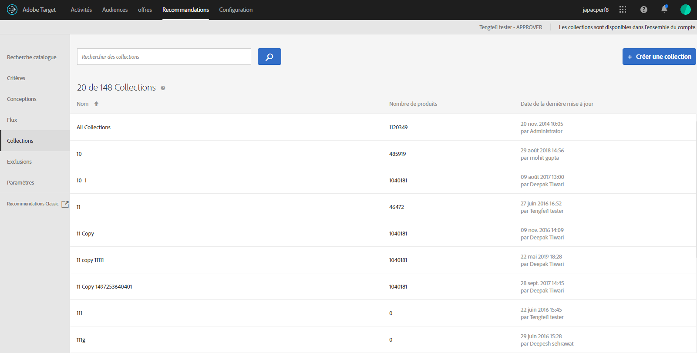

#  Collections {#collections}

Une collection correspond à l’ensemble des produits ou éléments admissibles pour la recommandation. Une collection est définie en spécifiant les conditions qui doivent être remplies par les éléments pour en faire partie.

Généralement, une collection est un ensemble d’éléments similaires ou associés, par exemple une collection de produits uniques. Cependant, vous pouvez regrouper les éléments dans une catégorie qui a du sens pour votre entreprise, par exemple les produits d’une certaine gamme de prix ou d’une certaine couleur ou les éléments susceptibles d’être intéressants dans une zone géographique particulière.

Utilisez les collections pour organiser vos produits dans des groupes logiques. Par exemple, si certains éléments sont disponibles dans une région mais pas dans une autre, vous pouvez créer une collection qui exclut les éléments qui ne sont pas disponibles dans la région du visiteur. Vous pouvez également utiliser les collections pour organiser des éléments saisonniers ou d’autres paramètres fonctionnels qui s’appliquent à votre entreprise.

Les [recommandations de sauvegarde](/help/c-recommendations/c-algorithms/backup-recs.md) générées pour chaque critère dans la recommandation utilisent également cette collection. Dès lors, seuls les éléments de la collection sont inclus dans la recommandation de sauvegarde. Avec les collections, vous avez la garantie que seuls les produits qu’il y a lieu de présenter à un emplacement donné sont affichés.

Les collections peuvent être recréées ou mises à jour chaque fois qu’un critère s’exécute.

Vous pouvez regrouper vos éléments dans des catalogues, puis créer des recommandations distinctes pour chaque collection.

Les critères d’inclusion vous permettent d’effectuer des opérations similaires aux collections mais ils doivent être configurés chaque fois que vous créez une activité. Les collections vous permettent de créer un ensemble d’éléments une seule fois et de l’utiliser chaque fois que vous le souhaitez sans avoir à le configurer à nouveau.

Lorsque vous créez ou modifiez une activité [!DNL Recommendations], le nom de la collection s’affiche à côté de l’étiquette [!UICONTROL Critères] dans le diagramme d’activités.

>[!NOTE]
>
>Les collections ne sont pas appliquées lors de l’utilisation de la clé de recommandation des [!UICONTROL Éléments récemment consultés].

## Création d’une collection {#task_1256DFF6842141FCAADD9E1428EF7F08}

Créez une collection pour organiser les produits ou le contenu que vous souhaitez afficher dans vos recommandations.

1. Cliquez sur **[!UICONTROL Recommandations]** > **[!UICONTROL Collections]** pour afficher la liste des collections existantes.

   

   La page [!UICONTROL Collections] affiche une liste de vos collections existantes. Pour créer de nouvelles collections, cliquez sur le bouton [!UICONTROL Créer une collection] . Vous pouvez également modifier, copier et supprimer des collections existantes en passant la souris sur la collection souhaitée et en cliquant sur l’icône de votre choix.

   

   Le « nombre d’éléments » consigné pour chaque collection sur la liste [!UICONTROL Collections] est le nombre de produits correspondant aux règles de ladite collection dans le [groupe d’hôtes](/help/administrating-target/hosts.md) configuré par défaut de Recommendations (environnement). Consultez les [Paramètres](../../c-recommendations/plan-implement.md#concept_C1E1E2351413468692D6C21145EF0B84) pour modifier le groupe d’hôtes par défaut.

1. Cliquez sur **[!UICONTROL Créer une collection]**.

1. (Conditionnel) Choisissez un environnement dans le **[!UICONTROL filtre Environnement]** lors de la création (ou de la mise à jour) d’une collection pour prévisualiser le contenu de la collection dans cet environnement. Par défaut, les résultats du groupe d’hôtes par défaut s’affichent.

   

1. Entrez un **[!UICONTROL Nom]** pour la collection.

   Vous pouvez saisir une **[!UICONTROL description facultative]**.

1. Définissez les règles utilisées pour générer la collection.

   Ainsi, votre collection peut-elle être créée sur la base d’une catégorie ou d’un ID de produit, d’une marge bénéficiaire ou de tout autre paramètre de la liste.

   Vous pouvez ajouter des règles pour utiliser plusieurs paramètres pour définir une collection. Plusieurs règles sont jointes par un opérateur ET. Pour que la collection soit appliquée, toutes les règles spécifiées doivent être respectées.

1. Cliquez sur **[!UICONTROL Enregistrer]**.

## Création d’une collection à l’aide de la recherche avancée

Vous pouvez également créer des collections à l’aide de la fonctionnalité de recherche avancée de la page de [recherche catalogue](/help/c-recommendations/c-products/catalog-search.md#save-as) ([!UICONTROL Recommandations] > [!UICONTROL Recherche catalogue] > [!UICONTROL Recherche avancée]).

Après avoir créé une recherche avec « id > contient », par exemple, vous pouvez cliquer sur [!UICONTROL Enregistrer sous] > [!UICONTROL Collection].

>[!IMPORTANT]
>
>La fonctionnalité de recherche avancée n’est pas sensible à la casse ; cependant, les produits renvoyés lors de la diffusion sont basés sur une recherche sensible à la casse. Cette incohérence peut prêter à confusion. Veillez à tenir compte du respect de la casse lorsque vous créez des collections sur la base de résultats obtenus à l’aide de la fonctionnalité de recherche avancée. Par exemple, si vous effectuez une recherche portant sur « Vacances », cette recherche initiale répertorie les résultats contenant « Vacances » et « vacances ». Si vous créez ensuite un catalogue avec l’intention de renvoyer les produits contenant « vacances », seuls les produits contenant « vacances » sont renvoyés. Les produits contenant « Vacances » ne sont pas renvoyés.

## Modification, copie ou suppression d’une collection

Passez la souris sur la collection souhaitée dans la liste, puis cliquez sur l’icône appropriée : modifier, copier ou supprimer.

Vous pouvez copier une collection existante pour créer une collection de duplicata que vous pourrez ensuite modifier. Cela vous permet de créer une exclusion similaire avec moins d’efforts.

Sachez que les collections sont disponibles sur l’ensemble du compte. Veillez à tenir compte de ce point avant de supprimer une collection. Impossible de récupérer les collections supprimées.

## Utilisation d’une collection dans une activité Recommendations

1. Créez une collection en utilisant l’une des méthodes mentionnées ci-dessus.

1. Cliquez sur **[!UICONTROL Activités]** et [créez une activité Recommendations](/help/c-recommendations/t-create-recs-activity/create-recs-activity.md) ou modifiez une activité existante.

1. Après avoir sélectionné un critère et une conception, la page [!UICONTROL Options] s’affiche lorsque vous sélectionnez la collection souhaitée.

   

1. (Conditionnel) Pour modifier un paramètre de collection existant, sur la page **[!UICONTROL Expériences]** (étape 2 du processus guidé en trois parties), cliquez sur un emplacement où vous avez placé les recommandations, cliquez sur **[!UICONTROL Modifier la collection]**, puis sélectionnez la collection souhaitée.

   

## Training video: Create collections and exclusions in Recommendations (7:05) 

Cette vidéo traite des sujets suivants :

* Créer une collection
* Créer une exclusion

>[!VIDEO](https://video.tv.adobe.com/v/27689)