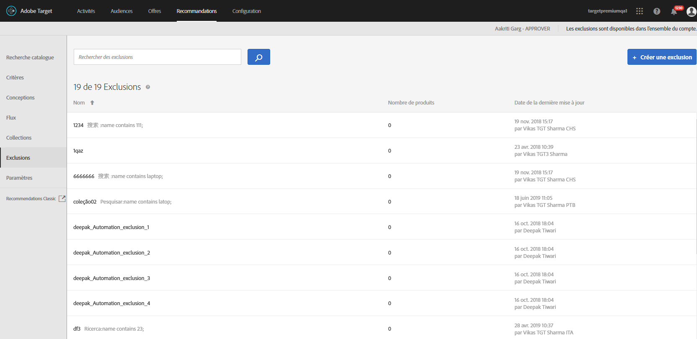

# Exclusions{#exclusions}

Créez une exclusion dans [!DNL Adobe Target Recommendations] pour empêcher que des produits ou du contenu ne soient recommandés aux visiteurs. Une exclusion est un sous-ensemble de produits ou de contenu qui ne doit pas être recommandé aux visiteurs.

Les exclusions sont disponibles pour l’ensemble du compte. Contrairement aux collections, où vous spécifiez une collection spécifique pour chaque expérience lorsque vous créez une activité [!UICONTROL Recommendations], les exclusions s’appliquent à toutes les activités du compte. Il n’existe aucune option permettant d’affecter un groupe d’exclusion lors de la création d’activités.

Voici quelques exemples d’utilisation des exclusions :

* Produits abandonnés
* Le catalogue automne/hiver est maintenant le seul catalogue qui doit être présent en ligne. Tout article du catalogue d’été n’est plus disponible à l’achat.
* Éléments susceptibles d’être inappropriés à recommander sur la plupart des pages/écrans (produits pour adultes, films NC-17, etc.)
* Produits avec des champs de métadonnées incomplets (miniature, prix ou autres métadonnées importantes manquants)
* Produits qui ne devraient jamais être recommandés (il existe peut-être un SKU dans le système pour quelque chose, mais il ne s’agit pas d’un article acheté, ou peut-être un SKU falsifié pour l’équipe d’assurance qualité afin de simuler un achat sans vraiment commander quelque chose, etc.)

>[!IMPORTANT]
>
>Les règles d’exclusion statiques et dynamiques sont des fonctionnalités puissantes qui peuvent vous aider dans vos efforts de marketing. Pour plus d’informations, des exemples et des scénarios de cas d’utilisation, voir [Utilisation des règles d’inclusion dynamique et statique](/help/c-recommendations/c-algorithms/use-dynamic-and-static-inclusion-rules.md#concept_4CB5C0FA705D4E449BD0B37B3D987F9F).

## Créer une exclusion

1. Cliquez sur **[!UICONTROL Recommandations]** > **[!UICONTROL Exclusions]** pour afficher la liste des exclusions existantes. 

   

   Le « nombre d’éléments » consigné pour chaque exclusion sur la liste [!UICONTROL Exclusions] est le nombre de produits correspondant aux règles de ladite exclusion, dans le [groupe d’hôtes](/help/administrating-target/hosts.md) des Recommandations par défaut (environnement). Voir [Paramètres](/help/c-recommendations/plan-implement.md#concept_C1E1E2351413468692D6C21145EF0B84) pour modifier le groupe d’hôtes par défaut.

1. Cliquez sur **[!UICONTROL Créer une exclusion]**.

1. (Conditionnel) Sélectionnez un environnement dans le filtre **[!UICONTROL Environnement]** tout en créant (ou en mettant à jour) une exclusion afin de prévisualiser le contenu de l’exclusion dans cet environnement. Par défaut, les résultats du groupe d’hôtes par défaut s’affichent.

   

1. Saisissez un **[!UICONTROL Nom]** d’exclusion et une description (facultatif).

1. Utilisez le créateur de règles pour créer les exclusions.

   Sélectionnez un paramètre dans la liste Règles, sélectionnez un opérateur, puis saisissez une ou plusieurs valeurs pour identifier les produits. Séparez les diverses valeurs par des virgules.

1. Cliquez sur **[!UICONTROL Enregistrer]**.

## Création d’une exclusion à l’aide de la recherche avancée

Vous pouvez également créer des exclusions à l’aide de [!UICONTROL Recherche avancée] sur la page [Recherche catalogue](/help/c-recommendations/c-products/catalog-search.md#save-as) ( [!UICONTROL Recommendations] > [!UICONTROL Recherche catalogue] > [!UICONTROL Recherche avancée]).

Après avoir créé une recherche avec « id > contient », par exemple, vous pouvez cliquer sur [!UICONTROL Enregistrer sous] > [!UICONTROL Exclusion].

>[!IMPORTANT]
>
>La fonctionnalité [!UICONTROL Recherche avancée] ne respecte pas la casse ; toutefois, les produits renvoyés au moment de la diffusion sont basés sur une recherche sensible à la casse. Cette incohérence peut prêter à confusion. Veillez à tenir compte du respect de la casse lorsque vous créez des exclusions sur la base de résultats obtenus à l’aide de la fonctionnalité de recherche avancée. Par exemple, si vous effectuez une recherche portant sur « Vacances », cette recherche initiale répertorie les résultats contenant « Vacances » et « vacances ». Si vous créez ensuite une exclusion avec l’intention d’exclure les produits contenant « vacances », seuls les produits contenant « vacances » sont exclus. Les produits contenant « Vacances » ne sont pas exclus.

## Modifier, copier ou supprimer une exclusion

Passez la souris sur l’exclusion de votre choix dans la liste, puis cliquez sur l’icône appropriée : modifier, copier ou supprimer.

Vous pouvez copier une exclusion existante pour créer une exclusion de duplicata que vous pourrez ensuite modifier. Cela vous permet de créer une exclusion similaire avec moins d’efforts.

Gardez à l’esprit que les exclusions sont disponibles pour l’ensemble du compte. Veillez à tenir compte de ce point avant de supprimer une exclusion. Impossible de récupérer les exclusions supprimées.

## Vidéo de formation : Créer des collections et des exclusions dans Recommendations (7:05) 

Cette vidéo traite des sujets suivants :

* Créer une collection
* Créer une exclusion

>[!VIDEO](https://video.tv.adobe.com/v/27689)