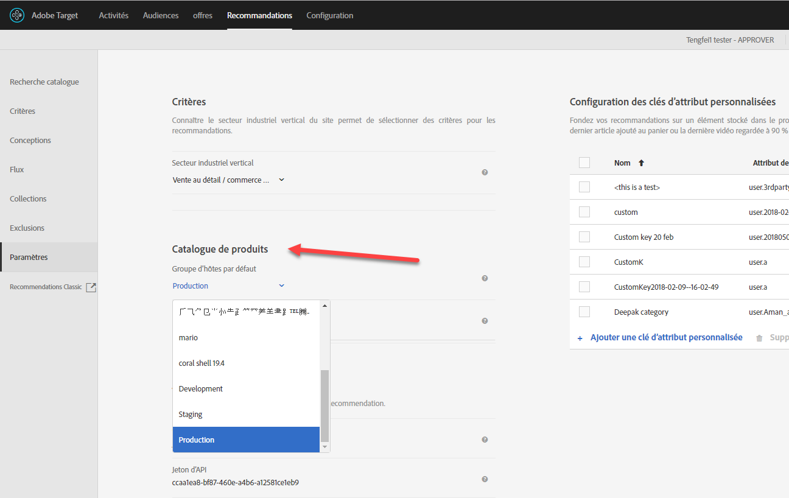
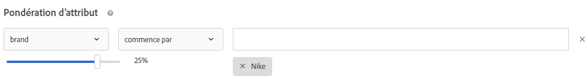

# Forum aux questions (FAQ) de Recommandations{#recommendations-faq}

Liste des questions fréquentes (FAQ) sur les activités Recommendations.

## Pourquoi la recherche catalogue n’affiche-t-elle pas les résultats corrects lorsque je recherche sur un attribut personnalisé avec une valeur numérique ?

Lorsque vous effectuez une recherche catalogue sur un attribut personnalisé doté d’une valeur numérique, les résultats traitent l’attribut personnalisé comme un type String plutôt que comme une valeur numérique.

Actuellement, aucune fonctionnalité disponible ne permet aux clients de modifier le type d’un attribut. Pour apporter une modification, [ouvrez un problème client](/help/cmp-resources-and-contact-information.md#reference_ACA3391A00EF467B87930A450050077C) référençant les attributs dont le type doit être passé de chaîne à numérique.

## Combien de temps faut-il pour que les mises à jour des éléments de mon catalogue soient répercutées sur mon site ?

Après l’importation d’un fichier de flux ou après la réception des mises à jour d’entité via l’API ou la mbox, les modifications suivantes sont répercutées en moins de 60 minutes :

* Attributs d’élément renvoyés dans le modèle de conception.
* Attributs d’élément utilisés dans les règles d’exclusion globales qui empêchent l’inclusion de l’élément dans les recommandations renvoyées.
* Attributs d’élément utilisés dans les règles d’inclusion dans les critères qui ont un impact si l’élément est inclus ou exclu dans les recommandations renvoyées.

Les modifications suivantes ne sont pas prises en compte avant que l’algorithme suivant ne s’exécute (dans les 12 à 24 heures) :

* Les attributs d’élément utilisés dans les règles de collection utilisées pour l’activité.
* Les attributs d’élément utilisés dans une promotion basée sur un attribut ou une collection associée à l’activité.
* Une catégorie d’éléments où l’élément apparaît pour une « catégorie en cours » ou une « catégorie préférée » dans l’algorithme Meilleures ventes ou Le plus consulté.
* Un classement des éléments recommandés lorsque l’attribut modifié est un attribut personnalisé utilisé comme clé personnalisée pour un algorithme.
* Un classement des éléments recommandés en fonction des attributs modifiés lorsque la logique de recommandation est « Articles avec des attributs similaires » lorsque des facteurs de pondération « Similarité de contenu » sont utilisés ou lorsque des facteurs « Pondération d’attribut » sont utilisés.

>[!NOTE]
>
>Un fichier de flux est considéré comme importé lorsque son état passe de « Importation des éléments » à « Préparation des mises à jour de l’index de recherche ». Les mises à jour peuvent prendre plus de 60 minutes dans l’interface utilisateur de recherche du catalogue ; La recherche catalogue est à jour lorsque l’état du flux devient « Mises à jour terminées ». Même si la recherche catalogue n’est pas encore à jour, votre site reflète les mises à jour selon les délais répertoriés ci-dessus. La durée de mise à jour de l’index de recherche catalogue la plus récente s’affiche sur la page Recherche catalogue.

## Que dois-je faire si des caractères spéciaux rompent ma matrice ?{#section_D27214116EE443638A60887C7D1C534E}

Utilisez des valeurs échappées dans JavaScript. Les guillemets ( &quot; ) peuvent rompre la matrice. Le fragment de code suivant est un exemple de valeurs échappées :

```
#set($String='') 
#set($escaper=$String.class.forName('org.apache.commons.lang.StringEscapeUtils')) 
<script type="text/javascript"> 
console.log("$escaper.escapeJavaScript($entity1.name)") 
console.log("$escaper.escapeJavaScript($entity2.name)") 
console.log('$escaper.escapeJavaScript($entity3.name)') 
names.push("$escaper.escapeJavaScript($entity4.name)") 
</script>
```

## Pourquoi tous les critères, y compris les critères personnalisés, ne sont-ils pas disponibles pour sélection lors de la création d’une activité de recommandations ? {#section_B2265AC8B8A94E0298D495A05C5D817F}

Les critères disponibles sont basés sur la catégorie actuelle. Lorsque vous créez des offres de recommandations, le sélecteur d’algorithmes affiche les critères sur la base de l’ID de catégorie.

Si l’emplacement sur lequel vous appliquez ce critère ne contient pas l’ID de catégorie, certains critères ne sont pas disponibles dans le sélecteur d’algorithmes.

Si vous utilisez un emplacement où l’ID de catégorie est présent dans la mbox, le sélecteur de critères contient tous les critères applicables.

Target comporte un paramètre [Filtrer les critères incompatibles](/help/c-recommendations/plan-implement.md#concept_C1E1E2351413468692D6C21145EF0B84) permettant de contrôler le filtrage intelligent du sélecteur d’algorithmes.

>[!NOTE]
>
>Ce paramètre s’applique seulement aux activités créées dans le compositeur d’expérience visuelle. Ce paramètre ne s’applique pas aux activités créées dans le compositeur d’expérience d’après les formulaires (Target ne dispose pas de contexte d’emplacement).

Pour accéder au paramètre [!UICONTROL Filtrer les critères incompatibles], cliquez sur [!UICONTROL Recommandations] > [!UICONTROL Paramètres] :


Si le paramètre [!UICONTROL Filtrer les critères incompatibles] n’est PAS activé, Target ne filtre pas les algorithmes dans le sélecteur d’algorithmes et tous les algorithmes s’affichent.

Si le paramètre [!UICONTROL Filtrer les critères incompatibles] est activé, dans les activités du compositeur d’expérience visuelle, Target lit les paramètres entityId et categoryId à partir de l’emplacement sélectionné, puis affiche des algorithmes basés sur `currentItem|currentCategory` (si des valeurs respectives sont présentes à cet emplacement). Par conséquent, par défaut, seuls les algorithmes compatibles pour l’emplacement sélectionné sont affichés dans le sélecteur d’algorithmes.

Si le paramètre [!UICONTROL Filtrer les critères incompatibles] est activé, vous pouvez toujours afficher des algorithmes non compatibles en désélectionnant la case [!UICONTROL Compatible] lors de la sélection des critères.


La liste suivante contient des cas spéciaux pour lesquels Target n’affiche pas la case [!UICONTROL Compatible] :

* Les paramètres entityId et categoryId sont présents à l’emplacement, puis rien n’est filtré.
* Vous utilisez [!DNL mbox.js] version 55 ou antérieure.
* Aucun appel de mbox n’est déclenché depuis la page (!config.isAutoCreateGlobalMbox &amp;&amp; !config.isRegionalMbox)
* Les paramètres de Target ne sont pas définis.

## Que dois-je faire si une collection dans Recommandations atteint zéro (0) ?  {#section_E2DB2FE67CF24EEC81412BFF3FA6385D}

Tenez compte des informations suivantes si vous voyez une collection atteindre zéro qui n’était pas auparavant à zéro :

* Vous pouvez réenregistrer la collection et voir si cela met à jour le nombre. Notez qu’en effectuant un nouvel enregistrement, la collection réexécute tous les algorithmes utilisant cette collection.
* Êtes-vous dans le bon environnement ? Accédez à [!DNL /target/products.html#recsSettings] pour revérifier (comme illustré ci-dessous).

   

* Votre index est-il à jour ? Accédez à [!DNL /target/products.html#productSearch] et vérifiez l’âge en heures de l’index depuis sa création (par exemple « Indexé il y a 3 heures »). Vous pouvez actualiser l’index si nécessaire.
* Avez-vous modifié un élément dans le flux ou dans la couche de données qui fait que vos entités ne correspondent plus aux règles de collecte ? Assurez-vous que la CASSE correspond (sensible à la casse).
* Le flux a-t-il fonctionné correctement ? Quelqu’un a-t-il changé le répertoire, le mot de passe FTP, etc. ?
* Target fait de son mieux pour que les mises à jour de la diffusion (sur la page/l’application du client) soient effectuées le plus rapidement possible. Cependant, nous devons également fournir une représentation dans l’interface utilisateur pour le responsable du marketing. Nous ne retardons pas nécessairement les mises à jour de diffusion pour attendre que les mises à jour de l’interface utilisateur soient synchronisées. Vous pouvez utiliser [mboxTrace](/help/c-activities/c-troubleshooting-activities/content-trouble.md) pour voir ce qui se trouve dans le système au moment où une demande arrive.

## Quelle est la différence entre la pondération générale des attributs et la pondération des attributs spécifiques à la similarité de contenu ?{#section_FCD96598CBB44B16A4C6C084649928FF}

La pondération des attributs existe sous deux formes : « pondération standard des attributs » et « pondération des attributs de similarité de contenu ».

La « pondération standard des attributs » s’applique à la plupart, ou même à tous les types de critères (et pas seulement à la similarité de contenu). Ce type de pondération donne plus de poids à certaines valeurs d’attribut. Dans l’exemple suivant, les produits Nike seront favorisés dans les recommandations de sortie.



La « pondération des attributs de similarité de contenu » s’applique uniquement aux critères de similarité de contenu.

Ce type de pondération est plus dynamique et repose sur la « clé de recommandation » actuelle (l’élément actuellement consulté). Dans l’exemple suivant (marque 16x), si un visiteur regardait des baskets Nike, il est plus susceptible de se voir recommander d’autres produits Nike (pas nécessairement seulement des baskets) plutôt que des baskets de concurrents. Si un visiteur regardait des baskets Adidas, il est plus susceptible de se voir recommander des produits Adidas.


## Pourquoi les recommandations ne sont-elles parfois pas affichées par Target ?  {#section_DB3F40673AED42228E407C05437D99E9}

Il arrive parfois que Target ne parvienne pas à afficher des recommandations en raison du faible nombre de recommandations disponibles.

Le nombre de valeurs générées par critère est égal à 3 fois le nombre d’entités spécifié dans la conception. Le filtrage d’exécution (par exemple la correspondance d’attributs inventaire/mbox) est appliqué une fois les valeurs générées 3 fois, aussi est-il possible que moins de 3 valeurs soient générées au moment de la livraison. Pour pallier cette situation, augmentez le nombre d’entités dans la conception en masquant les autres entités.

Le JavaScript suivant peut être utilisé au début de la conception pour augmenter le nombre d’entités demandées. Dans cet exemple, le nombre d’entités demandées serait de 30 (3x10).

```
#foreach($entity in $entities) 
 #if( $foreach.count > 10 ) 
  #break 
 #end 
 #set ($foo = $entity.id) 
#end 
```

## Quelle est la taille limite d’un appel d’API pour les produits à insérer/mettre à jour ? Puis-je mettre à jour 50 000 produits en un seul appel en utilisant l’API au lieu d’un flux ?  {#section_434FE1F187B7436AA39B7C14C7895168}

Target impose une limite de 50 Mo au niveau de l’application. Cependant, cela s’applique seulement lorsque vous transmettez l’en-tête de type de contenu `application/x-www-form-urlencoded`.

Vous pourriez certainement essayer d’envoyer 50 000 produits en un seul appel. Si cela échoue, vous devez le diviser en lots. Nous recommandons habituellement aux clients de diviser leurs appels en 5 000 ou 10 000 lots de produits afin de réduire la probabilité d’un délai d’attente en raison de la charge du système.

## Dois-je spécifier le nom de la mbox lors de la création de règles de test de critère de recommandation, de promotion ou de modèle ?  {#section_FFA42ABCC5954B48A46526E32A3A88A2}

Lors de la création d’une règle de test de critère de recommandation, de promotion ou de modèle basée sur un paramètre mbox, `mboxParameter` ne vous demande plus `mboxName`. Le nom de mbox est désormais optionnel. Cette modification vous permet d’utiliser les paramètres de plusieurs mbox ou de référencer un paramètre qui n’a pas encore été enregistré.

Pour sélectionner le paramètre désiré :

* Lors de la création d’une nouvelle règle de test de critère, de promotion ou de modèle, sélectionnez un nom de paramètre dans la liste, commencez à taper les premiers caractères du nom de paramètre souhaité ou tapez le nom complet du nom de paramètre souhaité.
* Si vous vous souvenez du nom de mbox, mais pas du nom du paramètre, utilisez la case à cocher pour filtrer une mbox connue qui transmet le paramètre désiré.

Quelle que soit la méthode, il n’existe aucun lien entre la mbox et le paramètre. La règle de test de critère, de promotion ou de modèle fonctionnera sur la base du paramètre à travers tous les mboxes qui transfèrent ce paramètre.

Si vous modifiez une règle de test de critère, de promotion ou de modèle existante, le critère de filtrage s’affiche avec le nom mbox fourni lors de la création.

## Pourquoi ne puis-je pas enregistrer mon activité de Recommandations héritée après avoir défini une nouvelle audience ?  {#section_1E47C40B1FE7479BAC3EE0F50CE7C2C4}

Assurez-vous que le nom de l’audience est unique. Si le nom que vous lui avez donné est celui d’une audience déjà existante, vous ne pouvez pas enregistrer votre activité de Recommandations héritée (activité de Recommandations créée avant octobre 2016).

## Quelle est la taille maximale d’un fichier CSV pour un chargement de flux ?  {#section_20F1AF4839A447B9889B246D6E873538}

Le nombre de lignes ou la taille de fichier pour le chargement de flux d’un fichier CSV sont illimités. Cependant, la bonne pratique est de limiter la taille du fichier CSV à 1 Go, afin d’éviter les échecs pendant le transfert du fichier. Si la taille du fichier est supérieure à 1 Go, dans l’idéal, vous devez le diviser en plusieurs fichiers de flux. Le nombre de colonnes d’attributs personnalisés est limité à 100. Le nombre de caractères des attributs personnalisés est limité à 4 096. Plus d’informations sur la longueur des colonnes disponibles sur la [page dédiée aux Limites dans Target](/help/r-troubleshooting-target/target-limits.md#reference_BEFE60C3AAA442FF94D4EBFB9D3CC9B1).

## Puis-je exclure dynamiquement une entité ?

Dans la chaîne de requêtes, vous pouvez transférer des ID d’entité à des entités que vous souhaitez exclure de vos recommandations. Par exemple, vous souhaitez peut-être exclure des articles déjà présents dans le panier.

Pour activer la fonctionnalité d’exclusion, utilisez le paramètre mbox `excludedIds`. Ce paramètre pointe sur une liste d’ID d’entité séparés par des virgules. Par exemple, `mboxCreate(..., "excludedIds=1,2,3,4,5")`. La valeur est envoyée lors de la demande de recommandations.

L&#39;exclusion est effectuée pour l&#39;appel de Cible en cours uniquement ; les éléments ne sont pas exclus lors des appels de Cible suivants, sauf si la valeur `excludedIds` est retransmise. Pour exclure des éléments du panier des recommandations sur chaque page, continuez à transmettre la valeur `excludedIds` sur chaque page.

>[!NOTE]
>
>Si un trop grand nombre d’entités sont exclues, les recommandations se comportent comme s’il n’y avait pas assez d’entités pour remplir le modèle de recommandation.

Pour exclure `entityIds`, ajoutez le jeton `&excludes=${mbox.excludedIds}` à l’URL de contenu de l’offre. Lorsque l’URL de contenu est extraite, les paramètres requis sont substitués en utilisant les paramètres de requête mbox actuels.

Par défaut, cette fonctionnalité est activée pour les recommandations nouvellement créées. Les recommandations existantes doivent être enregistrées pour prendre en charge les Entités exclues dynamiquement.

## Que signifie la réponse NO_CONTENT parfois renvoyée dans la trace de contenu Recommendations ?

NO_CONTENT est renvoyé lorsque des recommandations ne sont pas disponibles pour la combinaison algorithme et clé demandée. En règle générale, cela se produit lorsque les sauvegardes sont désactivées pour l’algorithme et qu’une ou plusieurs des conditions suivantes sont également vérifiées :

* Les résultats ne sont pas encore prêts.

   Cela se produit généralement lors de la première enregistrement d’une activité nouvellement créée ou après des modifications de configuration apportées à la collection, aux critères ou aux promotions utilisés dans l’activité.

* Les résultats sont prêts, mais pas encore mis en cache sur le serveur Edge le plus proche, pour la combinaison algorithme/clé demandée.

   La requête qui vient d’être envoyée déclenche une opération de mise en cache, de sorte que cette opération doit se résoudre après quelques rechargements de page et/ou quelques minutes de temps.

* Les résultats sont prêts, mais pas disponibles pour la valeur de clé fournie.

   Cela se produit généralement lors de la demande de recommandations pour un élément qui a été ajouté au catalogue après l’exécution de l’algorithme le plus récent et qui sera résolu après la prochaine exécution de l’algorithme.

* Le rendu partiel du modèle est désactivé et les résultats disponibles ne sont pas suffisants pour remplir le modèle.

   Cela se produit généralement lorsque vous disposez d’une règle d’inclusion dynamique, qui filtres agressivement de nombreux éléments à partir des résultats possibles. Pour éviter cela, activez les sauvegardes et n’appliquez pas la règle d’inclusion aux sauvegardes, ou utilisez les critères de manière séquentielle avec un critère filtré moins agressif.

