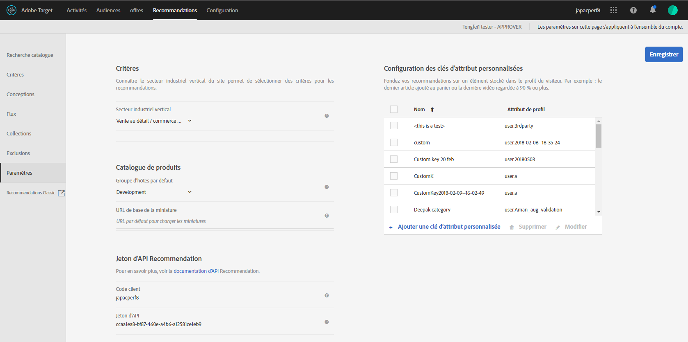

#  Plan et mise en oeuvre de Recommendations {#plan-and-implement-recommendations}

Ce que vous devez savoir avant de créer une activité de recommandations.

## Planification et implémentation de Recommandations {#concept_02AA644A4C7D4D5CB1D9CADA208CF8D1}

Ce que vous devez savoir avant de créer une activité [!DNL Recommendations].

[!DNL Recommendations] requiert de configurer la hiérarchie d’informations suivante :

| Étape | Informations | Détails |
|--- |--- |--- |
|  | Bibliothèque JavaScript | Chaque page requiert une référence à at.js version 0.9.1 (ou ultérieure) ou à mbox.js version 55 (ou ultérieure). Cette étape d’implémentation est requise sur toutes les pages où une activité Target sera utilisée et peut inclure des clés telles qu’un ID de produit ou de catégorie.<BR>Pour plus d’informations sur at.js, voir [Implémentation d’at.js](/help/c-implementing-target/c-implementing-target-for-client-side-web/t-mbox-download/c-target-atjs-implementation/target-atjs-implementation.md).<br>Pour plus d’informations sur mbox.js, voir [Implémentation de mbox.js](/help/c-implementing-target/c-implementing-target-for-client-side-web/t-mbox-download/mbox-download.md). |
|  | Clés | La clé détermine le type de produit ou de contenu qui s’affiche dans vos recommandations. Par exemple, la clé peut être une catégorie de produit. Voir [Axer la recommandation sur une clé de recommandation](/help/c-recommendations/c-algorithms/base-the-recommendation-on-a-recommendation-key.md). |
|  | Attributs | Les attributs fournissent des informations plus spécifiques sur les produits que vous souhaitez afficher. Par exemple, vous souhaitez peut-être afficher des produits compris dans une certaine plage de prix ou les éléments dont l’inventaire respecte un certain seuil. Les attributs peuvent être fournis dans la mbox ou au moyen d’un [flux](/help/c-recommendations/c-products/feeds.md).<br>Voir [Spécification des règles](/help/c-recommendations/c-algorithms/create-new-algorithm.md#inclusion)d’inclusion. |
|  | Exclusions | Les exclusions déterminent les éléments spécifiques qui n’apparaissent pas dans vos recommandations.<br>Voir [Exclusions](/help/c-recommendations/c-products/exclusions.md). |
|  | Détails des achats | Les détails des achats fournissent des informations sur les éléments achetés et sur la commande lorsque l’achat est terminé. |

## Implémentation de base {#concept_D1154A3FB0FB4467A29AD2BDD21C82D5}

L’implémentation de base requiert que vous transfériez des paramètres à votre page qui déterminent les produits ou les services qui apparaissent dans vos recommandations.

Avant de commencer à configurer une activité [!DNL Recommendations], vous devez comprendre de quelle façon les données de produits sont fournies sur [!DNL Recommendations] et déterminer la méthode qui vous convient le mieux.

Il existe deux méthodes permettant de fournir des informations sur les produits et les services sur [!DNL Recommendations] :

| Méthode | Description |
|--- |--- |
| Transférer des paramètres directement à la page | Cette méthode fonctionne bien pour des éléments qui changent fréquemment. Néanmoins, comme cette méthode requiert que les modifications soient effectuées directement sur la page, dans de nombreuses entreprises, elle nécessite l’implication du service informatique et des personnes qui implémentent les pages. |
| Transférer les paramètres au moyen d’un flux Google ou d’un fichier CSV | Cette méthode fonctionne bien pour les collections qui ne changent pas fréquemment. Il n’est généralement pas nécessaire de modifier votre implémentation ou d’autre code de page afin de fournir des informations sur les produits par le biais d’un flux. Néanmoins, la liste des produits reste statique, ce qui rend les modifications rapides plus difficiles. Pour plus d’informations, voir [Flux](/help/c-recommendations/c-products/feeds.md). |

Ces méthodes peuvent être utilisées séparément ou ensemble, comme dans les exemples suivants.

## Exemple 1 : combiner une page et des flux {#section_DF6BAE4BF11548BD9C44D0A426BCF5A7}

Une option d’implémentation [!DNL Recommendations] courante utilise les paramètres de la page et les flux.

Cette méthode vise plutôt un détaillant dont le catalogue de produits est relativement stable et qui souhaite mettre en avant des éléments saisonniers spécifiques ou des éléments qui sont en solde. La plupart des clients peuvent fournir les informations principalement par le flux, avec des ajustements occasionnels de la page.

Utilisez un flux pour fournir des informations qui ne changent pas fréquemment. Que vous utilisiez un fichier CSV ou un flux Google, utilisez les paramètres suivants :

* Paramètres requis

   * `entity.id`

* Paramètres utiles

   * `entity.name`
   * `entity.categoryId`
   * `entity.brand`
   * `entity.pageUrl`
   * `entity.thumbnailUrl`
   * `entity.message`
   * Tous les attributs personnalisés

Une fois que le flux est configuré et transmis à [!DNL Recommendations], transmettez les paramètres sur la page pour les attributs qui changent fréquemment, c’est-à-dire plus souvent qu’une fois par jour.

* Paramètres requis

   * `entity.id`
   * `entity.categoryId`

* Paramètres utiles

   * `entity.inventory`
   * `entity.value`

La priorité est donnée au jeu de données qui s’est exécuté le plus récemment. Si vous transférez le flux d’abord et que vous mettez ensuite à jour les paramètres de la page, les modifications apportées aux paramètres de la page s’affichent, remplaçant les informations d’élément transférées dans le flux.

## Exemple 2 : transférer tous les paramètres sur la page de détails des produits (ou du contenu){#section_D5A4F69457604CA7AACFD7BFF79B58A9}

Si vous transférez tous les paramètres sur la page, vous pouvez rapidement effectuer des mises à jour en mettant la page à jour. Dans certaines entreprises, cette opération requiert l’implication du service informatique ou de l’équipe de conception web.

Cet exemple peut être particulièrement utile pour les entreprises multimédias, dont le contenu change constamment.

* Paramètres requis

   * `entity.id`
   * `entity.categoryId`
   * Tous les autres attributs

## Exemple de code {#section_6E8A73376F30468BB549F337C4C220B1}

Par exemple, vous pouvez utiliser le code suivant dans la section d’en-tête de votre produit ou dans les pages de contenu :

```
function targetPageParams() {
 return {
    "entity": {
       "id": "32323",
       "categoryId": "My Category",
       "value": 105.56,
       "inventory": 329
    }
 }
}
```

Pour d’autres exemples du code que vous pouvez utiliser sur les différents types de pages, voir [Implémentation selon le type de page](/help/c-recommendations/plan-implement.md#reference_DE38BB07BD3C4511B176CDAB45E126FC).

## Implémentation selon le type de page {#reference_DE38BB07BD3C4511B176CDAB45E126FC}

Le type de page influera sur votre implémentation de [!DNL Recommendations].

Par exemple, les types de recommandations que vous voulez présenter peuvent être différents dans une page de produit, dans une page de catégorie ou encore dans votre page d’accueil. Pour chaque page, vous pouvez exécuter des fonctions spécifiques avant l’appel mbox pour afficher les recommandations appropriées.

Pour plus d’informations sur les attributs dans les exemples, voir [Attributs d’entités](/help/c-recommendations/c-products/entity-attributes.md#reference_3BCC1383FB3F44F4A2120BB36270387F)

La mise en forme JSON valide est requise.

La fonction `targetPageParams` illustrée ci-dessous est particulièrement utile si vous utilisez une solution de gestion des balises pour implémenter vos pages. [!DNL Adobe Launch] ou [!DNL Adobe Dynamic Tag Manager] (DTM) place la référence à at.js/mbox.js et la fonction `targetPageParams` sur votre page et vous permet de configurer les valeurs. Vous devez placer cette fonction avant votre appel at.js/mbox.js ou dans la section Extra JavaScript de votre at.js/mbox.js.

## Toutes les pages {#section_A22061788BAB42BB82BA087DEC3AA4AD}

Toutes les pages qui contiennent des recommandations nécessitent une référence à [!DNL at.js] ou [!DNL mbox.js] sur la page. Ajoutez l’une des références suivantes à toutes les pages comportant des recommandations :

```
<script src="/help/at.js /></script>
```

```
<script src="/help/mbox.js /></script>
```

Cette implémentation requiert :

* [!DNL at.js] version 0.9.2 (ou ultérieure) ou [!DNL mbox.js] version 55 (ou ultérieure)

* [!DNL mbox.js] doit inclure la référence à [!DNL target.js] ([!DNL at.js]ne requiert pas de référence à [!DNL target.js])

Pour plus d’informations sur l’implémentation [!DNL at.js], voir [Déploiement d’at.js](/help/c-implementing-target/c-implementing-target-for-client-side-web/how-to-deployatjs/how-to-deployatjs.md#topic_ECF2D3D1F3384E2386593A582A978556).

Pour plus d’informations sur l’implémentation [!DNL mbox.js], voir [Implémentation mbox.js](/help/c-implementing-target/c-implementing-target-for-client-side-web/t-mbox-download/mbox-download.md#task_4EAE26BB84FD4E1D858F411AEDF4B420).

Pour plus d’informations sur les différences entre les deux bibliothèques Target JavaScript, voir [Avantages d’at.js](/help/c-implementing-target/c-implementing-target-for-client-side-web/t-mbox-download/c-target-atjs-implementation/target-atjs-implementation.md#benefits).

## Page de catégorie {#section_F51A1AAEAC0E4B788582BBE1FEC3ABDC}

Sur une page de catégorie, vous souhaitez probablement limiter vos recommandations aux produits ou au contenu de cette catégorie. Pour configurer une page de catégorie, configurez les clés utilisées par la page. Pour plus d’informations sur les clés, voir [Axer la recommandation sur une clé de recommandation](/help/c-recommendations/c-algorithms/base-the-recommendation-on-a-recommendation-key.md).

```
function targetPageParams() { 
   return { 
      "entity": { 
         "categoryId": "My Category" 
      } 
   } 
}
```

## Page de produit {#section_205B3953C9664125A17CA8574FA6B2A3}

Sur une page de produit, vous souhaitez peut-être recommander des éléments spécifiques ou des éléments d’un prix spécifique ou d’un niveau d’inventaire spécifique. Pour une page de produit, vous devrez peut-être configurer des attributs changeant fréquemment (tels que la valeur et l’inventaire), en plus des clés requises pour une page de catégorie.

```
function targetPageParams() { 
   return { 
      "entity": { 
         "id": "32323", 
         "categoryId": "My Category", 
         "value": 105.56, 
         "inventory": 329 
      } 
   } 
}
```

## Page Panier {#section_D37E48700F074556B925D0CA0291405E}

Sur une page Panier, vous souhaiterez probablement exclure certains éléments de vos recommandations, tels que les éléments qui sont déjà dans le panier.

```
<script type="text/javascript">
function targetPageParams() {
   return {
      "excludedIds": [352, 223, 23432, 432, 553]
      }
}
</script>
```

## Page de remerciement {#section_C6126A4517A1478693AB7EC2A1D4ACCA}

Pour la page de remerciement, vous souhaitez peut-être afficher le total de la commande et son identifiant ainsi que les produits qui ont été achetés, sans recommander d’éléments supplémentaires. Vous pouvez mettre en œuvre une deuxième mbox pour capturer les informations de commande.

* Si vous utilisez at.js, reportez-vous à la rubrique [Suivi des conversions](/help/c-implementing-target/c-implementing-target-for-client-side-web/how-to-deployatjs/implementing-target-without-a-tag-manager.md#task_E85D2F64FEB84201A594F2288FABF053).
* Si vous utilisez mbox.js, voir [Création d’une mbox de confirmation de commande - mbox. js](/help/c-implementing-target/c-implementing-target-for-client-side-web/t-mbox-download/orderconfirm-create.md#task_0036D5F6C062442788BB55E872816D82).

## Paramètres {#concept_C1E1E2351413468692D6C21145EF0B84}

Utilisez les paramètres pour gérer votre implémentation de [!DNL Recommendations].

To access the [!UICONTROL Recommendations Settings] options, open [!DNL Target] in the [!DNL Adobe Experience Cloud], then click **[!UICONTROL Recommendations]** > **[!UICONTROL Settings]**.



Les options disponibles sont les suivantes :

| Paramètre | Description |
|--- |--- |
| Mbox globale personnalisée | (Facultatif) Indiquez la mbox globale personnalisée utilisée pour les activités [!DNL Target]. By default, the global mbox used by [!DNL Target] is used for [!DNL Recommendations].<br>Remarque : Cette option est définie sur la page [!DNL Target][!UICONTROL Administration] . Ouvrez [!DNL Target], puis cliquez sur [!UICONTROL Administration] > Compositeur d’expérience [!UICONTROL visuelle]. |
| Secteur industriel vertical | Le secteur industriel vertical permet de classer les critères de recommandations. Cela aide les membres de votre équipe à trouver les critères qui sont logiques pour une page spécifique, par exemple les critères les mieux adaptés à la page de panier ou à une page multimédia. |
| Filtrer les critères incompatibles | Activez cette option pour afficher uniquement les critères pour lesquels la page sélectionnée transmet les données requises. Tous les critères ne s’exécuteront pas correctement sur chaque page. La page ou la mbox doit transmettre `entity.id` ou `entity.categoryId` pour que les recommandations d’élément/de catégorie actuel(le) soient compatibles. En général, il est préférable de n’afficher que les critères compatibles. Néanmoins, si vous souhaitez que des critères incompatibles soient disponibles pour l’activité, décochez l’option.<br>Il est recommandé de désactiver cette option si vous utilisez une solution de gestion des balises.<br>Pour plus d’informations sur cette option, voir [Forum aux questions (FAQ) de Recommandations](/help/c-recommendations/c-recommendations-faq/recommendations-faq.md). |
| Groupe d’hôtes par défaut | Sélectionnez votre groupe d’hôtes par défaut.<br>Le groupe d’hôtes peut servir à séparer les éléments disponibles dans votre catalogue pour différents usages. Par exemple, vous pouvez utiliser des groupes d’hôtes pour les environnements de développement et de production, des marques différentes ou différentes zones géographiques. Par défaut, les résultats d’aperçu dans la recherche de catalogue, les collections et les exclusions sont basés sur le groupe d’hôtes par défaut. (Vous pouvez également sélectionner un autre groupe d’hôtes pour prévisualiser les résultats à l’aide du filtre Environnement.) Par défaut, les éléments nouvellement ajoutés sont disponibles dans tous les groupes d’hôtes, sauf si un identifiant d’environnement est spécifié lors de la création ou de la mise à jour de l’élément. Les recommandations fournies dépendent du groupe d’hôtes spécifié dans la requête.<br>Si vos produits ne sont pas répertoriés, vérifiez que vous utilisez le groupe d’hôtes approprié. Si, par exemple, vous configurez votre recommandation pour utiliser un environnement d’évaluation et que vous définissez votre groupe d’hôtes sur Évaluation, il se peut que vous deviez recréer vos collections dans l’environnement d’évaluation pour les produits à afficher. Pour voir quels produits sont disponibles dans chaque environnement, utilisez la recherche catalogue pour chaque environnement. Vous pouvez également prévisualiser le contenu des collections et exclusions de recommandations pour un environnement sélectionné (groupe d’hôtes).<br>**Remarque :** Après avoir modifié l’environnement sélectionné, vous devez cliquer sur Rechercher pour mettre à jour les résultats renvoyés.<br>Le filtre [!UICONTROL Environnement] est disponible à partir des emplacements suivants dans l’interface utilisateur de [!DNL Target] :<ul><li>Recherche catalogue (Recommandations > Recherche catalogue)</li><li>Boîte de dialogue Créer une collection ([!UICONTROL Recommandations > Collections > Créer nouveau])</li><li>Boîte de dialogue Mettre à jour la collection ([!UICONTROL Recommandations > Collections > Modifier])</li><li>Boîte de dialogue Créer une exclusion ([!UICONTROL Recommandations > Exclusions > Créer nouveau])</li><li>Boîte de dialogue Mettre à jour l’exclusion ([!UICONTROL Recommandations > Exclusions > Modifier])</li></ul>Pour plus d’informations, voir [Hôtes](/help/administrating-target/hosts.md). |
| URL de base de la miniature | La définition d’une URL de base pour votre catalogue de produits rend possible l’utilisation d’URL relatives lors de la spécification de miniatures de vos produits lors du transfert de votre URL de miniature.<br>Par exemple :<br>`"entity.thumbnailURL=/Images/Homepage/product1.jpg"`<br>définit une URL relative à l’URL de base de la miniature. |
| Jeton API de Recommendations | Utilisez ce jeton dans les appels à l’API de recommandations, comme l’API de téléchargement. |
