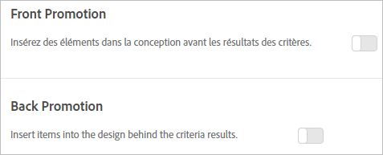

#  Ajout de promotions{#add-promotions}

Ajoutez des éléments en promotion et contrôlez leur placement dans vos conceptions Recommandations. Vous pouvez ajouter des promotions statiques et dynamiques.

>[!IMPORTANT]
>
>Les règles d’exclusion statiques et dynamiques sont des fonctionnalités puissantes qui peuvent vous aider dans vos efforts de marketing. Pour obtenir des informations détaillées, des exemples et des scénarios de cas d’utilisation, voir [Utilisation de règles d’inclusion dynamiques et statiques](/help/c-recommendations/c-algorithms/use-dynamic-and-static-inclusion-rules.md#concept_4CB5C0FA705D4E449BD0B37B3D987F9F).

Lorsque vous créez une activité [!DNL Recommendations], vous avez la possibilité d’inclure des éléments en promotion dans votre conception [!DNL Recommendations]. Les promotions utilisent les emplacements disponibles d’une conception et ont priorité sur les résultats des critères et les recommandations de sauvegarde. Par exemple, si votre conception compte six emplacements et que vous utilisez deux d’entre eux pour des promotions, quatre emplacements sont disponibles pour des éléments recommandés en fonction des critères.

Les promotions sont dédupliquées par rapport aux articles recommandés par les critères de votre activité ; un élément donné n’apparaîtra donc pas deux fois dans un bac de recommandations unique.

Vous pouvez promouvoir des éléments spécifiques, promouvoir des éléments de manière dynamique ou en fonction d’attributs, ou promouvoir des collections.

>[!NOTE]
>
>L’utilisation de promotions modifie la structure et le résultat du CSV. Ces modifications sont susceptibles d’avoir un impact sur les processus externes qui utilisent le format CSV, tels que la messagerie électronique.

1. Sur la page **[!UICONTROL Options]**, activez **[!UICONTROL Promotion avant]** ou **[!UICONTROL Promotion arrière]**.

   L’illustration suivante présente la bascule [!UICONTROL Promotion avant] sur la position « Activé ».

   

   Vous pouvez insérer des promotions avant *et* après les résultats des critères.
1. Définissez le nombre d’emplacements de conception à utiliser pour les éléments en promotion.

   Vous pouvez utiliser jusqu’à 20 emplacements en fonction de votre conception de [!DNL Recommendations]. Chaque emplacement utilisé devient indisponible pour les recommandations renvoyées en fonction de vos critères.

1. Définissez des dates de début et de fin pour vos éléments en promotion.

   Si vous ne définissez pas de date de début, la promotion commence immédiatement. Si vous ne définissez pas de date de fin, la promotion s’exécute indéfiniment.

1. Sélectionnez un **[!UICONTROL Type de promotion]**.

   * Sélectionnez **[!UICONTROL Liste des éléments]** et entrez les valeurs `entity.id` des éléments spécifiques que vous souhaitez promouvoir, séparées par des virgules.

      Si votre liste contient plus d’éléments que le nombre d’emplacements définis pour les promotions, vous pouvez cocher la case **[!UICONTROL Ordre des éléments aléatoire]** pour varier les éléments en promotion affichés dans votre conception. Si vous choisissez cette option, Target sélectionne au hasard le nombre d’éléments activés pour les promotions dans le modèle, à partir de l’ensemble de promotions complet pour chaque visite.

   * Sélectionnez **[!UICONTROL Promouvoir par attribut]** et ajoutez des règles pour définir les attributs des éléments que vous souhaitez promouvoir.

      Si vous sélectionnez l’option Promouvoir par attribut, vous pouvez créer des correspondances dynamiques. Pour plus d’informations, voir [Utilisation de règles d’inclusion dynamiques et statiques](/help/c-recommendations/c-algorithms/use-dynamic-and-static-inclusion-rules.md#concept_4CB5C0FA705D4E449BD0B37B3D987F9F).

   * Sélectionnez **[!UICONTROL Promouvoir une collection]** et choisissez la collection d’éléments que vous souhaitez promouvoir. Vous pouvez créer de nouvelles collections à utiliser pour les promotions. Voir [Création d’une collection](/help/c-recommendations/c-products/collections.md#task_1256DFF6842141FCAADD9E1428EF7F08) pour plus d’informations.

1. Cliquez sur **[!UICONTROL Enregistrer.]**.

Les promotions sont appliquées à toutes les expériences de l’activité.
