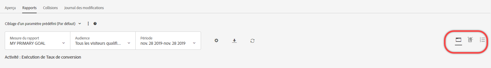
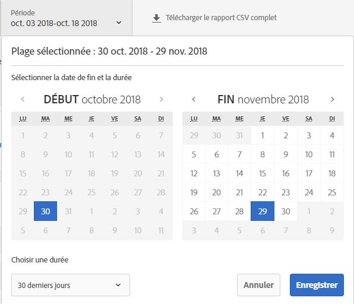
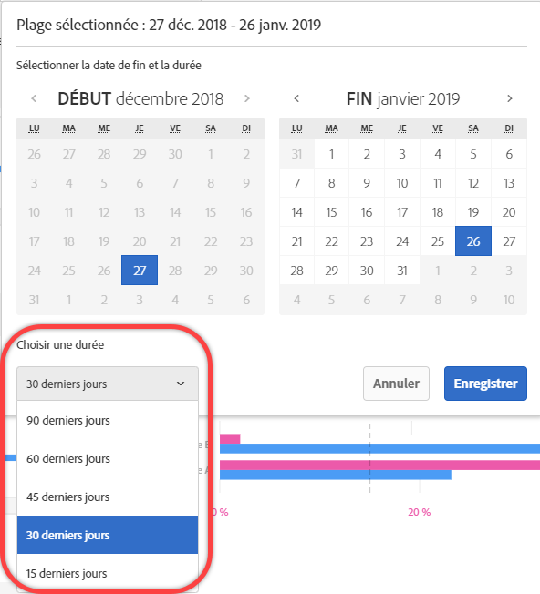
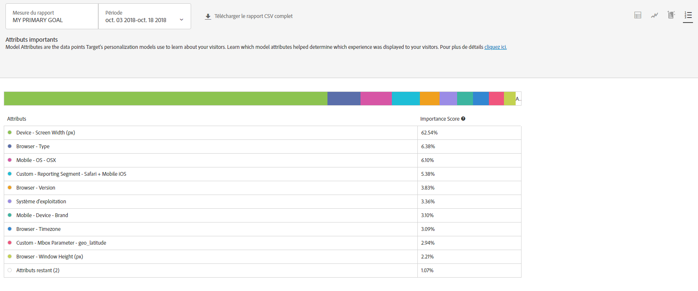

#  Rapport Attributs importants

Informations sur la variable [!UICONTROL Attributs importants] , l’un des deux rapports spécialisés disponibles pour les utilisateurs de [!UICONTROL Automated Personalization] (AP) et [!UICONTROL Ciblage automatique] (AT).

>[!NOTE]
>
>Tenez compte des points suivants lors de l’utilisation de [!UICONTROL Informations sur la personnalisation] rapports :
>
>* Les activités AP et AT sont disponibles dans le cadre de la solution [!DNL Target Premium]. Elles ne sont pas incluses dans [!DNL Target Standard] sans licence [!DNL Target Premium].
>
>* [!UICONTROL Les rapports Informations sur la personnalisation sont disponibles uniquement pour les activités AP et AT ayant un objectif d’optimisation de la conversion. ] Les activités passées d’un objectif d’optimisation des revenus à un objectif d’optimisation de la conversion, alors qu’elles étaient déjà actives, ne sont pas non plus prises en charge.
>
>* [!UICONTROL Informations sur la personnalisation] ne sont disponibles que si la variable [!UICONTROL Principal objectif] est sélectionné dans la variable [!UICONTROL Mesure du rapport] liste déroulante.
>
>* Les rapports Informations sur la personnalisation sont uniquement pris en charge dans l’[environnement par défaut](/help/administrating-target/hosts.md).
>
>* [!UICONTROL Informations sur la personnalisation] les rapports sont générés uniquement pour les activités qui se trouvent dans la variable [!UICONTROL En direct] et ont été activés et reçoivent du trafic pendant au moins 15 jours.

Dans les différentes activités, différents attributs sont plus ou moins importants dans la manière dont le modèle décide de personnaliser. Ce rapport indique les attributs principaux qui ont influencé le modèle et leur importance relative.

## Accédez au [!UICONTROL Attributs importants] rapport {#section_8E8F997AAAF44A1B9EE06EB6FB652801}

1. Cliquez sur **[!UICONTROL Activités]**, puis cliquez sur le [Automated Personalization](/help/c-activities/t-automated-personalization/automated-personalization.md#task_8AAF837796D74CF893CA2F88BA1491C9) ou [Ciblage automatique](/help/c-activities/auto-target/auto-target-to-optimize.md) de la liste.

   Si vous avez beaucoup d’activités, vous pouvez filtrer la liste en sélectionnant des options dans les listes déroulantes [!UICONTROL Type], [!UICONTROL État], [!UICONTROL Source de rapports], [!UICONTROL Compositeur d’expérience], [!UICONTROL Type de mesure] et [!UICONTROL Source d’activité].

1. Cliquez sur **[!UICONTROL Rapports]**.

   Le [Résumé d’Automated Personalization](/help/c-reports/reports-ap.md) ou [Résumé du ciblage automatique](/help/c-reports/auto-target-summary-report.md) s’affiche sous la forme d’un rapport qui fournit des informations sur les performances de vos activités, représentées par la première icône d’écran. Les deux icônes supplémentaires représentent les deux [!UICONTROL Informations sur la personnalisation] rapports : [!UICONTROL Segments automatisés] et [!UICONTROL Attributs importants].

   

   Notez que [!UICONTROL Ciblage automatique] comporte une icône de graphique supplémentaire pour la vue graphique de la variable [!UICONTROL Résumé] rapport.

   

   >[!IMPORTANT]
   >
   >Le rapport [!UICONTROL Attributs importants] sera disponible au plus tôt 15 jours après la date d’activation de votre activité. Pendant cette période initiale, vous ne pourrez pas accéder à ce rapport ni cliquer sur l’icône [!UICONTROL Attributs importants]. Une fois les 15 jours passés, en supposant qu’il existe un trafic personnalisé suffisant dans votre activité, la variable [!UICONTROL Attributs importants] est disponible.

1. 15 jours après l’activation de l’activité, cliquez sur le bouton **[!UICONTROL Attributs importants]** icône .

   

1. Sélectionnez la plage de dates désirée.

   Contrairement au rapport de [!UICONTROL synthèse] (rapport de performances), [!UICONTROL Informations sur la personnalisation], y compris [!UICONTROL Attributs importants], est uniquement disponible pour les plages de dates fixes : 15 jours, 30 jours, 45 jours, 60 jours et 90 jours. Ces plages de dates fixes permettent à [!UICONTROL Informations sur la personnalisation] d’utiliser une plage de données assez vaste pour limiter les probabilités que vous retiriez des informations d’un modèle à courte durée de vie dans votre activité. Les deux décisions que vous pouvez prendre pour votre plage de dates portent sur la « Date de fin » et la « Durée ». Vous remarquerez que le « Début » est grisé. La date de début change automatiquement en fonction de vos sélections de date de fin et de durée.

   

   Vous pouvez accéder aux plages de dates fixes disponibles dans la liste déroulante [!UICONTROL Choisir la durée].

   

1. Examinez les données du rapport [!UICONTROL Attributs importants].

   

1. (Facultatif) [Téléchargez le rapport au format CSV](/help/c-reports/c-report-settings/report-settings.md#section_77E65C50BAAF4AB79242DB3A8778ADEF) en vue d’une analyse dans Excel et d’autres outils.

   >[!NOTE]
   >
   >Le rapport de l’interface utilisateur Informations de personnalisation contient des informations choisies. Le fichier CSV correspondant au rapport Attributs importants contient des détails supplémentaires. Le téléchargement du rapport Attributs importants comprend la liste complète des 100 premiers attributs, tandis que le rapport de l’interface utilisateur inclut les 10 premiers uniquement. Si vous recherchez un attribut spécifique dans le rapport mais qu’il n’y figure pas, cela ne signifie pas que l’attribut n’a pas eu d’incidence sur l’activité, mais il n’a simplement pas atteint la liste des 100 premiers attributs.

## Interprétation du rapport Attributs importants

Le tableau suivant explique comment interpréter le rapport et en décrit les éléments :

| Élément | Détails |
|--- |--- |
| Graphique en barres | Le graphique en barres multicouleur situé en haut de l’écran vous permet de visualiser ces scores d’importance relative et est associé à la couleur du point en regard de chaque attribut respectif dans le tableau. Vous pouvez également survoler une couleur spécifique dans le graphique en barres avec le curseur pour afficher l’attribut qu’elle représente. Les scores d’importance sur les 100 premiers attributs totalisent 100 %. Pour plus d’informations sur l’ajout d’autres attributs utilisables par les modèles de personnalisation de Target, voir [Chargement de données pour les algorithmes de personnalisation de Target](/help/c-activities/t-automated-personalization/uploading-data-for-the-target-personalization-algorithms.md). |
| Graphique Classement des attributs de modèle | Le Classement des attributs de modèle comprend les 10 premiers attributs les plus importants dans la manière dont le modèle de personnalisation de Target a décidé du contenu à présenter à chaque visiteur. Le score d’importance indique, par rapport aux 100 premiers attributs, le degré d’importance d’un attribut spécifique pour les modèles de personnalisation de Target dans cette activité. |

## FAQ sur Attributs importants {#section_740910A52FA646B4AC9452F98C2F5719}

**Les rapports Informations sur la personnalisation ne sont pas encore disponibles pour mon activité. Pourquoi ?**

Il existe plusieurs raisons pour lesquelles les rapports [!UICONTROL Informations sur la personnalisation] ne sont pas encore disponibles pour votre activité :

* 15 jours ne se sont pas écoulés depuis que vous avez activé l’activité. Les rapports Segments automatisés et Attributs importants ne seront disponibles qu’au moins 15 jours après que vous ayez commencé votre activité. Pendant cette période initiale, vous ne pourrez pas accéder à ces rapports ni cliquer sur les icônes Segments automatisés et Attributs importants.
* Votre activité n’a pas présenté assez de trafic au cours de la période spécifiée. Une fois les 15 jours passés, en supposant qu’il existe un [trafic personnalisé suffisant](/help/c-activities/auto-target/auto-target-to-optimize.md#section_BA4D83BE40F14A96BE7CBC7C7CF2A8FB) dans votre activité pour construire les modèles de personnalisation, les rapports Segments automatisés et Attributs importants seront disponibles.
* Votre activité a un objectif d’optimisation des revenus. Pour l’instant, [!UICONTROL Informations sur la personnalisation] est uniquement disponible pour les activités d’objectif d’optimisation des conversions. Nous ajouterons une prise en charge des activités d’objectif des revenus dans une prochaine version.

**Qu’est-ce qu’un attribut ?**

Un attribut consiste en des informations sur un visiteur ou sa visite spécifique utilisées par les algorithmes de personnalisation pour savoir comment personnaliser le trafic. Par exemple, un attribut peut être le type de navigateur, l’emplacement, l’heure de la journée de la visite, etc.

Pour plus d’informations sur les attributs utilisés par [!DNL Target] dans ses modèles de personnalisation, voir [Collecte de données pour les algorithmes de personnalisation de Target](/help/c-activities/t-automated-personalization/ap-data.md). Pour plus d’informations sur la manière de télécharger de nouveaux attributs dans Target pour les utiliser dans les modèles de personnalisation de Target, voir [Méthodes de transfert de données dans Target](/help/c-implementing-target/c-considerations-before-you-implement-target/c-methods-to-get-data-into-target/methods-to-get-data-into-target.md#concept_0069C0EFB56C4700BB33F2F35C2B9B17).

**Les informations présentes dans les rapports [!UICONTROL Segments automatisés] et [!UICONTROL Attributs importants] sont-elles les même que celles contenues dans le fichier CSV téléchargé ?**

Non, le rapport d’interface utilisateur contient des informations sélectionnées. Le téléchargement CSV contient des détails supplémentaires. Le téléchargement du rapport Informations sur les segments automatisés inclut des segments automatisés supplémentaires au-delà des segments supérieurs inclus dans l’interface utilisateur, ainsi que la manière dont ces segments se sont comportés par rapport à vos offres ou expériences. Le rapport Attributs importants comprend les 100 premiers attributs de visiteur et leur importance relative, tandis que l’interface utilisateur inclut uniquement les 10 premiers attributs de visiteur.

**Puis-je voir Informations sur la personnalisation pour une plage de dates personnalisée ?**

Les rapports Informations sur la personnalisation ([!UICONTROL Segments automatisés] et [!UICONTROL Attributs importants]) sont uniquement disponibles pour des plages de dates fixes : 15 jours, 30 jours, 45 jours, 60 jours et 90 jours. Ces plages de dates fixes permettent à [!UICONTROL Informations sur la personnalisation] d’utiliser une plage de données assez vaste pour limiter les probabilités que vous retiriez des informations d’un modèle à courte durée de vie dans votre activité. Vous pouvez sélectionner ces durées pour n’importe quelle date de fin (où l’activité comprend assez de données pour satisfaire la durée).

**Comment est créé [!UICONTROL Informations sur la personnalisation ]?**

[!UICONTROL Informations sur la personnalisation] est créé à l’aide d’une technique Adobe en attente de brevet appelée MAGIX (Model Agnostic Globally Interpretable Explanations). Pour en savoir plus sur MAGIX, consultez l’article publié par l’équipe de recherche Adobe sur le [site web arXiv.org](https://arxiv.org/abs/1706.07160).

**Le rapport [!UICONTROL Informations sur la personnalisation] est-il disponible pour les objectifs/l’objectif principal de modélisation basée sur les revenus ?**

Pour l’instant, [!UICONTROL Informations sur la personnalisation] est uniquement disponible pour les activités d’objectif d’optimisation des conversions. Nous ajouterons une prise en charge des activités d’objectif des revenus dans une prochaine version.

**Quel est le score d’importance d’attribut dans le rapport Attributs importants ?**

Le score d’importance dans la partie « Classement d’importance d’attribut » du rapport fournit des données indiquant quelles variables utilisées par l’algorithme pour apprendre ont été les plus importantes lorsqu’il a déterminé comment diviser tous les visiteurs dans les segments qu’il a identifiés. Il a attribué un score en pourcentage aux 100 premiers attributs utilisés par le modèle.

**Pourquoi certaines offres/expériences présentant un taux de conversion plus faible reçoivent un trafic plus important par rapport à d’autres offres/expériences pour un certain segment automatisé ?**

Plusieurs raisons peuvent expliquer le fait que vous puissiez constater plus de visites sur une offre/expérience présentant un taux de conversion plus bas, y compris les raisons suivantes :

* Un petit nombre de vues pour certaines des offres/expériences ou toutes pour un certain segment automatisé.
* Activités de volume inférieur dans lesquelles certaines offres ou expériences n’ont pas de modèles créés.
* Activités de volume inférieur dans lesquelles les modèles ont été créés plus tôt pour certaines offres/expériences que d’autres. Supposons, par exemple, qu’un modèle supplémentaire ait été créé le jour 22 et que vous consultiez les données des jours 10-24.
* Des règles de ciblage sur une offre spécifique qui limitent quels visiteurs peuvent voir quelles offres/expériences.
* Les rapports de statistiques ne comportent aucune intervalle de confiance. Toutefois, si les taux de conversion sont suffisamment proches, le modèle peut diffuser le trafic afin qu’il soit plus élevé dans le nombre de points, mais il ne s’agit pas de nombres « statistiquement différents ».

Il peut s’avérer utile de savoir comment fonctionne le modèle qui diffuse le trafic. Chaque personne est servie en fonction de son profil total. Toutefois, les rapports statistiques généralisent ce comportement pour le rendre plus facile à interpréter par un humain. Par conséquent, les segments ne sont pas mutuellement exclusifs. Cela peut conduire à des segments individuels affichant ce type de comportement, car la même personne peut apparaître dans plusieurs segments.

**Quelles sont les différentes méthodes pour exploiter les informations du rapport Informations sur la personnalisation ?**

* Découvrez de nouvelles audiences à cibler : si un segment automatisé particulier est particulièrement efficace, vous pouvez envisager de créer une audience afin de pouvoir réutiliser ce segment dans d’autres rapports.
* Testez vos hypothèses sur le fait de savoir quels types de visiteur répondront auxquelles de vos expériences.
* Générez des informations indiquant quel contenu a fonctionné pour quel type de visiteur : quelles offres ont eu un effet élévateur chez quels visiteurs.
* Identifiez le contenu peu efficace.
* Identifiez les attributs les plus essentiels dans la manière dont le modèle a appris.
* Identifiez quels attributs sont utilisés dans les modèles de personnalisation et leur importance.
* Identifiez les opportunités de points de données supplémentaires que vous pouvez transmettre à Target pour informer davantage votre personnalisation.
