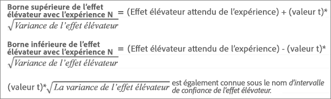
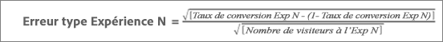
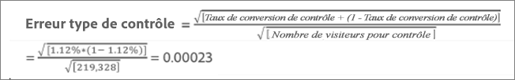
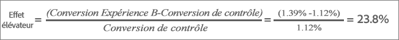
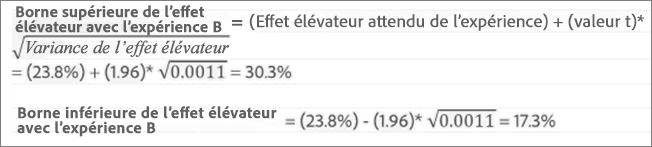

# Effet élévateur moyen, limites de l’effet élévateur et intervalle de confiance

Les rapports comprennent plusieurs points de données et représentations de visualisation qui vous aident à comprendre les limites d’effet élévateur et le niveau de confiance associés à votre [!DNL Adobe Target] activité afin de vous aider à déterminer plus précisément un gagnant.

>[!NOTE]
>
>This feature is available only when viewing reports in [!UICONTROL Table] View. Cette fonctionnalité n’est pas disponible pour les activités utilisant [Analytics comme source de rapports (A4T)](/help/c-integrating-target-with-mac/a4t/a4t.md#concept_7540C8C04259434AB6EE33B09F47A1DE).

## Interprétation des données {#section_62C0D7E76F3D49A7B3C371C82AEF27D5}

The following illustration shows [!UICONTROL Lift Bounds and Confidence Level] information:

The lift and confidence information in the [!DNL Target] reporting UI includes:

### Effet élévateur

Le grand nombre et la flèche reflètent la valeur de l’effet élévateur attendue. Ce nombre correspond au milieu de la gamme des limites de l’effet élévateur. La flèche de l’effet élévateur attendu s’affiche en gris jusqu’à ce que le degré de confiance dépasse 95 %. Au-delà de ce seuil, la flèche s’affiche en rouge ou en vert selon que l’effet élévateur est respectivement négatif ou positif.

### Limites de l’effet élévateur

Ceci correspond à l’intervalle de confiance de 95 % de l’effet élévateur. La valeur s’affiche sous forme de plage au-dessous de l’effet élévateur moyen. See [Example calculation](#example) below for an example of how these lift bounds are calculated.

### Graphique en courbes

The boxplot graph in the [!DNL Target] interface represents the expected value and 95% confidence interval of the success metric in question. Cette fonction peut être considérée comme un moyen graphique d’afficher l’effet élévateur et les informations relatives à ses limites.

There are a few key ways [!DNL Target] helps you interpret the confidence information, one of which is color. Le graphique affiche les chevauchements éventuellement présents dans l’intervalle de confiance d’une expérience spécifique en indiquant l’intervalle de confiance de contrôle indiqué en gris, et n’importe quelle gamme d’intervalles de confiance d’une expérience spécifique qui est supérieure ou inférieure à celle de l’intervalle de confiance de contrôle en vert ou en rouge, respectivement.

La longueur du diagramme en boîte représente la taille de l’intervalle de confiance d’une manière facile à comprendre. À mesure que vous collectez davantage de données durant votre activité, la barre se déplace et se modifie. L’intervalle de confiance est dérivé de la variance et de la taille de l’échantillon (nombre de visiteurs). Plus la variance est réduite et la taille de l’échantillon conséquente, plus l’intervalle de confiance est étroit.

### Degré de confiance

Le degré de confiance d’une expérience ou d’une offre représente la probabilité selon laquelle l’effet élévateur de l’expérience ou de l’offre associée par rapport à l’expérience ou offre de contrôle est « réelle » (c’est-à-dire non due au hasard). En général, le niveau de 95 % est le degré de confiance recommandé pour que l’effet élévateur soit considéré comme significatif.

## How are lift bounds calculated? {#section_1D360781D972483693680BE0F07AEAD1}

Les limites de l’effet élévateur représentent les intervalles de confiance de 95 % de l’effet élévateur que l’expérience ou l’offre spécifique présente par rapport à l’expérience ou à l’offre de contrôle. Globalement parlant, cela signifie que l’effet élévateur effectif a environ 95 % de chances de se situer entre ces limites.

Les limites de l’effet élévateur sont calculées à l’aide de la formule suivante :

Quelques calculs supplémentaires sont nécessaires pour arriver à l’entrée de nos limites de l’effet élévateur :

* **Valeur « t » :** la statistique critique pour notre niveau de confiance de 95 % est de 1,96. Pour plus d’informations sur les [valeurs « t », voir](https://en.wikipedia.org/wiki/T-statistic).
* **Variance de l’effet élévateur :** l’écart-type sur la valeur de succès de l’expérience N et l’écart-type sur la valeur de succès de l’expérience de contrôle sont nécessaires pour déterminer la variance de l’effet élévateur, qui est calculée à l’aide de la formule suivante (illustrée dans le cas où la mesure de succès est une conversion).

   

* **Écart-type sur le taux de conversion ou la mesure de succès :** l’écart-type est calculé de la même manière que l’expérience N et le contrôle, en appliquant la formule suivante (illustrée dans le cas où la mesure de succès est une conversion). Pour plus d’informations sur l’écart-type, [cliquez ici](https://en.wikipedia.org/wiki/Standard_error).

   

   >[!NOTE]
   >
   >L’écart-type des activités de mesure de succès en termes de chiffre d’affaires repose sur la variance du chiffre d’affaires au sein de l’échantillon.

## Example calculation {#example}

Prenons un exemple d’activité comportant les deux expériences et les résultats suivants :

| Expérience | Visiteurs | Conversions | Taux de conversion |
|--- |--- |--- |--- |
| Expérience A (contrôle) | 219 328 | 2 466 | 1,12 % |
| Expérience B | 218 362 | 3 040 | 1,39% |

D’après nos formules, nous pouvons calculer les entrées dont nous avons besoin pour les limites de l’effet élévateur.

**Écart-type pour l’expérience A (contrôle)**

**Écart-type pour l’expérience B**

**Variance de l’effet élévateur pour l’expérience B**

**Limites de l’effet élévateur pour l’expérience B**

Effet élévateur escompté pour l’expérience B :

Les limites de l’effet élévateur pour l’expérience B seraient alors :

>[!NOTE]
>
>Il peut y avoir un léger écart entre les calculs manuels effectués avec les formules ci-dessus et les chiffres présentés dans le rapport. Cet écart peut être dû au fait que les nombres de pages vues utilisés dans les calculs manuels ont été arrondis. The lift shown in the [!DNL Target] report is based on the exact numbers obtained from the total engagement and the engagement count. Les chiffres se rapportant aux engagements sont disponibles via l’API rapport de synthèse.

## When Are lift bounds not displayed? {#section_C5622E1E94684DAD937249B51A9E42CC}

In certain cases, [!DNL Target] does not display lift bounds:

* Quelle que soit l’activité, lorsque le nombre total de visites ou de visiteurs est inférieur à 30.
* For [!UICONTROL Auto-Allocate] activities, no lift bounds are displayed until one experience has attained 60% confidence.
