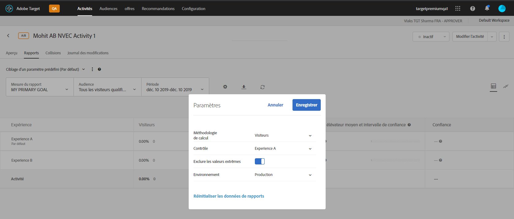

# Exclusion des valeurs extrêmes

You can exclude extreme values from affecting reports in [!DNL Adobe Target] so a few unusual orders don&#39;t affect your activity results. Exemple de commande inhabituelle : un entraîneur achetant des uniformes pour toute une équipe plutôt que des acheteurs individuels achetant individuellement des uniformes.

>[!NOTE]
>
>L’indicateur [!UICONTROL Exclure les valeurs extrêmes] s’applique uniquement aux activités qui ont recours aux mesures de type Recettes et Engagement.

Les valeurs extrêmes sont automatiquement signalées, en fonction des règles décrites ci-dessous. Vous pouvez choisir d’afficher ou d’exclure les valeurs extrêmes de vos rapports. Les valeurs extrêmes d’une activité sont exclues une fois que celle-ci a été exécutée pendant une heure ou après 15 commandes, selon le critère qui survient en premier.

Une valeur est considérée comme extrême lorsqu’elle présente un écart de +/- 3 par rapport à la valeur de commande moyenne, en utilisant le dernier mois de données (jusqu’au moment où le calcul a été effectué).

Par exemple, le filtre des valeurs extrêmes est souvent utile lors de l’utilisation des recettes par visiteur (RPV). RPV associe le taux de conversion et la valeur de commande moyenne et, souvent, révèle la volatilité de ces mesures. Si vous utilisez RPV et déterminez que les commandes ne semblent pas être distribuées normalement, vous pouvez voir plus de résultats normaux si vous appliquez le filtre des commandes extrêmes.

Lorsqu’une valeur est désignée comme extrême, sa valeur est remplacée par la valeur de commande moyenne de l’expérience pour le dernier mois, extrêmes exclus. The order is also marked as extreme in the [!UICONTROL Order Details] report and in the CSV download for daily results.

**Pour exclure les valeurs extrêmes de vos rapports, procédez comme suit :**

1. Ouvrez une activité qui comprend les mesures de types Recettes ou Engagement, puis cliquez sur l’onglet **[!UICONTROL Rapports]**.
1. Cliquez sur l’icône d’engrenage pour ouvrir la boîte de dialogue **[!UICONTROL Paramètres]** .

   

1. Faites glisser la bascule **[!UICONTROL Exclure les valeurs]** extrêmes vers la position &quot;Activé&quot; ou &quot;Désactivé&quot;, selon vos besoins.
1. Cliquez sur **[!UICONTROL Enregistrer]**.
