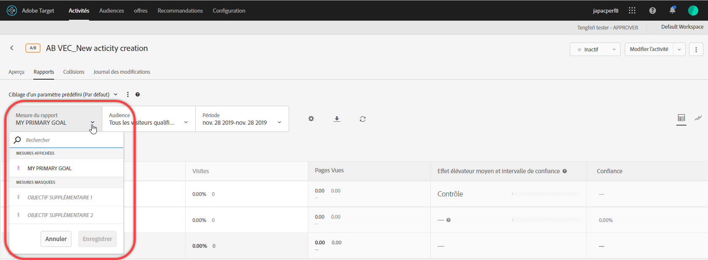
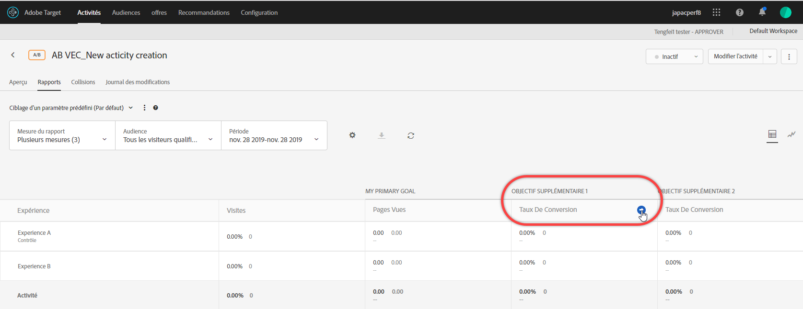
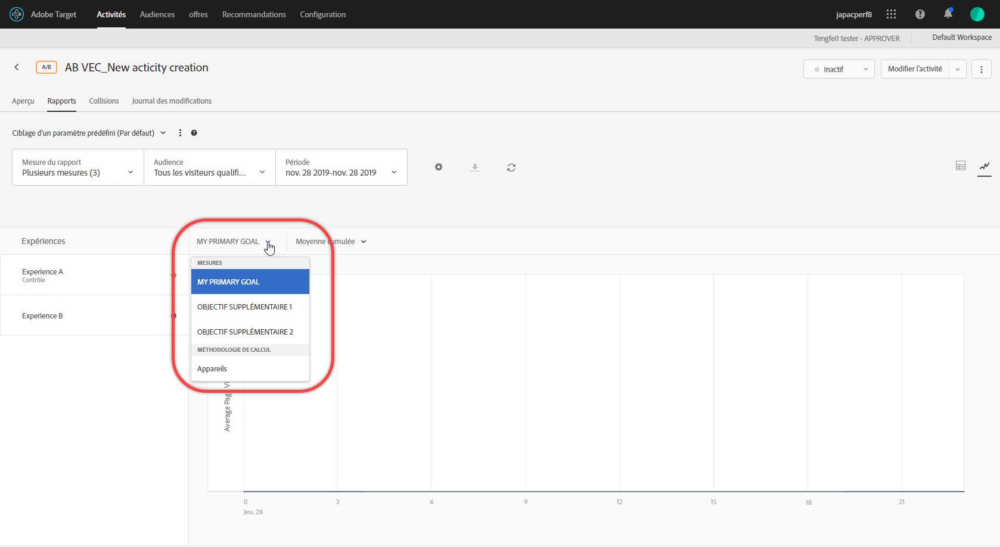

# Affichage de plusieurs mesures dans un rapport{#view-multiple-metrics-in-a-report}

Vous pouvez sélectionner plusieurs mesures à vue dans un rapport [!DNL Adobe Target].

Tenez compte des informations suivantes lorsque vous utilisez plusieurs mesures dans les rapports :

* La possibilité de vue de plusieurs mesures est disponible uniquement pour les activités [Test A/B](/help/c-activities/t-test-ab/test-ab.md), [Affectation automatique](/help/c-activities/automated-traffic-allocation/automated-traffic-allocation.md), [Cible automatique](/help/c-activities/auto-target/auto-target-to-optimize.md) et [Ciblage d’expérience](/help/c-activities/t-experience-target/experience-target.md) (XT).
* Vous ne pouvez pas ajouter plus de 20 mesures à un rapport pour une activité qui utilise [Analytics pour la Cible](/help/c-integrating-target-with-mac/a4t/a4t.md) (A4T). Vous pouvez ajouter autant de mesures que dans votre activité aux rapports pour les activités qui n’utilisent *pas* A4T.
* Vous ne pouvez pas utiliser l’option Télécharger pour télécharger des rapports au format CSV si vous avez sélectionné plusieurs mesures. Vous devez sélectionner une seule mesure pour activer l’option [!UICONTROL Télécharger].
* Vous ne pouvez pas vue plusieurs mesures pour les activités créées avant la version [!DNL Target] de juillet 2015 (30 juillet 2015).

**Pour sélectionner plusieurs mesures à afficher dans le rapport, procédez comme suit :**

1. Pour afficher un rapport, cliquez sur **[!UICONTROL Activités]**, sélectionnez une activité dans la liste, puis cliquez sur l’onglet **[!UICONTROL Rapports.]**
1. Cliquez sur la liste déroulante **[!UICONTROL Mesure du rapport]** pour afficher les listes [!UICONTROL Mesures affichées] et [!UICONTROL Mesures masquées].

   

   Vous pouvez utiliser la zone [!UICONTROL Rechercher] pour trouver rapidement les mesures disponibles à ajouter à la liste [!UICONTROL Mesures affichées].

   Vous pouvez sélectionner plusieurs mesures en mode [!UICONTROL Vue Tableau] et [!UICONTROL Vue graphique] du rapport.

1. Passez le pointeur de la souris sur les mesures souhaitées de la liste [!UICONTROL Mesures masquées], puis cliquez sur **[!UICONTROL Sélectionner]** pour les déplacer vers la liste [!UICONTROL Mesures affichées].

   OU

   Faites glisser les mesures souhaitées de la liste [!UICONTROL Mesures masquées] vers la liste [!UICONTROL Mesures affichées].

   Au moins une mesure doit figurer dans la liste [!UICONTROL Mesures affichées].

   Vous pouvez réorganiser les mesures en les faisant glisser et en les déposant dans l’ordre souhaité dans la liste [!UICONTROL Mesures affichées]. L&#39;ordre sélectionné sera reflété dans la [!UICONTROL Vue de tableau] et la [!UICONTROL Vue graphique]. Pour supprimer une mesure de la liste [!UICONTROL Mesures affichées], placez le pointeur de la souris sur la mesure, puis cliquez sur l’icône **X**.

1. Lorsque vous avez terminé, cliquez sur **[!UICONTROL Enregistrer]**.
1. (Conditionnel) Lors de l’affichage du rapport dans la [!UICONTROL Vue de tableau], placez le pointeur de la souris sur l’en-tête de colonne d’une mesure pour afficher une flèche bleue. Cliquez sur la flèche pour développer le tableau afin d’afficher l’[!UICONTROL Effet élévateur] et le [!UICONTROL Degré de confiance] pour cette mesure.

   

   Vous pouvez développer une seule mesure/colonne à la fois. Cliquez de nouveau sur la flèche pour réduire les colonnes.

1. (Conditionnel) Lors de l’affichage du rapport dans la Vue Graphique, vous pouvez sélectionner des mesures individuelles à afficher dans la liste déroulante :

   

